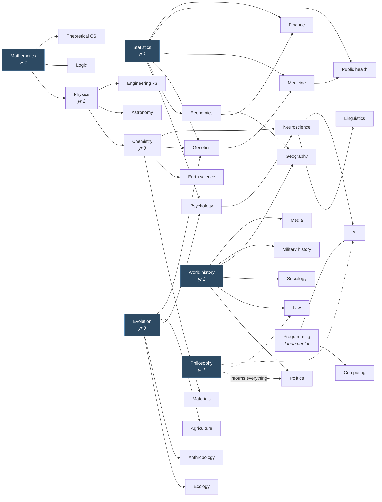

# The Spine — A Linear Plan, Year 1 to Year 70

`02-map.md` says what the territory is. `resources/` says what to read and do
in each part of it. Neither tells you what to do *this year*, or in what
order, or what has to come first so the thing after it isn't wasted effort.
That's this file.

The spine walks all 44 ledger domains, the fundamentals, one language, one
craft, and the mastery spikes across seven decades in a defensible order. It
is a **default sequence, not a contract**. Reorder it freely — but reorder it
deliberately, at an annual review, knowing which prerequisite you're skipping
and what it will cost you.

## The seventy-year frame

Seven decades, seventy years. **The ledger completes at year 15** — and that
single fact shapes everything else.

| Decade | Years | The work |
|--------|-------|----------|
| 1 | 1–10 | Foundations: the fundamentals, 30 of the 44 domains, the first spike |
| 2 | 11–20 | The ledger completes at year 15; then the first real depth |
| 3 | 21–30 | Mastery and original work: the second spike, the first bridges |
| 4 | 31–40 | Integration and synthesis; re-foundation; institutions |
| 5 | 41–50 | The free decade: hours rise again, the third spike on pull alone |
| 6 | 51–60 | Distillation: what survives you, put in usable form |
| 7 | 61–70 | The long view: the perspective nobody younger can have |

**Fifty-five years sit after the ledger.** Covering the map is the first fifth
of this plan, not the whole of it. What follows is not repetition — it is
promotion (taking the domains that actually pull to real depth), re-foundation
(fields you learned in Decade 1 will have moved by Decade 3), the frontier
(fields that have no name today), and transmission.

A note on pace. Seventy years is generous, deliberately. The slack absorbs the
years that go wrong: illness, a demanding program, a move, a job that eats
everything. Falling five years behind is not failure; it is the schedule
working as designed.

## The sequencing logic

Five rules generated this order. If you rebuild the sequence yourself, keep
them and you'll get something equally good.

**1. Fundamentals first, because they tax everything downstream.** A slow
reader pays that tax on all 44 domains. Someone who can't write pays it on
every artifact, which is the only thing that earns a checkmark. Years 1–2 are
disproportionately about the instrument rather than the territory, and that
front-loading buys back more time than it costs by roughly year 6.

**2. Prerequisite chains, honoured.** Some domains are dramatically cheaper
after another one. The real chains:

The five shaded nodes are the load-bearing ones: statistics, mathematics,
philosophy, world history, and evolution. Everything else in the ledger gets
cheaper after them, which is why all five land in years 1–3. Get those wrong
and the rest of the sequence costs more than it should.

**3. Alternate hard and free.** Every year pairs prerequisite-chained domains
with at least one that has no prerequisites at all — literature, music, art,
religion, film. This isn't decoration. It's what makes seventy years
survivable: the free domain is the one you read on a bad week, and it keeps
the curiosity budget from being the only non-obligatory thing in your life.
At three domains a year the rule matters more, not less — three hard domains
in one year is how a good year becomes an abandoned one.

**4. Six domains run at once, and each spans two years.** This is the
interleaving rule from `01-principles.md`, principle 2, and it is the single
biggest structural choice in the plan.

Every domain runs **two years at ~90 hours a year** rather than one year at
~180. Three domains start each year and three finish, so **six are live at any
moment**, deliberately spanning several clusters:

- A domain's **first year** is orientation — the door, the survey, the
  accessible entry, the course begun, the equipment bought.
- A domain's **second year** is completion — the canon, the course finished,
  the practice, and the artifact that earns the checkmark.
- The year of distance between them does for a subject what spacing does for
  a flashcard.

The completion rate is unchanged: three domains a year, ledger closed at year
15. What changes is that you are never studying one thing. Blocked study —
one subject to completion, then the next — feels more efficient and measurably
isn't; it produces worse retention and worse transfer than mixing. The
discomfort of holding six half-finished subjects is the mechanism, not a
symptom.

**Prerequisites only need to be one cohort ahead.** Because the first year of
a domain is orientation, a dependent domain can start while its prerequisite
is in its second year — physics starts while mathematics finishes, structural
engineering starts while materials finishes. What you cannot do is start them
in the same cohort.

**5. Some things run continuously, not in slots.** Spaced repetition, weekly
logging, the language, the craft, the spike, and the curiosity budget are
*tracks*, not domains. They appear in every year because they never stop.

This is why 43 of the ledger's 44 domains get a cohort and one doesn't: **"a
craft done with the hands" is a track, not a slot.** You cannot bring embodied
skill to literacy in a hundred hours and then leave it — it decays, and it is
the one domain on the map the rest cannot fake. It starts in year 2 and runs
the length of the plan. Language works the same way for the same reason (see
`resources/languages.md`).

---

## The load model

The agenda assumes **25 focused hours a week**, about 1,300 a year. That is
the number everything else is sized against, and it is deliberately a real
number rather than a comfortable one.

| Track | Hours/yr | Notes |
|-------|----------|-------|
| Three T3 domains | ~540 | ~180 each; this is the ledger work |
| Depth (promotions) | ~300 | From year 6 on: taking domains to working depth via the long shelves |
| Spike (T1/T2) | ~250 | Your professional depth; more in some years |
| Fundamentals | ~80 | Heavy in years 1–2, maintenance after |
| Current awareness | ~100 | ~2 hrs/wk across all frequencies — `05-current.md` |
| Frontier slot | ~80 | Reconnaissance on what isn't on the map yet — `04-frontier.md` |
| Curiosity budget | ~150 | Unplanned, off-ledger, no artifact required |

Two of those tracks are permanent and capped on purpose. The **frontier slot**
holds 5–10% of your hours open, every year for seventy years, for fields that
don't exist yet — because over that span some will, and a fixed map would
sleep through them. **Current awareness** is the live layer: a map with no
news attached becomes a museum. Both expand to fill whatever you give them,
which is why both have ceilings.

### Pick your pace honestly

25 hrs/week is the default, not a requirement. The whole plan rescales
cleanly, and the *order* never changes — only how fast you move through it.

| Hrs/week | Hrs/year | Ledger done | 70-year total | Reads as |
|----------|----------|-------------|---------------|----------|
| 10 | ~520 | year 25 | ~36,000 | A serious hobby alongside a full life |
| 15 | ~780 | year 17 | ~55,000 | Committed; roughly a part-time second job |
| **25** | **~1,300** | **year 15** | **~91,000** | **The default. Demanding but sustainable** |
| 35 | ~1,820 | year 9 | ~127,000 | Near-professional. Realistic only in stretches |

Choose the row you will still be running in year 12, not the one that
flatters you in year 1. **Consistency is the entire mechanism** — the plan
does not reward a heroic first year followed by a decade of nothing, and
`FAQ.md` is blunt about why.

Two further caveats:

**If you're in a demanding degree or training program, cut the ledger to one
or two domains a year while it lasts** — the spike comes first, always, and a
professional program *is* the spike. The ledger completes later; nothing else
breaks.

**A domain's hours need not be evenly spread.** Six weeks of intensity beats
ten months of thirty-minute sessions for most literacy passes.

---

## How to read a year

Each year below gives you:

- **Ledger** — the three T3 domains, with the file to open in `resources/`
- **Why now** — the prerequisite argument, so you can judge a reorder
- **Fundamentals** — which capacity gets deliberate work
- **Modes** — the variety mandate. Minimum three modes per domain; see
  `resources/modes.md`
- **Kit** — what to buy this year; see `resources/kit.md` for the detail
- **By December** — the artifacts that must exist

---

# Decade 1 — Years 1–10: Foundations

Thirty of the forty-four domains, the fundamentals, the first spike, and the
first promotions. This is by far the heaviest decade, and deliberately so:
these are the domains everything downstream waits on, and at this pace there
is no reason to spread them over thirty years.

| Cohort | Years | Domains | Why these, together |
|--------|-------|---------|---------------------|
| C1 | 1–2 | Statistics · Philosophy · Mathematics | The three meta-domains, and none has prerequisites. Statistics is how you evaluate every empirical claim in the other 41; philosophy how you evaluate every argument; mathematics gates the formal and physical half |
| C2 | 2–3 | World history · Physics · Literature | History is the timeline the social and humanities domains attach to. Physics starts while mathematics finishes. Literature is the free domain — no prerequisites, different rhythm |
| C3 | 3–4 | Evolution & molecular biology · Chemistry · Music | Evolution organises the living cluster; chemistry starts while physics finishes and gates genetics, medicine, materials. Music is the free slot, and the instrument starts here |
| C4 | 4–5 | Psychology · Economics · Visual art & architecture | Both hard domains need statistics; economics also needs history. Psychology without statistics cannot survive its own replication literature |
| C5 | 5–6 | Neuroscience · Genetics · World religions & mythology | Neuroscience needs biology, chemistry, psychology. Genetics is the most prerequisite-dense domain in the living cluster. Religion against neuroscience is a deliberate collision — two very different accounts of the human interior, live in the same year |
| C6 | 6–7 | Political science · Computing in practice · Anthropology & archaeology | Politics needs history and philosophy; anthropology needs evolution and history; computing arrives after five years of programming as a fundamental. **The first promotion happens this year** |
| C7 | 7–8 | Cosmology & astronomy · Logic & foundations · Theater, film & narrative media | Astronomy needs physics and mathematics; logic needs mathematical maturity. Film is the free slot |
| C8 | 8–9 | Theoretical CS & information theory · Linguistics · Rhetoric & writing | Theoretical CS starts while logic finishes — the same subject in two hats, and the overlap is the argument. Linguistics needs neuroscience. Rhetoric arrives after seven years of weekly writing |
| C9 | 9–10 | Artificial intelligence · Sociology · Ecology | AI needs the mathematics, the programming, and neuroscience. Sociology needs history and statistics. Ecology needs evolution |
| C10 | 10–11 | Earth science & climate · Law & legal systems · Medicine & physiology | Earth science needs chemistry and physics. Law needs history and philosophy. Medicine is the most prerequisite-dense domain on the map, which is why it waits |

Year 1 runs three live domains, because only C1 has started. From year 2
onward, six are live: last year's cohort finishing and this year's starting.

**Continuous from year 2:** the language (to B2 by year 6) and the craft.
**Continuous from year 1:** spaced repetition, the weekly log, current
awareness, the frontier slot, the curiosity budget.

**By year 10:** 30 domains · ~30 artifacts · a language at B2 · a craft making
real objects · the first spike professional · 2–3 domains at working depth ·
the second spike chosen from evidence.

---

# Decade 2 — Years 11–20: Completion, then Depth

Two halves, and they are different in kind.

**Years 11–15 close the ledger.**

| Cohort | Years | Domains |
|--------|-------|---------|
| C11 | 11–12 | Materials science · Finance & markets · Geography & geopolitics |
| C12 | 12–13 | Education · Engineering: energy & power · Engineering: structures |
| C13 | 13–14 | Engineering: machines & manufacturing · Public health · Business |
| C14 | 14–15 | Media & communication · Military history · Design · **Agriculture** |

C14 carries four domains — it is the last cohort, so seven run live in year 14
and four finish in year 15.

The applied cluster concentrates in years 12–14 by design: after a decade of
largely textual learning, these are the domains where *doing* is the material,
and the project ladders in `resources/made-applied.md` become the spine of the
practice. The workshop lands here.

**Year 15 is the hinge of the entire plan.** All 44 domains checked, roughly
45 artifacts, and fifty-five years still to run. The consolidation work that
year — sweeping every domain's re-foundation watch, reading `bridges.md`
against your accumulated "these two should talk" list, and making the
promotion decisions that open the long shelves — is what converts a covered
map into a working one.

**Years 16–20 are the first real depth.** Three or four domains promoted to
working depth, chosen on demonstrated pull rather than plan. The second spike
takes serious hours. The first bridges get attempted.

**By year 20:** the ledger complete and refreshed · 4–6 domains at working
depth · second spike well advanced · the first cross-field project.

---

# Decade 3 — Years 21–30: Mastery and Original Work

With the map covered fifteen years ago and depth accumulating since, this is
the plan's most productive stretch.

- **The second spike reaches mastery.** Original contribution becomes the
  goal rather than the horizon.
- **The bridges open.** `resources/bridges.md` is the material; the ledger is
  what bought the right to use it. Most original work happens at
  intersections, and you now hold forty-four of them.
- **The first re-foundation pass.** Domains learned in Decade 1 have moved —
  genetics, astronomy, AI, medicine, and linguistics move fastest.
- **Teaching becomes routine**, and the first institution-building starts.

**By year 30:** an original contribution defended in public · 6–9 domains at
working depth · 1–2 at mastery · a legible body of work · the craft at
working level.

---

# The Second Half — Years 31–70

Forty years, no new ledger domains, and more material than the first thirty
carried. Detail lives in `phases/` and `TIMELINE.md`.

## Decade 4 — Years 31–40: Integration and Synthesis

The signature cross-field work — the problems that need your specific
combination. Institution-building: the course, the curriculum, the standard,
the open resource that teaches after you. A second re-foundation pass. Peak
earning meets deferred wants, so the durable equipment in `resources/kit.md`
becomes justifiable on cost-per-year-of-use.

## Decade 5 — Years 41–50: The Free Decade

Obligations loosen and hours rise again. The **third spike, chosen on pull
alone** with zero career justification permitted — beginner-hood as a
practice, not a humiliation. Transmission at scale: the book-length synthesis,
named successors, formal re-entry if you want it.

## Decade 6 — Years 51–60: Distillation

The corpus is large and unsorted; the work is editing, not accumulating. The
summative work, the curriculum, the archive made legible to a stranger.
Hard learning continues as health infrastructure — novelty and difficulty are
the active ingredient. **Adapt the method, don't lower the ambition.**

## Decade 7 — Years 61–70: The Long View

The shape of how knowledge changed across seventy years, which confident
consensus collapsed, what turned out to matter. Capture it — memoir, oral
history, the annotated bibliography of a life's reading. Hand things over by
name, while you can still explain them. Re-read the canon against your own
decades-old marginalia.

**Year 70 is not a finish line.** A plan written in year 1 and still running
in year 70 has already succeeded. Write the next sketch anyway.

---

## Reordering rules

The sequence is a default. Break it deliberately, under these rules:

1. **Never skip a prerequisite silently.** If you want astronomy in year 3,
   fine — but know you're reading it without the physics, and that you're
   getting a story rather than an understanding. Write the trade in your
   annual review.
2. **Pull a domain forward when life offers it.** A dig season, a class
   nearby, a friend who'll teach you, a trip to a place — opportunity beats
   sequence every time. The order exists to serve you, not the reverse.
3. **Keep the alternation.** Whatever you reorder, don't stack two hard
   prerequisite-chained domains in the same year unless the year is otherwise
   empty. That's the rule most likely to save the whole project.
4. **A domain that won't start after two attempts is telling you something.**
   Move it to a later decade and pick up its neighbour. Twice-deferred is
   information; four-times-deferred means it belongs in the anti-goals.
5. **The spike always wins.** In any year where the professional work and the
   ledger conflict, the ledger yields. A polymath with no spike is an
   audience member.

## What the spine does not schedule

Deliberately absent, and it should stay that way:

- **The curiosity budget.** Ten to twenty percent of your hours, unplanned,
  off-ledger, no artifact required. If it ever hits zero, the agenda is
  dying — that's the canary.
- **Tools and products.** Nothing with a version number appears in a
  seventy-year plan (`01-principles.md`, principle 5). Tools are learned
  just-in-time, inside projects. The frontier slot exists to catch the rare
  case where something that looks like a tool is actually a new field —
  `04-frontier.md` is how you tell the difference.
- **What fills the frontier slot.** The slot is scheduled; its contents
  cannot be. Naming in 2026 what you'll study in 2056 is precisely the error
  the slot is designed to prevent.
- **Your life.** Seventy years contains illness, moves, jobs, people, and
  losses. The spine assumes interruption; the weekly log exists to make
  restarting cheap. Any lapsed track restarts at the next weekly log, at half
  size if necessary. A plan that only works in good years isn't a plan, it's
  a wish.
