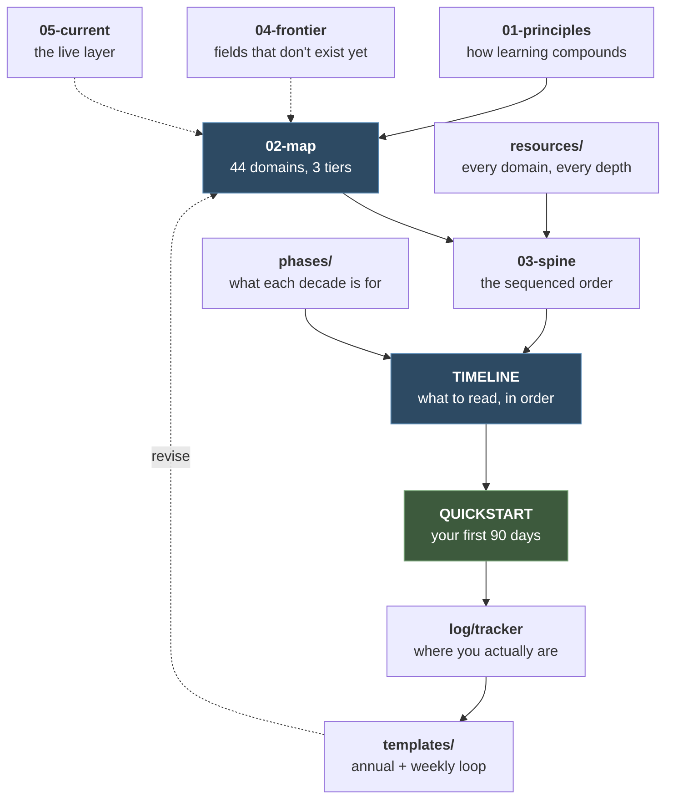
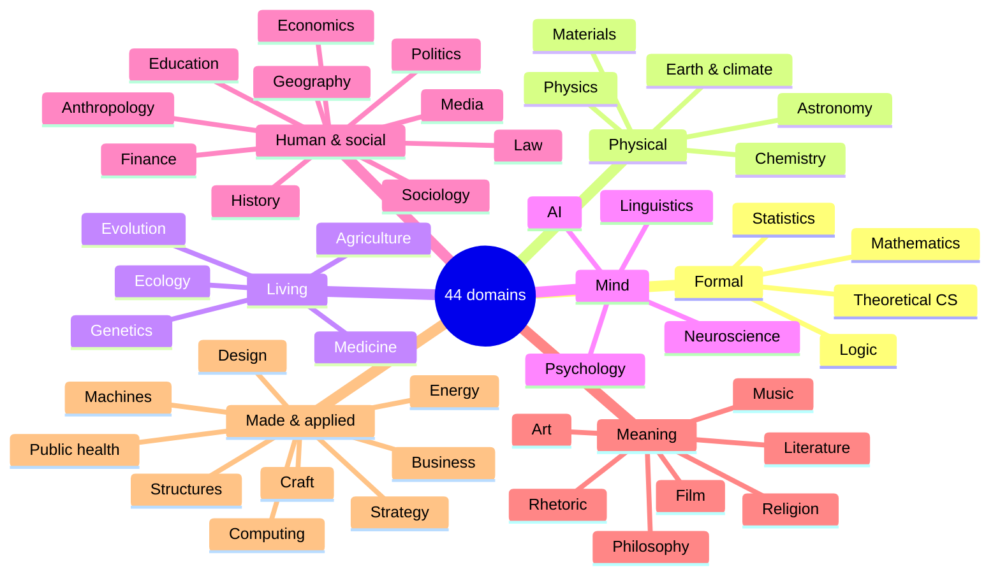

# Learning Agenda

**A seventy-year plan to learn everything one mind can hold.**

Not a reading list. A working system: 44 domains of human knowledge mapped into
three depth tiers, sequenced year by year across seven decades, with the material,
the equipment, the habits, and the honest arithmetic to actually run it.

[**Quickstart**](QUICKSTART.md) · [**Timeline**](TIMELINE.md) ·
[**Map**](02-map.md) · [**Resources**](resources/) ·
[**Tracker**](log/tracker.md) · [**FAQ**](FAQ.md) ·
[**Glossary**](GLOSSARY.md)

---

## The premise

Twenty-five focused hours a week for seventy years is about **91,000 hours**.
That is enough to be world-class in three or four fields, professionally
competent in a dozen, and genuinely literate in every major domain of human
knowledge — with languages, a craft, and time left over.

At that pace **the 44-domain map is covered by year 15**, which is the fact
that shapes everything else here. Covering it is the first fifth of the plan,
not the whole of it. The remaining fifty-five years are for depth, mastery,
and the work only a covered map makes possible.

The arithmetic has never been the hard part. The hard part is knowing what to
open in year 7, having material that doesn't run out in year 40, and building
a system that survives the years when life wins. That's what this repo is.

> **The one rule:** consistency beats intensity. No heroic sprints. The agenda
> only asks that you never fully stop.

---

## How the pieces fit

---

## Start here

Three steps, in order. The whole repo is downstream of these.

1. **Read [`01-principles.md`](01-principles.md)** — the operating manual.
   Twenty minutes, and everything else assumes it.
2. **Open [`QUICKSTART.md`](QUICKSTART.md)** — day zero takes 30 minutes.
   Install Anki, get a library card, publish 300 bad words. The first piece
   being bad is load-bearing; it kills the standard that would otherwise stop
   you.
3. **Copy [`log/tracker.md`](log/tracker.md)** and fill in the status block.
   That file is the only record that matters.

<b>Where am I?</b> — jump to your year

 

| Plan year | You're in | Material | Phase |
|---|---|---|---|
| Not started | — | [Quickstart](QUICKSTART.md) | [Decade 1](phases/decade-1-foundations.md) |
| 1–10 | Foundations — 30 domains | [Timeline: Years 1–10](TIMELINE.md#years-110--foundations) | [Decade 1](phases/decade-1-foundations.md) |
| 11–15 | Closing the ledger | [Timeline: Years 11–15](TIMELINE.md#years-1115--the-ledger-completes) | [Decade 2](phases/decade-2-mastery.md) |
| 16–20 | First depth | [Timeline: Years 16–20](TIMELINE.md#years-1620--first-depth) | [Decade 2](phases/decade-2-mastery.md) |
| 21–30 | Mastery, original work | [Timeline: Years 21–30](TIMELINE.md#years-2130--mastery-and-original-work) | [Decade 3](phases/decade-3-synthesis.md) |
| 31–40 | Integration | [Timeline: Years 31–40](TIMELINE.md#years-3140--integration-and-synthesis) | [Decade 4](phases/decade-4-integration.md) |
| 41–50 | The free decade | [Timeline: Years 41–50](TIMELINE.md#years-4150--the-free-decade) | [Decade 5](phases/decade-5-reinvention.md) |
| 51–60 | Distillation | [Timeline: Years 51–60](TIMELINE.md#years-5160--distillation) | [Decade 6](phases/decade-6-distillation.md) |
| 61–70 | The long view | [Timeline: Years 61–70](TIMELINE.md#years-6170--the-long-view) | [Decade 7](phases/decade-7-long-view.md) |
| Behind, or starting late | — | [Variants](TIMELINE.md#variants--pre-built-forks) · [FAQ](FAQ.md) | — |

<b>What year 1 actually looks like</b> — the first nine items

 

Not "year 1: statistics and philosophy." The timeline is a queue of specific
material, in order, with the reason each item sits where it does:

| # | Material | Role | Hrs | Why here |
|---|----------|------|-----|----------|
| 1 | Adler & Van Doren, *How to Read a Book* | method | ~12 | month one, as a manual not an essay — it is the instrument the other sixty-nine years run on |
| 2 | Anki, set up day one, with Woźniak's twenty rules | method | ~4 + daily | rules 1–4 before your first card, or you'll write a year of bad ones |
| 3 | Spiegelhalter, *The Art of Statistics* | survey | ~20 | teaches the reasoning through real cases, postpones formulas until you want them |
| 4 | Huff, *How to Lie with Statistics* | survey | ~2 | ninety minutes, written in 1954, inoculates permanently |
| 5 | Plato, *Euthyphro / Apology / Crito*, Grube | canon | ~10 | sixty pages, and it shows philosophy as an activity before any doctrine |
| 6 | Harvard **Stat 110** + Blitzstein & Hwang, ch. 1–6 | course | ~55 | the load-bearing half of the domain; the problem sets *are* the course |
| 7 | Millican, *General Philosophy* (Oxford, free) | course | ~15 | the core problems, structured, before you meet them scattered through the canon |
| 8 | Freedman, Pisani & Purves, *Statistics* | survey | ~25 | the calculus-free classic, unmatched on what inference actually *means* |
| 9 | Kenny, *A New History of Western Philosophy* | survey | ~25 | the map, after you've walked one small piece of the territory yourself |

Sixteen items in year 1, 540 across seventy years — see
[`TIMELINE.md`](TIMELINE.md).

---

## The map — 44 domains

Everything enters at **literacy** and is promoted only at an annual review.
Concurrency caps hold at all times: 2 fields at mastery, 3–5 at working
depth, ~3 new literacies a year.

<b>The full ledger</b> — check them off as you go

 

Fork the repo and tick these. Full detail for every one lives in
[`resources/`](resources/); tier and year get recorded in
[`log/tracker.md`](log/tracker.md).

**Formal** — [`resources/formal.md`](resources/formal.md)
- [ ] Mathematics
- [ ] Logic & foundations
- [ ] Statistics & probability
- [ ] Theoretical computer science & information theory

**Physical** — [`resources/physical.md`](resources/physical.md)
- [ ] Physics
- [ ] Cosmology & astronomy
- [ ] Chemistry
- [ ] Earth science & climate
- [ ] Materials science

**Living** — [`resources/living.md`](resources/living.md)
- [ ] Evolutionary & molecular biology
- [ ] Genetics
- [ ] Ecology
- [ ] Medicine & physiology
- [ ] Agriculture & food systems

**Mind** — [`resources/mind.md`](resources/mind.md)
- [ ] Neuroscience
- [ ] Psychology
- [ ] Linguistics
- [ ] Artificial intelligence

**Human & social** — [`resources/human-social.md`](resources/human-social.md)
- [ ] World history
- [ ] Anthropology & archaeology
- [ ] Sociology
- [ ] Political science
- [ ] Law & legal systems
- [ ] Economics
- [ ] Finance & markets
- [ ] Geography & geopolitics
- [ ] Education
- [ ] Media & communication

**Meaning & expression** — [`resources/meaning-expression.md`](resources/meaning-expression.md)
- [ ] Philosophy
- [ ] World religions & mythology
- [ ] Literature
- [ ] Music
- [ ] Visual art & architecture
- [ ] Theater, film & narrative media
- [ ] Rhetoric & writing

**Made & applied** — [`resources/made-applied.md`](resources/made-applied.md)
- [ ] Engineering: energy & power systems
- [ ] Engineering: structures & the built environment
- [ ] Engineering: machines, manufacturing & transport
- [ ] Computing in practice
- [ ] Public health & care systems
- [ ] Business, management & entrepreneurship
- [ ] Military history & strategy
- [ ] Design
- [ ] A craft done with the hands *(a track, not a slot — runs 40 years)*

**Languages** — [`resources/languages.md`](resources/languages.md)
- [ ] A second language to real fluency
- [ ] Further languages as chosen

<b>The three tiers</b> — what each depth costs and buys

 

| Tier | You can… | Cost | Concurrent |
|------|----------|------|-----------|
| **T3 — Literacy** | State the field's core questions and big ideas, follow an expert, know the canon exists | 100–300 hrs | ~2 new/yr |
| **T2 — Working depth** | Do real work, read the primary literature, teach the fundamentals | 1–3 yrs | 2–3 |
| **T1 — Mastery** | Contribute original work; hold your own with the field's best | 5–10 yrs | 1–2 |

Beyond T1, every domain has a **long shelf**: subfield branches, an extended
canon, a re-foundation watch, a lifetime practice, and rabbit holes. That's
what keeps a promoted domain from running dry in the second half.

**A literacy pass is done when the artifact exists** — 1,000–3,000 words
published: what the field asks, its biggest ideas, what surprised you, what
you'd study next, what you still don't understand. Reading is the input; the
artifact is the evidence. No artifact, no checkmark.

---

## The seventy years

**The ledger completes around year 30 — with forty years left.** Covering the
map once is the first third.

<b>Decade 1</b> — The Trunk (20–30) · 20 domains

 

Fundamentals first, because they tax everything downstream. Statistics and
philosophy in year 1 — one is how you evaluate every empirical claim in the
other 42, the other is how you evaluate every argument. Then mathematics,
physics, biology, chemistry, and the domains that make later ones cheap.

The language and the craft begin in year 3 and run for decades. The telescope
arrives in year 10, as the payoff for the discipline that got you there.

**Ends with:** 20 domains · a language at B2 · a craft that produces real
objects · a professional first spike · the second spike chosen from evidence.

→ [`phases/decade-1-foundations.md`](phases/decade-1-foundations.md) ·
[Timeline](TIMELINE.md)

<b>Decade 2</b> — The Second Spike (30–40) · 14 domains

 

Fewer domains per year on purpose: the second spike is taking real hours and
this is peak career output. The π-shape forms — two competencies whose
intersection few people hold, which is where original work comes from.

The central risk is structural, not motivational: competence is comfortable,
and your calendar will quietly decide you're done learning. The countermeasure
is a fixed weekly block defended like a client meeting.

**Ends with:** 34 domains · second spike near mastery · an original
contribution · teaching as routine.

→ [`phases/decade-2-mastery.md`](phases/decade-2-mastery.md)

<b>Decade 3</b> — The Applied World (40–50) · 9 domains · <b>ledger completes</b>

 

The remaining domains cluster in engineering, computing, business, and design —
deliberately. After two decades of largely textual learning, the third act is
where you build things. The workshop lands here.

Year 30 is the hinge: forty-nine years old, the map covered, roughly 60
artifacts, two mature spikes, and forty years still to run.

→ [`phases/decade-3-synthesis.md`](phases/decade-3-synthesis.md)

<b>The Second Half</b> (50–90) · four kinds of work

 

No new ledger domains — there are none left. Instead:

| | |
|---|---|
| **Re-foundation** | A field learned at 25 has moved by 55. Refresh every 15–20 years. The signal: you can't follow a current talk in a field you once knew |
| **Promotion** | 44 literacy passes told you which five domains actually pull. Take those to real depth |
| **Frontier** | Fields will exist in the later decades with no name today ([`04-frontier.md`](04-frontier.md)) |
| **Transmission** | Synthesis, teaching, institutions, successors. Unshared mastery doesn't compound — it retires |

**Decade 4** (50–60) integration and the first re-foundations ·
**Decade 5** (60–70) the free decade, when hours roughly double and the third
spike is chosen on pull alone · **Decade 6** (70–80) distillation, where the
work is editing rather than accumulating · **Decade 7** (80–90) the long view,
the perspective nobody younger can have.

→ [Decade 4](phases/decade-4-integration.md) ·
[5](phases/decade-5-reinvention.md) ·
[6](phases/decade-6-distillation.md) ·
[7](phases/decade-7-long-view.md)

---

## Every file

<b>The spine</b> — read in this order

 

| File | What it's for |
|------|---------------|
| [`01-principles.md`](01-principles.md) | How learning actually compounds — deliberate practice, spaced repetition, artifacts, half-life |
| [`02-map.md`](02-map.md) | The territory: 44 domains, three depth tiers, concurrency caps, guardrails |
| [`03-spine.md`](03-spine.md) | The sequenced order and the prerequisite reasoning behind it |
| [`04-frontier.md`](04-frontier.md) | The mobile slot for fields that don't exist yet — how to tell a shift from a fad |
| [`05-current.md`](05-current.md) | News and journals as a deliberate low-time system, not an anxious scroll |
| [`TIMELINE.md`](TIMELINE.md) | **The material queue** — 540 items in order, with branch points and six pre-built forks |
| [`QUICKSTART.md`](QUICKSTART.md) | Your first 90 days, hour by hour |
| [`FAQ.md`](FAQ.md) | Objections, edge cases, and what to do when you fall behind |
| [`GLOSSARY.md`](GLOSSARY.md) | The system's vocabulary |

<b>resources/</b> — the library (~10,000 lines)

 

Every domain gets: the question the field actually asks · its big ideas · what
outsiders get wrong · then T3, T2, T1, and the long shelf.

| File | Covers |
|------|--------|
| [`formal.md`](resources/formal.md) | Mathematics, logic, statistics, theoretical CS |
| [`physical.md`](resources/physical.md) | Physics, astronomy, chemistry, earth science, materials |
| [`living.md`](resources/living.md) | Biology, genetics, ecology, medicine, agriculture |
| [`mind.md`](resources/mind.md) | Neuroscience, psychology, linguistics, AI |
| [`human-social.md`](resources/human-social.md) | History, anthropology, sociology, politics, law, economics, finance, geography, education, media |
| [`meaning-expression.md`](resources/meaning-expression.md) | Philosophy, religion, literature, music, art, film, rhetoric |
| [`made-applied.md`](resources/made-applied.md) | Engineering ×3, computing, public health, business, strategy, design, craft |
| [`languages.md`](resources/languages.md) | Language acquisition by method — CEFR, FSI hours, the maintenance problem |
| [`fundamentals.md`](resources/fundamentals.md) | The eight capacities the whole map runs on |
| [`bridges.md`](resources/bridges.md) | Where domains meet — the material for synthesis work |
| [`modes.md`](resources/modes.md) | Sources beyond books: courses, data, museums, people, doing |
| [`kit.md`](resources/kit.md) | Equipment, access, and instruction — what to buy, and what to buy instead |
| [`INDEX.md`](resources/INDEX.md) | Every work named in the library, indexed |

<b>phases/</b> and <b>templates/</b> and <b>log/</b>

 

**phases/** — one document per decade, all seven: the mission, the
themes, the milestones, and the failure modes characteristic of that stretch of
life.

**templates/** — [`annual-plan.md`](templates/annual-plan.md) every January ·
[`annual-review.md`](templates/annual-review.md) every December ·
[`weekly-log.md`](templates/weekly-log.md), five minutes a week.

**log/** — where your filled-in plans, reviews, and logs live.
[`tracker.md`](log/tracker.md) is the durable state file: the ledger, the
streaks, the artifacts, the promotions, and the re-foundation log.

---

## The rules that actually matter

Nine things the whole system rests on

 

1. **No artifact, no checkmark.** Passive consumption counts for nothing. If a
   book left no artifact and no cards, you didn't read it — you visited it.
2. **Everything enters at literacy.** No field is promoted on enthusiasm, only
   at an annual review, after its artifact exists.
3. **The caps hold even when it hurts.** The failure this map is built against
   is surveying everything and mastering nothing.
4. **Fields, not tools.** Nothing with a version number belongs in a
   seventy-year plan. Tools are learned just-in-time, inside projects.
5. **The spike always wins.** When professional work and the ledger conflict,
   the ledger yields. A polymath with no spike is an audience member.
6. **Teaching is the final exam.** You don't understand it until you can
   explain it to someone a level below you.
7. **Consistency beats intensity.** Ten hours a week, kept, beats thirty
   abandoned. Sleep and exercise are learning infrastructure, not competitors.
8. **A lapsed habit restarts at the next weekly log** — at half size if
   necessary. Broken streaks are fine; unrestarted ones are how agendas die.
9. **Buy access before objects.** A tutor and a field school teach more than
   the same money in equipment. And nothing gets bought without a scheduled
   first use.

---

## Scale

| | |
|---|---|
| **Domains** | 44, each at four depths |
| **Span** | 70 years · seven decades |
| **Library** | ~10,000 lines across 14 files · 540-item material queue |
| **Repo** | ~19,500 lines across 39 files |
| **Hours assumed** | 25/week → ~91,000 total (rescales cleanly at 10, 15, or 35) |
| **Cost** | Most of it free. Equipment scales from ~$3k/yr; the library card is the highest-leverage item in it |

---

**A plan written in year 1 and still running in year 70 has already succeeded.**

*Start with [`QUICKSTART.md`](QUICKSTART.md). Today. 300 bad words.*

