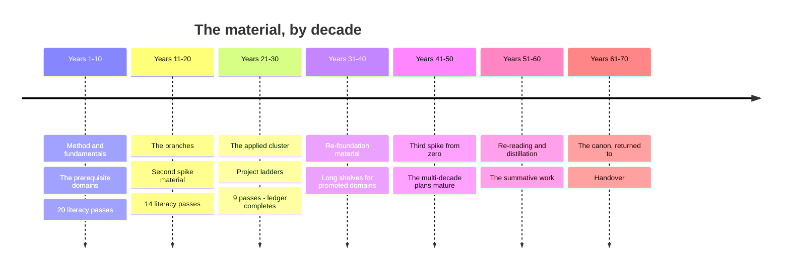

# Timeline — What to Read, and in What Order

This is the material queue: the specific books, courses, datasets, and
practices to pick up across seventy years, in the order to pick them up.

`02-map.md` says what the territory is. `resources/` says everything available
in each part of it — which is far more than any one life will consume.
`03-spine.md` says which domains happen when, and why that order. **This file
says what to actually open, on what day, and what to open after it.**

It is a queue to branch from, not a contract to obey. The [branch
points](#branch-points) mark where the plan legitimately splits, and the
[variants](#variants--pre-built-forks) are pre-built forks for common
situations. Everything named here is already in `resources/` — nothing new is
introduced, so every item has a full treatment waiting behind it.

## How to use this

**Work down the numbered list.** Within a year, the order is the argument.
Three rules generated it, and they are worth knowing so you can re-derive the
sequence when you inevitably reorder:

1. **Method before material.** Adler before anything he teaches you to read.
   The reading and note-taking method pays off across every item that follows
   it, so it goes first even though it feels like a detour.
2. **Intuition before rigour.** 3Blue1Brown before Strang. Spiegelhalter
   before Blitzstein. The accessible door first, always — a hard text read
   after an easy one is a different and much faster experience than the same
   text read cold.
3. **Canon after survey, never instead.** The survey tells you what the field
   asks; the canon shows you the field asking it. Reversed, the canon is just
   difficult prose. Where a resource file says *start here*, that item is #1.

### About the hours

Every item carries a rough estimate. Add them up and the years don't sit
evenly, which is deliberate and worth understanding before you start:

| Decade | Listed per year | Against a 500-hour year |
|--------|-----------------|-------------------------|
| 1 (yrs 1–10) | ~265–345 hrs | Heavy. The trunk years carry two domains each *and* the fundamentals |
| 2 (yrs 11–20) | ~140–180 hrs | Light on purpose — the second spike is taking the rest |
| 3 (yrs 21–30) | ~220–250 hrs | Middling, but half of it is building rather than reading |

**Decade 1 is over its nominal budget and this is the honest fact about it.**
The load model in `03-spine.md` allocates about 200 hours a year to ledger
material; the trunk years list closer to 300. Three ways to resolve that, and
you should pick one deliberately rather than discovering the gap in March:

1. **Run the trunk years at twelve or thirteen hours a week** rather than ten.
   Most people starting this have more slack early than they will later, and
   the front-loading buys back time from year 6 onward.
2. **Cut from the bottom.** The queue is *ordered*, which makes it a triage
   list: item 16 is there because it earns its place after item 15, not
   because it's optional filler. When a year won't fit, drop the tail — never
   the first four.
3. **Take the constrained fork** — one domain a year, ledger completes near
   year 44. See [the variants](#variants--pre-built-forks).

What you should not do is keep all sixteen items and finish none of them. A
year with ten items completed and six deferred is a good year. A year with
sixteen started is a wasted one.

**Within a year, hours need not be spread evenly.** Six weeks of intensity
beats ten months of half-hour sessions for most literacy passes.

**Three things run underneath every year** and are not repeated in the tables:
daily spaced repetition, the weekly log, and the curiosity budget. Current
awareness (`05-current.md`) and the frontier slot (`04-frontier.md`) run every
year too. When those stop, the plan has stopped.

---

# Years 1–10 — The Trunk

`03-spine.md` tells you which domains happen when. This tells you what to
open, in what order, and why that order and not another one. It is a queue,
not a schedule — if a year runs long, the next item waits; it does not get
skipped.

Every item here is already named in `resources/`. Nothing new has been
introduced. Where a domain file says *start here*, that item is #1 or close
to it, and the reason is always the same: the accessible door before the hard
text, the method before the material, the intuition before the rigour.

**Hours are approximate.** Roughly 200 a year across the two ledger domains,
per the load model in `03-spine.md`. Method and fundamentals items in the
tables draw on the separate fundamentals budget, which is heavy in years 1–2
and maintenance after. The numbers are there to tell you the shape and weight
of an item — a weekend, a month, a season — not to be added up.

---

## Year 1 — Statistics & probability · Philosophy

**The order, and why.** Adler comes before everything because he is the
instrument for everything: the four levels — inspectional, analytical,
syntopical — are how you will read the next sixty-nine years, and reading him
in month one makes every item below cheaper. Then the two doors open at once,
because these are the two meta-domains and they teach opposite skills:
Spiegelhalter teaches you to interrogate evidence, Plato to interrogate
argument. The course is scheduled like an enrolled class, and the problem sets
are the only part that is really the course.

| # | Material | Role | Hrs | Why here |
|---|----------|------|-----|----------|
| 1 | Adler & Van Doren, *How to Read a Book* | method | ~12 | month one, as a manual not an essay — it is the instrument the other nine years run on |
| 2 | Anki, set up day one, with Woźniak's "Twenty rules of formulating knowledge" | method / practice | ~4 + daily | rules 1–4 before your first card, or you will write a year of bad ones |
| 3 | Spiegelhalter, *The Art of Statistics* | survey (door) | ~20 | teaches the reasoning through real cases and postpones formulas until you want them |
| 4 | Huff, *How to Lie with Statistics* | survey | ~2 | ninety minutes, written in 1954, and it inoculates permanently |
| 5 | Plato, *Euthyphro / Apology / Crito*, Grube (Hackett) | canon (door) | ~10 | sixty pages, and it shows philosophy as an activity before it shows any doctrine |
| 6 | Harvard **Stat 110** (Blitzstein) with Blitzstein & Hwang, *Introduction to Probability*, ch. 1–6 | course | ~55 | the load-bearing half of the domain; exercises worked with solutions covered, then checked |
| 7 | Millican, *General Philosophy* (Oxford, free) | course | ~15 | the core problems, structured, before you meet them scattered through the canon |
| 8 | Freedman, Pisani & Purves, *Statistics* | survey | ~25 | the calculus-free classic, still unmatched on what inference actually *means* |
| 9 | Kenny, *A New History of Western Philosophy* | survey | ~25 | the map, after you have walked one small piece of the territory yourself |
| 10 | Philosophy canon: *Republic* I–II, VI–VII; *Nicomachean Ethics* I–II, X; Descartes, *Meditations*; Hume, *Enquiry*; Mill, *On Liberty*; Nietzsche, *Genealogy* | canon | ~40 | read for argument structure, not conclusions — the summaries lose the interesting move |
| 11 | The *Analects* (Slingerland), *Tao Te Ching* (D.C. Lau), Nāgārjuna via Garfield's *Fundamental Wisdom of the Middle Way* | canon | ~20 | alongside the Western canon, not after it, or the survey's silences become yours |
| 12 | Sandel, *Justice* (justiceharvard.org) | course | ~15 | ethics and political philosophy with the arguments run live against a room |
| 13 | Fisher, *The Design of Experiments* ch. 2; Tukey, *Exploratory Data Analysis* (browse); Tufte, *The Visual Display of Quantitative Information* | canon | ~12 | the lady tasting tea is fifteen pages and is where the modern experiment starts |
| 14 | A reading group, or one reader who owes you honesty | people | ~15 | feedback is the bottleneck in both domains and you must go get it deliberately |
| 15 | Salsburg, *The Lady Tasting Tea* | history | ~8 | the century of statistics as a story, once the vocabulary is in place |
| 16 | McElreath, *Statistical Rethinking* lectures (free) | course | ~20 | the Bayesian and causal side — after Stat 110, never instead of it |

**Also running.** Writing is the year's other real subject: Zinsser's *On
Writing Well* first for the argument, then Williams' *Style: Lessons in
Clarity and Grace* worked slowly with its exercises and answers, and Pinker's
*The Sense of Style* for why the advice works. Publish 500–1,500 words every
week, with your name on it, where strangers can see it — draft, sleep on it,
cut a quarter, apply Williams to the ten worst sentences. Brown, Roediger &
McDaniel's *Make It Stick* explains what the daily Anki habit is doing;
Ahrens' *How to Take Smart Notes* is the retrieval half. Peter Adamson's
*History of Philosophy Without Any Gaps* and *In Our Time* fill commute hours
that were otherwise unusable. Personal finance gets exactly one weekend,
early, and then stops: Housel's *The Psychology of Money* for the behavioural
half, the *Bogleheads' Guide* for the allocation, Sethi's checklists for the
account order — automate it and do not touch it again until the annual hour.

**Buy this year.** Almost nothing, deliberately — under $50. A library card
first, which is the highest-leverage item in `kit.md` by an enormous margin
and often carries remote JSTOR and newspaper archives. A notebook system
($20–40/yr): a carry notebook for capture, a bound one for working problems,
one place they get processed. Index cards ($10). Anki, free. Gear bought
before the habit exists is gear that goes unused.

**The artifacts.** A statistical claim from the news taken back to its paper —
2,000 words on what it does and does not support, naming sample, interval,
assumptions, and how many comparisons were really made. Free will
reconstructed three ways — hard determinism, libertarianism, compatibilism —
as numbered premise–conclusion arguments, then the single premise you deny and
your defence of denying it, 2,000 words. Forty-plus weeks of public writing.
An unbroken SRS streak. An honest self-rating against the fundamentals table
in `02-map.md`.

---

## Year 2 — Mathematics · World history

**The order, and why.** Intuition before rigour, twice over. Gowers explains
the abstract method — why mathematicians refuse to say what a number really
is — which is the thing that locks outsiders out; 3Blue1Brown then makes
linear algebra and calculus geometric; only then does Strang become the real
thing rather than symbol-pushing. On the history side the method book is not
optional and comes early, because Bloch changes how you read every narrative
after him. History is the one domain the spine gives two years: this is part
one — deep time, the global spine, the method, one decentring anchor.

| # | Material | Role | Hrs | Why here |
|---|----------|------|-----|----------|
| 1 | Gowers, *Mathematics: A Very Short Introduction* | survey (door) | ~6 | 150 small pages on the abstract method, which is the actual barrier |
| 2 | 3Blue1Brown, *Essence of Linear Algebra* and *Essence of Calculus* | video | ~10 | geometric meaning first — and they are intuition pumps, not substitutes |
| 3 | McNeill & McNeill, *The Human Web* | survey (door) | ~12 | organises everything around connection and exchange, which is the frame you want before any survey |
| 4 | Bloch, *The Historian's Craft* (or Carr, *What Is History?*) | method | ~10 | non-optional, and early — Bloch is warmer, Carr sharper on causation |
| 5 | The **Big History Project** (free) | course | ~25 | the deep-time frame, so the last 5,000 years stop looking like the whole story |
| 6 | MIT OCW **18.06 Linear Algebra** (Strang) | course | ~50 | the real thing, with the problem sets done; reading math is not learning math |
| 7 | Roberts & Westad, *The Penguin History of the World* | survey | ~45 | the best single reference narrative, ~1,200 pages, read as a spine to hang anchors on |
| 8 | Courant & Robbins, *What Is Mathematics?* (or Aleksandrov, Kolmogorov & Lavrent'ev, *Mathematics: Its Content, Methods and Meaning*) | survey | ~25 | the panorama; take the Dover three-in-one if Courant feels thin |
| 9 | Sweigart, *Automate the Boring Stuff with Python* | practice | ~25 | programming starts by killing one real annoyance of your own, not by taking a course |
| 10 | Euclid, *Elements* Book I — definitions, postulates, common notions, then Props. 1–47; plus Book IX Prop. 20 | canon | ~12 | the first axiomatic system, ending at Pythagoras; two paragraphs for the infinitude of primes |
| 11 | Herodotus, *Histories* Bks 1 and 7; Thucydides, *Peloponnesian War* Bk 1, the Melian Dialogue, Bks 6–7 | canon | ~20 | the invention of the genre, then the hardest political history ever written |
| 12 | Frankopan, *The Silk Roads* | survey anchor | ~15 | the decentring anchor — read it against the Penguin spine, not instead of it |
| 13 | A natural history museum, with a specific written question in hand | place | ~6 | deep time as physical scale; go repeatedly and briefly, never once and exhaustively |
| 14 | Hardy, *A Mathematician's Apology* | canon | ~4 | what a mathematician thinks they are doing, at the end of a year of doing it |

**Also running.** Anki daily, now carrying two domains. Weekly publication
continues, with Williams' exercises still being worked. `04-frontier.md` and
`05-current.md` both start drawing their capped hours this year and never
stop. Held back for history's second pass: Ibn Khaldun's *Muqaddimah* on
*asabiyyah* and the dynastic cycle, Sima Qian's selected biographies,
Hobsbawm's *Age of* quartet, the Open Yale courses (Merriman's *European
Civilization, 1648–1945*; Freedman's *The Early Middle Ages*), and one
non-Western regional history — Keay's *India*, Iliffe's *Africans*, or Brook's
*The Troubled Empire*.

**Buy this year.** Under $100. A whiteboard ($25–80), A2 or larger, because
thinking with your arm instead of your wrist changes what you can hold in
view. A proof notebook ($10), hardbound and kept separate — the record of your
own failed attempts is the most useful document you will own in this cluster.
Skip the graphing calculator. The rest of the formal kit is free software:
LaTeX, SageMath or SymPy, Anki.

**The artifacts.** Cantor's diagonal argument and Galois' insight explained in
full to a bright sixteen-year-old, then used to argue whether mathematics is
discovered or invented — 2,000 words. History part-one notes, structured so
part two can attach to them; the Great Divergence essay waits for the second
pass. One working script you wrote that saves you real time, in a git repo you
actually commit to.

---

## Year 3 — Physics · Literature

**The order, and why.** Feynman's *Character of Physical Law* first, because
it teaches what a physical law *is*, and that is prerequisite to everything
else in the domain. Year 2's calculus means you can skip lighter on Carroll
and go to the Feynman Lectures sooner — but by the chapters `physical.md`
names, not cover to cover, which is how people bounce off them. Literature is
the alternation rule's first real test, so it is deliberately not sequenced
around difficulty: Wilson's *Odyssey* is the door because nearly everything
after is arguing with it. This is also the year two permanent tracks start.

| # | Material | Role | Hrs | Why here |
|---|----------|------|-----|----------|
| 1 | Feynman, *The Character of Physical Law* (Messenger Lectures; book and video free) | canon (door) | ~8 | what a law is, before any particular law |
| 2 | Homer, *The Odyssey*, Emily Wilson | canon (door) | ~20 | plain, fast, line-for-line with the Greek; her introduction is a short education in what a translator decides |
| 3 | Carroll, *The Biggest Ideas in the Universe*, vols. 1–2 | survey | ~25 | real equations, no prerequisites — go lighter here if year 2's calculus took |
| 4 | Susskind, *The Theoretical Minimum* — Classical Mechanics, then Quantum Mechanics, then Special Relativity | course | ~40 | furthest for least pain, and in that order specifically |
| 5 | *The Feynman Lectures*, Vol. I ch. 1–7, 26–27, 37–38, 44–46 (free online) | canon | ~35 | least time, quantum, and the thermodynamic ratchet — the named chapters, not the book |
| 6 | Norton Anthology of World Literature (Puchner, gen. ed.) | survey | ~30 | a survey that consists of actually reading the works |
| 7 | Lewin, MIT 8.01/8.02 lectures (YouTube) | course | ~20 | still the best filmed introduction to E&M |
| 8 | Open Yale **ENGL 300**, *Introduction to Theory of Literature* (Paul Fry) | course | ~25 | the schools taught fairly, so you can tell which lens you are using |
| 9 | Literature canon, first pass: Sophocles, *Oedipus Tyrannus*; Dante, *Inferno* (Hollander for notes, Pinsky for verse); Austen, *Pride and Prejudice*; Flaubert, *Madame Bovary* (Davis); Woolf, *To the Lighthouse* | canon | ~45 | ask of each: how does it manage time, and where does its narrator stand |
| 10 | Shakespeare, *Hamlet* and *King Lear*, read aloud | canon | ~15 | aloud is not a flourish — the verse does not work silently |
| 11 | Auerbach, *Mimesis* | survey / argument | ~20 | a survey and an argument at once, and it needs canon under it to land |
| 12 | Einstein (1905), "On the Electrodynamics of Moving Bodies," §1–5 | primary | ~4 | free, and astonishingly readable once Susskind's SR is done |
| 13 | ModPo (Filreis, free) | course / community | ~15 | real communal close reading, which is the rarest thing online |

**Also running.** **The language starts now** and runs three years to B2.
Order matters here too: Wyner's *Fluent Forever* first for the sound system,
with minimal-pair drills and shadowing daily for two months, because sounds
you cannot distinguish you cannot store; Krashen's *Principles and Practice*
(free at sdkrashen.com) for why comprehensible input is the engine; a paid
tutor from month one via italki or a local equivalent, which is the
non-negotiable item; graded readers as the input backbone; the first
1,000–2,000 words by frequency, taken deliberately rather than waited for;
Anki cards built from sentences you actually met, never bare translation
pairs; a grammar reference with an index, to consult and not to study. The
daily loop is SRS 15–20 min, input 30–45 min, output two or three sessions a
week. **The craft starts now and never ends.** Pick one from `made-applied.md`
and learn the tool before the technique: sharpening, tuning, calibration, and
the safety rules cold, from a person. Then the one book for your craft —
Schwarz, Nosrat, Leach, Platt, Smith, or Klickstein — read once and kept
beside the bench, not on a shelf. Then an in-person class, because this is the
tier where money buys the most.

**Buy this year.** 10×50 binoculars, $90–180 — the most useful advice in
`kit.md`, and they serve astronomy in year 10 and birding forever. A
planisphere, $12, which teaches the sky's rotation because you turn it
yourself; Stellarium is free. The craft's starting tools: the cheap version,
used until its limits genuinely annoy you — except the sharpening setup, which
is bought good alongside the first edged tools.

**The artifacts.** 2,000 words on why least action, not Newton's second law,
is the real formulation of classical mechanics, and what it means that the
same principle reappears in quantum mechanics. A 2,000-word close reading of
one poem or one three-page passage, defending a claim that collapses if the
details don't support it — no biography, no context, the words only. CEFR A2.
One finished object from the craft, however bad.

---

## Year 4 — Evolutionary & molecular biology · Music

**The order, and why.** Dawkins first because he makes selection an algorithm
you can run in your head, and after that you can predict what selection will
and won't build — every later reading is checked against that. Copland does
the same job for music: he converts passive listening into attention with a
target, so Wright's course lands on trained ears instead of building them from
zero. The microscope goes early, not late. Pond water on day one is the point.

| # | Material | Role | Hrs | Why here |
|---|----------|------|-----|----------|
| 1 | Dawkins, *The Selfish Gene*, ch. 1–6 and 11 | canon (door) | ~12 | selection as an algorithm; those chapters carry it |
| 2 | Copland, *What to Listen For in Music* | survey (door) | ~10 | you finish it hearing form rather than mood |
| 3 | Pond water, yeast, your own cheek cells, under the scope | practice | ~15 | day one, before the textbook — the cell stops being a diagram |
| 4 | Open Yale **MUSI 112**, *Listening to Music* (Craig Wright) | course | ~30 | the best structural-listening course available anywhere |
| 5 | Zimmer & Emlen, *Evolution: Making Sense of Life* | survey | ~35 | a textbook that reads like journalism; the best complete first pass |
| 6 | Open Yale **EEB 122**, *Principles of Evolution, Ecology and Behavior* (Stearns) | course | ~35 | 36 free lectures, still the best online treatment |
| 7 | Darwin, *On the Origin of Species*, ch. 1, 4, 6, 14 | canon | ~15 | ch. 6 is where Darwin is his own best critic; skip the pigeon-fancier detail |
| 8 | Coursera (Edinburgh), *Fundamentals of Music Theory*, with musictheory.net and teoria.com drills | course | ~20 | the mechanics, once Copland and Wright have given you something to name |
| 9 | Music canon, listened to structurally with a score where you can: Josquin; Monteverdi, *L'Orfeo*; Bach's C-major prelude and fugue then the *B Minor Mass*; Mozart 40; Beethoven 5 and Op. 131; *Winterreise*; the *Tristan* prelude; Debussy; *The Rite of Spring*; Ligeti | canon | ~35 | ask of each: where is the tension, and what resolves it |
| 10 | Lane, *The Vital Question* | survey | ~12 | the energetic origin story the standard textbook underplays |
| 11 | MIT OCW **7.01SC**, *Fundamentals of Biology* | course | ~25 | the molecular half Stearns doesn't cover |
| 12 | Beyond the West: a full Ravi Shankar rāga (ālāp into jor into jhālā); Umm Kulthūm; Javanese gamelan; Ali Farka Touré. And Ellington; *Kind of Blue* (modal, not functional); *A Love Supreme*; Robert Johnson; Aretha Franklin | canon | ~25 | Taruskin's line is one tradition; Titon's *Worlds of Music* is the corrective |
| 13 | Ross, *The Rest Is Noise* | survey | ~15 | the twentieth century as narrative, after you can hear it |
| 14 | Monod, *Chance and Necessity* | canon | ~8 | chance and necessity stated by someone who did the molecular work |
| 15 | A local natural history society | people | ~10 | amateur societies hand a newcomer real equipment within a month |

**Also running.** An instrument in your hands, not a book about music — a
weekly teacher, and Klickstein's *The Musician's Way* for how to practise
rather than merely repeat. If the instrument *is* your craft, this and the
year-3 craft track are the same track. Language to B1: the daily loop
unchanged, tutor sessions now doing real work, graded readers giving way to
native shows with target-language subtitles. Sapolsky's Stanford *Human
Behavioral Biology* lectures are the famous supplement here — excellent, and a
supplement, not a substitute for Stearns.

**Buy this year.** A real compound microscope — achromatic objectives,
mechanical stage with coaxial controls, Abbe condenser with iris, glass
throughout. New, the usable entry point is $200–400; better, buy used from
university surplus or a lab liquidation at $150–400, where a thirty-year-old
professional instrument beats anything new at that price. Prepared slides
($30–60) to calibrate your eye, then blanks and coverslips ($20/hundred) and
methylene blue and iodine ($15), because making your own is the skill. A
dissection kit ($20–40). An instrument bought used — a solid-top acoustic
guitar at $150–400, or a weighted-key 88 digital piano at $300–500 — plus
$50–100 for a setup or tuning, and a mechanical metronome ($20–30), which gets
used because it is sitting there. IMSLP is free and holds the repertoire.

**The artifacts.** One adaptation traced end to end — lactase persistence, the
sickle-cell heterozygote advantage, the vertebrate eye — through the mutation,
the selective regime, the population dynamics of its spread, and the evidence
the story is true rather than merely plausible, 2,000 words. 1,500 words on a
single four-minute piece: what happens, in order, section by section, plus the
moment the music makes a promise and the moment it keeps or breaks it.
Language at B1.

---

## Year 5 — Chemistry · Psychology

**The order, and why.** The lab course is item one because it is a calendar
constraint, not a reading choice — chemistry is the least autodidact-friendly
domain on the map, you cannot fake a lab, and community-college enrolment
happens months before the reading does. Levi then makes chemistry a way of
seeing rather than a syllabus. On the psychology side the year-1 statistics is
the whole point: Kahneman is read *with the replication crisis in hand*, which
is why he comes before Bloom's course rather than after it — watching a great
book age is itself part of the literacy.

| # | Material | Role | Hrs | Why here |
|---|----------|------|-----|----------|
| 1 | The community college chemistry lab course | course / lab | ~50 | enrol first; it sets the year's calendar and it is the honest route |
| 2 | Levi, *The Periodic Table* | canon (door) | ~10 | chemistry as a way of seeing, by a working chemist; if only two chapters, "Iron" and "Carbon" |
| 3 | Kahneman, *Thinking, Fast and Slow* | survey (door) | ~20 | how a vague claim about the mind becomes a cheap decisive experiment — and the priming chapter has not held up |
| 4 | Atkins, *Chemistry: A Very Short Introduction*, then *Atkins' Molecules* | survey | ~15 | he wrote the standard physical chemistry text and compresses without lying |
| 5 | Open Yale **PSYC 110**, *Introduction to Psychology* (Paul Bloom) | course | ~30 | take it whole; among the best introductory courses in any subject |
| 6 | MIT OCW **5.111**, *Principles of Chemical Science* (Drennan) | course | ~40 | full video, among the best-taught on OCW, and it pairs with the lab hours |
| 7 | Gray & Bjorklund, *Psychology* (or Bloom, *Psych: The Story of the Human Mind*) | survey | ~30 | a real textbook, evolutionary in framing — which year 4 has now earned |
| 8 | PsychoPy or jsPsych: run a classic experiment on yourself | practice | ~15 | watching your own data come out noisy teaches the methods problem faster than any chapter about it |
| 9 | Pauling, *The Nature of the Chemical Bond*, ch. 1–3 and the resonance chapters | canon | ~15 | it built modern chemistry and is still readable; skip the crystal-radii tables |
| 10 | James, *The Principles of Psychology* — "Habit," "The Stream of Thought," "The Consciousness of Self," "Attention," "Will" | canon | ~15 | five chapters and stop; still quoted, and still right about more than it should be |
| 11 | Festinger, Riecken & Schachter, *When Prophecy Fails* | canon | ~10 | what social psychology looked like when it was brave |
| 12 | MIT OCW **5.12**, *Organic Chemistry I* | course | ~30 | after 5.111 and the lab, when the arrow-pushing has something to attach to |
| 13 | Kean, *The Disappearing Spoon* | supplement | ~8 | the fun supplement, and explicitly not the substitute |

**Also running.** Speaking is usually the fundamentals row still sitting weak
by now, and this is a good year to attack it, because both domains produce
things worth explaining. A real venue monthly is the primary source, not a
supplement — Toastmasters is the widest-available structured one, and any
equivalent works. Berkun's *Confessions of a Public Speaker* for fear and for
rooms that go wrong, Anderson's *TED Talks* for structuring around one idea,
Winston's "How to Speak" (MIT, free, one hour). Record every time; the
recording is the feedback source and it is non-negotiable. Language to B1+.
Craft continues toward its second object. R is free and is the environment
psychology reasons in — learn it here rather than later.

**Buy this year.** Lab course fees rather than home equipment. Be clear-eyed
about home chemistry: reagents, glassware and apparatus carry real safety and
legal constraints, and `kit.md` names the legitimate hobby routes. For
psychology the equipment that isn't free is mostly disappointing — a hobbyist
EEG will show you alpha rhythm appearing when you close your eyes, which is a
legitimate thrill and is not neuroscience. The real equipment is access to
participants and R.

**The artifacts.** Haber–Bosch traced end to end, 2,000 words — the
thermodynamics that makes it hard, the catalysis that makes it possible, the
real temperatures and pressures, and the fact that roughly half the nitrogen
atoms in your body passed through it. A famous psychological finding you
believed before you started, traced through its full evidential history — the
original N and effect size, what the press said, what replication found, where
it honestly stands — then what you would need to see to change your mind
again, 2,000 words. Language at B1+. The craft's second object, visibly better
than the first.

---

## Year 6 — Economics · Visual art & architecture

**The order, and why.** Economics is the one domain where `human-social.md`
says explicitly: start with a course, not a book. CORE's *The Economy* leads
with inequality, institutions, power and real data instead of chapter-one
supply-and-demand, and Heilbroner afterwards supplies the intellectual lineage
CORE assumes rather than teaches. The dataset comes early on purpose —
`modes.md` is right that in quantitative fields an afternoon with real series
should precede the survey book, because the book reads differently afterwards.
For art, Berger before any names, then the museum before Gombrich, because
scale does not survive reproduction.

| # | Material | Role | Hrs | Why here |
|---|----------|------|-----|----------|
| 1 | **CORE Econ, *The Economy*** (core-econ.org) | course (door) | ~50 | the modern introduction, free, and the single best free resource named in `human-social.md` |
| 2 | Berger, *Ways of Seeing* — the book and the four free BBC episodes | survey (door) | ~8 | makes visible the ideology in how you already look, before you have learned any names |
| 3 | FRED and Our World in Data — one question, one afternoon, one chart you made | data | ~10 | before the survey book, not after; an afternoon of messy series teaches what ten chapters don't |
| 4 | The museum, repeatedly and briefly, membership in hand | place | ~30 | twenty short visits to look at four things, not one exhausting march |
| 5 | Heilbroner, *The Worldly Philosophers* | survey | ~12 | the great economists as a story, readable in a weekend, and it is the lineage CORE assumes |
| 6 | Gombrich, *The Story of Art* | survey | ~30 | one great voice through the Western tradition, and honest about being that |
| 7 | Hayek, "The Use of Knowledge in Society" (1945) | canon | ~3 | fifteen pages, free, and the best argument for prices ever written |
| 8 | MIT OCW **14.01** *Principles of Microeconomics* and **14.02** *Principles of Macroeconomics* | course | ~40 | do the problem sets; they are posted with solutions |
| 9 | Smarthistory (free, with Khan Academy) | course | ~20 | two experts talking in front of each work — the best free art-history resource that exists |
| 10 | Smith, *Wealth of Nations* I.1–3 and IV.2; Ricardo, *Principles* ch. 7 | canon | ~10 | the invisible hand is one sentence and is almost always misquoted |
| 11 | Kostof, *A History of Architecture: Settings and Rituals*, with Ching's *Architecture: Form, Space and Order* | survey | ~30 | Ching teaches spatial thinking by drawing, which is the only way it goes in |
| 12 | Stokstad, *Art History* (or Gardner's *Art Through the Ages*); MIT OpenCourseWare's global history of architecture | survey | ~25 | the global coverage Gombrich doesn't attempt and most surveys skip |
| 13 | Keynes, *The General Theory* ch. 12 and 24 only; Friedman, *Capitalism and Freedom* ch. 1–2 | canon | ~10 | read *about* the rest of Keynes first — the file is right that it is genuinely hard |
| 14 | The canon, looked at in person wherever possible — the Pantheon's oculus, Hagia Sophia, Chartres, Giotto's Arena Chapel, Masaccio's *Trinity*, *Las Meninas*, Rembrandt's late self-portraits, Hokusai, Manet's *Olympia*, Rothko; and the buildings — Brunelleschi's dome, the Villa Rotonda, Fallingwater, the Salk Institute, Kéré's school at Gando | canon | ~25 | look for what the work does with your eye's path and your body's position |

**Also running.** Language reaches B2 this year, which is the level that
changes your life — real conversations without strain on both sides, a novel
read with effort, work done in the language. Mollick's *Co-Intelligence* is
the right year for the AI-tools row, because you now have five domains'
literacy to check a model against, and the weekly drill — take one
AI-generated explanation in a field you know well and find its errors — is
only possible once you know a field well. Craft continuing. The monthly
speaking venue continues, still recorded.

**Buy this year.** A museum membership, $50–150/yr, which pays for itself in
two visits and changes how you use a museum. If the looking turns into making,
a drawing kit at $40–70 — graphite HB through 6B, vine and compressed
charcoal, kneaded eraser, blending stump — and a 90–150 gsm sketchbook at
$15–25, because cheap paper buckles and makes competent work look bad at
exactly the wrong moment.

**The artifacts.** 2,000 words on a real policy with real data — a minimum
wage change, a carbon tax, a zoning reform — with a supply/demand analysis, an
explicit incidence claim, the strongest counterargument stated fairly, and at
least one chart you made yourself from FRED, World Bank WDI, or your national
statistics office. 1,500 words on one object you saw in person: five hundred
words of pure description with no interpretation, then what it was for, then
what you claim it does to a viewer — with the description as your evidence.
Language at B2. Sixty percent of the fundamentals table at "strong."

---

## Year 7 — Neuroscience · World religions & mythology

**The order, and why.** Sacks first because each chapter is a mind broken in
one specific way, which is precisely how the field learned what the parts do —
and because you finish it wanting the mechanism, which is the right appetite to
bring to Kanwisher. Prothero first on the other side because he inoculates
against the single commonest error before you read anything else. Kandel is
deliberately late and deliberately partial: at this tier you read Part I, the
membrane and action potentials, synaptic transmission, and one systems chapter
on vision, and you skip the molecular detail entirely.

| # | Material | Role | Hrs | Why here |
|---|----------|------|-----|----------|
| 1 | Sacks, *The Man Who Mistook His Wife for a Hat* | canon (door) | ~10 | the abstract made concrete, and it leaves you wanting mechanism |
| 2 | Prothero, *God Is Not One* | survey (door) | ~12 | organises each tradition around the problem that tradition thinks it is solving |
| 3 | MIT OCW **9.13**, *The Human Brain* (Kanwisher) | course | ~40 | free video, outstanding, unusually honest about the limits of the methods |
| 4 | Cobb, *The Idea of the Brain* | survey | ~15 | the whole history of how we've thought about brains, honest about how much is unknown |
| 5 | Open Yale **RLST 145**, *Introduction to the Old Testament* (Christine Hayes) | course | ~30 | a model of what rigorous non-devotional teaching about scripture looks like |
| 6 | Hebrew Bible in Robert Alter's translation — Genesis, Exodus, Job, Ecclesiastes | canon | ~30 | his notes are the education; read alongside Hayes, not after |
| 7 | Harvard, *Fundamentals of Neuroscience* (three parts, browser simulations) | course | ~25 | the cellular side Kanwisher skips, with simulations to fail against |
| 8 | Kandel et al., *Principles of Neural Science* — Part I, membrane potential, action potential, synaptic transmission, one vision chapter | canon | ~30 | do **not** read it cover to cover at this tier |
| 9 | Smart, *The World's Religions* | survey | ~18 | the standard secular survey, built on the seven dimensions |
| 10 | Mark and Romans; the Qur'an (Abdel Haleem); the *Bhagavad Gita* (Miller); the *Dhammapada*, then Bhikkhu Bodhi's *In the Buddha's Words* | canon | ~30 | read for genre and audience — who was this addressed to, and what did it ask of them |
| 11 | Open Yale **RLST 152**, *Introduction to New Testament History and Literature* (Dale Martin) | course | ~20 | the second half of the same non-devotional method |
| 12 | Services or ceremonies of two traditions not your own, observed as a scholar would | place / people | ~10 | the material dimension of Smart's seven, which no text delivers |
| 13 | *Gilgamesh* (Andrew George); Hesiod, *Theogony*; *Popol Vuh* (Dennis Tedlock) | canon | ~15 | myth as its own genre, not as failed history |
| 14 | Ramachandran, *Phantoms in the Brain*; Cajal's Nobel lecture (short, free) | survey / primary | ~10 | the founder's own voice, once you know what a neuron is |
| 15 | A brain specimen — a museum or a university open day | place | ~4 | proportion, which is exactly what secondary sources lose |

**Also running.** The language shifts from acquisition to maintenance, and the
protocol is specific: SRS five to ten minutes a day on that deck, never
deleted; one hour of input a week minimum; one book and one show a month, with
the book as the load-bearing half; one hour of conversation a month, because
output degrades first and fastest; and one recorded hour a year with a tutor
briefed to rate you against CEFR and say so plainly. Craft continuing. The
*Analects* and *Tao Te Ching* return this year from year 1's philosophy queue
— read now as religious texts rather than as arguments, which is a different
book.

**Buy this year.** Nothing significant. Bank it for year 10.

**The artifacts.** A single act — reaching for a cup you see on a table —
traced from photons to muscle contraction, naming each structure and the
transformation it performs, then marking explicitly every step where the
textbook story is actually a hypothesis. The marks are the real test. 2,000
words. One ritual described three times — as participants explain it, as a
Durkheimian functionalist would, as a textual historian would — then which
description you think is missing the most, 2,000 words.

---

## Year 8 — Genetics · Political science

**The order, and why.** Mukherjee is the door because he braids mechanism with
the eugenics history most popular accounts skip — and then you read the
criticism of his epigenetics chapter, because the argument is itself an
education in how a field polices claims. Fukuyama does the parallel job for
politics: after him you will never again treat "state," "rule of law," and
"democracy" as one thing. Both domains are prerequisite-dense and this is the
payoff year for years 1, 2, 4 and 5 — heritability is unreadable without
statistics, Fukuyama is unreadable without history.

| # | Material | Role | Hrs | Why here |
|---|----------|------|-----|----------|
| 1 | Mukherjee, *The Gene: An Intimate History* | survey (door) | ~18 | then read the criticism of the epigenetics chapter — that argument is part of the door |
| 2 | Fukuyama, *The Origins of Political Order* | survey (door) | ~25 | genuinely comparative — China, India, the Islamic world, Europe — rather than Western |
| 3 | Mendel, *Experiments on Plant Hybridization* (1866), whole | canon | ~4 | free, short, startlingly modern, and the rare canon item you read entire |
| 4 | Lander, *Introduction to Biology — The Secret of Life* (MITx / OCW 7.00x) | course | ~45 | problem-set driven, taught by someone who led the genome project; the best free course here by a wide margin |
| 5 | **Federalist 10 and 51** | canon | ~3 | twenty pages, non-negotiable, the best short statement of institutional design ever written |
| 6 | GenBank: pull real sequence data, build a tree, learn what a bootstrap value does and does not mean | data | ~20 | the year-1 statistics finally cashing out on somebody else's evidence |
| 7 | A local council meeting, then its minutes | place | ~8 | the gap between the two is the domain's actual subject |
| 8 | Rutherford, *A Brief History of Everyone Who Ever Lived* | survey | ~12 | the numerate correction to genetic just-so stories, especially on ancestry and race |
| 9 | Machiavelli, *The Prince* (whole — 100 pages) and *Discourses on Livy* Book 1 | canon | ~15 | the *Discourses* are more important and far less read |
| 10 | Hobbes, *Leviathan* (Introduction, ch. 13–18); Locke, *Second Treatise*; Rousseau, *Social Contract* Bks 1–2 | canon | ~20 | ch. 13–18 is the whole argument; the rest is optional at this tier |
| 11 | Open Yale, *Introduction to Political Philosophy* (Steven B. Smith) | course | ~25 | the systematic version of what Sandel did in year 1 |
| 12 | Dahl, *On Democracy*, with Acemoglu & Robinson, *Why Nations Fail* and its critiques | survey | ~18 | Dahl for the definition of polyarchy; Acemoglu & Robinson read *with* the causal-overreach critiques |
| 13 | MIT OCW **7.03**, *Genetics* | course | ~25 | follows on from Lander, and this is the order the file gives |
| 14 | Watson, *The Double Helix*, alongside Maddox, *Rosalind Franklin: The Dark Lady of DNA* | canon | ~15 | the pair is the honest version; neither alone is |
| 15 | Reich, *Who We Are and How We Got Here* | survey | ~12 | ancient DNA, once population structure means something to you |
| 16 | Tocqueville, *Democracy in America* (Vol. 1 Pt 2; Vol. 2 Pt 2); Mill, *On Liberty*, reread | canon | ~15 | *On Liberty* was a year-1 philosophy text; read now as institutional design it is a different book |

**Also running.** Watson & Crick's 1953 paper is one page — read it once,
whichever week you like. Judson's *The Eighth Day of Creation* is the full saga
if the molecular history grips you, and skipping it is legitimate. Craft moving
toward material fluency, which is where the second, harder book on your medium
belongs. Language maintenance protocol unchanged. Monthly speaking venue.

**Buy this year.** Nothing new.

**The artifacts.** 2,500 words answering a smart skeptic's question — what
does it mean to say height is 80% heritable? — handling twin studies, GWAS,
missing heritability, population stratification, and why the number says
nothing about any individual person. 2,000 words explaining one country's
specific political outcome using two competing frameworks and stating what
observable evidence would distinguish them; naming the discriminating evidence
is the test. And the **mid-decade decision point**: which domains so far
pulled hardest. Those are your second-spike candidates.

---

## Year 9 — Computing in practice · Anthropology & archaeology

**The order, and why.** Petzold first, because *Code* builds a computer from
flashlights and relays and "it's just electricity and logic" stops being a
slogan. Then *Missing Semester* very early — a week of work that removes years
of friction, and `made-applied.md` calls it the highest-leverage free course
in the whole file, so it belongs before anything larger. After seven years of
programming as a fundamental you arrive with real problems, so building and
deploying comes before CS50 rather than after it; CS50 is here for structure
if you want it, and it is legitimate not to. Anthropology inverts the usual
shape: there is no open flagship worth your time, and one full ethnography read
cover to cover *is* the training.

| # | Material | Role | Hrs | Why here |
|---|----------|------|-----|----------|
| 1 | Petzold, *Code: The Hidden Language of Computer Hardware and Software* (2nd ed.) | survey (door) | ~20 | you watch a computer get built out of relays, which no later abstraction replaces |
| 2 | Geertz, *The Interpretation of Cultures* — "Thick Description" and "Deep Play" | canon (door) | ~8 | everything you read afterward is either doing this or arguing with it |
| 3 | MIT, *The Missing Semester of Your CS Education* | course | ~12 | shell, git, editors, debugging, profiling — do it before anything bigger |
| 4 | Build and deploy something small that strangers actually use | practice | ~50 | the better route by now; a tutorial's problem gives you a tutorial's feedback |
| 5 | Eriksen, *Small Places, Large Issues* | survey | ~15 | short, global, and not US-centric |
| 6 | One full ethnography, cover to cover | canon | ~20 | the lecture format fails this field; this is the substitute and it is not a lesser one |
| 7 | Ten hours of observation in a setting you can access, with field notes written the same day | practice | ~20 | start the observation early — the artifact depends on notes you cannot reconstruct later |
| 8 | Malinowski, *Argonauts of the Western Pacific* — the Introduction on method, plus the kula chapters | canon | ~15 | the Introduction alone is the founding document of fieldwork |
| 9 | Mauss, *The Gift*, whole | canon | ~8 | short, and it is the other half of the kula |
| 10 | Renfrew & Bahn, *Archaeology: Theories, Methods and Practice* — method chapters read, the rest browsed | survey | ~20 | the genuine standard; the method chapters are the part that transfers |
| 11 | Brooks, *The Mythical Man-Month* ch. 1–3, 11 and "No Silver Bullet"; Kernighan & Pike, *The Practice of Programming* | canon | ~15 | Brooks for why your project is late, Kernighan & Pike for taste in the small |
| 12 | Harvard **CS50**, if you want the structure | course | ~35 | optional by now; finish it including the final project, or don't start |
| 13 | Evans-Pritchard, *The Nuer* (the cattle and time-reckoning chapters); Lévi-Strauss, *Tristes Tropiques* | canon | ~18 | time reckoned by cattle is the cleanest available demolition of the universal category |
| 14 | Abelson & Sussman, *Structure and Interpretation of Computer Programs*, ch. 1–2 (free) | canon | ~25 | if it grips you keep going; if it doesn't, that is a legitimate outcome, not a moral failure |
| 15 | Sapolsky, *Human Behavioral Biology* (Stanford, free) | course | ~25 | the biological-anthropology flank, and it links back to year 4 |
| 16 | An archaeological field school or a dig season | practice / place | ~40 | volunteer archaeology genuinely takes amateurs; pull it forward if a season is offered |

**Also running.** This is the natural year for programming's deliberate
re-foundation — take a tool you actually depend on and rebuild it on whatever
is currently mainstream, including version control, environment and deployment.
Craft continuing. Language maintenance. The frontier slot has been running
since year 1 and this is the cluster where it most often pays.

**Buy this year.** Under $200, and it opens the whole made-and-applied
cluster. A temperature-controlled soldering station, $50–120 — the $12
fixed-temp pencil is the standard false economy, producing cold joints you
will misdiagnose as circuit bugs for hours; buy a spare tip and a brass
sponge, and fan the smoke away. A multimeter, $40–80, which turns "it doesn't
work" into a location. Breadboards and a components assortment, $50–80. A
microcontroller starter kit, $30–70 for an Arduino-class board or $50–90 for a
Raspberry Pi-class board. A cheap USB oscilloscope at $60–150 if the signals
start mattering.

**The artifacts.** Something small, built and deployed, that strangers
actually use — plus the write-up: what broke, what you measured, what you'd
change. Separately, 1,500 words tracing everything that happens between typing
a URL and pixels appearing — DNS, TCP, TLS, HTTP, rendering. An ethnographic
sketch of 2,000 words on a setting you can access, thick description first,
closing with a paragraph on what your own position let you see and what it hid.

---

## Year 10 — Cosmology & astronomy · Theater, film & narrative media

**The order, and why.** Sagan first because *Cosmos* models reasoning rather
than reporting results, and it is still the best invitation ever made.
Aristotle first on the other side because the *Poetics* is forty pages and
every story manual sold today is a diluted restatement of it — reading the
source lets you see what they left out. Then vocabulary before canon in both
domains: OpenStax skimmed whole in a month, Bordwell & Thompson before the
films. The binoculars from year 3 go outdoors before the telescope arrives,
which is the whole argument of the year-10 purchase.

| # | Material | Role | Hrs | Why here |
|---|----------|------|-----|----------|
| 1 | Sagan, *Cosmos* (book or the 1980 series) | survey (door) | ~15 | it models reasoning rather than reporting results |
| 2 | Aristotle, *Poetics* (Malcolm Heath, Penguin) | canon (door) | ~5 | forty pages, and every story manual since is a diluted restatement |
| 3 | OpenStax *Astronomy 2e* (free) | survey | ~30 | skim it whole in a month, for the vocabulary — this is not close reading |
| 4 | Bordwell & Thompson, *Film Art: An Introduction* | survey | ~25 | it teaches you to see rather than to summarize; the vocabulary must precede the canon |
| 5 | Binoculars and a planisphere, outdoors, twenty nights | practice | ~20 | you learn that the sky moves, that the Moon ruins everything, and that magnitude is a sensation |
| 6 | Open Yale **ASTR 160**, *Frontiers and Controversies in Astrophysics* (Bailyn) | course | ~35 | uses real arithmetic — actually perform it — and is honest about what is unsettled |
| 7 | A local astronomy club — six meetings and two star parties | people | ~15 | the most welcoming amateur community in existence; someone stops you buying the wrong eyepiece |
| 8 | Film canon, with the remote in hand and rewatching: Lumière and Méliès; Keaton's *Sherlock Jr.*; the Odessa Steps shot by shot; *La Règle du jeu*; *Citizen Kane*; *Tokyo Story*; *Bicycle Thieves*; *Rashomon*; *Pather Panchali*; *Persona*; *Breathless*; *Vertigo*; *2001*; *Stalker*; *Black Girl*; *Jeanne Dielman*; *Close-Up*; *In the Mood for Love*; *Spirited Away*; *Parasite* | canon | ~45 | with *Film Art*'s vocabulary in hand, which is what makes rewatching productive |
| 9 | SDSS SkyServer: pull galaxy spectra, plot a colour–magnitude diagram, find the red sequence yourself | data | ~30 | the hour the textbook figure stops being a figure |
| 10 | Weinberg, *The First Three Minutes*; then Hubble (1929) and Penzias & Wilson (1965) | canon / primary | ~12 | two papers of two pages each — the modern picture is born in four pages |
| 11 | Theatre, live and not filmed: *Oedipus*, *A Doll's House*, *The Cherry Orchard*, *Waiting for Godot*, *Mother Courage*, *A Raisin in the Sun* | canon | ~20 | whatever is actually staged near you; the mode is the point, not the title |
| 12 | Every Frame a Painting (Tony Zhou); Bordwell, *Observations on Film Art* | video / blog | ~10 | free, and better than most paid courses at teaching you to see a cut |
| 13 | An observatory or planetarium night | place | ~5 | one public observing session at a real instrument, plus a show on a question you brought |
| 14 | Thorne, *Black Holes and Time Warps*; MIT OCW **8.282J**, *Introduction to Astronomy* | survey / course | ~25 | the relativistic half, after ASTR 160 has given you the arithmetic |
| 15 | Bordwell & Thompson, *Film History*; Brockett & Hildy, *History of the Theatre* | survey | ~20 | the timelines, last, once you have things to hang on them |

**Also running.** The craft has been running seven years and should now be
producing objects a stranger would call good. Language maintenance. And this
is the audit year, so the reading turns partly inward: Adler's syntopical
chapter, reread, is the method for the decade's synthesis work, and the
fundamentals table in `02-map.md` gets rated honestly rather than kindly.

**Buy this year.** **The year-10 purchase: a Dobsonian reflector, 6–8 inch,
$350–700.** It spends your money on the only thing that matters — aperture —
and its mount problem is already solved, which is why it beats a cheap
equatorial. Any advertisement leading with magnification is aimed at people
who don't know this. Never point any optical instrument at the Sun without a
proper full-aperture solar filter over the front; eyepiece-mounted "sun
filters" can crack while your eye is at the lens, and this is the one
irreversible injury in `kit.md`. If film study is continuing, physical media
plus a projector ($400–900) or a good large screen — streaming crops,
recompresses and alters colour, and if you are studying film rather than
watching it, the disc is the primary source.

**The artifacts.** 2,000 words on how we know the age, composition and
geometry of the universe — naming the measurements and their error bars, not
the conclusions. A shot-by-shot analysis of one three-minute sequence: every
shot logged for scale, angle, movement, duration and sound, then 1,500 words
arguing what the pattern accomplishes, with the log attached. And **the
ten-year audit** — twenty domains checked, the fundamentals table rated
honestly, the second spike chosen. `phases/decade-1-foundations.md` is the
instrument for it.

# Years 11–20 — The Second Spike

Fourteen literacy passes across ten years, which is fewer per year than Decade
1 ran, and that is the design. The second spike is taking real hours now
(`phases/decade-2-mastery.md`), so the ledger drops to roughly 100–150 hours
of material a year instead of 200. Single-domain years go deeper into the one
domain rather than padding with a second.

Three of these domains have T3 passes larger than a year can hold — artificial
intelligence at 250 hours, law at 250, medicine at 200. Where that happens the
queue says so, names which item to cut first, and pre-loads the door in the
previous year rather than pretending the arithmetic works.

In practice the years below run 140–180 hours of listed material. The
two-domain years sit at the top of that band and each carries a **cut first**
line naming what goes when the year runs long — which it will, because the
spike always wins.

---

## Year 11 — Logic & foundations

**The order, and why.** Nagel & Newman walks the incompleteness argument in a
hundred pages, which is the only honest way to start — you meet the
destination before the machinery, so the machinery has somewhere to go. Then
Priest for the map and Peter Smith's free textbook for the truth tables,
natural deduction and quantifiers, because skipping the machinery means
nothing after it lands. Gödel's own 1931 paper is brutal and you take it
through Smith's book instead; Turing 1936 you read directly, and it pays for
itself again in year 12.

| # | Material | Role | Hrs | Why here |
|---|----------|------|-----|----------|
| 1 | Nagel & Newman, *Gödel's Proof* | door | ~10 | it walks the argument rather than gesturing at it |
| 2 | Graham Priest, *Logic: A Very Short Introduction* | survey | ~8 | the map, before you commit a year to the terrain |
| 3 | Peter Smith, *Beginning Mathematical Logic: A Study Guide* (free) | method | ~4 | a better roadmap than any course on offer |
| 4 | Peter Smith, *An Introduction to Formal Logic* (free, logicmatters.net) | survey | ~35 | the machinery — skip it and nothing after it lands |
| 5 | Peter Smith, *An Introduction to Gödel's Theorems* | canon | ~30 | the route to Gödel 1931 that a self-teacher can actually walk |
| 6 | Turing, *On Computable Numbers* (1936), §1–4, with Petzold, *The Annotated Turing* | canon | ~25 | computability and provability are one subject; also year 12's canon |
| 7 | Frege, preface to the *Begriffsschrift*, and Russell's 1902 letter to Frege (van Heijenoort, *From Frege to Gödel*) | canon | ~3 | an evening, and the whole programme's rise and puncture |
| 8 | Torkel Franzén, *Gödel's Theorem: An Incomplete Guide to Its Use and Abuse* | method | ~10 | inoculation against what you will hear said about Gödel forever |
| 9 | *Mathematics in Lean*, with mathlib | practice | ~25 | a proof assistant changes what you believe a proof is |
| 10 | The artifact | artifact | ~12 | see below |

**Also running.** The second spike moves from foundations toward working
professional strength — the fastest route is real projects that already use
the first spike, which is the π advantage. The craft is approaching material
fluency: stop following recipes, start diagnosing why the joint gapped or the
glaze crazed, and pick up the craft's own periodical (*Fine Woodworking*,
*Ceramics Monthly*, *Cook's Illustrated*, *Nuts and Volts*). Language is
maintenance, not acquisition. Mathematics' lifetime practice continues — one
hard problem a week in the notebook. **A new lifetime practice starts here:**
keep a proof assistant alive and formalize something small every month, an
exercise or a lemma, in Lean or Rocq. Thirty years of that is both a skill and
an instrument for measuring how the tools changed. Frontier slot (~40 hrs) and
current awareness (~100 hrs) run as always.

**Buy this year.** Almost nothing — this is the cluster where money buys
nothing, and it is worth sitting with that fact. A hardbound **proof
notebook** ($10), kept separate, because the record of your failed attempts is
the most useful document you will own here. Lean, mathlib, LaTeX, SageMath and
Anki are free. The two purchases that do help: a **maths tutor for the eight
weeks you are stuck** ($40–100/hr, transformative at exactly the right
moment), and an **alumni library account** ($50–200/yr) for journal access.
Otherwise put the year's money into the desk, the chair and the light, in that
order — it applies to every hour of every domain for the rest of the plan.

**The artifacts.** State both incompleteness theorems precisely, with every
hypothesis, then explain in 1,500 words what each hypothesis is doing and what
the theorems do *not* imply about minds, machines, or mathematics. Plus twelve
monthly formalizations in the proof-assistant repository.

---

## Year 12 — Theoretical computer science & information theory · Rhetoric & writing

**The order, and why.** Both doors go first because both are cheap and both
reorganize what follows: Petzold builds a computer out of relays so
"computation" stops being a metaphor, and Williams is the only book that
reliably improves prose on a single pass. You worked Williams in year 1 — this
is a re-read with the exercises done against ten years of your own weekly
writing, which is a different book. Sipser and MIT's 18.404J run together
because the course is Sipser teaching his own book. Shannon comes after Sipser,
not before: read cold it is elegant, read after the complexity chapters it is
the second half of the same idea. This is the heaviest year in the decade, and
it is survivable only because Turing 1936 was paid for in year 11 and Williams
in year 1.

| # | Material | Role | Hrs | Why here |
|---|----------|------|-----|----------|
| 1 | Charles Petzold, *Code: The Hidden Language of Computer Hardware and Software* | door | ~15 | a working computer from flashlights and relays |
| 2 | Joseph M. Williams, *Style: Lessons in Clarity and Grace* | door | ~10 | re-read with exercises, now against your own decade of drafts |
| 3 | Larry McEnerney, *The Craft of Writing Effectively* (80 min) with Gopen & Swan, "The Science of Scientific Writing" | method | ~4 | reader-expectation prose in one afternoon |
| 4 | Sipser, *Introduction to the Theory of Computation*, ch. 0–5 and 7 | survey | ~35 | slowly through 3, 4 and 7; skip 6 on a first pass |
| 5 | MIT OCW **18.404J Theory of Computation** | course | ~15 | Sipser on video teaching Sipser — run it against the book |
| 6 | Steven Pinker, *The Sense of Style* | survey | ~12 | the modern linguistic account of why prose fails |
| 7 | Shannon, *A Mathematical Theory of Communication* (1948), in full | canon | ~8 | one of the most readable landmark papers ever written |
| 8 | David MacKay's Cambridge lectures with *Information Theory, Inference, and Learning Algorithms* (free PDF) | course | ~16 | equals anything paid, and the entropy half needs a teacher |
| 9 | Aristotle, *Rhetoric* I–II (Kennedy, *On Rhetoric*), with Plato's *Gorgias* | canon | ~12 | invention and arrangement — the canons modern advice ignores |
| 10 | The speeches: Pericles; Lincoln's Gettysburg and Second Inaugural; Douglass, "What to the Slave Is the Fourth of July?"; King, "Letter from Birmingham Jail"; Montaigne; Orwell; Baldwin; Didion | canon | ~12 | the field's real canon — read each twice, once for what, once for how |
| 11 | Quintilian, *Institutio Oratoria*, Book I | canon | ~8 | one book a year for twelve years starts now |
| 12 | The artifacts | artifact | ~22 | see below |

**Cut first if the year runs long.** Farnsworth's *Classical English Rhetoric*
and Zinsser's *On Writing Well* — both real, both deferrable to the standing
craft track. Do not cut Sipser's exercises.

**Also running.** Second spike toward trusted-professional level, with the
first deliberately hybrid project scoped. The craft's second book — the
material science of your medium. **Two lifetime practices start here.** From
TCS: reduce things. Every genuinely new problem that turns up, at work or in
another domain on this map, gets classified — polynomial, NP-hard,
undecidable, or ill-posed — and the reduction written down, however roughly.
Keep the file. Add one Simons Institute workshop series a year; the videos are
free. From rhetoric: 500 words a day, one finished piece published a month,
one page a week copied by hand from a single writer chosen for the year, the
*progymnasmata* worked in order at one per quarter, and a commonplace book on
Locke's indexing method — one book, forty years, indexed, never restarted.
Keep an editorial log of every change any editor makes to your work, with the
pattern named. Logic's monthly formalization continues.

**Buy this year.** Nothing for the domains — these are pencil-and-screen
subjects. Spend it on feedback instead, which is where rhetoric's hours
actually convert: **a paid editor**, $300–1,500 per pass, once or twice a year
on a real piece. This is the single most underrated line in `kit.md`, because
writing is the fundamental with the worst feedback loop — nobody in your life
will tell you your prose is flabby. Add **a serious writing workshop** staffed
by people willing to hurt your feelings on schedule ($300–1,500), which beats
any course. A **second large monitor** ($200–500) earns its place for anything
with code or two documents at once.

**The artifacts.** Prove the halting problem undecidable from scratch, explain
what NP-completeness means and why 3-SAT is the hinge, then estimate the
entropy of English text and say what that number means — 2,000 words. And:
take 1,000 words of your own older writing, cut it to 600 without losing
content, publish both versions plus a paragraph naming each *class* of cut.
The taxonomy is the proof, not the shorter draft.

---

## Year 13 — Linguistics

**The order, and why.** Deutscher first because he shows grammar the way
geology shows mountains — accumulated residue of ordinary erosion — after
which you can never again read grammatical structure as designed. Pinker next
and deliberately second: it is the more famous door and it argues one side
hard, so meet it once you have a counterweight. Then *Language Files*, whose
problem sets are the point and not the packaging. Saussure and Chomsky come
after the problem sets, because read cold they are position statements and
read after them they are arguments about data you have handled. The last two
rows are AI's door, pre-loaded: AI's literacy pass is 250 hours, the largest in
the ledger, and it does not fit in year 14 beside sociology.

| # | Material | Role | Hrs | Why here |
|---|----------|------|-----|----------|
| 1 | Guy Deutscher, *The Unfolding of Language* | door | ~12 | grammar as erosion, not design |
| 2 | Steven Pinker, *The Language Instinct* | survey | ~10 | read it, and know it argues one side hard |
| 3 | *Language Files* (Ohio State Dept. of Linguistics) | survey | ~40 | exercise-driven, every subfield; do the problem sets, don't read past them |
| 4 | MIT OCW **24.900 Introduction to Linguistics** | course | ~25 | full materials free, unusually good on syntax |
| 5 | Saussure, *Course in General Linguistics* — Introduction, Part One on the sign, synchrony/diachrony | canon | ~8 | the frame every later argument assumes; the rest is skippable |
| 6 | Chomsky, *Syntactic Structures* ch. 1–5, then his 1959 review of Skinner's *Verbal Behavior* | canon | ~8 | "colorless green ideas," then the shot that started the cognitive revolution |
| 7 | Edward Sapir, *Language* (1921) | canon | ~6 | beautiful prose, still worth the evening (skip Bloomfield) |
| 8 | Labov (1963) on Martha's Vineyard | canon | ~3 | the paper that founded sociolinguistics — variation is structured, not noise |
| 9 | Narrow IPA transcription of your own speech, with CHILDES for child-language data | practice | ~18 | the gap between what people think they say and what they say |
| 10 | Melanie Mitchell, *Artificial Intelligence: A Guide for Thinking Humans* | door | ~15 | AI's #1, read here because year 14 cannot hold all 250 hours |
| 11 | Turing (1950), "Computing Machinery and Intelligence," and the 1955 Dartmouth proposal | canon | ~5 | the objections-and-replies section, not just the imitation game |

**Also running.** Second spike: the π takes shape, and the hybrid project
should ship this year or next. In the first spike, move from *solving* problems
to *choosing* them — taste is the master-level skill, built from post-mortems
and proximity to people who have it. Craft at working depth: work to a spec
someone else set and a deadline you didn't choose. **Linguistics' lifetime
practice starts now:** one reference grammar a year of a language you do not
speak, worked through, with your own ten-page structural sketch written —
inventory, morphology, alignment, word order, whatever is strange. Thirty of
those, spread across families, gives you an internal typology no textbook can
hand you. Keep a few minutes of narrow IPA a month alongside it, or the ear
goes. Monthly formalization, weekly hard problem, daily 500 words, the
reduction file, the forecast log from year 1.

**Buy this year.** **A microphone, bought properly the first time** —
$100–250 for a decent large-diaphragm condenser or dynamic plus an audio
interface. This is an explicit buy-good-immediately category in `kit.md`: a $25
microphone does not produce a worse recording, it produces a recording in which
you cannot hear the thing you were trying to evaluate, which defeats the point
of recording at all. Praat, ELAN, CHILDES and COCA are free. If the year allows
one program, the **LSA Summer Institute** is the field's central training event
and takes non-academics ($1,000–4,000 plus travel, from `kit.md`'s summer
schools line).

**The artifacts.** Transcribe three minutes of your own unscripted speech in
narrow IPA — actual transcription, not spelling — then 1,500 words on what the
transcription reveals that the orthography hides, and on what a five-year-old
knows about your language that nobody taught them, citing real CHILDES data
rather than reasoning from the armchair. Plus the first structural sketch of a
grammar you don't speak.

---

## Year 14 — Artificial intelligence · Sociology

**The order, and why.** Mitchell was read last year, so AI opens directly on
Winston's 6.034 — the best teaching of AI *as a field* rather than as a stack —
with Berkeley's CS188 Pacman projects running underneath, because search, CSPs,
MDPs and reinforcement learning stick when you implement them and evaporate
when you watch them. Russell & Norvig is read in parts, not whole, at this
tier. Sociology takes the lean pass: Mills for what the discipline is *for*,
the free OpenStax survey rather than Giddens to buy back hours, then straight
to the classical theorists and one modern ethnography. AI carries the year;
sociology is deliberately the lighter half.

| # | Material | Role | Hrs | Why here |
|---|----------|------|-----|----------|
| 1 | C. Wright Mills, *The Sociological Imagination*, ch. 1–2 | door | ~8 | a hundred pages, a mission statement, what the discipline is for |
| 2 | MIT OCW **6.034 Artificial Intelligence** (Patrick Winston) | course | ~25 | AI as a seventy-year field, not as this year's tooling |
| 3 | OpenStax, *Introduction to Sociology* (free) | survey | ~18 | the map, at no cost, so the hours go to the theorists |
| 4 | Russell & Norvig, *Artificial Intelligence: A Modern Approach* — Part I, the search chapters, skim uncertainty and decisions, read the closing philosophy chapters properly | survey | ~30 | do not attempt it whole at this tier |
| 5 | Berkeley **CS188** Pacman projects (free) | practice | ~22 | the most efficient way to make search, CSPs, MDPs and RL stick |
| 6 | Erving Goffman, *The Presentation of Self in Everyday Life* | canon | ~10 | the most immediately usable book on the sociology list |
| 7 | Weber, *The Protestant Ethic and the Spirit of Capitalism*, with "Politics as a Vocation" and "Science as a Vocation" | canon | ~10 | short, and the rationalization thesis is load-bearing everywhere later |
| 8 | Durkheim, *Suicide* Book 2 (egoistic and anomic), and the conclusion of *The Elementary Forms* | canon | ~7 | social facts as real, external and measurable |
| 9 | Marx, the 1844 manuscripts on alienation, with *The Communist Manifesto*; Du Bois, *The Souls of Black Folk* ch. 1 | canon | ~6 | the two frames the survey will have flattened |
| 10 | Newell & Simon (1976), "Computer Science as Empirical Inquiry"; Searle (1980), "Minds, Brains, and Programs"; Marr, *Vision*, ch. 1; Sutton, "The Bitter Lesson" (2019) | canon | ~9 | the hypothesis, its best attack, the levels discipline, and the two pages to argue with |
| 11 | Matthew Desmond, *Evicted* | practice | ~10 | what a modern ethnography actually looks like, against the classical frames |
| 12 | The artifacts | artifact | ~25 | see below |

**Cut first if the year runs long.** Nils Nilsson's *The Quest for Artificial
Intelligence* — the authoritative history by someone who was there, and the
right first read of year 15's slower weeks. Then Open Yale's *Foundations of
Modern Social Theory* (Szelényi), which covers the classical theorists you are
already reading in the original.

**Also running.** Second spike at trusted-professional level by the end of this
year, with the hybrid project shipped and a written answer to "what problems
are worth my next five years?" Craft at working depth. The reduction file from
year 12 gets a heavy year here — most of what AI does is search, and most of
search is a classification problem you now have the vocabulary for. Grammar of
the year, monthly formalization, weekly hard problem, daily 500 words,
progymnasmata, Quintilian Book III. Frontier slot earns its keep this year in
particular; `04-frontier.md` exists for exactly the case where something that
looks like tooling is actually a new field.

**Buy this year.** Little, and deliberately. **Compute** if the projects need
it — rented cloud time at $50–300 for a specific project, or a machine that
runs your simulations without a coffee break. Not a framework subscription and
not hardware bought speculatively: `01-principles.md` principle 5 says nothing
with a version number belongs in a seventy-year plan, and this is the year
you'll be most tempted. **One serious newspaper of record**, $150–400/yr, read
daily — it is a slow course in politics, economics and geography at once, and
it is the raw material for the sociology artifact. GSS, IPUMS and the World
Values Survey are free.

**The artifacts.** 2,500 words answering what would have to be true for you to
say a system understands something: state a concrete test, apply it to a chess
engine, a large language model and a honeybee, and where the test gives an
answer you don't believe, say so and diagnose why. A literate answer engages
Turing and Searle without merely restating either. And: 2,000 words applying
one classical frame — Durkheim, Weber, Marx, Bourdieu or Goffman — to a
contemporary pattern you have real data on, with a closing section on what the
frame cannot explain. The second section is the one that proves literacy.

---

## Year 15 — Ecology

**The order, and why.** Quammen teaches island biogeography as narrative, and
owning the species–area relationship lets you reason about extinction,
fragmentation and reserve design on your own — so it comes before any textbook.
Begon is the survey and it is genuinely complete, but Gotelli runs alongside
it, because ecology's ideas are models and you cannot hold a model you have
never fitted. Leopold and Carson come late on purpose: read after the
population mathematics, they stop being nature writing and become arguments.
And the patch of ground starts in week one, not after the reading, because a
season is a season and it will not wait for your schedule.

| # | Material | Role | Hrs | Why here |
|---|----------|------|-----|----------|
| 1 | David Quammen, *The Song of the Dodo* | door | ~18 | island biogeography as narrative — the one relationship that generalizes |
| 2 | One patch of ground, visited weekly for a season | practice | ~25 | starts now because the season starts now, not when the reading ends |
| 3 | Begon, Townsend & Harper, *Ecology: From Individuals to Ecosystems* | survey | ~40 | unusually readable and genuinely complete |
| 4 | Gotelli, *A Primer of Ecology* | course | ~18 | short, math-forward, the fastest route to modelling competence |
| 5 | Open Yale **EEB 122**, second half (Stearns) | course | ~12 | the ecology treatment, from the course you already know |
| 6 | Aldo Leopold, *A Sand County Almanac* — "Thinking Like a Mountain" and "The Land Ethic" | canon | ~7 | lands differently once you can do the population arithmetic |
| 7 | Rachel Carson, *Silent Spring* — ch. 1–3 and the pesticide-resistance chapters | canon | ~7 | the scientifically live half, read as evolution in action |
| 8 | MacArthur & Wilson, *The Theory of Island Biogeography* | canon | ~7 | skim the mathematics; the argument is the point |
| 9 | Darwin, *The Formation of Vegetable Mould through the Action of Worms* | canon | ~5 | the original ecosystem-engineering study, and a delight |
| 10 | Paine (1966), "Food Web Complexity and Species Diversity" | canon | ~2 | short, still the model of a clean field experiment |
| 11 | eBird, iNaturalist and Zooniverse, plus a local mycological or botanical society | practice | ~15 | citizen science with genuine scientific value, and people who will correct you |
| 12 | The artifact | artifact | ~15 | see below |

**Also running.** This is the first year of the original-contribution stretch:
aim the spikes at work that would not exist without you, and start learning the
meta-skills of scale — leading, allocating, judging people, negotiating —
because impact now flows through others. Teach at a higher level: mentor
several people seriously. Craft continues; sell or give away work to people who
will judge it. Grammar of the year, monthly formalization, the reduction file,
the forecast log, 500 words a day, Quintilian Book IV. Nilsson's *Quest for
Artificial Intelligence* fits the slower weeks here if you deferred it.

**Buy this year.** The kit line that converts two domains from reading to
fieldwork, and it is cheap. **Regional field guides** ($20–30 each) — regional
beats comprehensive, so buy the one whose range map includes your house;
Peterson and Audubon for America, Sibley for birds, Collins for Britain and
Europe. **A 10x doublet or triplet loupe** ($15–40), non-negotiable for botany
since plant keys ask about hairs and floral parts you cannot otherwise see. **A
plant press** ($40–80 bought, $20 built from plywood, straps and newspaper).
Your year-3 binoculars carry over, though **8x42** is the birder's preference
for the wider, steadier field. Then the access spend, which matters more:
**botanical garden or arboretum membership** ($40–100/yr, and the good ones run
identification and taxonomy courses) and a **professional society membership**
($50–300/yr — ornithological, mycological, native plant; they take
non-professionals and hand newcomers real responsibility within a month). If
the opportunity reserve has been rolling over, an **ecology field school**
($1,500–5,000, two to six weeks) is what it was saved for.

**The artifacts.** 2,500 words of natural history on your patch of ground:
species present, energy flow, disturbance and land-use history, the human hand
on it, and one falsifiable claim you could test next season. Plus a season of
verified records in eBird or iNaturalist that a researcher can actually use.

---

## Year 16 — Earth science & climate · Law & legal systems

**The order, and why.** Two doors, both cheap, both permanently reorganizing:
McPhee installs deep time in your bones and Hart makes it impossible ever again
to confuse law with orders backed by threats. Then the two surveys, and note
that law's survey is a *comparative* one — Merryman decenters the common law
immediately, which matters because if you have only met common law you have met
the minority tradition. Archer's course goes before the IPCC report because you
should run a model and watch the outgoing spectrum change before you read what
was agreed about it. The opinions come last and take the largest single block:
briefing them yourself is the training, and there is no substitute.

| # | Material | Role | Hrs | Why here |
|---|----------|------|-----|----------|
| 1 | John McPhee, *Annals of the Former World* — "Basin and Range" first | door | ~12 | nothing else installs deep time in your bones |
| 2 | H.L.A. Hart, *The Concept of Law*, ch. 1–6 | door | ~20 | afterward you cannot confuse law with threats, or with morality |
| 3 | David Archer, *Global Warming: Understanding the Forecast* | survey | ~15 | short, quantitative, honest about the uncertainty |
| 4 | Merryman & Pérez-Perdomo, *The Civil Law Tradition* | survey | ~12 | short, and it decenters the common law immediately |
| 5 | Archer, *Global Warming: The Science and Modeling of Climate Change* (Chicago, free), with MODTRAN and the models at forecast.uchicago.edu | course | ~20 | you run real models rather than watch |
| 6 | Fischl & Paul, *Getting to Maybe* | method | ~12 | nominally an exam book, actually how legal argument is constructed |
| 7 | IPCC AR6 Working Group I — Summary for Policymakers, then the Technical Summary | canon | ~15 | the SPM is negotiated line by line; the TS is where the science lives |
| 8 | Holmes, "The Path of the Law" (1897); Fuller, *The Morality of Law* ch. 2 (King Rex); Dworkin, *Law's Empire* ch. 1 and the Hercules material | canon | ~11 | realism, a legal theory told as a story, and the answer to both |
| 9 | Lyell, *Principles of Geology* Vol. 1 ch. 1–4, with Arrhenius (1896) | canon | ~8 | what Darwin read on the *Beagle*, and the radiative physics at its source |
| 10 | Six landmark opinions in full, briefed yourself: *Marbury*, *Brown*, *Donoghue v. Stevenson*, *Carlill*, *Riggs v. Palmer*, and one from your own jurisdiction | practice | ~22 | reading actual opinions beats any book about them |
| 11 | One live case followed through its docket on CourtListener and RECAP (free) | practice | ~8 | law in action against law on the books |
| 12 | The artifacts | artifact | ~24 | see below |

**Cut first if the year runs long.** Bjornerud's *Timefulness* or Alvarez's *T.
rex and the Crater of Doom* for the solid-earth half, and MIT OCW 12.001; then
Wacks' *Law: A Very Short Introduction* and Feinman's *Law 101*, both of which
are orientation you now get from Hart and Merryman anyway. Do not cut the
opinions — the ledger pass here is literacy, and briefing cases *is* the
literacy.

**Also running.** The original-contribution stretch continues, and the
meta-skills of scale — leading teams, allocating resources, judging people,
negotiating — now have the highest marginal value of anything you could learn.
Craft at working depth: diagnose rather than follow, and teach a beginner,
which will expose every gap in what you think you know. The grammar of the
year, the monthly formalization, the reduction file, the forecast log, 500
words a day, one page a week copied by hand, Quintilian Book V. Current
awareness runs hot this year — climate and law are both domains where the
live literature moves and `05-current.md` is the mechanism.

**Buy this year.** The other half of the fieldwork conversion. **A home weather
station** with anemometer and rain gauge ($120–300), or a thermometer and
aneroid barometer to start ($40–90) — pressure falling ahead of a front stops
being a textbook sentence and becomes something you watched happen. Log the
readings; the log is the point. **A rock and mineral hardness kit** ($25–50):
Mohs picks, a streak plate, a magnet, dilute hydrochloric acid for the
carbonate fizz test, because geology is a field identification discipline first
and identification is a procedure you perform with your hands. **Topographic
sheets** from your national mapping agency ($10–20 each) for places you
actually walk. A **geology field-methods course** is worth the money if one is
reachable. For law, the good sources are free: CourtListener, RECAP, and the
Avalon Project.

**The artifacts.** 2,000 words deriving the greenhouse effect from first
principles — blackbody balance, why the surface exceeds the effective
temperature, what doubling CO₂ does before feedbacks, and exactly where the
uncertainty lives. And: brief three cases yourself in standard format (facts,
issue, holding, reasoning, dissent), then 1,500 words tracing how one doctrine
shifted across them, arguing whether the shift was interpretation or policy.

---

## Year 17 — Medicine & physiology

**The order, and why.** Gawande before any mechanism, deliberately — the domain
is 200 hours of physiology and pharmacology and the thing that will actually
protect you is having met the epistemics of practice first: uncertainty, error,
judgment, an incomplete picture and a clock running. Silverthorn is then the
whole middle of the year, taken in the sequence the resource file names —
membrane transport, cardiovascular, respiratory, renal, endocrine — because
that ordering *is* the integration the book is selling. The evidence course
runs in parallel from month one, not at the end, since half of what medicine
knows is a claim about trials rather than about bodies. The clinical practice
route is chosen early, because EMT certification has a calendar and it is not
yours.

| # | Material | Role | Hrs | Why here |
|---|----------|------|-----|----------|
| 1 | Atul Gawande, *Complications* | door | ~12 | the epistemics of practice, read before any mechanism, so what follows carries the right humility |
| 2 | Dee Unglaub Silverthorn, *Human Physiology: An Integrated Approach* — membrane transport, cardiovascular, respiratory, renal, endocrine | survey | ~55 | the best physiology text for someone working alone; it teaches integration, not organ lists |
| 3 | *Understanding Clinical Research: Behind the Statistics* (Cape Town, Coursera) | course | ~15 | the evidence half matters as much as the mechanism half; run it in parallel |
| 4 | EMT-Basic certification (~120), **or** emergency department / hospice volunteering (~40) | practice | ~120 / ~40 | the honest amateur routes; both put you in front of actual patients |
| 5 | Harvey, *De Motu Cordis* (1628) | canon | ~6 | short, and you can follow the demonstration yourself |
| 6 | Claude Bernard, *An Introduction to the Study of Experimental Medicine* (1865) | canon | ~12 | the *milieu intérieur*, and still the best statement of what a physiological experiment is |
| 7 | Walter Cannon, *The Wisdom of the Body* (1932) | canon | ~8 | homeostasis named — the organizing principle, from the person who named it |
| 8 | Archie Cochrane, *Effectiveness and Efficiency* (1972) | canon | ~7 | evidence-based medicine's founding document |
| 9 | Lewis Thomas, *The Youngest Science* | canon | ~8 | what the profession was before it could do much, told from inside |
| 10 | Dissection — sheep heart, cow eye, fetal pig | practice | ~8 | anatomy is spatial knowledge and diagrams flatten it |
| 11 | Manual blood pressure, and Dubin, *Rapid Interpretation of EKG's* | practice | ~10 | two skills that make the physiology stop being notional |
| 12 | Khan Academy health and medicine sequence | course | ~8 | gap-filling only — no free course rivals working through Silverthorn, so don't hunt |
| 13 | NHANES for population physiology; MIMIC-IV for bedside critical-care data (both free) | data | ~12 | the base-rate lesson lands once you compute it yourself |
| 14 | The artifact | artifact | ~15 | see below |

**Pick the practice route in January, and size the year around it.** With
volunteering the year lands near 200 hours, which is what the resource file
budgets and what a single-domain year can hold. With EMT-Basic it lands near
240 even after cutting rows 5, 9, 12 and 13 and taking Silverthorn's
cardiovascular, respiratory and renal chapters only — so let the certification
carry the year and read less. That is the heavier of the two, and it is
defensible: this is the most prerequisite-dense domain on the whole map, it has
waited seventeen years for the biology, chemistry, genetics and statistics
underneath it, and no textbook teaches what a patient in front of you does.

**Also running.** Original contribution is due this year per
`phases/decade-2-mastery.md`: one piece of work you would defend as original,
mentoring as a routine part of the week, and your specialty's material taught
at a serious level — a course, a talk series, a book in progress, or long-form
writing with an audience. Craft, grammar of the year, monthly formalization,
the reduction file, the forecast log, 500 words a day, Quintilian Book VI. The
forecast log earns its keep here in particular: clinical prediction is
calibration under exactly the conditions that expose it.

**Buy this year.** **A dissection kit** ($20–40). Then the spend that matters,
which is access, not objects: **EMT-Basic course fees** (a community college
certification, in `kit.md`'s live-courses-with-feedback line at $150–600 a
semester, sometimes more for the clinical component), or the time cost of a
hospital or hospice volunteering commitment, which is free and expensive in the
currency that counts. An **alumni library account** ($50–200/yr) if you don't
already hold one — NEJM, *The Lancet*, JAMA and BMJ are the year's live reading
and PubMed Central covers only part of it. Note the tier gate: no big-ticket
instrument here, because this domain has not been promoted to T2 and a
research-grade anything would be a closet ornament.

**The artifacts.** Pick one common condition — heart failure, type 2 diabetes,
hypertension — and write the whole chain in 2,500 words: normal physiology,
what breaks, how it presents, what each first-line treatment does
mechanistically, and what the trials showed in absolute risk and number needed
to treat. Plus the certification or the volunteer log, which is an artifact in
the same sense a finished object is.

---

## Year 18 — Materials science · Finance & markets

**The order, and why.** Gordon and Malkiel are both doors that work by asking
one question you cannot then un-ask: why things don't fall down, and whether
markets can be beaten. Gordon is better on fracture than most textbooks and
funnier than all of them; Malkiel forces the efficiency question first, and
your answer to it reorganizes everything else in finance you will ever read.
Sadoway's 3.091 grounds the atomic basis properly before Ashby & Jones asks you
to reason about selection, and Shiller's ECON 252 is a Nobel laureate walking
the whole system from insurance to behavioral finance, free. Metallography
starts as soon as 3.091 reaches phase diagrams, because the iron–carbon chart
means nothing until you have etched a coupon and looked at it.

| # | Material | Role | Hrs | Why here |
|---|----------|------|-----|----------|
| 1 | J.E. Gordon, *Structures: Or Why Things Don't Fall Down* | door | ~12 | funny, physical, and better on fracture than most textbooks |
| 2 | Burton Malkiel, *A Random Walk Down Wall Street* | door | ~15 | forces the efficiency question first; your answer reorganizes the rest |
| 3 | Mark Miodownik, *Stuff Matters* | survey | ~8 | ten materials, superbly told — the vocabulary in a week |
| 4 | Robert Shiller, Open Yale **ECON 252 Financial Markets** | survey | ~28 | free, complete, the entire system from insurance to behavioral finance |
| 5 | MIT OCW **3.091 Introduction to Solid-State Chemistry** (Sadoway) | course | ~25 | one of the great lecture performances on OCW; grounds the atomic basis |
| 6 | Ashby & Jones, *Engineering Materials 1* | survey | ~15 | a textbook that reads like a book, once 3.091 has given you the atoms |
| 7 | Home metallography — mount, polish, etch and image steel; heat-treat and quench coupons and measure the hardness change | practice | ~15 | the most accessible genuine lab work in any domain on the map |
| 8 | Benjamin Graham, *The Intelligent Investor* — ch. 8 (Mr. Market) and ch. 20 (margin of safety) | canon | ~5 | those two chapters; the rest is dated and you may skip it |
| 9 | Walter Bagehot, *Lombard Street* (1873) | canon | ~6 | still cited by central bankers, which tells you something |
| 10 | Kindleberger & Aliber, *Manias, Panics, and Crashes* | canon | ~10 | the pattern, across three centuries, so you recognize the next one |
| 11 | Fama (1970), "Efficient Capital Markets" | canon | ~3 | the claim in its own words, after Malkiel gave you the popular version |
| 12 | Cyril Stanley Smith, *A Search for Structure* — the title essay and "Art, Technology and Science" | canon | ~5 | materials advanced through aesthetics and craft long before theory arrived |
| 13 | The artifacts | artifact | ~27 | see below |

**Cut first if the year runs long.** Gordon's *The New Science of Strong
Materials*, MIT OCW 3.032, John Kay's *Other People's Money*, and Michael
Lewis's *Liar's Poker* and *The Big Short* — the last two are reportage, not
canon, and belong to the curiosity budget rather than the ledger. Do not cut the
metallography or the 10-K.

**Also running.** Second spike heading toward T1. Consolidation begins: finish
the long arcs, turn scattered expertise into legible artifacts — a book, a body
of work, a named method, a team that runs without you. Craft, grammar of the
year, monthly formalization, the reduction file, the forecast log (which the
paper portfolio feeds directly), 500 words a day, Quintilian Book VII. Start
learning deliberately from people two levels down; seniority insulates you from
the new, and reverse-mentoring is the countermeasure.

**Buy this year.** **A metallography setup**, which is cheaper than it sounds
and genuinely doable at home — mounting and polishing consumables, etchants, and
an inexpensive metallurgical microscope. This is the year's real purchase and it
converts materials science from reading into laboratory work. Get **tensile
testing** at a makerspace ($30–150/month) or a community college rather than
buying anything for it. The Materials Project database, Quantum ESPRESSO and
pycalphad are free. Finance needs nothing at all: Ken French's data library,
Damodaran's entire valuation course, and every 10-K ever filed are free, and the
temptation to buy data or a terminal is the exact substitution error `kit.md`
warns about.

**The artifacts.** 2,000 words on steel down the full chain: the iron–carbon
phase diagram, what quenching and tempering do to microstructure, and why a
razor blade, a bridge cable and a sword need three different microstructures
from nearly the same alloy system — illustrated with your own etched samples.
And: build a DCF for one real public company from its own 10-K, not a summary
site, stating every assumption; then invert it, compute what growth rate the
current price implies, and write 1,500 words on why the market might be right
and you wrong. Optionally run a paper portfolio against a broad index for six
months and write the postmortem honestly.

---

## Year 19 — Geography & geopolitics

**The order, and why.** Scott first, because one idea — the state's need to
flatten complicated space into something countable — explains cadastral maps,
surnames, city grids, scientific forestry and collectivization simultaneously,
and nothing else in the domain buys that much with twenty hours. Then the two
halves of the survey, and take the physical half seriously: most readers skip
Christopherson and shouldn't, because you cannot reason about climate,
agriculture or water without it, and year 16 just gave you the physics to read
it fast. There is no dominant free flagship course here, so the course slot goes
to the tool instead — QGIS, most days, because doing geography means making
maps. The geopolitical canon comes after the tool, since Mackinder and Mahan are
arguments about maps and you should be able to draw the map before you judge the
argument.

| # | Material | Role | Hrs | Why here |
|---|----------|------|-----|----------|
| 1 | James C. Scott, *Seeing Like a State* | door | ~20 | one idea that explains cadastral maps, surnames, city grids and collectivization at once |
| 2 | Harm de Blij, *Why Geography Matters* (or *The Power of Place*) | survey | ~15 | the human half, from someone who taught it for a living |
| 3 | Robert Christopherson, *Geosystems* | survey | ~30 | the physical half most readers skip and shouldn't |
| 4 | QGIS — its own documentation and tutorials, with UC Davis's GIS specialization for structure | course | ~35 | no dominant free flagship exists, so learn the tool instead |
| 5 | Halford Mackinder, "The Geographical Pivot of History" (1904) | canon | ~3 | twenty pages, free, and the origin of the whole geopolitical vocabulary |
| 6 | Alfred Thayer Mahan, *The Influence of Sea Power upon History* — introduction and ch. 1 only | canon | ~5 | the sea-power half of the argument, at its source |
| 7 | Nicholas Spykman, *America's Strategy in World Politics* | canon | ~8 | the Rimland answer to Mackinder — all three are frameworks, not predictions |
| 8 | Carl Sauer, "The Morphology of Landscape" (1925) | canon | ~4 | landscape as a made thing, which is the discipline's other half |
| 9 | David Harvey, *The Condition of Postmodernity* — Part III on time-space compression | canon | ~6 | space is produced socially, not just occupied |
| 10 | James Blaut, *Eight Eurocentric Historians*, with Pomeranz, read against *Guns, Germs, and Steel*; Marshall's *Prisoners of Geography* treated as journalism | method | ~10 | environmental determinism is the field's oldest failure mode; inoculate against it deliberately |
| 11 | Our World in Data and the CIA *World Factbook* | data | ~5 | free reference infrastructure worth knowing exists |
| 12 | Travel as field equipment — three weeks in one place | practice | ~— | the variable is duration, not distance |
| 13 | The artifact | artifact | ~20 | see below |

**Also running.** Consolidation continues, and the twenty-year audit starts
being drafted now rather than in December of year 20 — it needs a year's
thinking, not a week's. Craft at working depth; the grammar of the year;
monthly formalization; the reduction file; the forecast log; 500 words a day;
Quintilian Book VIII. Teach: the class you will run in year 20 gets scheduled
this year, because venues book ahead and the deadline is what does the work.

**Buy this year.** **Travel, budgeted as field equipment rather than leisure**
($1,500–6,000, and a great deal less if you go slowly and stay put) — this is
the one line where more money reliably buys more learning, because it buys
duration. Three weeks in one place, navigating badly in a language you're
learning, teaches what three countries in three weeks does not; attach it to a
field school, a language program, a specific set of buildings or a specific
archive and it converts from tourism into study. For the desk: the ***Times
Comprehensive Atlas of the World*** ($150–250) as the reference standard, or the
*National Geographic Atlas of the World* ($100–170) as the cheaper alternative,
plus **topographic sheets** for places you walk and **a wall map you see daily**
— which beats a better one you shelve. QGIS, OpenStreetMap and Natural Earth are
free.

**The artifact.** Pick one strait, basin or borderland — Malacca, Hormuz, the
Nile, the North European Plain, the Taiwan Strait — and write 2,000 words on
what geography constrains there, what it demonstrably does *not* constrain, and
how technology has changed the constraint over a century. Include a map you made
yourself in QGIS, with a defensible projection.

---

## Year 20 — Education

**The order, and why.** *Make It Stick* is the door and you have almost
certainly read it already — the resource file says to read it before anything
else in the repo, and that advice was correct in year 1. Read it again here as
someone about to teach rather than someone about to learn; it is a different
book from that chair. Willingham and Christodoulou next, because the field's
honest position is that the cognitive findings replicate and the system-level
interventions mostly don't, and you need that distinction before Dewey and
Freire — who are arguing about systems — or you will read them as psychology.
The teaching itself starts by mid-year, since the class is the year's real
instrument and it needs pre/post assessments you wrote, not a syllabus you
admired. Then the audit.

| # | Material | Role | Hrs | Why here |
|---|----------|------|-----|----------|
| 1 | Brown, Roediger & McDaniel, *Make It Stick* | door | ~10 | re-read from the teacher's chair; it converts a large literature into things you can do this week |
| 2 | Daniel Willingham, *Why Don't Students Like School?* | survey | ~10 | short, and scrupulous about what the evidence does and doesn't support |
| 3 | Daisy Christodoulou, *Seven Myths About Education* | survey | ~10 | the systematic demolition of what schools believe without evidence |
| 4 | Oakley & Sejnowski, *Learning How to Learn* (Coursera, free) | course | ~15 | the most enrolled course in the world, for defensible reasons |
| 5 | Barbara Oakley, *Uncommon Sense Teaching* | course | ~12 | you intend to teach, and Decade 3's stewardship work assumes it |
| 6 | Benjamin Bloom, "The 2 Sigma Problem" (1984, free, fifteen pages) | canon | ~2 | the benchmark every edtech claim should be measured against |
| 7 | Dunlosky et al. (2013), "Improving Students' Learning With Effective Learning Techniques" | canon | ~6 | free, and the single best review in the field |
| 8 | Teach a real class at a library or makerspace — with pre/post assessments you wrote, item analysis, and a taxonomy of the errors your learners actually make | practice | ~30 | teaching is the final exam, used as a source and not just a test |
| 9 | John Dewey, *Democracy and Education* ch. 1–4 and 11, then *Experience and Education* | canon | ~15 | the second is short, and is Dewey correcting the progressives who claimed him |
| 10 | Paulo Freire, *Pedagogy of the Oppressed*, ch. 1–2 | canon | ~8 | the banking model, named — and you have just spent a semester avoiding it |
| 11 | Vygotsky, *Mind in Society*, ch. 6 | canon | ~5 | the zone of proximal development at its source, not in paraphrase |
| 12 | The artifact | artifact | ~15 | see below |

**Also running.** The decade closes: a legible, durable body of work exists in
at least one spike; the learning block is still on the calendar, still defended,
still used. Craft, the grammar of the year, monthly formalization, the reduction
file, the forecast log, 500 words a day, Quintilian Book IX. Reverse-mentoring
is now a standing practice. The frontier slot has run for twenty consecutive
years, which is the whole argument for it — check what it caught.

**Buy this year.** Almost nothing, and that is fitting for a year about
learning rather than equipment. The teaching venue is free: libraries,
makerspaces and community centres usually say yes, and the deadline does the
work. Spend instead on **a paid editor** ($300–1,500) for the consolidated body
of work, and on the desk, the chair and the light if year 11 did not already
settle them. Do the `kit.md` inventory walk before anything else — an hour with
a list, through the house, writing down what you already own and what condition
it's in. Twenty years of purchases have accumulated, and the commonest error at
this budget is buying a second thing that does what the first thing already did.
Then apply the tier gate: the big-ticket items are justified only for domains
promoted to T2, with the literacy artifact to prove it.

**The artifacts.** Run the experiment on yourself: take a body of material you
need anyway, split it, learn half by rereading and half by spaced retrieval,
test cold at four and eight weeks, and write 1,500 words reporting your actual
numbers plus an honest section on what your design cannot rule out. Plus the
taught class with its assessments and error taxonomy. Plus **the twenty-year
audit** (`phases/decade-2-mastery.md`): roughly 34 domains checked, second spike
at or near T1, which bets paid off, what you would tell your year-1 self, and a
drafted direction for Decade 3 — which may legitimately point somewhere new,
chosen from strength rather than boredom.

# Years 21–30 — The Applied World

This is the decade where the queue stops being a reading list. Nine of the
remaining domains sit in the made-and-applied cluster, and every one of them
has a practice component that reading cannot substitute for — which is why
`resources/made-applied.md` carries project ladders and the other resource
files mostly don't. Work the ladders. A year here should end with objects,
datasets, calculation packages and metered results, not only essays.

Two structural changes from Decade 2. **One ledger domain a year, not two** —
the applied domains are heavier (150–200 hours each, and machining and shop
time are hours like any other), and the synthesis and stewardship tracks from
`phases/decade-3-synthesis.md` now take real time. And **each year adds one
lifetime practice** — MacKay's household ledger, the load-path notebook, the
shop logbook, *MMWR* weekly, the decision journal, the media diary, one
campaign a year, the daily sketchbook, the field book. By year 30 you are
running nine of them, and that accumulation is most of what the decade
actually leaves behind.

---

## Year 21 — Engineering: energy & power systems

**The order, and why.** MacKay first and alone, because he fixes the units —
kWh per person per day — and every item after it is easier to hold once your
arithmetic has somewhere to land. Then instrument your own house before you
read anyone else's numbers, because the gap between your mental model and your
actual load profile is the year's cheapest lesson. Tools come last: a power
flow you cannot sanity-check by hand is a liability, so the hand calculation
precedes MATPOWER, always.

| # | Material | Role | Hrs | Why here |
|---|----------|------|-----|----------|
| 1 | David MacKay, *Sustainable Energy — Without the Hot Air* (free at withouthotair.com) | door | ~20 | it refuses to argue with adjectives, and after it you cannot read energy journalism the same way |
| 2 | Ladder rung 1 — clamp meter and plug loggers on your own house; a real load profile; predict next month's bill to within 5% | project | ~12 | your own numbers before anyone else's, and the prediction is the test |
| 3 | Vaclav Smil, *Energy: A Beginner's Guide* | survey | ~10 | the technical sweep, compactly |
| 4 | Grady Hillhouse, *Practical Engineering* videos | video | ~6 | free, and genuinely good for grid intuition before the math arrives |
| 5 | Sadi Carnot, *Reflections on the Motive Power of Fire* (1824) | canon | ~4 | short, foundational, readable — the ceiling under everything else |
| 6 | MacKay's technical appendices (not the popular front half) | canon | ~12 | the same book at the tier you are now ready for |
| 7 | Vaclav Smil, *Energy and Civilization: A History* | canon | ~18 | why energy is the substrate under every other domain on the map |
| 8 | Alexandra von Meier, *Electric Power Systems: A Conceptual Introduction* | spine | ~18 | the clearest bridge from literacy into the real math |
| 9 | MIT OCW, *Introduction to Electric Power Systems* (James Kirtley); MIT OCW *Sustainable Energy* for the systems view | course | ~30 | free, and it needs the calculus you have had since year 2 |
| 10 | A per-unit model of a small network, power flow solved by hand, then checked in MATPOWER or PyPSA | practice | ~18 | hand first, tool second — this is the order that keeps you honest |
| 11 | NREL's PVWatts and SAM: size a rooftop PV-plus-battery system, price it, compare against a year of your actual bills | practice | ~12 | then find out why your estimate was wrong, which is the actual exercise |
| 12 | Smil, *Power Density* | canon | ~8 | the land-use argument done honestly, which is where the renewables debate really sits |
| 13 | IEA *World Energy Outlook*, NREL *Annual Technology Baseline*, EIA *Annual Energy Outlook* | data | ~6 | the field's shared reality; rebuy the cost data every five years |
| 14 | A real interconnection study, plus the US–Canada Task Force report on the 2003 Northeast blackout and the FERC/NERC report on the February 2021 Texas event | primary | ~8 | event reports are where the grid explains itself |
| 15 | Ladder rung 4 — rebuild a published dispatch or capacity-expansion study in PyPSA or MATPOWER from public data, and find where you disagree | project | ~25 | replication is the only reading of a model that counts |
| 16 | The artifact — MacKay's own exercise, for yourself | artifact | ~12 | see below |

**Also running.** The synthesis track opens: start the "these two should talk"
list from `bridges.md` and write in it the moment something recurs. The craft
reaches ladder rung 5 — **a chair**, the field's traditional proof piece,
because compound angles have no square reference and strangers judge it with
their bodies. The workshop begins in earnest (see below). Stewardship is still
light this year; the frontier slot and current awareness run as always. The
second spike is at or near T1 and comes first in any conflict.

**Buy this year.** The multimeter in `kit.md` at a genuine CAT III rating with
fused current inputs, since you will be measuring mains, plus the clamp meter
and plug loggers rung 1 needs. Then the workshop, in the order `kit.md`
insists on: **safety equipment before the tools that need it** — ANSI-rated
eye protection, hearing protection at NRR 25+, a fitted respirator with real
dust extraction, and an ABC extinguisher within reach of the bench. Then the
sharpening setup, bought good immediately, and a bench and vise — build the
bench, buy the vise. An alumni library account for *IEEE Transactions on Power
Systems*, and associate membership of the IEEE Power & Energy Society.

**The artifacts.** An energy balance for your own life in kWh/day — transport,
heat, food, electricity, embodied goods — with a supply stack for your country
that adds up to it, arithmetic published. If the columns don't balance you
don't have an opinion yet. Plus the replication write-up naming where you
disagree with the published study, and the chair.

---

## Year 22 — Engineering: structures & the built environment

**The order, and why.** Gordon first because he teaches you to *see* force in
ordinary objects with almost no mathematics, and everything downstream is
easier once the load path is a thing your eye does automatically. Salvadori's
pair goes next and must be read as a set — *Why Buildings Fall Down* is the
exam for *Why Buildings Stand Up*. Break something small early, before the
course, because the gap between your predicted failure load and the actual
break is the fastest feedback this field offers.

| # | Material | Role | Hrs | Why here |
|---|----------|------|-----|----------|
| 1 | J.E. Gordon, *Structures: Or Why Things Don't Fall Down* | door | ~15 | force becomes visible in ordinary objects, with no condescension and no math |
| 2 | Ladder rung 1 — build a model truss or beam, write down the predicted failure load, then break it | project | ~6 | a weekend, and the gap is the lesson |
| 3 | Mario Salvadori, *Why Buildings Stand Up*, then Levy & Salvadori, *Why Buildings Fall Down* | survey | ~18 | read as a set; the second grades the first |
| 4 | MIT OCW 1.050, *Engineering Mechanics I* | course | ~40 | statics and mechanics of materials, the entire foundation — do the problem sets or don't bother |
| 5 | Vitruvius, *Ten Books on Architecture*, Book I | canon | ~5 | firmitas, utilitas, venustas; skip the war machines unless curious |
| 6 | Gordon, *The New Science of Strong Materials* | canon | ~12 | the material half, from the same voice you already trust |
| 7 | Henry Petroski, *To Engineer Is Human* | canon | ~8 | design as a failure-driven process, which is the discipline's actual method |
| 8 | ASCE 7 for the loads, alongside a gravity load takedown on a small building | practice | ~10 | the texts teach you to read the documents you will actually work from |
| 9 | The artifact — a structure you can walk to, load path drawn roof to soil | artifact | ~12 | see below |
| 10 | David Billington, *The Tower and the Bridge* | canon | ~10 | structural art as a discipline with its own aesthetics, not decoration |
| 11 | Stewart Brand, *How Buildings Learn* | canon | ~8 | the time dimension the textbooks omit, and buildings outlive their assumptions |
| 12 | The NIST investigations (World Trade Center, Champlain Towers South) and the Hyatt Regency walkway literature | primary | ~12 | study them as an ethics curriculum as much as a technical one |
| 13 | Ladder rung 2 — something real and small, designed by you to code with a calculation package behind it: a deck, a shed, a retaining wall | project | ~30 | a package another engineer could check without phoning you |
| 14 | Ladder rung 3 — a traditional timber frame, cut and raised, at a workshop | project | ~25 | joinery that resists by geometry teaches what fasteners hide |
| 15 | Ladder rung 4 — instrument a real footbridge with accelerometers, extract the modal frequencies, compare to your hand model | project | ~12 | the year-9 microcontroller kit is the rig; measurement against prediction again |
| 16 | Bridge — *Materials and structure*: Smil, *Making the Modern World: Materials and Dematerialization*, with Gordon and Vitruvius already in hand | bridge | ~10 | which buildings were possible when, and why — architectural history with the physics restored |

**Also running.** The synthesis list keeps growing; year 21's grid work and
this year's load paths are both about paths that must close, and that is worth
a line in the list. The craft takes ladder rung 6 — **a piece with a curve you
made rather than cut**, a bent lamination or a steam-bent component, which
teaches planning because the clock starts when the glue opens. The workshop
expands. Stewardship starts small: teach one beginner.

**Buy this year.** The artisan workshop fee for the timber framing —
`kit.md` prices these at $200–1,500 for a weekend to a week, and concentrated
hands-on instruction with tools you'd otherwise buy and misuse is the best
version of this money. A makerspace membership if the bandsaw and planer
question is starting to press; `kit.md` is clear that dimensioning stock by
hand becomes the obstacle later than people expect. Borrow ASCE 7 and the AISC
*Steel Construction Manual* through the alumni library account rather than
buying. Topographic sheets for the ground you walk.

**The artifacts.** The load-path essay: a bridge, a parking garage or a market
hall you can physically reach, loads estimated from ASCE 7, 1,500 words on why
it is shaped the way it is and what would have changed if the span doubled.
The deck, shed or retaining wall, permitted and standing, with its calculation
package. The footbridge modal data.

---

## Year 23 — Engineering: machines, manufacturing & transport

**The order, and why.** Macaulay first — do not skip it because it looks like
a children's book; it is the best mechanism-literacy text in print and adults
consistently learn from it. Then the teardown artifact immediately, because
cataloguing every part of a real machine by function, material and process is
this domain's front door and it makes every process chapter afterwards
concrete. The shop course is booked early and runs all year underneath the
reading: feeds, speeds and how a part moves when you clamp it do not come from
screens.

| # | Material | Role | Hrs | Why here |
|---|----------|------|-----|----------|
| 1 | David Macaulay, *The Way Things Work Now* | door | ~10 | mechanism literacy, and the fastest hundred pages in this decade |
| 2 | The artifact — take a machine apart and catalogue every part | artifact | ~15 | see below; do it before the process reading, not after |
| 3 | A community college machining course — manual lathe and mill, cutting metal | course | ~45 | `kit.md`'s best value per dollar after tutoring, and there is no substitute |
| 4 | Womack, Jones & Roos, *The Machine That Changed the World* | survey | ~12 | manufacturing *systems*, not factories, differ by orders of magnitude |
| 5 | Eliyahu Goldratt, *The Goal* | survey | ~8 | a novel that teaches more operations theory than most textbooks |
| 6 | Taiichi Ohno, *Toyota Production System* | canon | ~8 | in his own terse voice; inventory as a symptom, not an asset |
| 7 | Frederick Taylor, *The Principles of Scientific Management* | canon | ~5 | read critically, and against Ohno — foundational and the origin of much he was reacting to |
| 8 | Matthew Crawford, *Shop Class as Soulcraft* | canon | ~6 | why this work is worth doing at all, read while your hands hurt |
| 9 | MIT OCW 2.007, *Design and Manufacturing I* | course | ~25 | the design process plus the contest that motivates it |
| 10 | This Old Tony and NYC CNC — real chips being cut | video | ~10 | watching an experienced machinist think aloud beats most lectures per hour |
| 11 | Ladder rung 1 — a mechanism from scratch: a Geneva drive or a Peaucellier linkage, printed or cut, then measured against its intended motion | project | ~10 | a weekend, and it makes kinematics physical |
| 12 | Budynas & Nisbett, *Shigley's Mechanical Engineering Design* — the fatigue and bearing chapters properly | spine | ~15 | machines die from cycles, not single loads, and this is the half nobody does |
| 13 | *Machinery's Handbook* | reference | ~5 | bought once and kept forever; learn to find things in it |
| 14 | Ladder rung 2 — restore a machine to working spec: a hand plane, a small engine, a bicycle | project | ~15 | you find out what "spec" means by having to meet one |
| 15 | Ladder rung 3 — an assembly of a dozen parts with a real tolerance stack-up, made and fitted first-article | project | ~15 | getting it right once feels like magic and is just arithmetic |
| 16 | Ladder rung 4 — hold a tenth on the lathe and mill, then make five identical | project | ~20 | five identical is a different and much harder problem than one good one |
| 17 | Factory and industrial heritage tours | place | ~8 | the knowledge lives on the floor, not in the CAD file — go look at a floor |
| 18 | David Hounshell, *From the American System to Mass Production, 1800–1932* | canon | ~10 | how interchangeable parts were really achieved, and how long it took |
| 19 | Marc Levinson, *The Box* | canon | ~8 | the transport half of the domain, and a container reorganizing the world economy |

**Also running.** The synthesis list now has three engineerings in it, which
is the point of taking them in a block — the same habit of mind, three times.
The craft takes ladder rung 8: **a tool of your own making** — a plane, a
knife, a marking gauge, a jig — the point at which you stop being downstream
of a catalogue, and the shop's "make one tool a year" practice starts here.
The shop logbook starts: every job, every setup, every scrap part and why.

**Buy this year.** The machining course fee ($150–600 a semester). A lathe if
the course has made the case — `kit.md` says the wood lathe is the most
immediately rewarding machine in a home shop and the metal lathe is the
machine that lets you make machines, and that the machining course should
*precede* the metal lathe rather than follow it. *Machinery's Handbook*. A 3D
printer ($200–400) only if you already have parts you want and can model
them — otherwise use a print service until a specific part is the reason.
Laser cutters and CNC routers are what makerspaces are for; do not buy one.

**The artifacts.** The teardown: a derailleur, a stapler, a hard drive or a
cordless drill, every part photographed and catalogued with its function,
material and process, and 1,500 words on why each choice was made and what
would change at 100× the volume. The first-article assembly that fitted. Five
identical parts within a tenth. The tool you made.

---

## Year 24 — Public health & care systems

**The order, and why.** Johnson first, because *The Ghost Map* shows you an
epidemiological argument being *constructed* rather than handing you its
conclusion, and that is the habit the whole year is about. Rothman's short
survey next, then Snow's own paper, which reads completely differently once
you know what a natural experiment is. The front-desk placement gets booked in
January and runs all year underneath everything: the gap between the protocol
and what happens at the front desk is where public health actually lives or
dies, and nothing else teaches it.

| # | Material | Role | Hrs | Why here |
|---|----------|------|-----|----------|
| 1 | Steven Johnson, *The Ghost Map* | door | ~10 | an argument being assembled against the consensus, not a conclusion delivered |
| 2 | Kenneth Rothman, *Epidemiology: An Introduction* | survey | ~20 | short, by a master, and it teaches the concepts rather than the vocabulary |
| 3 | John Snow, *On the Mode of Communication of Cholera* (1855, free) — the Broad Street pump and the South London water supply comparison | canon | ~5 | the first natural experiment, in the author's own hand |
| 4 | Geoffrey Rose, *Rose's Strategy of Preventive Medicine* | canon | ~8 | the field's philosophical core in under 150 pages, and the prevention paradox inverts your intuitions |
| 5 | Johns Hopkins, *Epidemiology in Public Health Practice* (Coursera, auditable free); UNC's *Epidemiology: The Basic Science of Public Health* as the gentler alternative | course | ~30 | structure, from the field's leading school, at no cost |
| 6 | Ladder rung 1 — reproduce a published figure from NHANES or BRFSS microdata and publish the code | project | ~12 | your number will differ; finding out why is the education |
| 7 | The artifact — three news health claims traced back to the actual study | artifact | ~20 | see below |
| 8 | Ladder rung 3 — six months inside a real program: a clinic, a vaccination drive, a needle exchange, a food bank; or the medicine-year route if you did not take it — EMT certification, hospital or hospice volunteering | project | ~50 | the front desk, and both routes are genuinely open to anyone |
| 9 | Atul Gawande's essays | survey | ~6 | the delivery side, which the methods texts leave out |
| 10 | John Barry, *The Great Influenza* | canon | ~12 | medicine as an institution under pressure |
| 11 | Doll & Hill's British Doctors Study; the Framingham papers; Marmot's Whitehall studies | primary | ~10 | three landmarks that between them built the modern field |
| 12 | Archie Cochrane, *Effectiveness and Efficiency* (1972); Austin Bradford Hill, "The Environment and Disease" (1965); Ioannidis, "Why Most Published Research Findings Are False" (2005) | canon | ~8 | seventy pages, nine pages, and a correction — the field's epistemology in one sitting |
| 13 | James Jones, *Bad Blood*, and Rebecca Skloot, *The Immortal Life of Henrietta Lacks* | canon | ~12 | read both as the ethics curriculum, not as reading |
| 14 | Ladder rung 6 — an outbreak investigation done properly: case definition, line list, epidemic curve, hypothesis, control measure | project | ~20 | health departments take volunteers and CSTE runs the training |
| 15 | Bridge — *The politics of health numbers*: Theodore Porter, *Trust in Numbers*; Marmot, *The Status Syndrome*; Oreskes & Conway, *Merchants of Doubt* | bridge | ~15 | with the project: reconstruct one local disparity from open data, then name the official who could act and what evidence their process accepts |

**Also running.** ***MMWR* weekly, and it never stops** — forty years of it is
pattern recognition you cannot buy. The synthesis list gets its first
three-way entry, since the bridge above needs statistics and political science
as much as it needs this year's domain. The craft takes ladder rung 7 — **a
commission**: someone else's brief, deadline, budget and taste, delivered on
time at the price you quoted, and quoting it correctly is half the lesson.
Stewardship: this is a good year to start the thing that teaches without you.

**Buy this year.** Almost nothing physical, deliberately — this is an access
year. The alumni library account earns its keep on *The Lancet*, *NEJM* and
the *American Journal of Epidemiology*. A serious newspaper of record if you
don't have one. R or Python and every dataset named above are free. Bank the
rest against year 25's risk capital and year 29's ground.

**The artifacts.** Three separate 1,500-word pieces, each taking a health
claim currently in the news back to the study behind it — design, plausible
confounders, the absolute rather than relative risk change, and whether the
headline survives contact with the paper. Do it three times and you will never
be fooled the same way again. Plus the reproduced NHANES figure with its code,
and the outbreak line list.

---

## Year 25 — Business, management & entrepreneurship

**The order, and why.** Kaufman maps the whole territory honestly in one
volume and tells you where the real books are, which is exactly what a
literacy pass needs. Then Graham on financial statements immediately, because
you cannot claim literacy here without reading a balance sheet and this is the
cheapest possible fix. Everything after that alternates reading with risk: the
ladder's early rungs are small enough to run alongside the canon, and this is
the one domain where reading without doing produces confident nonsense fastest.

| # | Material | Role | Hrs | Why here |
|---|----------|------|-----|----------|
| 1 | Josh Kaufman, *The Personal MBA* | door | ~15 | maps the territory honestly and points at the real books |
| 2 | Benjamin Graham, *The Interpretation of Financial Statements* (or Berman & Knight, *Financial Intelligence*) | survey | ~8 | short, old, still correct, and it fixes the one gap you cannot bluff |
| 3 | Ladder rung 1 — sell ten things to strangers and record the unit economics honestly, including your own time at a real rate | project | ~8 | a weekend, and "honestly" is the whole exercise |
| 4 | Andy Grove, *High Output Management* | canon | ~10 | the best book ever written on managing, and it is about leverage |
| 5 | Peter Drucker, *The Effective Executive* | canon | ~8 | then *The Practice of Management* if it pulls |
| 6 | Ronald Coase, "The Nature of the Firm" (1937) | canon | ~2 | twenty pages that explain the existence of your employer |
| 7 | Michael Porter, *Competitive Strategy*, chapters 1–3 | canon | ~8 | the chapters carry the argument; the rest is optional |
| 8 | Y Combinator's *Startup School* and the Stanford *How to Start a Startup* lectures — Graham, Altman, Chesky; several others are filler | course | ~15 | free, and read Paul Graham's essays alongside |
| 9 | The artifact — a real 10-K, modelled on one page | artifact | ~15 | see below |
| 10 | Ladder rung 3 — a three-statement model of a public company, forecast a year out, then scored against what happened | project | ~20 | the error analysis is the course, and it lands next year |
| 11 | Rob Fitzpatrick, *The Mom Test*, then thirty customer interviews before building anything | practice | ~20 | how to ask without generating flattery, which is the entire skill |
| 12 | Ladder rung 2 — a side business to its first $1,000 of revenue: priced, delivered, invoiced, collected | project | ~30 | collection is the part nobody warns you about |
| 13 | Richard Rumelt, *Good Strategy Bad Strategy* | spine | ~8 | the rare strategy book with actual content |
| 14 | Clayton Christensen, *The Innovator's Dilemma* | canon | ~10 | with "Disruptive Technologies" behind it |
| 15 | Ladder rung 4 — own a P&L that is not yours: treasurer of a nonprofit, a team budget, a project with a real number attached | project | ~20 | fiduciary weight without needing to found anything |
| 16 | The failure library — Lowenstein, *When Genius Failed*; McLean & Elkind, *The Smartest Guys in the Room*; Carreyrou, *Bad Blood* | canon | ~18 | this is where the real education is, and business books are survivor-biased hypothesis generators |
| 17 | Peter Drucker, *Managing Oneself* | canon | ~1 | twenty pages, reread every five years — this is the first reread |
| 18 | Bridge — *Organisational ethnography*: Diane Vaughan, *The Challenger Launch Decision*; Julian Orr, *Talking About Machines* | bridge | ~15 | the best book on how competent organizations normalize deviance, and what people actually do versus what the diagram says |
| 19 | The bridge project — shadow one role for a week, with permission and a notebook; daily fieldnotes; the gap analysis | project | ~20 | every organisation has this gap and almost none have it written down |

**Also running.** **The decision journal starts** — dated predictions with the
reasoning, reviewed annually, the only defence against remembering yourself as
having been right. One annual report a month. The craft goes commercial in a
small way: track your time and material cost per piece, and sell or give away
work to people who will judge it. The synthesis work should now have a named
question, not a theme — `bridges.md` is strict about this, and a question a
specialist in A would punt to B is the test.

**Buy this year.** Nothing on a shelf. This is the year `kit.md`'s "spend on
access and people before objects" argument is most literally true: put money at
risk in the side business instead, at a size you can lose. A conference or
industry meeting registration ($200–1,500) — go as a non-academic, nobody
checks. A nonprofit board seat and a treasurer's role cost time, not money, and
teach more than either.

**The artifacts.** The one-page model of a real company — where revenue
enters, what it costs to serve, where the cash actually goes — with 1,500
words on where its advantage is structural and what would kill it in five
years. The side business's first $1,000, collected. The shadowing gap
analysis. The three-statement forecast, filed dated and unopened until year 26.

---

## Year 26 — Media & communication

**The order, and why.** Postman first, because he takes McLuhan's aphorism and
turns it into a concrete arguable claim, and the argument transfers to every
medium since. Then Lippmann, who anticipated most of the field in 1922. This
is the one year in the decade with **no course** — `human-social.md` is blunt
that no open flagship is worth the hours here, so the artifact *is* the
course, and it starts early rather than as a December scramble.

| # | Material | Role | Hrs | Why here |
|---|----------|------|-----|----------|
| 1 | Neil Postman, *Amusing Ourselves to Death* | door | ~8 | short, and it makes the medium-is-the-message claim arguable instead of decorative |
| 2 | Walter Lippmann, *Public Opinion* (1922), Part I — "The World Outside and the Pictures in Our Heads" | canon | ~12 | anticipated most of the field, and reads as current |
| 3 | The artifact begins — a real content analysis, coding scheme first | artifact | ~35 | the doing is the course here; start it in month two, not month ten |
| 4 | McQuail (with Deuze), *Mass Communication Theory* | survey | ~25 | dry but complete, and it gives you the whole map with names attached |
| 5 | Marshall McLuhan, *Understanding Media*, chapters 1–4 | canon | ~8 | past chapter four it becomes aphorism |
| 6 | Herman & Chomsky, *Manufacturing Consent* — chapter 1 for the model, then skim the cases | canon | ~8 | contested as a total theory; the ownership-and-advertiser mechanism is well documented |
| 7 | Stuart Hall, "Encoding/Decoding" (1973) | canon | ~2 | reception is not reception of intent |
| 8 | Habermas, *The Structural Transformation of the Public Sphere* — introduction and chapter 6 | canon | ~8 | an ideal type, useful precisely because real media never match it |
| 9 | McCombs & Shaw (1972); Entman (1993); Katz & Lazarsfeld, *Personal Influence*; Bakshy, Messing & Adamic (*Science*, 2015) | primary | ~12 | agenda setting, framing, two-step flow — the durable findings, in the original |
| 10 | Benkler, Faris & Roberts, *Network Propaganda*, with Chris Bail, *Breaking the Social Media Prism* | canon | ~18 | the asymmetry finding, and how weak the echo-chamber story turned out to be |
| 11 | Content analysis at scale — Media Cloud, GDELT, the Internet Archive's TV News Archive; hand-code a sample, train a classifier, validate against human coders rather than against itself | practice | ~30 | free corpora, and the validation step is the one people skip |
| 12 | Produce media yourself — write, edit, shoot, publish | practice | ~30 | the constraints of the form are invisible until you have hit them |
| 13 | Zeynep Tufekci, *Twitter and Tear Gas* (free online) | canon | ~8 | protest movements outside the West, from someone who was there |
| 14 | Tim Wu, *The Master Switch* | canon | ~10 | the cycle every information industry runs, which you will now recognise twice a decade |
| 15 | Reuters Institute *Digital News Report* | data | ~5 | free and annual; read as a long series rather than a snapshot |

**Also running.** **The media diary starts** — the same week each year, log
everything you read, watch and hear with sources and durations, and archive a
sample of the actual content. Forty years of that is a longitudinal record of
one information environment nobody else has. The craft: teach a beginner, which
exposes every gap in what you think you know. The synthesis work should be
drafting by now. Score year 25's three-statement forecast against what actually
happened; that is the assignment, not an option.

**Buy this year.** **A paid editor** — `kit.md` calls this the single most
underrated line item in the file, $300–1,500 for one pass on a real piece, and
a year spent producing media is exactly when line-level correction compounds.
A serious newspaper of record read daily, ideally in a language and country not
your own, which is the cheapest possible immersion in another public sphere. A
used mirrorless body and one prime lens ($300–600) only if photography is the
point rather than the record. The alumni library account for *Public Opinion
Quarterly* and *Journal of Communication*.

**The artifacts.** The content analysis: one event, coverage sampled from six
outlets across at least two countries, an explicit coding scheme, the sample
coded, a subset re-coded two weeks later to measure your agreement with
yourself, and 1,500 words on what varied, what didn't, and what your coding
scheme couldn't see. Plus whatever you published as a producer rather than an
analyst.

---

## Year 27 — Military history & strategy

**The order, and why.** Nolan first because he attacks the illusion you almost
certainly hold — that wars are decided by great battles — and once that is
gone everything else in the field reads differently. Then Howard's short dense
survey, then Keegan at eye level, then the primary texts in the specific
selections `made-applied.md` names, because Thucydides and Clausewitz reward
targeted reading and punish completism on a first pass. There is no course
here and you should not go looking for one: the reading is the course, and the
practice is analytic work with editors attached.

| # | Material | Role | Hrs | Why here |
|---|----------|------|-----|----------|
| 1 | Cathal Nolan, *The Allure of Battle* | door | ~20 | it removes the decisive-battle illusion, and nothing else lands correctly until it is gone |
| 2 | Michael Howard, *War in European History* | survey | ~8 | short, dense, superb |
| 3 | John Keegan, *The Face of Battle* | survey | ~10 | what combat is actually like at eye level, before any theory |
| 4 | Thucydides — the funeral oration, the Corcyra passages, the Melian Dialogue, the Sicilian Expedition | canon | ~20 | skip much of the campaign narrative on a first pass; these four carry it |
| 5 | Clausewitz, *On War* (Howard & Paret) — Book One Chapter One, then Book Eight | canon | ~10 | the trinity and friction; leave the rest until you have a reason |
| 6 | Sun Tzu, *The Art of War* (Griffith or Sawyer) | canon | ~2 | ninety minutes, read once, don't build a philosophy on it |
| 7 | Martin van Creveld, *Supplying War* | spine | ~12 | it will permanently change what you notice, which is the point of reading it early |
| 8 | Ladder rung 1 — reconstruct the order of battle for one day of one action from primary sources | project | ~15 | and notice how much the narrative histories silently invented |
| 9 | The artifact — one campaign, the commander's decision problem as he actually faced it | artifact | ~20 | see below |
| 10 | John Keegan, *A History of Warfare* | survey | ~12 | the wider anthropological sweep, once the European frame is set |
| 11 | Peter Paret (ed.), *Makers of Modern Strategy*, and the 2023 Hal Brands edition | spine | ~25 | read both; they disagree usefully, and the disagreement is the education |
| 12 | Lawrence Freedman, *Strategy: A History* | spine | ~12 | strategy outside the military frame, which is where most of it now lives |
| 13 | Ladder rung 2 — design and play a wargame of a small engagement, then write down what your model got wrong | project | ~20 | designing one teaches more than playing fifty |
| 14 | Ladder rung 3 — plan and lead a staff ride for other people on terrain you can reach | project | ~20 | explaining a decision while standing where it was made is the test |
| 15 | Ladder rung 5 — a logistics reconstruction: a campaign's actual requirement in tons and calories per day against what moved | project | ~25 | this is also the *Logistics, weapons and war* bridge project, and van Creveld's method is reusable |
| 16 | Graham Allison, *Essence of Decision* | canon | ~12 | three models of one crisis, and the best methodological training in `made-applied.md` |
| 17 | *Parameters*, the *Naval War College Review*, *War on the Rocks* | primary | ~8 | free, and where practitioners argue in the present tense |

**Also running.** **One campaign a year, from primary sources, with a written
assessment you keep** — and a commonplace book of sourced quotations. A
battlefield a year walked deliberately is forty battlefields over the rest of
the plan. The craft holds steady with sharpening weekly and a maintenance day
each quarter, treated as practice rather than overhead. The synthesis work
should be in front of a specialist on each side by now — separately, per
`bridges.md`, while correction is still cheap.

**Buy this year.** **An archive reader's card**, usually free — ID, proof of
address, a short registration, and the first time you handle a document nobody
has requested in eleven years, history stops being a genre. A phone scanning
app, with the discipline of recording the citation in the same moment.
Topographic sheets from the national mapping agency for the terrain you will
walk, and the *Times Comprehensive Atlas of the World* for the desk. Travel
budgeted as field equipment and attached to a specific archive or a specific
piece of ground — three weeks in one place beats three countries.
Society for Military History membership.

**The artifacts.** The campaign reassessment: the information the commander
had and when he had it, the constraints he could not change, and 2,000 words
on whether the standard verdict on him is fair. Hindsight is the field's
occupational disease and this exercise is the cure. Plus the wargame and its
post-mortem, the staff ride you led, and the logistics arithmetic.

---

## Year 28 — Design

**The order, and why.** Norman first — he hands you a vocabulary for
frustrations you have had all your life and blamed yourself for, and the five
words (affordances, signifiers, mapping, feedback, constraints) are load
bearing for everything after. Butterick goes second and out of tier order,
because *Practical Typography* is free and will improve every document you
produce within a week, which pays back across every remaining artifact in the
plan. Then rung 1 starts in January and repeats monthly all year: twelve small
redesigns tested on five people each beats any course, and the file says so
plainly.

| # | Material | Role | Hrs | Why here |
|---|----------|------|-----|----------|
| 1 | Don Norman, *The Design of Everyday Things* (revised edition) | door | ~12 | the vocabulary, and you will see badly designed objects for the rest of your life |
| 2 | Matthew Butterick, *Practical Typography* (free online) | course | ~8 | opinionated, and it improves every document you produce within a week |
| 3 | Dieter Rams' ten principles | canon | ~1 | one page; read them today |
| 4 | Ladder rung 1, twelve times — redesign one real thing a month (a form, a sign, a label) and test it on five people | project | ~48 | twelve of these beats any course, and Nielsen's five users is why cheap testing works |
| 5 | Lidwell, Holden & Butler, *Universal Principles of Design* | survey | ~8 | a browsable index for finding out what you don't know exists |
| 6 | Josef Müller-Brockmann, *Grid Systems in Graphic Design* | canon | ~10 | the grid as an instrument for directing attention, not decoration |
| 7 | Robert Bringhurst, *The Elements of Typographic Style* | canon | ~15 | most "bad design" is bad typography, and this is the reference |
| 8 | Edward Tufte, *The Visual Display of Quantitative Information* | canon | ~10 | and it retro-fits every chart in twenty-seven years of artifacts |
| 9 | Steve Krug, *Rocket Surgery Made Easy*, then actually run the sessions with strangers | practice | ~15 | read it and then do it; watch yourself want to explain, and don't |
| 10 | Christopher Alexander, *The Timeless Way of Building* (first hundred pages) and *A Pattern Language* (dip) | canon | ~12 | patterns as a language, and the argument that the objective is the real question |
| 11 | The Nielsen Norman Group's free articles | reference | ~6 | the working reference for usability; the paid design-thinking certificates are not worth the money |
| 12 | The artifact — one real thing redesigned, tested, and reported | artifact | ~15 | see below |
| 13 | Bruno Munari, *Design as Art*, and Massimo Vignelli, *The Vignelli Canon* (free) | canon | ~8 | playful and short, and wiser than they look |
| 14 | David Pye, *The Nature and Art of Workmanship* | canon | ~10 | the workmanship of risk versus certainty will organize forty years of your thinking |
| 15 | Bridge — *Engineering × Design*: Petroski, *The Evolution of Useful Things*, with Norman, Pye and Alexander already in hand | bridge | ~12 | why objects that work well so often feel wrong, which is three years of engineering finally arguing back |
| 16 | The bridge project — take an object you dislike using, document every error it induces, redesign and *build* it, then give version two to somebody else and watch them fail differently | project | ~25 | the building is what separates this from an opinion |
| 17 | The failure literature — the Therac-25 papers, the Three Mile Island control room, the 2018 Hawaii false missile alert, the 737 MAX documents | primary | ~12 | what happens when the human is the last undesigned component |

**Also running.** **The daily sketchbook starts** — the single habit that most
separates designers who improve from designers who plateau — plus a standing
critique group, and a personal archive of collected artifacts: tickets,
packaging, signage, forms. The craft reaches ladder rung 9: **a body of work**,
twenty or more pieces with a recognizable hand, shown or sold, made at a speed
someone could live on. Quality and speed together is the actual line between
amateur and professional, and this is the year the craft crosses it. The
synthesis work should be in revision.

**Buy this year.** A duplex laser printer/scanner ($150–300) if you don't have
one — twelve monthly redesigns means printing before-and-afters at real size,
and inkjets are a false economy past occasional use. A second large monitor
($200–500) for two documents at once. An artisan workshop for letterpress or
bookbinding ($200–1,500) if ladder rung 3's printed object appeals — ink and
paper refuse to be undone, which is the lesson. A museum or design-collection
membership ($50–150/yr), where the argument is repetition: twenty short visits
to look at four things.

**The artifacts.** The redesign, done properly: one real thing that annoys you
— a government form, a wayfinding sign, a remote control, an app screen — with
a stated hypothesis about why the original fails, before-and-after, tested on
five real people, reporting **what they did, not what they said**. The test is
what separates this from doodling. Plus twelve monthly redesigns in a folder,
the rebuilt object from the bridge project, and the body of work.

---

## Year 29 — Agriculture & food systems

**The order, and why.** Pollan first, read as journalism — he is excellent at
seeing and unreliable at quantities — and then corrected with Smil's numbers,
which is the whole method of the year in one move. Magdoff & van Es comes
second and out of the usual tier order because `living.md` is explicit that the
strongest free material here is extension literature rather than a MOOC. Then
the ground: get the soil test in the ground's first warm week, because
everything else this year runs on a season you cannot reschedule.

| # | Material | Role | Hrs | Why here |
|---|----------|------|-----|----------|
| 1 | Michael Pollan, *The Omnivore's Dilemma* | door | ~12 | four complete food chains made visible at once; read it, then correct it |
| 2 | Magdoff & van Es, *Building Soils for Better Crops* (free PDF) | survey | ~15 | land-grant extension literature, genuinely excellent, and free |
| 3 | A soil test through the agricultural extension service, and a call to the extension office | practice | ~4 | one lab result is worth ten home kits, and the office is the most underused free expertise in the domain |
| 4 | The season — a market-garden bed sequence with records: yield per bed-foot, inputs, irrigation, labour hours, failures; a compost pile monitored with a thermometer; germination tests; an amendment and pest log | project | ~50 | grow at a scale that keeps books, not a windowsill; the season sets the calendar for everything else |
| 5 | Vaclav Smil, *Enriching the Earth* | survey | ~10 | half the nitrogen in your body passed through an industrial reactor, and that fact reorganizes the subject |
| 6 | Smil, *Should We Eat Meat?* | survey | ~8 | the livestock question done numerically, which is the antidote to arguing on vibes |
| 7 | Ruth DeFries, *The Big Ratchet* | survey | ~8 | the long-run framing, and it connects back to year 4's biology |
| 8 | Albert Howard, *An Agricultural Testament* | canon | ~8 | the founding soil-and-compost text, and the origin of "organic" |
| 9 | F.H. King, *Farmers of Forty Centuries* (1911), first four chapters | canon | ~5 | four thousand years of nutrient cycling before anyone had the chemistry |
| 10 | Masanobu Fukuoka, *The One-Straw Revolution* | canon | ~4 | argue with it; that is what it is for |
| 11 | David Montgomery, *Dirt: The Erosion of Civilizations* | canon | ~8 | soil as the thing civilizations spend rather than keep |
| 12 | Amartya Sen, *Poverty and Famines* — the introduction and the Bengal 1943 chapter | canon | ~6 | famine as a failure of entitlement, not absolute scarcity, and it holds up |
| 13 | A yield-trend analysis built from FAOSTAT and USDA NASS | data | ~12 | the numbers you will be arguing from for the next forty years, assembled yourself |
| 14 | Poore & Nemecek (2018, *Science*); Foley et al., "Solutions for a Cultivated Planet" (2011) | primary | ~6 | probably the single most useful paper in the field, and the framing paper beside it |
| 15 | A season of someone else's ground — a CSA, a WWOOF placement, a research farm | project | ~30 | your own plot will never teach you scale |
| 16 | Charles Mann, *The Wizard and the Prophet*, then Borlaug's 1970 Nobel lecture (free) | canon | ~13 | if you read one book here, this — the field's central argument staged as two biographies |
| 17 | The artifact — one crop, one region, the whole system | artifact | ~18 | see below |
| 18 | Bridge — *The energy budget of food*: Odum, *Environment, Power, and Society*, and Altieri, *Agroecology*, against year 21's Smil and Montgomery above | bridge | ~15 | `bridges.md` names this slot as the natural home for it — audit the full energy cost of one meal or one garden bed against calories delivered |

**Also running.** **The ground, and an unbroken record of it** — the same
sample points, the same depth, the same laboratory, every three to five years
for thirty years, plus a dated field book: last frost, sowing, emergence,
flowering, harvest, yield per bed, rainfall, every failure and what you think
caused it. Save seed from your own selections until you have a landrace
adapted to your specific ground; that is a thirty-year artifact no catalogue
can supply. The craft: a piece built to be repaired. The synthesis work should
be finished or nearly. Stewardship should now have a name attached — a
specific successor, not a category.

**Buy this year.** A garden, soil test kits, and time — the slowest feedback
loop of anything in the plan and worth it. Send samples to the extension
service ($15–30 for a real lab report) rather than relying on home kits. Seeds,
soil and potting mix as consumables ($50–200/yr under `kit.md`'s Living line).
A fermentation setup ($30–60) — applied microbial ecology at kitchen scale,
failing informatively. A compost thermometer, regional field guides, and the
10× loupe you already own from the ecology years.

**The artifacts.** One crop in one region, 2,500 words: agronomy, inputs,
water, labour, subsidy regime, supply chain, environmental cost per kilogram
— then model what a 30% yield shortfall or a price spike does to each link.
Plus a full season's bed records with yields and failures, the FAOSTAT trend
analysis, and the energy-per-calorie audit. **The ledger's forty-fourth
domain closes here.**

---

## Year 30 — No new domain. The ledger completes.

**The order, and why.** Nothing new gets opened this year, and that constraint
is the point — the material is what you already have. Audit first, because the
promotion decision downstream should be made from the record rather than from
memory, and memory flatters. Then the re-foundation sweep, then the bridges,
then the rereads, and only then the writing. The rereads sit late deliberately:
a book you first read in year 1 is a different book after forty-three literacy
passes, and you want the audit's findings in your head while you reread.

| # | Material | Role | Hrs | Why here |
|---|----------|------|-----|----------|
| 1 | `templates/annual-review.md`, run at thirty-year scale | audit | ~10 | answer from the record, not from memory — skim the weekly logs first, all of them |
| 2 | `phases/decade-3-synthesis.md`, milestone list | audit | ~2 | five checkboxes, answered honestly, including the one about being a genuine beginner at something after year 21 |
| 3 | Every "Re-foundation watch" paragraph in `resources/`, read in one sitting | audit | ~12 | forty-four of them; the ones that read as stale *are* Decade 4's re-foundation queue |
| 4 | `resources/bridges.md`, end to end, against your own "these two should talk" list | synthesis | ~10 | an idea you wrote down three times across five years has a question underneath it |
| 5 | The "Beyond T1 — the long shelf" section of every promotion candidate | decision | ~12 | the year-30 branch point: saying yes to five means saying no to thirty-nine, and the long shelves are what the five open into |
| 6 | Mortimer Adler, *How to Read a Book*, reread | reread | ~8 | the method from year 1, now applied by someone with forty-three passes behind it; you will find you have been half-doing it |
| 7 | The Socratic dialogues, reread | reread | ~6 | sixty pages, and a different book entirely after law, politics, medicine, business and war |
| 8 | David Pye, *The Nature and Art of Workmanship*, reread | reread | ~8 | the workmanship of risk reads differently after three engineering years and a body of work |
| 9 | Thucydides, the Melian Dialogue, reread | reread | ~2 | fifteen pages that now have public health, business and strategy standing behind them |
| 10 | Peter Drucker, *Managing Oneself*, reread | reread | ~1 | twenty pages, every five years; this is the sixth-decade habit starting properly |
| 11 | MacKay's household ledger, re-run | practice | ~8 | decade two of a fifty-year dataset nobody else has |
| 12 | The major synthesis work — written at full scale | project | ~80 | the book, the framework, the survey of a territory you are one of few to have walked end to end |
| 13 | Show it to a specialist on each side, separately, before publishing | practice | ~6 | `bridges.md`'s countermeasure — if both wince, you learned something cheaply |
| 14 | Stewardship — the course, curriculum, standard or open resource that teaches without you | project | ~40 | one good institution outlearns any individual, and vault-keeping is this decade's named failure mode |
| 15 | The craft, ladder rung 10 — teach it, and make one piece built to be repaired and still in use in a hundred years | project | ~40 | both are contributions of a kind books cannot be |
| 16 | The Decade 4 sketch | artifact | ~8 | forty years left and a completed map to work from |

**Also running.** Everything, unchanged and now decades old: spaced
repetition, the weekly log, the frontier slot, current awareness, the curiosity
budget. Nine lifetime practices are live — MacKay's ledger, the load-path
notebook, the shop logbook, *MMWR* weekly, the decision journal, the media
diary, one campaign a year, the daily sketchbook, the field book and soil
history. Check each one honestly; a practice with no entries is a practice that
ended, and it is better to retire it deliberately than to keep it on the list.
Apply `kit.md`'s consumables diagnostic across the whole workshop while you are
auditing — **a tool with no consumable spend is a tool you are not using.**

**Buy this year.** Nothing, deliberately, with one exception: `kit.md`'s
unglamorous upgrade — the desk, the chair and the light, in that order. It is
applied to every hour of every domain for the forty years that follow, which is
the best cost-per-year arithmetic in the file. Otherwise the money goes to the
audit's conclusions: whatever the promotion decision names, buy for that in
year 31, not now.

**The artifacts.** The thirty-year review, written against the template and
kept. The re-foundation queue: which domains have moved most since you learned
them, named and ranked. The promotion decision: three to five domains, with the
reasoning written down and the thirty-nine you are declining named too. The
major synthesis work, shared. And the Decade 4 sketch — because the plan
doesn't end at the ledger's completion; that is the moment the bridges become
visible, and `bridges.md` is right that the forty-four literacy passes were
never a collection. They were the price of the right to stand between two
fields and be taken seriously by both.

---

# Years 31–40 — Integration

The ledger completed around year 30, and the naive reading of that is that
the material runs out. It doesn't. It reorganises. Four sources replace the
literacy queue, and between them they hold more material than the first three
decades did: the **long shelves** at the bottom of every `resources/` file,
the **re-foundation** passes on domains that have moved, the **multi-decade
plans** that started early and are now deep enough to be worth their own
line, and the **bridges** in `resources/bridges.md`.

What changes is the unit. Decades 1–3 were organised around a domain and its
survey. From here the unit is a branch, a question, or a return.

## Years 31–33 — Re-foundation: the domains that moved

**What the material is now.** You are not learning these fields; you are
learning their last fifteen years. The drift audit in
`phases/decade-4-integration.md` picks 5–8 domains, and the ones that come
up are always the same kind — instrument-driven and computational, where a
new way of measuring opened a window that was shut when you studied. Each gets
the T3 shape again at roughly half the hours: a survey published in the last
three years, a current primary source, a new artifact.

| # | Material | Role | Why here |
|---|----------|------|----------|
| 1 | David Reich, *Who We Are and How We Got Here*; Svante Pääbo, *Neanderthal Man*; Patrick Geary, *The Myth of Nations* | Re-foundation: genetics × archaeology | Ancient DNA rewrote human prehistory after roughly 2010. Geary is the corrective on what ancestry does *not* license |
| 2 | The Reich Lab's Allen Ancient DNA Resource — reproduce a principal-components plot | Artifact | The re-foundation isn't done until you have touched the current data yourself |
| 3 | P.J.E. Peebles, *Cosmology's Century*; Željko Ivezić et al., *Statistics, Data Mining, and Machine Learning in Astronomy* | Re-foundation: cosmology & astronomy | The most instrument-driven domain on the map. Ivezić is the survey-era survival skill |
| 4 | Emily Levesque, *The Last Stargazers*; Martin Harwit, *Cosmic Discovery* | Long canon, read as diagnosis | Harwit's thesis — discoveries follow instruments, not theories — is the argument for why this domain re-founds first |
| 5 | Current guideline for one common condition, read line by line against your own year 17–18 artifact | Re-foundation: medicine | `resources/living.md` sets the test explicitly: count the reversals. If there are none, you have the wrong guideline |
| 6 | Stuart Russell & Peter Norvig, *Artificial Intelligence: A Modern Approach*; Melanie Mitchell, *AI: A Guide for Thinking Humans*; Brian Christian, *The Alignment Problem* | Re-foundation: AI | The most volatile domain in `resources/mind.md`. What the field believes its central problem is flips roughly every fifteen years |
| 7 | One reference grammar of a language you don't speak, worked through to a ten-page structural sketch | Re-foundation: linguistics | The learnability argument reopened; the field's durable half is fieldwork technique, and this keeps it |
| 8 | Miguel Hernán & James Robins, *Causal Inference: What If* (free); Richard McElreath, *Statistical Rethinking*; Gelman, Hill & Vehtari, *Regression and Other Stories* | Re-foundation: statistical practice | The mathematics is permanent; the practice has turned over twice. This is the fifteen-year refresh `resources/fundamentals.md` schedules |
| 9 | Rebuild one tool you actually depend on, on the current toolchain | Re-foundation: programming — a build, not a read | `resources/fundamentals.md` is explicit that this refresh has to be made, not read. Expect four or five more shifts of that size before year 70 |
| 10 | Deborah Mayo, *Statistical Inference as Severe Testing*, read against Jaynes | Long canon, argumentative | The significance-testing reform is unresolved and will look different again. Read the strongest version of each side |

Nothing on this list is remedial. You keep the scaffolding, so you are
learning the delta rather than the field — which is why 50–150 hours does
what 150–300 did the first time. Note also what is *not* here: mathematics,
philosophy, literature, the historical canon, and the craft. Theorems do not
rot, arguments do not rot, and wood movement will be identical in forty
years. Those domains want deepening, not refreshing, and putting them in a
drift audit is how you waste the decade.

## Years 34–36 — Promotions: the long shelves open

**What the material is now.** Thirty years of evidence tell you which domains
you kept reading after the artifact was done. Three to five of them go to T2,
and the material they open into is the *Branch into* and *The long canon*
blocks at the bottom of each `resources/` file — subfield textbooks and
extended canon, not surveys. The four domains below — one formal, one
physical, one human-social, one from meaning-expression — are
**illustrative only**. The real choice comes from demonstrated pull, and
picking from this list because it is written down is the exact error the
promotion rule exists to prevent.

| # | Material | Role | Why here |
|---|----------|------|----------|
| 11 | Steven Strogatz, *Nonlinear Dynamics and Chaos*, then Katok & Hasselblatt | Formal branch: dynamical systems | Owns the long-run behaviour of iteration. `resources/formal.md`: one branch a year, taken seriously, is itself thirty years of work |
| 12 | Emily Riehl, *Category Theory in Context* (free), then Mac Lane | Formal branch: category theory | Owns what "structure-preserving" means — and it is what makes the other branches talk to each other |
| 13 | John Stillwell, *Mathematics and Its History*; Aigner & Ziegler, *Proofs from THE BOOK* | Long canon | Stillwell is the best single volume for seeing the subject whole. Aigner & Ziegler is a lifetime of five-page pleasures |
| 14 | Dina Prialnik, *An Introduction to the Theory of Stellar Structure and Evolution* | Physical branch: stellar astrophysics | Why a ball of gas has a life story at all. The Dobsonian from year 10 has been waiting for this |
| 15 | Perryman, *The Exoplanet Handbook*, with Seager, *Exoplanet Atmospheres* | Physical branch: exoplanets | What you can learn from a 0.01% dip in brightness — the branch where the census is still being built |
| 16 | AAVSO variable-star estimates, submitted; Burnham's *Celestial Handbook* beside the eyepiece | Practice | A fifty-year light curve assembled by amateurs is the normal unit of contribution here. Burnham's data are dated; the eye is not |
| 17 | Fernand Braudel, *Civilization and Capitalism, 15th–18th Century* — one volume a year | Human-social long canon | The great synthesis, and `resources/human-social.md` says how to take it: a volume a year, not a summer |
| 18 | Alfred Crosby, *Ecological Imperialism*; J.R. McNeill, *Something New Under the Sun* | Human-social branch: environmental history | Owns nature as an agent rather than a stage — and it is the branch that meets ecology and earth science |
| 19 | Quentin Skinner, *Visions of Politics* vol. 1; Subrahmanyam, "Connected Histories" (1997) | Branch: intellectual and connected history | Two methods for reading past the national container. Skinner is the contextualist discipline you'll want for the bridges below |
| 20 | Alfred Dürr, *The Cantatas of J.S. Bach*, as the standing companion | Meaning-expression: the cantata spine, promoted | The listening plan has been running since Decade 1; promotion is where it acquires scholarship |
| 21 | Bruce Haynes, *The End of Early Music*; Abbate & Parker, *A History of Opera* | Music branches | Haynes owns the argument that period instruments changed what the repertoire *means* — which reorganises everything you've been listening to |
| 22 | Bonnie Wade, *Music in India: The Classical Traditions*, alongside the one-rāga-a-year habit | Music branch | Owns rāga and tāla as generative systems, and oral transmission as a pedagogy. The habit gives the book somewhere to land |

Say the arithmetic out loud, because it is the decade's real work: promoting
five domains means declining thirty-nine. The map does not shrink — your
funding narrows, deliberately, and one promotion that has produced no real
work in two years gets demoted at a review rather than defended.

## Years 37–40 — The signature work: bridges

**What the material is now.** A bridge is worth pursuing when you can name a
specific question that neither field alone can answer — a question a
specialist in A would punt to B and a specialist in B would punt to A.
`resources/bridges.md` holds twenty-four of them with their reading already
assembled. Pick one, give it the back half of the decade, and show the work
to a specialist on each side separately before you publish.

| # | Material | Role | Why here |
|---|----------|------|----------|
| 23 | Stephenson, *Historical Eclipses and Earth's Rotation*; Aveni, *Skywatchers*; Ruggles; Richards, *Mapping Time* | Bridge: archaeoastronomy | Cashes the astronomy promotion against the history one. Can the sky date the archive? |
| 24 | Retro-calculate one dated eclipse from a chronicle; or survey a local alignment with real error bars | Bridge project | The error bars are what separate this field from its lunatic fringe |
| 25 | Helmholtz, *On the Sensations of Tone*; Benson, *Music: A Mathematical Offering* (free); Duffin; Tymoczko, *A Geometry of Music* | Bridge: tuning, harmony and number | Cashes the formal promotion against the musical one. The problem is arithmetic and the solutions are aesthetic |
| 26 | Build a monochord; find the Pythagorean comma by ear and ruler; retune a recording into just intonation | Bridge project | Cheap, physical, and it makes the temperament argument audible rather than theoretical |
| 27 | Le Roy Ladurie, *Times of Feast, Times of Famine*; Geoffrey Parker, *Global Crisis*; Kyle Harper, *The Fate of Rome* | Bridge: climate and the historical record | The methodological question — when is this determinism with proxy data attached? — is more interesting than any single case |
| 28 | Schrödinger, *What Is Life?*; D'Arcy Thompson, *On Growth and Form*; Vogel, *Life in Moving Fluids*; West, *Scale*, read sceptically | Bridge: biophysics and biological scaling | The quarter-power claims are genuinely contested, which makes this a bridge with a live question rather than a theme |
| 29 | Ebbinghaus, *Memory*; Dunlosky et al. (2013); Bjork & Bjork; Ericsson & Pool, *Peak*, with the Macnamara meta-analysis | Bridge: the science of learning | Self-interested and therefore first among equals — it sets the efficiency of the other forty-three |
| 30 | Export your own SRS history and weekly logs; test one claim above against your own record | Bridge project | Thirty years in, you are the dataset. Nobody else has it |

By the end of the decade one synthesis work exists that neither spike alone
could produce, and something institutional is running with other hands on it.
The kit note applies here too: peak earning meets deferred wants, and the
trap is buying capability instead of exercising it.

**The long-running plans.** The Shakespeare cycle, one play a year since the
literature slot in Decade 1 — read in January, seen or watched by June,
reread in December, three sets of notes kept — is finishing its first
complete traverse of the roughly thirty-eight plays right about now. The Bach
cantatas have been running liturgically since the music year: sixty occasions
against two hundred surviving works means a full traverse takes three or four
church years, so you are many cycles in and the calendar has become
recognition rather than discovery — Gardiner's *Pilgrimage* set and the free
Bach Cantatas Website still doing the indexing. The Beethoven sonatas ran one
a month for thirty-two months, then the sixteen quartets at one a season, and
have begun again. The film night has produced something like fifteen hundred
films, three editions of the *Sight and Sound* poll worked through, and
twenty-five or thirty complete director filmographies. The museum route is
past three hundred and fifty monthly visits, one room at a time, with the
hour rule kept — one work, sixty minutes, notes afterwards. Of the canon
re-reads: the *Critique of Pure Reason* has been round three times, with
Guyer then Allison then Longuenesse; the Hebrew Bible and New Testament three
times straight through in three translations; the philosophy plan has just
closed its fourth decade-spine — Plato entire, then the Islamic, Jewish,
Indian and Buddhist traditions, then the moderns to Kant, then the one
subfield you refuse to leave. Quintilian's twelve books are on their second
pass, one a year. Deep in the background, one grammar a year, one new rāga a
year, one branch of mathematics a year, one long novel every winter, a poem
memorised every month.

---

# Years 41–50 — The Free Decade

The hours roughly double, and the material has to be loaded before they
arrive or they evaporate into errands inside six months. This is the decade
where the plan's least intuitive claim gets tested: that with a vast SRS
vault, syntopical reading, a network that answers, taste, a completed map and
two or three spikes, a new field costs weeks rather than years. Nobody
arriving at year 1 has that combination.

## Years 41–43 — The third spike, entered from zero

**What the material is now.** Back to *start here* doors — deliberately.
A third spike is chosen on pull alone, with zero career justification
permitted, and it enters at T3 like everything else: one survey, one primary
source, one artifact, and only then equipment. The examples below are
illustrative; the criterion is what you would read on a bad week.

| # | Material | Role | Why here |
|---|----------|------|----------|
| 31 | The *start here* door of whichever domain won, from its `resources/` file | T3 entry, third spike | `02-map.md`'s rule holds with no exceptions: everything enters at T3, nothing skips the line on enthusiasm |
| 32 | Ted Gioia, *The History of Jazz*, with Mark Levine, *The Jazz Theory Book* | Illustrative third spike: improvisation as composition at speed | A branch of a promoted domain is the cheapest possible third spike — the scaffolding is already there |
| 33 | Bill Nichols, *Introduction to Documentary*; Anne Bogart, *A Director Prepares* | Illustrative third spike: making rather than watching | Owns the ethics of pointing a camera at real people, and the room where it gets made |
| 34 | Charles Elton, *Animal Ecology*; Hutchinson's "Homage to Santa Rosalia" and "The Paradox of the Plankton"; Bernd Heinrich, *Ravens in Winter* | Illustrative third spike: field ecology | Heinrich is the standing proof that one person with patience can still do real ecology |
| 35 | Peter & Rosemary Grant, *40 Years of Evolution* | The model, whatever the spike | The payoff of a single sustained study — and the argument for starting a forty-year observation now rather than admiring one |
| 36 | A fourth or fifth language, chosen on circumstance: where you moved, whom you married, the archive you need | Languages: the cheap-neighbour slot | `resources/languages.md` — the second language in a family is cheap; spend distance early and collect neighbours late |
| 37 | Ørberg's *Lingua Latina* (*Familia Romana*, then *Roma Aeterna*), or *Athenaze* | Classical language, reading only | One skill, no production, two or three years to the primary sources. Take it when the canon work makes the payoff concrete |
| 38 | Craft ladder rungs 5–7: a chair; a bent lamination or steam-bent component; a commission with someone else's brief, deadline and budget | Craft, continuing | The chair is the field's traditional proof piece — compound angles, no square reference, and strangers who judge it with their bodies |

Beginner-hood here is a practice, not a humiliation, and the thing you will
notice is how fast forty years of method carries you compared with year 1.

## Years 44–46 — The book-length synthesis, and formal re-entry

**What the material is now.** For the first time the reading is chosen to
serve a piece of writing rather than the reverse. A full-scale account of a
territory you are one of few to have walked end to end is what the agenda has
been accumulating toward since year 1, and the material is models of the
form plus the craft books that survive contact with a long manuscript.

| # | Material | Role | Why here |
|---|----------|------|----------|
| 39 | John McPhee, *Draft No. 4* | Craft: structure | The best thing written on structure, and structure is now the entire problem — the sentences stopped being it two decades ago |
| 40 | Francis-Noël Thomas & Mark Turner, *Clear and Simple as the Truth* | Craft: style as a stance | You need a settled stance to hold a book together; rulebooks won't do it |
| 41 | Umberto Eco, *How to Write a Thesis* | Method | Far better than its title on working systematically through a literature you already hold |
| 42 | Quintilian, *Institutio Oratoria* — the books on arrangement, taken out of sequence | Long canon, applied | Twelve books read one a year for decades; this is the year you read the ones the manuscript needs |
| 43 | Braudel again, and Auerbach's *Mimesis* — read as construction, not content | Models of synthesis | Two books that are surveys and arguments at once. Read for how the thing is built |
| 44 | Robert Caro, *The Years of Lyndon Johnson* | Model | For what sustained biography can do, and what a decade inside one subject buys |
| 45 | One formal program applied to — a degree, fellowship, residency or visiting position | Structure | `phases/decade-5-reinvention.md` is blunt: many institutions actively want older students. The worst case is a letter |
| 46 | Phillip Lopate, *The Art of the Personal Essay* | Branch: the essay | Owns thinking performed rather than reported — the register the summative work will probably need somewhere |

## Years 47–50 — The second re-foundation pass

**What the material is now.** Fifteen years is long enough that the domains
re-founded in Decade 4 have moved again, and the frontier slot has probably
absorbed something that had no name when you last looked. Same procedure,
different list — and reverse-mentoring is now structural rather than
incidental, because almost nobody in the room is still positioned to tell you
your model is out of date.

| # | Material | Role | Why here |
|---|----------|------|----------|
| 47 | The drift audit, row by row through `02-map.md` | Method | One question per domain: how far has this moved since I last looked? |
| 48 | AI again, from whatever has replaced the current paradigm | Re-foundation | The field's sense of its own central problem will have flipped at least once more inside this span |
| 49 | Your dated capability logbook, run again | Practice, compounding | Fixed battery, prediction written first, result recorded — every six months, forever. By now it is an uncontaminated private evaluation record |
| 50 | Genetics: the current pangenome, the current cost-per-genome, the current portability picture across ancestries | Re-foundation | The stale signal is numerical. If your figure for the cost of a genome is the one you learned, refresh everything |
| 51 | Martin Kleppmann, *Designing Data-Intensive Applications*; Kernighan & Pike, *The Practice of Programming* | Re-foundation: computing | The layer question — which layer a problem belongs at — is the only part that survives four toolchain generations |
| 52 | Neuroscience: the current cell-type nomenclature, and one brain-wide association study at current sample sizes | Re-foundation | The small-sample imaging literature you learned from is largely unreliable, and the taxonomy is being rewritten |
| 53 | Your forecast log, scored | Practice, compounding | Thirty years of scored predictions makes you a better statistician than thirty more textbooks |
| 54 | The frontier list, read as a ten-year diff | Method | `04-frontier.md`: if your list has produced zero literacy passes in a decade, your filter is broken |

**The long-running plans.** The Shakespeare cycle, having closed once, is
worth running again from the start — the plays you found impenetrable at the
beginning are the ones that have changed most, and you now have two sets of
notes to read against a third. The museum route completes its planned forty
years and its four hundred and eightieth visit somewhere in the middle of
this decade; begin the second forty, and use the free decade's travel for the
Vermeer pilgrimage — thirty-odd paintings across roughly eighteen
collections in seven countries, which is the errand that ends with you
having seen an entire lifetime's output. One building revisited every fifth
year is eight or nine thousand-word accounts deep, still unread against each
other. The
*Sight and Sound* route takes up its fifth edition; the director year is past
forty filmmakers, which was the whole target, so choose the next forty on
different grounds. The religions plan — five years per tradition, eight
traditions, forty years — is entering its last blocks, with the *daf yomi*
rhythm of one page a morning still underneath it. Quintilian's second pass
finishes; the *progymnasmata* run their fourth or fifth complete sequence,
one exercise a quarter against harder subjects each time. The rāga habit is
past forty, which was the plan, and the listening log is the record of it.
Proust's first complete pass is long behind you; the second is deliberately
held back.

---

# Years 51–60 — Distillation

The binding constraint for fifty years was acquisition. It is gone, and what
replaces it is an editing problem: a corpus of notes, artifacts,
half-finished manuscripts, three spikes' worth of judgment and forty-four
domains of literacy, almost entirely unsorted and legible to nobody but you.
A thousand scattered pieces distilled into one usable thing is a larger
contribution than the thousand, and it is the hardest intellectual work in
the agenda — you could not have done it in Decade 2, because you did not yet
know which parts were load-bearing.

## Years 51–54 — Reading for subtraction

**What the material is now.** Mostly your own corpus, read the way you would
read someone else's — which is why the outside material here is method
rather than content. Every pass asks what to cut. Most of what you have is
scaffolding: necessary to build, useless to hand over.

| # | Material | Role | Why here |
|---|----------|------|----------|
| 55 | Your own reading journal — one page per book, dated, forty years, including the abandonments and why | Primary source | `resources/meaning-expression.md` calls it the most interesting thing you own by forty years. This is the decade it earns that |
| 56 | Verlyn Klinkenborg, *Several Short Sentences About Writing* | Craft: subtraction | It will annoy you usefully, which is the correct effect at this stage |
| 57 | Montaigne's *Essays* in Donald Frame's translation, with the A, B and C layers marked | Model | You can literally watch a man rewrite himself across three editions and twenty years. That is the operation you are now performing |
| 58 | Locke's indexing method for the commonplace book — one book, never restarted, indexed | Method | The finding aid a stranger can actually use starts here, not in a new system |
| 59 | Reread something you wrote ten years earlier and name what is wrong with it in the vocabulary of the field | Practice | `resources/meaning-expression.md`'s unusual case: the re-reading that matters most is of your own work, and the point is diagnosis, not embarrassment |
| 60 | Hand a chapter, a module or a folder to someone thirty years younger and watch where they stall | Test | Their confusion is the edit list. There is no substitute for this and no way to do it alone |
| 61 | *A Pattern Language*, David Pye's *The Nature and Art of Workmanship* — as models of a method written down completely | Model | Both are what a distillation looks like when it worked: a whole practice, rendered usable by strangers |

## Years 55–57 — Something new, with real failure in it

**What the material is now.** Genuinely unfamiliar, and chosen for
difficulty. Reviewing what you already know is not the same stimulus as being
a beginner, and novelty plus difficulty is the active ingredient — which
makes this block health infrastructure rather than enrichment. Adapt the
method freely; do not lower the ambition.

| # | Material | Role | Why here |
|---|----------|------|----------|
| 62 | A dormant language revived, or a close neighbour of one you hold | New, and best value | Relearning is far faster than first learning — the savings effect. Above B2 there is a residue to come back to |
| 63 | Michael Tenzer, *Gamelan Gong Kebyar*, or Habib Hassan Touma, *The Music of the Arabs* | Illustrative: a new music from zero | Cyclic form and interlocking parts, or modal melody with microtonal intervals — neither reachable through the tonal training you have |
| 64 | Craft ladder rung 8: a tool of your own making — a plane, a marking gauge, a jig, a glaze recipe | New difficulty, old hands | The point at which you stop being downstream of a catalogue. Adapted: better light, better guarding, fewer solo sessions on the dangerous tools |
| 65 | Curtis Roads, *The Computer Music Tutorial* | Illustrative branch | Owns timbre as the composed parameter — a genuinely different compositional problem, and one that suits a screen and headphones |
| 66 | Audio as a first-class mode: the long canon read aloud, at whatever length suits | Method, not fallback | `resources/fundamentals.md` is explicit that audio substitutes fully for narrative and argument. Keep print for equations, diagrams and tables |
| 67 | The SRS vault, twenty minutes a day | The payoff, collected | Fifty years of your own cards is what holds a lifetime of reading within reach. This was always what the habit was for |
| 68 | The frontier slot, undiminished | Countermeasure | A frozen model is this decade's characteristic failure, and the slot is the only structural defence against it |

## Years 58–60 — The first deliberate re-readings, and succession

**What the material is now.** Re-reading, treated as real material with real
value — because the repo's claim is specific and testable: returning to a
work decades later is a different experience, not a nostalgic one, and you
are the only person who can run the comparison. These are the works where the
difference is largest, chosen for that reason rather than for affection.

| # | Material | Role | Why here |
|---|----------|------|----------|
| 69 | George Eliot, *Middlemarch* | The standard proof | Dorothea is admirable on a first reading, exasperating on a second and heartbreaking on a third. Eliot wrote all three |
| 70 | Homer, *The Odyssey* (Wilson) | Re-reading | It changes once you have a home to return to, which is not a thing you can rush |
| 71 | Aristotle, *Nicomachean Ethics* VIII–IX on friendship; Hume on the self; Parfit, *Reasons and Persons*; Epicurus and Lucretius on death | Re-reading, philosophy | The arguments do not change. What changes is which premise you find it costly to deny |
| 72 | Job, then Ecclesiastes | Re-reading, religion | Job is a puzzle about theodicy first and a book about the friends later. Ecclesiastes reverses polarity somewhere in the middle |
| 73 | Beethoven, Op. 131 and the Op. 111 sonata; Schubert's *Winterreise*, one singer's earliest recording against their latest | Re-listening | Impressive early, legible late. *Winterreise* is a young man's cycle sung best by old singers |
| 74 | Glenn Gould's 1955 and 1981 *Goldberg Variations*, back to back | The demonstration | Same notes, a different person — the cleanest available proof of what returning does |
| 75 | Ozu, *Tokyo Story*; Kurosawa, *Ikiru*; Bergman, *Wild Strawberries*; Fellini, *8½* | Re-watching | *Tokyo Story* is three films depending on where you stand in it. Rewatching is the method this medium requires, not nostalgia |
| 76 | Rembrandt's 1669 self-portraits; late Titian, *The Flaying of Marsyas*; Goya's Black Paintings; Matisse's cut-outs; Michelangelo's *Rondanini Pietà* | Re-seeing | All made late, all about what remains possible — which is not a subject that can be seen clearly from the beginning of a life |
| 77 | Named successors, named work, named dates: who takes the course, who inherits the correspondence, who gets the manuscript if you stall | Handover | The value of a transfer is not the object; it is the six months of questions afterward |

**The long-running plans.** The Shakespeare second pass is well advanced, and
the January–June–December structure now generates a comparison rather than
a reading. The cantata calendar has been round the church year enough times
that you know what is coming and listen for what a particular performance
does with it; Dürr stays open beside it. The film night keeps its fixed slot;
the *Sight and Sound* route takes up its sixth edition, and reading the
additions and deletions as a diff against the list you started with is now
one of the more interesting documents you have access to. The museum route is
deep into its second forty, with the hour rule intact and the sketchbooks —
one a year, dated on the spine — filling a shelf. The *Critique of Pure
Reason* comes round again; so does a full traverse of the Hebrew Bible and
New Testament, this time in whichever translation or source language you have
not used. Quintilian's third pass begins. The reading journal, the listening
log, the viewing and playgoing log, the observing log, the build log, the
forecast log and the capability logbook all keep running, and this is the
decade in which you realise they are no longer records of the work — they
*are* the work, and the next decade is about making them readable.

---

# Years 61–70 — The Long View

The contribution here is not another domain. It is a view of change over time
that no younger person can hold and no book reconstructs — historians work
from documents; you worked from inside. It decays unless it is written down,
and writing it down is a real assignment with real material behind it.

## Years 61–64 — Your own record as primary source

**What the material is now.** For the first time, the primary sources are
yours. Every long-running log in this plan was designed to be readable
decades later, and this is the decade they are read — not for nostalgia but
because they are evidence about how fields actually moved, which confident
consensus collapsed, and how long it took.

| # | Material | Role | Why here |
|---|----------|------|----------|
| 78 | The annual reviews, read end to end in one sitting | Primary source | Seventy years of decisions with reasons attached. Nobody else has this about you, and you will not remember it accurately |
| 79 | The frontier lists, year by year | Primary source | What you watched, what you concluded, what changed. The 1985 version of anyone's list would have said "expert systems" and not "the web" — yours will be quaint in ways you cannot presently detect, and that is the finding |
| 80 | The AI capability logbook, all of it | Primary source | A private, uncontaminated evaluation record across decades. There is no public equivalent |
| 81 | The forecast log with its scores | Primary source | Which of your bets were right, and which were right for the wrong reasons — the second list is the more useful one |
| 82 | The reading journal, converted into an annotated bibliography — one paragraph per book on what it did and whether it held up | The deliverable | Among the most useful documents you can leave, and achievable in an afternoon a week |
| 83 | The list of things you believed that were later reversed | The credential | `resources/living.md` says it plainly: that list is the real credential |
| 84 | Memoir, long essay, or recorded conversations taken by someone who asks good questions | The form | Written if you write well, recorded if you talk better than you type. Recording is cheap; there is no excuse left for losing this |
| 85 | Letters to specific successors, addressed to one person about one thing they are working on | The form | Letters written to nobody get read by nobody |
| 86 | The observing log, the build log, the listening log, the viewing log, the commonplace book | Primary sources | Each is a fifty-year series in a single domain, taken the same way each time. That is what makes them usable by someone else |

## Years 65–68 — One canonical re-reading a year, and the handover

**What the material is now.** One canonical work a year, read against your own
marginalia from decades earlier, with the comparison written down. This is the
clearest measure of a mind's change anyone gets, and it is a genuine research
output — you are the instrument and the record both. Alongside it, the
physical handover, done while you are present to explain things.

| # | Material | Role | Why here |
|---|----------|------|----------|
| 87 | Plato, *Apology* | Canonical re-reading | It repays a reading every ten years — Socrates is a young person's hero, then an awkward one, then something else again |
| 88 | Proust, entire, one volume a year — the second pass | Canonical re-reading | The plan always specified twice in a life, and this is the second. The first was decades ago and by design |
| 89 | Shakespeare, *Hamlet*, then *King Lear*, read aloud | Canonical re-reading | *Hamlet* shifts as you read past the prince and toward Polonius, then past him. *Lear* was never a young reader's play |
| 90 | Tolstoy, *The Death of Ivan Ilyich* | Canonical re-reading | Theoretical until it isn't — which the repo says without embellishment, and so should you |
| 91 | Augustine, *Confessions* (Chadwick); the second chapter of the *Bhagavad Gita*; the Buddhist texts on impermanence | Canonical re-reading | All read as argument first and as description later |
| 92 | Bashō, *The Narrow Road to the Deep North*, and the classical Chinese lyric poets | Canonical re-reading | They get better as the reader gets quieter, which is the one advantage this decade has over every other |
| 93 | Kant, *Critique of Pure Reason*, with a fourth commentary | Canonical re-reading | Once a decade with a different commentary was the plan from the start. The marginalia are now the more interesting text |
| 94 | The Dobsonian from year 10, the microscope from year 4, the bench and the sharpening stones | Handover | The object is half the gift; the other half is the afternoon showing someone how you used it. Libraries, makerspaces, clubs and schools take gear gladly |
| 95 | Books, notebooks, correspondence, collections — each to a named person or institution, written down and told to them | Handover | What is left to chance is left to a skip |
| 96 | The unfinished work, documented: what you were trying to do, where you got stuck, what you would try next | Handover | Unfinished work with instructions is an inheritance; without them it is a puzzle nobody solves |
| 97 | Craft ladder rung 10: teach it, and make one piece built to be repaired and still in use in a hundred years | Craft, completed | Both are contributions of a kind books cannot be. Smaller pieces, better light, sharper tools, more jigs, less standing |

## Years 69–70 — What still runs

**What the material is now.** Fewer domains, chosen for pull, at whatever
pace the energy supports — three good hours a week is a real learning
practice. Everything here has been running for decades and needs no
introduction; the work is keeping it honest rather than starting it.

| # | Material | Role | Why here |
|---|----------|------|----------|
| 98 | The curiosity budget — ten to twenty percent, off-ledger, no artifact required | The canary | It was the canary in year 1 and it is the canary now. Checked at review, every year |
| 99 | One canonical rereading a year, comparison written | Continuing | The habit does not have a terminal year; it has a cadence |
| 100 | The frontier slot | Continuing | Still the difference between a current model of the world and one that froze at the height of a career — and it is how you stay interesting to the people you are trying to teach |
| 101 | One journal issue cover to cover a month, including the articles you have no stake in | Continuing | The philosophy plan's underneath-everything habit, and the cheapest breadth maintenance that exists |
| 102 | The SRS review, twenty minutes | Continuing | Expect retrieval to slow before knowledge goes. Those are different problems, and confusing them is how people talk themselves out of work they could still do easily |
| 103 | The long-view account, revised once against the four standing questions in `phases/decade-7-long-view.md` | The deliverable | What was the whole thing for — this year's answer, not last year's |
| 104 | Years 71–80, sketched in good faith with real intentions in it | The last instruction | A plan written in year 1 and still running in year 70 has already succeeded. Draft the next one anyway |

**The long-running plans.** Most of them have completed at least one full
circuit and several have completed two, which was always the design — the
plans were sized to outlast impatience, not to be finished early. The
Shakespeare cycle has two complete traverses and three sets of notes per
play. The cantata calendar simply continues; it was never going to end,
because the church year doesn't. The film night keeps its fixed slot and is
well past two thousand films, with the *Sight and Sound* poll's seventh
edition taken up and the whole run of lists readable as a sixty-year record
of what a critical consensus does. The museum route continues one room at a
time, adapted to whatever the body wants — shorter visits, more of them, the
hour rule intact. The *Up* series is watched at the intervals the series
itself sets, which is the only long plan here that was designed by somebody
else and holds up perfectly. Quintilian's third pass closes. Proust's second
pass closes. The canon re-reads keep producing new books out of old ones,
which was the claim in Decade 1 and is now simply the observed result. What
none of these need is a summary or a completion certificate — the
checkboxes were always the instrument, and this is what the instrument was
for.

---

# Branch points

Eight moments where the material queue legitimately forks. Everywhere else,
reordering is a preference. Here it's a decision worth taking to an annual
review, because what you pick up afterward changes.

| Year | The decision | What hangs on it |
|------|--------------|------------------|
| 1 | **Ten hours a week, or four?** | Sets whether the ledger finishes near year 30 or year 44. Both are fine — decide honestly, not aspirationally |
| 3 | **Which language, and which craft?** | Both are forty-year tracks with their own material. Linguistic distance is cheapest to buy now (`resources/languages.md`) |
| 5–7 | **Your first spike's specialization** | The highest-stakes choice of Decade 1. Depth in a good-enough subfield beats sampling the perfect one |
| 10 | **The second spike** | Chosen from evidence, not plan. Pick for combinatorial value with the first — the π-shape is where original work comes from |
| 20 | **Consolidate or reinvent?** | Both legitimate. Drift is not |
| 30 | **Which 3–5 domains get promoted?** | Saying yes to five means saying no to thirty-nine. The long shelves in `resources/` are what those five open into |
| 41 | **What are the reclaimed hours for?** | Allocate on paper before they arrive, or they dissipate |
| 42 | **The third spike, on pull alone** | The one choice in seventy years where career justification is forbidden |

---

# Variants — pre-built forks

Take whichever fits and edit from there. All preserve the prerequisite chains;
they change pace, order, or emphasis. Each names its own cost, because every
fork has one.

<b>The constrained queue</b> — four hours a week

 

One ledger domain a year instead of two. The ledger completes near year 44
rather than year 30. Cut the second domain from every year and keep the
prerequisite order intact.

**What you do not cut:** the fundamentals and the three habits. They're what
make the remaining hours effective — a slow reader at four hours a week is
running at a fraction of a fast reader's rate, so the reading method is more
important here, not less.

**Which domain to keep** when a year has two: keep the prerequisite-chained
one (statistics over philosophy in year 1, mathematics over history in year 2,
physics over literature in year 3). The free domains are the ones to defer,
because nothing downstream is waiting on them.

**This is not a lesser plan.** Forty-four domains at any pace is more than
almost anyone manages. Consistency is the entire mechanism.

<b>The compressed queue</b> — starting later

 

The tiers and the method are unchanged; the sequence shortens. Cut in this
order: the second half's re-foundation passes first (fewer decades means fewer
things go stale), then the third spike, then the number of promotions.

- **A decade in:** run the standard queue. You reach year 30's completion a
  decade later and compress Decades 4–5 into one.
- **Two decades in:** three domains a year for ten years covers 30 of 44.
  Choose by pull rather than sequence — but keep statistics and philosophy
  first regardless, because they change how you read everything after.
- **Three or more decades in:** ignore completeness entirely. Pick twelve
  domains you actually want and do them properly. The literacy artifact still
  earns the checkmark, and twelve done well beats forty-four skimmed.

<b>The research queue</b> — early depth over early breadth

 

For someone who knows their spike from the start and wants mastery sooner.

- One ledger domain a year through Decade 1; the spike takes the freed hours
- Second spike pulled forward to year 7
- First original contribution targeted at year 12 rather than 17
- The long shelves open earlier — you'll be in subfield material by year 15

**The cost, stated plainly:** the map completes near year 45, so you carry less
breadth into the synthesis decades. `resources/bridges.md` is thinner when you
own fewer domains, and bridges are where the third act's work usually comes
from. Take this fork knowing what it trades.

<b>The maker queue</b> — applied cluster early

 

Pull the three engineerings, computing, and design forward into Decades 1–2;
push the social sciences back.

- Years 1–2 unchanged — statistics, mathematics, and philosophy are genuine
  prerequisites and moving them costs more than it saves
- Physics at year 3 as normal, then engineering material from year 6
- The project ladders in `resources/made-applied.md` become the spine of your
  practice rather than a late addition
- Craft reaches working depth by year 15 rather than year 30
- Workshop kit lands in Decade 1, which raises the early-years budget
  substantially (`resources/kit.md`)

**The cost:** history arrives late, so the humanities cluster has no timeline
to attach to until Decade 2, and the social sciences read thinner without it.

<b>The classical queue</b> — canon and languages early

 

For someone whose pull is the meaning-and-expression cluster.

- Latin from year 2, Greek from year 5 — reading the canon in the original is
  the point, and `resources/languages.md` names Ørberg and Athenaze as the
  routes in
- Literature, philosophy, religion, art, and music all inside Decade 1
- The multi-decade reading and listening plans in
  `resources/meaning-expression.md` start immediately rather than at
  promotion — the Shakespeare year-by-year, the cantata cycle, the museum
  route. Started early, they finish inside your lifetime
- Sciences run one domain a year behind the standard queue

**The cost:** the mathematics and statistics chain runs late, which closes
parts of the science ledger until Decade 2. Keep statistics in year 1 anyway;
it is the cheapest insurance against being fooled that exists.

<b>The interrupted queue</b> — after a lost stretch

 

Not a fork so much as the recovery procedure, and the one you are most likely
to need. Something will take a year from you. The plan has forty years of
slack built in for exactly this.

1. **Don't restart.** Restarting is the failure mode, not the fix. You do not
   owe the plan the years you missed.
2. **Restart one habit, at half size.** The weekly log first — five minutes,
   and it makes everything else visible again. Spaced repetition second, with
   the backlog suspended rather than ground through.
3. **Skip the missed years' material.** Those domains go to the back of the
   queue, not into a backlog you'll never clear. A backlog is how a plan
   becomes a debt.
4. **Write the gap into the annual review** — what happened, and what you'd
   change. A recorded interruption is data. A hidden one becomes drift.

---

# Cumulative totals

What the queue produces at the default pace:

| By year | Domains | Artifacts | Hours | Also |
|---------|---------|-----------|-------|------|
| 10 | 20 | ~20 | 5,000 | A language at B2 · a craft that makes real objects · first spike professional |
| 20 | 34 | ~35 | 10,000 | Second spike near mastery · teaching routine · an original contribution |
| 30 | **44 — complete** | ~60 | 15,000 | Two mature spikes · a synthesis work · a workshop · a garden |
| 40 | 44 + refreshed | ~75 | 20,000 | 3–5 domains at working depth · an institution that teaches without you |
| 50 | 44 + a third spike | ~90 | 27,000 | The book · named successors · a field entered from zero |
| 60 | — | ~100 | 33,000 | The distillation · an archive a stranger can use |
| 70 | — | — | 38,000 | The long view, written down |

Thirty-eight thousand hours is not a heroic number. It is ten hours a week,
kept — with the later decades running higher because the time comes back. The
arithmetic has never been the hard part.

---

**Next:** [`QUICKSTART.md`](QUICKSTART.md) if you haven't begun ·
[`03-spine.md`](03-spine.md) for why this order ·
[`resources/INDEX.md`](resources/INDEX.md) to look anything up ·
[`log/tracker.md`](log/tracker.md) to record where you actually are.
