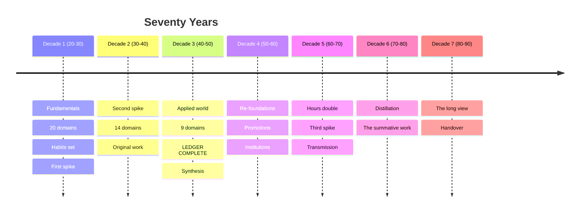

# Timeline — All Seventy Years, One Page

This is the single centralized schedule: every year from 20 to 90, what it
holds, and what should exist when it ends. Everything else in the repo
explains *why*; this file says *when*.

**It is a baseline to branch from, not a contract to obey.** The order is
defensible — it follows real prerequisite chains (`03-spine.md`) — but it was
written before your life happened. Fork it. The variants at the bottom are
pre-built forks for common situations, and the branch points section marks the
moments where the plan legitimately splits.

## How to read a row

| Column | Meaning |
|--------|---------|
| **Ledger** | The T3 literacy domains for that year — the checkbox work |
| **Tracks** | Continuous commitments: spike, language, craft, habits, frontier |
| **Due** | What must exist by December. If it doesn't, the year didn't happen |

Three things run in *every* row from year 1 to year 70 and are not repeated:
daily spaced repetition, the weekly log, and the curiosity budget. Current
awareness (`05-current.md`) and the frontier slot (`04-frontier.md`) run every
year from year 1 too. When they stop, the plan has stopped.

---

# Decade 1 — The Trunk (years 1–10, ages 20–30)

Twenty domains, the most of any decade, because these are the ones that make
everything downstream cheap. Detail and reasoning: `03-spine.md`.

| Yr | Age | Ledger | Tracks | Due |
|----|-----|--------|--------|-----|
| 1 | 20 | Statistics & probability · Philosophy | Writing, reading, SRS begin | 2 artifacts · 40+ published pieces · fundamentals self-rated |
| 2 | 21 | Mathematics · World history (1/2) | Programming begins | 2 artifacts · a script that saves you real time |
| 3 | 22 | Physics · Literature | **Language begins** (→B2 by yr 6) · **craft begins** | 2 artifacts · CEFR A2 · first finished object |
| 4 | 23 | Evolutionary & molecular biology · Music | Microscope, instrument | 2 artifacts · CEFR B1 |
| 5 | 24 | Chemistry · Psychology | Lab course | 2 artifacts · craft object #2, visibly better |
| 6 | 25 | Economics · Visual art & architecture | Museum membership | 2 artifacts · **CEFR B2** · 60% of fundamentals "strong" |
| 7 | 26 | Neuroscience · World religions & mythology | Language → maintenance | 2 artifacts |
| 8 | 27 | Genetics · Political science | — | 2 artifacts · **second-spike candidates named** |
| 9 | 28 | Computing in practice · Anthropology & archaeology | Electronics bench | 2 artifacts · something you built that others use |
| 10 | 29 | Cosmology & astronomy · Theater, film & narrative | **Telescope** | 2 artifacts · **10-year audit** · second spike chosen |

**Decade total:** 20 domains · ~20 artifacts · 1 language at B2 · craft at
competent · first spike professional · all three habits at 10 years.

---

# Decade 2 — The Second Spike (years 11–20, ages 30–40)

Fourteen domains, deliberately fewer per year: the second spike is taking real
hours and this is peak career output. The domains here needed a decade of
scaffolding underneath them. Phase detail: `phases/decade-2-mastery.md`.

| Yr | Age | Ledger | Tracks | Due |
|----|-----|--------|--------|-----|
| 11 | 30 | Logic & foundations | Second spike → T2 | 1 artifact · Lean/formalization practice started |
| 12 | 31 | Theoretical CS & information theory · Rhetoric & writing | Writing workshop | 2 artifacts |
| 13 | 32 | Linguistics | Spike work heavy | 1 artifact · an hour of speech transcribed and analysed |
| 14 | 33 | Artificial intelligence · Sociology | — | 2 artifacts · **first hybrid project at the spike intersection** |
| 15 | 34 | Ecology | Citizen science begins | 1 artifact · a season of real field records |
| 16 | 35 | Earth science & climate · Law & legal systems | Weather station, field guides | 2 artifacts |
| 17 | 36 | Medicine & physiology | EMT cert or hospital volunteering | 1 artifact |
| 18 | 37 | Materials science · Finance & markets | Metallography setup | 2 artifacts · **original contribution named** |
| 19 | 38 | Geography & geopolitics | Travel as fieldwork | 1 artifact |
| 20 | 39 | Education | Teaching a real class | 1 artifact · **20-year audit** · Decade 3 drafted |

**Decade total:** 34 domains cumulative · second spike at or near T1 · a
legible body of work · teaching routine.

---

# Decade 3 — The Applied World (years 21–30, ages 40–50)

Nine domains, concentrated in the made-and-applied cluster by design: after two
decades of largely textual learning, the third act is where you build things.
The ledger completes here. Phase detail: `phases/decade-3-synthesis.md`.

| Yr | Age | Ledger | Tracks | Due |
|----|-----|--------|--------|-----|
| 21 | 40 | Engineering: energy & power systems | Synthesis track begins | 1 artifact · your own energy balance, published |
| 22 | 41 | Engineering: structures & built environment | **Workshop built** | 1 artifact |
| 23 | 42 | Engineering: machines, manufacturing & transport | Hand tools, safety kit | 1 artifact · a machine you repaired or made |
| 24 | 43 | Public health & care systems | Stewardship begins | 1 artifact |
| 25 | 44 | Business, management & entrepreneurship | Something small and real, run | 1 artifact |
| 26 | 45 | Media & communication | — | 1 artifact |
| 27 | 46 | Military history & strategy | Successors identified | 1 artifact |
| 28 | 47 | Design | — | 1 artifact |
| 29 | 48 | Agriculture & food systems | **A garden** — slowest feedback loop here | 1 artifact |
| 30 | 49 | — | Synthesis, consolidation | **ALL 44 DOMAINS COMPLETE** · major synthesis work · 30-year audit |

**Year 30 is the hinge.** You are forty-nine with the map covered, roughly 60
artifacts, two mature spikes, a craft at working level, and forty years left.
Everything after this is a different kind of work.

---

# The Second Half (years 31–70, ages 50–90)

No new ledger domains — there are none left. Four kinds of work fill forty
years, and none were available to you before now:

| | |
|---|---|
| **Re-foundation** | A field learned at 25 has moved by 55. Every domain needs a refresh every 15–20 years. The signal: you can't follow a current talk in a field you once knew |
| **Promotion** | Forty-four literacy passes told you which five domains actually pull. Take them to real depth via the long shelves in `resources/` |
| **Frontier** | Fields will exist in your sixties with no name today. The slot has run since year 1 so you notice them |
| **Transmission** | Synthesis, teaching, institutions, successors. Unshared mastery doesn't compound — it retires |

## Decade 4 — Integration (years 31–40, ages 50–60)

| Yr | Age | Focus | Due |
|----|-----|-------|-----|
| 31 | 50 | Drift audit: which domains have moved most? | Re-foundation list of 5–8 named |
| 32 | 51 | Re-foundation pass 1 (2 domains) | 2 refreshed artifacts |
| 33 | 52 | Re-foundation pass 1 (2–3 domains) | Re-foundation log complete |
| 34 | 53 | **Promotion 1** — T3 → T2 | Working-depth practice begun |
| 35 | 54 | Promotion 2 | — |
| 36 | 55 | Promotion 3 | 3 domains at T2 |
| 37 | 56 | Cross-field synthesis — the signature work | The bridge named (`resources/bridges.md`) |
| 38 | 57 | Synthesis continues · institution-building begins | A course or curriculum exists |
| 39 | 58 | Institution work | Something teaches without you |
| 40 | 59 | Consolidation | **40-year audit** · maintenance now scheduled curriculum |

**Kit note:** peak earning meets deferred wants. The durable goods — serious
telescope, full workshop, real instrument, kiln, lathe — are justifiable now on
cost-per-year-of-use. The trap is buying capability instead of exercising it.

## Decade 5 — The Free Decade (years 41–50, ages 60–70)

Obligations loosen; learning hours roughly double. For someone who kept the
habits for forty years, this can be the most productive learning decade of a
life — the compounding assets and the time arrive together.

| Yr | Age | Focus | Due |
|----|-----|-------|-----|
| 41 | 60 | Allocate the doubled budget **on paper, before it lands** | A written plan for 20 hrs/week |
| 42 | 61 | **Third spike chosen — on pull alone**, zero career justification | Beginner again, publicly |
| 43 | 62 | Third spike foundations | First artifact in the new field |
| 44 | 63 | Transmission at scale · the book-length synthesis begun | Outline and first chapters |
| 45 | 64 | Named successors · mentoring seriously | 2–3 people you are actively carrying |
| 46 | 65 | Formal re-entry if wanted — degree, fellowship, residency | — |
| 47 | 66 | Re-foundation pass 2 | Reverse-mentoring structural |
| 48 | 67 | Third spike → T2 | — |
| 49 | 68 | The synthesis work finished | **The book, or its equivalent** |
| 50 | 69 | Consolidation | **50-year audit** · decide what stays |

## Decade 6 — Distillation (years 51–60, ages 70–80)

The corpus is large and unsorted. The work is editing, not accumulating.

| Yr | Age | Focus | Due |
|----|-----|-------|-----|
| 51–54 | 70–73 | **The distillation.** One primary form: the summative book, the curriculum, the archive made legible to a stranger | A finding aid · the archive tested on someone who wasn't there |
| 55–57 | 74–76 | The instrument, maintained. Novelty and difficulty as the active ingredient — a new language, instrument, or craft | One genuinely new thing begun after 74 |
| 58–60 | 77–79 | **Succession.** Named people, dated handovers | Work given away while you're present to explain it |

Running throughout: adapt the method, don't lower the ambition. Audio as a
first-class mode, larger type, shorter and more frequent sessions, more spaced
review, hearing aids early rather than late. The SRS vault built over five
decades is now doing exactly what it was designed for.

## Decade 7 — The Long View (years 61–70, ages 80–90)

You hold something no younger person can: the shape of how knowledge actually
changed across seventy years, which confident consensus collapsed, what turned
out to matter.

| Yr | Age | Focus | Due |
|----|-----|-------|-----|
| 61–64 | 80–83 | **What only you can now say.** Memoir, oral history, recorded conversations, the annotated bibliography of a life's reading | Letters to named successors |
| 65–68 | 84–87 | **The handover, by name.** Books, tools, instruments, notes, collections placed with people or institutions | The telescope and the microscope given, with explanation |
| 69–70 | 88–89 | The last audits. Re-read the canon against your own fifty-year-old marginalia | The year-70 review — and the sketch of years 71–80 |

**Year 70 is not a finish line.** A plan written at twenty and still running at
ninety has already succeeded. Write the next sketch anyway.

---

# Branch points

Eight moments where the plan legitimately forks. Everywhere else, reordering is
a preference; here it's a decision worth taking to an annual review.

| Yr | Age | The decision | What hangs on it |
|----|-----|--------------|------------------|
| 1 | 20 | Ten hours a week, or four? | Sets whether the ledger finishes at 50 or 65. Both are fine — pick honestly, not aspirationally |
| 3 | 22 | Which language, and which craft? | Both are 40-year tracks. Distance is cheapest to buy now (`resources/languages.md`) |
| 5–7 | 24–26 | Your first spike's specialization | The single highest-stakes choice in Decade 1. Depth in a good-enough subfield beats sampling the perfect one |
| 10 | 29 | **The second spike** | Chosen from evidence, not plan. Pick for combinatorial value with the first — the π-shape is where original work comes from |
| 20 | 39 | Consolidate or reinvent? | Both are legitimate. Drift is not |
| 30 | 49 | Which 3–5 domains get promoted? | Saying yes to five means saying no to thirty-nine. Choose on demonstrated pull |
| 41 | 60 | What are the reclaimed hours for? | Allocate before they arrive or they dissipate |
| 42 | 61 | **The third spike, on pull alone** | The one choice in seventy years where career justification is forbidden |

---

# Variants — pre-built forks

Take whichever fits and edit from there. All of them preserve the prerequisite
chains; they change pace, order, or emphasis.

<b>The constrained timeline</b> — 4 hours a week

One ledger domain a year instead of two, everything else unchanged. The ledger
completes around year 44 (age 64) rather than year 30. The habits and the
fundamentals are *not* cut — they're what make the remaining hours effective.

- Years 1–4: fundamentals only, plus one domain a year
- Drop the second domain from every year; keep the prerequisite order
- The second half compresses to re-foundation and one or two promotions
- **This is not a lesser plan.** Forty-four domains at any pace is more than
  almost anyone manages. Consistency is the whole mechanism.

<b>The compressed timeline</b> — starting at 35, 50, or 65

The tiers and the method are unchanged; the sequence shortens. Cut in this
order: the second half's re-foundations first (you have fewer decades for
things to go stale), then the third spike, then the number of promotions.

- **Starting at 35:** run the standard spine; you finish the ledger at 65 and
  get Decades 4–5 compressed into one.
- **Starting at 50:** three domains a year for ten years covers 30 of 44 —
  choose by pull rather than sequence, and keep statistics and philosophy first.
- **Starting at 65:** ignore completeness. Pick twelve domains you actually want
  and do them properly. The literacy artifact still earns the checkmark.

<b>The research track</b> — early depth over early breadth

For someone who knows their spike at 20 and wants T1 sooner.

- Decade 1: one ledger domain a year, spike gets the freed hours
- Bring the second spike forward to year 7
- First original contribution targeted at year 12 rather than 17
- **The cost:** the map completes near year 45, and you'll have less breadth
  when the synthesis decades arrive. The bridges are thinner if you own fewer
  domains. Take this fork knowing that.

<b>The maker track</b> — applied cluster early

Pull the three engineerings, computing, and design forward into Decade 1–2, and
push the social sciences back.

- Years 1–2 unchanged (statistics, mathematics, philosophy are prerequisites)
- Physics at year 3 as normal, then engineering from year 6
- Craft goes to T2 by year 15 rather than year 30
- Workshop kit lands in Decade 1, which raises the year-1 through year-5 budget
  substantially — see `resources/kit.md`
- **The cost:** history arrives late, so the humanities cluster has no timeline
  to attach to until Decade 2.

<b>The classical track</b> — canon and languages early

For someone whose pull is the meaning-and-expression cluster.

- Latin from year 2, Greek from year 5 — the canon in the original is the point
- Literature, philosophy, religion, art, and music all in Decade 1
- The multi-decade reading and listening plans in
  `resources/meaning-expression.md` start immediately rather than at promotion
- Sciences run one domain a year behind the standard spine
- **The cost:** the mathematics and statistics chain runs late, which closes
  parts of the science ledger until Decade 2. Keep statistics in year 1 anyway.

<b>The interrupted timeline</b> — what to do after a lost stretch

Not a fork so much as the recovery procedure, and the most likely one you'll
need.

1. **Don't restart.** Restarting is the failure mode, not the fix. The plan has
   forty years of slack built in for exactly this.
2. **Restart one habit, at half size.** The weekly log first, because it's five
   minutes and it makes everything else visible again.
3. **Skip the missed years' domains.** They go to the back of the queue, not
   into a backlog you'll never clear.
4. **Write the gap into the annual review** — what happened, and what you'd
   change. A recorded interruption is data; a hidden one becomes drift.

---

# Cumulative totals

What the plan has produced, if followed at the default pace:

| By year | Age | Domains | Artifacts | Hours | Also |
|---------|-----|---------|-----------|-------|------|
| 10 | 29 | 20 | ~20 | 5,000 | Language at B2 · craft competent · first spike professional |
| 20 | 39 | 34 | ~35 | 10,000 | Second spike near T1 · teaching routine · original contribution |
| 30 | 49 | **44 — complete** | ~60 | 15,000 | Two mature spikes · a synthesis work · a workshop |
| 40 | 59 | 44 + refreshed | ~75 | 20,000 | 3–5 domains at T2 · an institution that teaches without you |
| 50 | 69 | 44 + third spike | ~90 | 27,000 | The book · named successors · a field entered at 60 |
| 60 | 79 | — | ~100 | 33,000 | The distillation · an archive a stranger can use |
| 70 | 89 | — | — | 38,000 | The long view, written down |

Thirty-eight thousand hours is not a heroic number. It is ten hours a week,
kept, for seventy years — with the second half running higher because the time
comes back. The arithmetic has never been the hard part.

---

**Next:** `QUICKSTART.md` if you haven't begun · `03-spine.md` for why this
order · `log/tracker.md` to record where you actually are.
