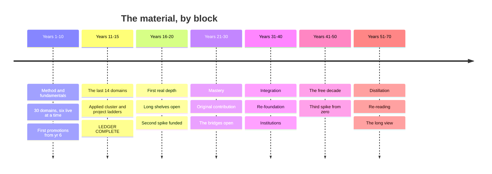

# Timeline — What to Read, and in What Order

This is the material queue: the specific books, courses, datasets, and
practices to pick up across seventy years, in the order to pick them up.

`02-map.md` says what the territory is. `resources/` says everything available
in each part of it — far more than any one life will consume. `03-spine.md`
says which domains happen when, and why that order. **This file says what to
actually open, and what to open after it.**

It is a queue to branch from, not a contract to obey. The [branch
points](#branch-points) mark where the plan legitimately splits, and the
[variants](#variants--pre-built-forks) are pre-built forks. Everything named
here is already in `resources/` — nothing new is introduced, so every item has
a full treatment waiting behind it.

## Six subjects at once, not one

The single most important thing about this timeline: **you are never studying
one subject.** Six run live at any moment.

Every domain spans **two years at ~90 hours a year** rather than one year at
~180. Three start each year, three finish:

| | |
|---|---|
| **First year** | Orientation — the door, the survey, the accessible entry, the course begun, the equipment bought |
| **Second year** | Completion — the canon, the course finished, the practice, and the artifact that earns the checkmark |

The year of distance between them does for a subject what spacing does for a
flashcard. And because three cohorts overlap, every year's table mixes six
domains from several clusters — mathematics against literature, neuroscience
against world religions, materials against structural engineering.

**This is deliberate and it will feel worse than the alternative.** Studying
one subject to completion before starting the next produces better performance
*during* the session and worse retention afterwards. Mixing feels messy and
inefficient while you're doing it. That gap between how learning feels and how
it works is the whole finding — see `01-principles.md`, principle 2.

**Each year names its own collisions.** The *mix* note at the top of every
year says which live domains illuminate each other, because those pairings are
scheduled rather than accidental: logic finishing while theoretical computer
science starts is the same subject in two hats.

## How to read a year

Each year gives you **finishing** domains, **starting** domains, the clusters
live, the weekly rotation, and then the table.

**The table is sorted by `When`, not by domain.** Scanning down it you'll see
statistics, then philosophy, then mathematics, then statistics again — that
ordering *is* the schedule. Work down it; don't regroup it by subject, because
regrouping it undoes the point.

Three rules govern order *within* a domain, and they're worth knowing so you
can re-derive the sequence when you reorder:

1. **Method before material.** Adler before anything he teaches you to read.
2. **Intuition before rigour.** 3Blue1Brown before Strang. Spiegelhalter
   before Blitzstein. The accessible door first, always.
3. **Canon after survey, never instead.** The survey tells you what the field
   asks; the canon shows you the field asking it. Reversed, the canon is just
   difficult prose.

**Three things run underneath every year** and aren't repeated in the tables:
daily spaced repetition, the weekly log, and the curiosity budget. Current
awareness (`05-current.md`) and the frontier slot (`04-frontier.md`) run every
year too. When those stop, the plan has stopped.

### The pace, and the hours

The default is **25 hours a week, about 1,300 a year**, of which roughly 500
go to ledger material. That funds three domains completing a year, and it
means **the ledger completes at year 15**.

| Block | Ledger hrs/yr | What's happening |
|-------|---------------|------------------|
| Year 1 | ~310 | Ramp-up. Only three domains live, and the heaviest fundamentals load of the plan |
| Years 2–10 | ~500–560 | Six live. Twenty-seven more domains complete |
| Years 11–15 | ~500–620 | The applied cluster, where doing is the material and shop hours are hours |
| Years 16–70 | — | No new literacy passes. Depth, re-foundation, bridges, the long shelves |

The whole plan **rescales cleanly** — the *order* never changes, only how fast
you move through it. At 10 hrs/week the ledger closes near year 25; at 15,
near year 17; at 35, near year 9. Pick the row in `03-spine.md`'s pace table
you'll still be running in year 12, not the one that flatters you now.

**When a year won't fit, cut from the bottom.** The queue is ordered, which
makes it a triage list. A year with three artifacts finished and some reading
deferred is a good year; a year with six domains started and none closed is a
wasted one.

---

# Years 1–10 — Foundations

Thirty of the forty-four domains. Six live at any moment from year 2 onward:
last year's cohort finishing on canon and artifact, this year's starting on
doors and surveys. Every year's mix deliberately spans several clusters, so
you are always holding a proof and a novel at the same time.

Promotions begin at year 6, once enough literacy passes have shown which
domains you kept reading after the artifact was done.

## Year 1 — the ramp-up: three domains, and the instrument you read them with

**Finishing** *(second year — canon, course, artifact)*: nothing yet — the
first cohort only starts this year
**Starting** *(first year — doors and surveys)*: Statistics & probability ·
Philosophy · Mathematics
**Clusters live this year:** Formal · Meaning & expression

**The mix, and why.** This is the one narrow year, and it is narrow on
purpose — you cannot interleave six domains before you can read any of them
well, so year 1 buys the instrument instead: Adler, Anki, Williams, and the
weekly published piece, all front-loaded, all taxing every year after this
one. The three ledger domains that do run are chosen because they are
instruments too. Spiegelhalter teaches you to interrogate evidence, Plato to
interrogate an argument, Gowers to see the abstract method that locks
outsiders out — and the genuine resonance is between statistics and
philosophy, which are the same discipline pointed at different objects:
Spiegelhalter's chapter on what a confidence interval does *not* say is an
exercise in exactly the premise-hunting Plato does to Euthyphro. Mathematics
sits underneath both and gets paid back with interest in year 2, when
Strang's linear algebra turns out to be Susskind's notation.

**The rotation.** ~25 hours a week. One domain leads at a time, rotating every
three weeks — Statistics, then Philosophy, then Mathematics — while the other
two stay warm at an hour apiece. That is only about five ledger hours a week,
which is correct: the ledger is deliberately underfunded this year so the
fundamentals can be overfunded.

| Slot | Hrs/wk | What sits here |
|------|--------|----------------|
| Lead domain | 3 | one unbroken block — Stat 110's problem sets, 18.06's, the Plato read cold |
| The other two | 2 | an hour each, reading or video only, enough to keep the thread |
| Fundamentals | 4 | Adler worked as a manual, Williams' exercises, the weekly 500–1,500 words |
| Programming, and the finance weekend | 2 | one capacity being built, one being closed permanently |
| The spike | 8 | your working specialty, which comes first in any conflict |
| SRS, weekly log, curiosity budget | 3 | daily and non-negotiable |
| Unbooked | 3 | year 1 is the only year with slack in it — spend it on Adler |

Several weeks run fallow by design. One four-week intensive mid-year, on Stat
110's harder half, is worth more than four months of even spread.

| # | When | Material | Domain | Role | Hrs |
|---|------|----------|--------|------|-----|
| 1 | wks 1–2 | Anki, set up day one, with Woźniak's "Twenty rules of formulating knowledge" | Fundamentals | method / practice | ~4 |
| 2 | wks 1–4 | Adler & Van Doren, *How to Read a Book* | Fundamentals | method | ~12 |
| 3 | wks 2–3 | Huff, *How to Lie with Statistics* | Statistics | survey | ~2 |
| 4 | wks 2–52 (ongoing) | 500–1,500 words published weekly, with your name on it | Fundamentals | practice | ~40 |
| 5 | wks 3–6 | Plato, *Euthyphro / Apology / Crito*, Grube (Hackett) | Philosophy | canon (door) | ~10 |
| 6 | wks 4–10 | Spiegelhalter, *The Art of Statistics* | Statistics | survey (door) | ~20 |
| 7 | wks 5–7 | Gowers, *Mathematics: A Very Short Introduction* | Mathematics | survey (door) | ~6 |
| 8 | wks 6–12 | Williams, *Style: Lessons in Clarity and Grace* | Fundamentals | method | ~10 |
| 9 | wks 7–10 | 3Blue1Brown, *Essence of Linear Algebra* and *Essence of Calculus* | Mathematics | video | ~10 |
| 10 | wks 9–20 | Millican, *General Philosophy* (Oxford, free) | Philosophy | course | ~15 |
| 11 | wks 10–30 | Harvard **Stat 110** (Blitzstein), begun — lectures with Blitzstein & Hwang ch. 1–3 | Statistics | course | ~28 |
| 12 | wks 12–52 (ongoing) | A reading group, or one reader who owes you honesty | Fundamentals | people | ~15 |
| 13 | wks 14–34 | MIT OCW **18.06 Linear Algebra** (Strang), begun — through the four subspaces | Mathematics | course | ~25 |
| 14 | wks 18–28 | Freedman, Pisani & Purves, *Statistics* | Statistics | survey | ~25 |
| 15 | wks 22–34 | Kenny, *A New History of Western Philosophy* | Philosophy | survey | ~25 |
| 16 | wks 26–38 | Courant & Robbins, *What Is Mathematics?* (or Aleksandrov, Kolmogorov & Lavrent'ev) | Mathematics | survey | ~25 |
| 17 | wks 30–52 (ongoing) | The forecast log, started — dated probabilistic predictions, scored when they resolve | Statistics | practice | ~10 |
| 18 | wks 36–46 | Sandel, *Justice* (justiceharvard.org) | Philosophy | course | ~15 |
| 19 | wks 40–48 | Euclid, *Elements* Book I — definitions, postulates, common notions, Props. 1–47; plus Book IX Prop. 20 | Mathematics | canon | ~12 |

**Also running.** The fundamentals are deliberately front-loaded into this
year, which is why the table above carries method items no later year will.
Around the Williams work, Zinsser's *On Writing Well* first for the argument,
then Pinker's *The Sense of Style* for why the advice works. Brown, Roediger &
McDaniel's *Make It Stick* explains what the daily Anki habit is doing;
Ahrens' *How to Take Smart Notes* is the retrieval half. Peter Adamson's
*History of Philosophy Without Any Gaps* and *In Our Time* fill commute hours
that were otherwise unusable. Personal finance gets exactly one weekend,
early, and then stops: Housel's *The Psychology of Money*, the *Bogleheads'
Guide*, Sethi's checklists for account order — automate it and do not touch it
again until the annual hour. The language and the craft do **not** start yet;
they start next year, when the reading instrument is built. Underneath all of
it: daily spaced repetition, the weekly log, the curiosity budget, and
whatever your working specialty already takes.

**Buy this year.** Almost nothing, deliberately — well under $150. A library
card first, the highest-leverage item in `kit.md` by an enormous margin, and
often carrying remote JSTOR and newspaper archives. A notebook system
($20–40/yr): a carry notebook for capture, a bound one for working problems,
one place they get processed. Index cards ($10). A whiteboard ($25–80), A2 or
larger, because thinking with your arm instead of your wrist changes what you
can hold in view. A hardbound proof notebook ($10), kept separate. Skip the
graphing calculator. Anki, LaTeX, SageMath and SymPy are free.

**The artifacts.** None from the ledger — nothing finishes this year, and that
is the honest price of the ramp-up. What must exist by the annual review:
forty-plus weeks of public writing, an unbroken SRS streak, a first scored
page in the forecast log, and a self-rating against the fundamentals table in
`02-map.md` that you would be willing to show someone.

---

## Year 2 — the first full year: three close out, three open, six live

**Finishing** *(second year — canon, course, artifact)*: Statistics &
probability · Philosophy · Mathematics
**Starting** *(first year — doors and surveys)*: World history · Physics ·
Literature
**Clusters live this year:** Formal · Physical · Human & social · Meaning &
expression

**The mix, and why.** The three domains you have been holding all year now
get their canon and their artifacts, and three new doors open beside them,
which is the shape every year takes from here. The pairing that carries the
year is mathematics and physics: you finish 18.06 in the same months you start
Susskind, and the change of basis you drilled in Strang is the thing Susskind
assumes you already own — a domain closing and a domain opening turn out to
be the same afternoon's work. Statistics and world history run a quieter
version of the same trade, because Bloch's *Historian's Craft* and Ioannidis
are two statements of one problem: what a source is evidence *of*. And
philosophy finishing beside literature starting is the year's cheapest
gift — you spend six months reading the Western canon for argument structure,
then meet Fry's course, which is entirely about the fact that a text has more
than an argument in it. What the year is really building is the habit of
carrying six threads at once without dropping any.

**The rotation.** ~25 hours a week, and from here the ledger takes ten of
them. Two domains lead each three-week block — one finishing, one starting —
and the other four idle at an hour apiece. Three pairings cycle: **Mathematics
+ Physics**, **Statistics + World history**, **Philosophy + Literature**. Each
domain leads roughly a third of the year at three hours a week, holds at one
hour the rest of it, and ends near ninety.

| Slot | Hrs/wk | What sits here |
|------|--------|----------------|
| Lead pair | 6 | two unbroken 3-hr blocks — the course with its problem set, or the hard text |
| The other four | 4 | an hour each; reading or listening, never the problem sets |
| The spike | 5 | your working specialty |
| Language | 4 | starts this year — SRS 15–20 min daily, input 30–45, output 2–3× a week |
| Craft | 2 | starts this year — tool before technique |
| Fundamentals | 2 | the weekly piece, Williams' exercises still being worked |
| SRS, weekly log, frontier slot, current awareness, curiosity budget | 2 | all running, all capped |

One four-week intensive, on Hobsbawm, closes the year's largest single block
of reading in one push rather than ten months of half-hours.

| # | When | Material | Domain | Role | Hrs |
|---|------|----------|--------|------|-----|
| 1 | wks 1–3 | McNeill & McNeill, *The Human Web* | World history | survey (door) | ~12 |
| 2 | wks 1–4 | Feynman, *The Character of Physical Law* (Messenger Lectures; book and video free) | Physics | canon (door) | ~8 |
| 3 | wks 2–8 | Homer, *The Odyssey*, Emily Wilson | Literature | canon (door) | ~20 |
| 4 | wks 3–14 | MIT OCW **18.06**, completed — the remaining problem sets, eigenvalues through SVD | Mathematics | course | ~25 |
| 5 | wks 4–7 | Bloch, *The Historian's Craft* (or Carr, *What Is History?*) | World history | method | ~10 |
| 6 | wks 5–16 | Harvard **Stat 110**, completed — Blitzstein & Hwang ch. 4–6, exercises worked then checked | Statistics | course | ~27 |
| 7 | wks 6–20 | Philosophy canon: *Republic* I–II, VI–VII; *Nicomachean Ethics* I–II, X; Descartes, *Meditations*; Hume, *Enquiry*; Mill, *On Liberty*; Nietzsche, *Genealogy* | Philosophy | canon | ~40 |
| 8 | wks 8–18 | The **Big History Project** (free) | World history | course | ~25 |
| 9 | wks 9–20 | Carroll, *The Biggest Ideas in the Universe*, vols. 1–2 | Physics | survey | ~25 |
| 10 | wks 10–24 | Norton Anthology of World Literature (Puchner, gen. ed.) | Literature | survey | ~30 |
| 11 | wks 12–18 | Pólya, *How to Solve It*, with Aigner & Ziegler, *Proofs from THE BOOK* (browsed) | Mathematics | method | ~10 |
| 12 | wks 16–20 | Fisher, *The Design of Experiments* ch. 2; Tukey, *Exploratory Data Analysis* (browse); Tufte, *The Visual Display of Quantitative Information* | Statistics | canon | ~12 |
| 13 | wks 18–30 | Hammack, *Book of Proof* (free) — or Velleman, *How to Prove It* | Mathematics | practice | ~25 |
| 14 | wks 20–30 | Lewin, MIT 8.01/8.02 lectures (YouTube) | Physics | course | ~20 |
| 15 | wks 21–24 | The *Analects* (Slingerland), *Tao Te Ching* (D.C. Lau), Nāgārjuna via Garfield's *Fundamental Wisdom of the Middle Way* | Philosophy | canon | ~20 |
| 16 | wks 22–34 | Roberts & Westad, *The Penguin History of the World*, begun — deep time to 1500 | World history | survey | ~25 |
| 17 | wks 24–36 | Open Yale **ENGL 300**, *Introduction to Theory of Literature* (Paul Fry) | Literature | course | ~25 |
| 18 | wks 26–30 | Ioannidis (2005), "Why Most Published Research Findings Are False"; Gigerenzer (2004), "Mindless Statistics" | Statistics | canon | ~4 |
| 19 | wks 28–40 | Susskind, *The Theoretical Minimum* — Classical Mechanics, then Quantum Mechanics | Physics | course | ~25 |
| 20 | wks 30–36 | Gettier (1963), "Is Justified True Belief Knowledge?"; Nagel (1974), "What Is It Like to Be a Bat?" | Philosophy | canon | ~4 |
| 21 | wks 32–40 | Salsburg, *The Lady Tasting Tea* | Statistics | history | ~8 |
| 22 | wks 34–42 | Frankopan, *The Silk Roads* | World history | survey anchor | ~15 |
| 23 | wks 36–48 | ModPo (Filreis, free) | Literature | course / community | ~15 |
| 24 | wks 38–44 | Lakatos, *Proofs and Refutations* | Mathematics | canon | ~10 |
| 25 | wks 40–50 | McElreath, *Statistical Rethinking* lectures (free) | Statistics | course | ~20 |
| 26 | wks 42–52 | Hobsbawm, *Age of Revolution / Capital / Empire / Extremes* | World history | survey anchor | ~30 |
| 27 | wks 46–50 | Hardy, *A Mathematician's Apology*, with Wigner, "The Unreasonable Effectiveness of Mathematics" | Mathematics | canon | ~6 |

**Also running.** The language starts now and runs to B2 over three years.
Order matters here too: Wyner's *Fluent Forever* first for the sound system,
with minimal-pair drills and shadowing daily for two months, because sounds
you cannot distinguish you cannot store; Krashen's *Principles and Practice*
(free at sdkrashen.com) for why comprehensible input is the engine; a paid
tutor from month one via italki or a local equivalent, which is the
non-negotiable item; graded readers as the input backbone; the first
1,000–2,000 words by frequency; Anki cards built from sentences you actually
met. The craft starts now and never ends — pick one from `made-applied.md` and
learn the tool before the technique: sharpening, tuning, calibration and the
safety rules cold, from a person. Then the one book for your craft — Schwarz,
Nosrat, Leach, Platt, Smith or Klickstein — read once and kept beside the
bench, then an in-person class, because this is the tier where money buys the
most. `04-frontier.md` and `05-current.md` both start drawing their capped
hours this year and never stop. Two lifetime practices open: mathematics' one
hard problem a week in the notebook, and physics' one derivation a week from
scratch with no references open. Weekly publication continues.

**Buy this year.** Under $250. 10×50 binoculars, $90–180 — the most useful
advice in `kit.md`, and they serve birding forever and the astronomy year
later. A planisphere, $12, which teaches the sky's rotation because you turn
it yourself; Stellarium is free. The craft's starting tools: the cheap
version, used until its limits genuinely annoy you — except the sharpening
setup, which is bought good alongside the first edged tools. A cheap
multimeter and a handful of LEDs, under $40, for next year's bench work.

**The artifacts.** *Statistics:* a statistical claim from the news taken back
to its paper — 2,000 words on what it does and does not support, naming
sample, interval, assumptions, and how many comparisons were really made.
*Philosophy:* free will reconstructed three ways — hard determinism,
libertarianism, compatibilism — as numbered premise–conclusion arguments, then
the single premise you deny and your defence of denying it, 2,000 words.
*Mathematics:* Cantor's diagonal argument and Galois' insight explained in
full to a bright sixteen-year-old, then used to argue whether mathematics is
discovered or invented, 2,000 words. Three boxes checked; twelve to go.

---

## Year 3 — the heaviest year, and the one where the sciences arrive

**Finishing** *(second year — canon, course, artifact)*: World history ·
Physics · Literature
**Starting** *(first year — doors and surveys)*: Evolutionary & molecular
biology · Chemistry · Music
**Clusters live this year:** Physical · Living · Human & social · Meaning &
expression

**The mix, and why.** The chemistry lab course is booked before anything on
this page is read — it is a calendar constraint, not a reading choice, and
community-college enrolment happens months before the term starts. Everything
else arranges itself around it. The pairing that does the most work is physics
finishing beside chemistry starting: you read the named Feynman chapters in
the same months Drennan builds the atom, and the chemical bond stops being a
stick between two letters and becomes the quantum mechanics you have just
spent a year on. The second real resonance is world history and biology, which
are both arguments about the past made from surviving traces — Darwin's
chapter 6, where he is his own best critic, reads very differently in the same
term as Herodotus, and both are exercises in inference under missing evidence.
Literature finishing and music starting is the year's quiet pleasure: you ask
of Dante and of Bach the identical question — where is the tension, and what
resolves it. This is the heaviest year on the whole page and it is heaviest
because chemistry is the least autodidact-friendly domain on the map.

**The rotation.** ~25 hours a week, ten to the ledger. Three pairings cycle
every three weeks: **Physics + Chemistry**, **World history + Biology**,
**Literature + Music**. The lab term is the exception that proves the shape —
for the twenty weeks it runs, chemistry takes a fixed evening whether or not
it is leading, and the other five domains absorb the loss.

| Slot | Hrs/wk | What sits here |
|------|--------|----------------|
| Lead pair | 6 | two unbroken 3-hr blocks; the lab bench counts as one of them |
| The other four | 4 | an hour each — the Norton anthology, the listening, the survey chapters |
| The spike | 4 | your working specialty; it gives up an hour to the lab this year |
| Language | 4 | to B1 — tutor sessions now doing real work, native shows with target subtitles |
| Instrument and craft | 3 | the weekly teacher, plus the craft's first finished object |
| Speaking | 1.5 | starts this year — a real venue monthly, recorded every time |
| SRS, weekly log, frontier, current awareness, curiosity budget | 2.5 | unchanged, uncapped only in that they never stop |

| # | When | Material | Domain | Role | Hrs |
|---|------|----------|--------|------|-----|
| 1 | wks 1–3 | Dawkins, *The Selfish Gene*, ch. 1–6 and 11 | Biology | canon (door) | ~12 |
| 2 | wks 1–4 | Copland, *What to Listen For in Music* | Music | survey (door) | ~10 |
| 3 | wks 1–20 | The community college chemistry lab course, first term | Chemistry | course / lab | ~25 |
| 4 | wks 2–5 | Pond water, yeast, your own cheek cells, under the scope | Biology | practice | ~15 |
| 5 | wks 3–8 | Susskind, *The Theoretical Minimum* — Special Relativity, completed | Physics | course | ~15 |
| 6 | wks 4–7 | Levi, *The Periodic Table* | Chemistry | canon (door) | ~10 |
| 7 | wks 5–14 | Literature canon, first pass: Sophocles, *Oedipus Tyrannus*; Dante, *Inferno* (Hollander for notes, Pinsky for verse); Austen, *Pride and Prejudice*; Flaubert, *Madame Bovary* (Davis); Woolf, *To the Lighthouse* | Literature | canon | ~45 |
| 8 | wks 6–14 | Roberts & Westad, *The Penguin History of the World*, completed — 1500 to the present | World history | survey | ~20 |
| 9 | wks 8–20 | Open Yale **MUSI 112**, *Listening to Music* (Craig Wright) | Music | course | ~30 |
| 10 | wks 9–12 | Einstein (1905), "On the Electrodynamics of Moving Bodies," §1–5 | Physics | primary | ~4 |
| 11 | wks 10–24 | MIT OCW **5.111**, *Principles of Chemical Science* (Drennan) | Chemistry | course | ~40 |
| 12 | wks 12–18 | Herodotus, *Histories* Bks 1 and 7; Thucydides, *Peloponnesian War* Bk 1, the Melian Dialogue, Bks 6–7 | World history | canon | ~20 |
| 13 | wks 14–26 | Zimmer & Emlen, *Evolution: Making Sense of Life* | Biology | survey | ~35 |
| 14 | wks 16–28 | *The Feynman Lectures*, Vol. I ch. 1–7, 26–27, 37–38, 44–46 (free online) | Physics | canon | ~35 |
| 15 | wks 18–22 | Shakespeare, *Hamlet* and *King Lear*, read aloud | Literature | canon | ~15 |
| 16 | wks 20–32 | Open Yale: Merriman, *European Civilization, 1648–1945*; Freedman, *The Early Middle Ages* | World history | course | ~30 |
| 17 | wks 21–26 | Atkins, *Chemistry: A Very Short Introduction*, then *Atkins' Molecules* | Chemistry | survey | ~15 |
| 18 | wks 22–34 | Coursera (Edinburgh), *Fundamentals of Music Theory*, with musictheory.net and teoria.com drills | Music | course | ~20 |
| 19 | wks 24–34 | Open Yale **EEB 122** (Stearns), begun — lectures 1–18 | Biology | course | ~18 |
| 20 | wks 26–30 | Ibn Khaldun, *The Muqaddimah* (abridged) on *asabiyyah* and the dynastic cycle; Sima Qian, selected biographies | World history | canon | ~15 |
| 21 | wks 28–34 | Bell (1964), "On the Einstein Podolsky Rosen Paradox," with EPR (1935); Anderson, "More Is Different" (1972) | Physics | primary | ~6 |
| 22 | wks 30–38 | Literature canon, second pass: Murasaki, *The Tale of Genji* (Tyler); Cervantes, *Don Quixote* (Grossman); *The Arabian Nights* (Haddawy) | Literature | canon | ~20 |
| 23 | wks 32–40 | Music canon, first pass, with a score where you can: Hildegard; Josquin; Monteverdi, *L'Orfeo*; Bach's C-major prelude and fugue, then the *B Minor Mass* | Music | canon | ~18 |
| 24 | wks 34–44 | One non-Western regional history read properly: Keay's *India*, Iliffe's *Africans*, or Brook's *The Troubled Empire* | World history | survey anchor | ~20 |
| 25 | wks 36–44 | The bench: *g* to three figures, the speed of light with a microwave and cheese, Planck's constant from LEDs | Physics | practice | ~15 |
| 26 | wks 38–48 | Auerbach, *Mimesis* | Literature | survey / argument | ~20 |
| 27 | wks 40–48 | Bernstein, *The Unanswered Question* (Norton Lectures, free) | Music | video | ~6 |
| 28 | wks 42–52 (ongoing) | A local natural history society | Biology | people | ~10 |
| 29 | wks 44–50 | Blaut's *Eight Eurocentric Historians* and Pomeranz, read against *Guns, Germs, and Steel* and *Sapiens* | World history | method | ~12 |

**Also running.** An instrument in your hands, not a book about music — a
weekly teacher, and Klickstein's *The Musician's Way* for how to practise
rather than merely repeat. If the instrument *is* your craft, this and last
year's craft track are the same track; otherwise the craft continues toward
its first finished object. Language to B1: the daily loop unchanged, tutor
sessions doing real work, graded readers giving way to native shows with
target-language subtitles. Speaking starts this year, because all six live
domains produce things worth explaining — a real venue monthly is the primary
source and not a supplement, with Berkun's *Confessions of a Public Speaker*
for fear and rooms that go wrong, Anderson's *TED Talks* for structuring
around one idea, and Winston's "How to Speak" (MIT, free, one hour). Record
every time; the recording is the feedback source. R is free and is the
environment biology and, next year, psychology both reason in — learn it here.
Chemistry's bound lab notebook is kept properly from the first session, dated
and numbered, even for kitchen chemistry. Sapolsky's *Human Behavioral
Biology* is held back for the anthropology year, where it does double duty.

**Buy this year.** A real compound microscope — achromatic objectives,
mechanical stage with coaxial controls, Abbe condenser with iris, glass
throughout. New, the usable entry point is $200–400; better, buy used from
university surplus or a lab liquidation at $150–400, where a thirty-year-old
professional instrument beats anything new at that price. Prepared slides
($30–60) to calibrate your eye, then blanks and coverslips ($20/hundred) and
methylene blue and iodine ($15). A dissection kit ($20–40). An instrument
bought used — a solid-top acoustic guitar at $150–400, or a weighted-key 88
digital piano at $300–500 — plus $50–100 for a setup or tuning, and a
mechanical metronome ($20–30), which gets used because it is sitting there.
IMSLP is free. For chemistry, lab course fees rather than home equipment:
reagents, glassware and apparatus carry real safety and legal constraints, and
`kit.md` names the legitimate hobby routes.

**The artifacts.** *World history:* 2,000 words on the Great Divergence —
state Pomeranz's case, state the strongest institutionalist counter, and say
precisely what evidence would settle it; if you cannot name the evidence, you
have not understood the argument. *Physics:* 2,000 words on why least action,
not Newton's second law, is the real formulation of classical mechanics, and
what it means that the same principle reappears in quantum mechanics.
*Literature:* a 2,000-word close reading of one poem or one three-page
passage, defending a claim that collapses if the details don't support it — no
biography, no context, the words only. Plus CEFR A2 and one working month of
the physics notebook.

---

## Year 4 — the year the sciences hand off to the studies of people

**Finishing** *(second year — canon, course, artifact)*: Evolutionary &
molecular biology · Chemistry · Music
**Starting** *(first year — doors and surveys)*: Psychology · Economics ·
Visual art & architecture
**Clusters live this year:** Physical · Living · Mind · Human & social ·
Meaning & expression

**The mix, and why.** Five clusters are live at once, which is the widest the
plan ever gets, and the hand-off is the point: biology closes in the same
months psychology opens, and that ordering is load-bearing rather than
decorative. You read Gray & Bjorklund's evolutionary framing having spent a
year with Stearns and Darwin, so "adaptation" is a claim you know how to check
rather than a word you nod at — and Henrich's question next year, about which
of psychology's findings are about humans and which about undergraduates, is
already sitting in your mouth. The stranger and better pairing is chemistry
with economics: equilibrium is the same idea in both, a system settling where
opposing rates balance, and reading CORE's units on markets in the same term
as Le Châtelier is the cheapest way to learn that neither field owns the
concept. Music finishing beside art starting closes the year — form in time,
then form in space, asked the same questions.

**The rotation.** ~25 hours a week, ten to the ledger. Three pairings cycle:
**Biology + Psychology**, **Chemistry + Economics**, **Music + Art &
architecture**. The museum is the exception to the block structure — twenty
short visits scattered across the year beat one exhausting march, so it sits
outside the rotation entirely and takes a standing Saturday hour.

| Slot | Hrs/wk | What sits here |
|------|--------|----------------|
| Lead pair | 6 | two unbroken 3-hr blocks — 5.12's arrow-pushing, 14.01's problem sets, PSYC 110 whole |
| The other four | 4 | an hour each; the museum hour lives here permanently |
| The spike | 5 | your working specialty, restored to full after the lab year |
| Language | 3 | to B2 — the level that changes your life |
| Craft | 3 | toward its second object, visibly better than the first |
| Speaking, and the weekly AI drill | 2 | the monthly venue, still recorded; one AI explanation a week, errors found |
| SRS, weekly log, frontier, current awareness, curiosity budget | 2 | as always |

| # | When | Material | Domain | Role | Hrs |
|---|------|----------|--------|------|-----|
| 1 | wks 1–4 | Kahneman, *Thinking, Fast and Slow* | Psychology | survey (door) | ~20 |
| 2 | wks 1–5 | Berger, *Ways of Seeing* — the book and the four free BBC episodes | Art & arch. | survey (door) | ~8 |
| 3 | wks 1–20 | The community college chemistry lab course, second term | Chemistry | course / lab | ~25 |
| 4 | wks 2–4 | FRED and Our World in Data — one question, one afternoon, one chart you made | Economics | data | ~10 |
| 5 | wks 3–8 | Darwin, *On the Origin of Species*, ch. 1, 4, 6, 14 | Biology | canon | ~15 |
| 6 | wks 4–18 | **CORE Econ, *The Economy*** (core-econ.org), begun — units 1–11 | Economics | course (door) | ~30 |
| 7 | wks 5–12 | Music canon, second pass: Mozart 40; Beethoven 5 and Op. 131; *Winterreise*; the *Tristan* prelude; Debussy; *The Rite of Spring*; Ligeti | Music | canon | ~17 |
| 8 | wks 6–52 (ongoing) | The museum, repeatedly and briefly, membership in hand | Art & arch. | place | ~30 |
| 9 | wks 8–16 | Open Yale **PSYC 110**, *Introduction to Psychology* (Paul Bloom) | Psychology | course | ~30 |
| 10 | wks 10–16 | Pauling, *The Nature of the Chemical Bond*, ch. 1–3 and the resonance chapters | Chemistry | canon | ~15 |
| 11 | wks 12–20 | Open Yale **EEB 122** (Stearns), completed — lectures 19–36 | Biology | course | ~17 |
| 12 | wks 14–22 | Heilbroner, *The Worldly Philosophers* | Economics | survey | ~12 |
| 13 | wks 16–30 | Gombrich, *The Story of Art* | Art & arch. | survey | ~30 |
| 14 | wks 18–26 | Taruskin & Gibbs, *The Oxford History of Western Music: College Edition* | Music | survey | ~25 |
| 15 | wks 20–34 | MIT OCW **5.12**, *Organic Chemistry I* | Chemistry | course | ~30 |
| 16 | wks 22–34 | Gray & Bjorklund, *Psychology* (or Bloom, *Psych: The Story of the Human Mind*) | Psychology | survey | ~30 |
| 17 | wks 24–32 | MIT OCW **7.01SC**, *Fundamentals of Biology* | Biology | course | ~25 |
| 18 | wks 24–52 (quarterly) | *Journal of Economic Perspectives*, cover to cover | Economics | primary | ~8 |
| 19 | wks 26–36 | Smarthistory (free, with Khan Academy) | Art & arch. | course | ~20 |
| 20 | wks 26–52 (ongoing) | One unknown a week — a published ¹H and ¹³C NMR, IR and mass spectrum, assigned cold and checked | Chemistry | practice | ~10 |
| 21 | wks 28–40 | MIT OCW **14.01**, *Principles of Microeconomics* — problem sets done | Economics | course | ~20 |
| 22 | wks 30–38 | Beyond the West: a full Ravi Shankar rāga (ālāp into jor into jhālā); Umm Kulthūm; Javanese gamelan; Ali Farka Touré. And Ellington; *Kind of Blue*; *A Love Supreme*; Robert Johnson; Aretha Franklin | Music | canon | ~25 |
| 23 | wks 32–38 | Lane, *The Vital Question* | Biology | survey | ~12 |
| 24 | wks 34–40 | Kean, *The Disappearing Spoon* | Chemistry | supplement | ~8 |
| 25 | wks 36–42 | Ross, *The Rest Is Noise* | Music | survey | ~15 |
| 26 | wks 38–44 | Weiner, *The Beak of the Finch* | Biology | survey | ~10 |
| 27 | wks 40–46 | Hoffmann, *The Same and Not the Same* | Chemistry | canon | ~8 |
| 28 | wks 40–52 | Marginal Revolution University's video library, with the IGM Forum polls | Economics | course | ~10 |
| 29 | wks 42–48 | Kimura (1968) on neutral theory; Margulis (1967), "On the origin of mitosing cells"; Gould & Lewontin (1979), "The Spandrels of San Marco" | Biology | canon | ~5 |
| 30 | wks 44–50 | MoMA's free Coursera courses | Art & arch. | course | ~10 |
| 31 | wks 46–52 | Monod, *Chance and Necessity* | Biology | canon | ~8 |

**Also running.** Language reaches B2 this year, which is the level that
changes your life — real conversations without strain on both sides, a novel
read with effort, work done in the language. Mollick's *Co-Intelligence* is
the right year for the AI-tools row, because you now have twelve domains'
worth of literacy to check a model against, and the weekly drill — take one
AI-generated explanation in a field you know well and find its errors — is
only possible once you know several fields well. The craft moves toward its
second object; the monthly speaking venue continues, still recorded. Economics
adds its own lifetime practice, and it starts in its first year rather than
its second because it needs the runway: one long series of your own — prices
at your local shops, rents on one street, your household's complete
accounts — collected the same way, the same month, for decades. Weekly
publication, daily SRS, the forecast log, the frontier slot and current
awareness all run as always.

**Buy this year.** A museum membership, $50–150/yr, which pays for itself in
two visits and changes how you use a museum. A drawing kit at $40–70 —
graphite HB through 6B, vine and compressed charcoal, kneaded eraser, blending
stump — and a 90–150 gsm sketchbook at $15–25, bought now even though Edwards
lands next year, because cheap paper buckles and makes competent work look bad
at exactly the wrong moment. The chemistry lab's second-term fee. For
psychology the equipment that isn't free is mostly disappointing: a hobbyist
EEG will show you alpha rhythm appearing when you close your eyes, which is a
legitimate thrill and is not neuroscience. The real equipment in both
empirical domains is access to participants, R, and free public data — FRED,
World Bank WDI, Our World in Data, and your national statistics office.

**The artifacts.** *Biology:* one adaptation traced end to end — lactase
persistence, the sickle-cell heterozygote advantage, the vertebrate eye —
through the mutation, the selective regime, the population dynamics of its
spread, and the evidence the story is true rather than merely plausible, 2,000
words. *Chemistry:* Haber–Bosch traced end to end, 2,000 words — the
thermodynamics that makes it hard, the catalysis that makes it possible, the
real temperatures and pressures, and the fact that roughly half the nitrogen
atoms in your body passed through it. *Music:* 1,500 words on a single
four-minute piece — what happens, in order, section by section, plus the
moment the music makes a promise and the moment it keeps or breaks it. Plus
language at B1 holding toward B2 and the craft's first finished object,
however bad.

---

## Year 5 — the payoff year: four years of prerequisites all cash out at once

**Finishing** *(second year — canon, course, artifact)*: Psychology ·
Economics · Visual art & architecture
**Starting** *(first year — doors and surveys)*: Neuroscience · Genetics ·
World religions & mythology
**Clusters live this year:** Living · Mind · Human & social · Meaning &
expression

**The mix, and why.** Nothing on this page would have been readable in year 1,
and that is the argument for the whole structure: heritability is unreadable
without year 2's statistics, Kandel next year is unreadable without year 4's
chemistry, and Lander's genome course assumes the molecular biology you
finished twelve months ago. The pairing that carries the year is psychology
finishing beside neuroscience starting — Sacks leaves you wanting mechanism at
exactly the point where James and Festinger have shown you how much of the
mind was described before any mechanism was available, and running Kanwisher
against the replication papers in the same term is the single most useful
juxtaposition in the first five years. The sleeper pairing is economics with
genetics: both spend the year on the same statistical move — how much of the
variation in *this* is explained by *that* — and the honest answer to "what
does 80% heritable mean" is structurally the answer to "what does this
incidence estimate mean." Art finishing beside religions starting gives the
third: Chartres and Hagia Sophia are on both reading lists, and you will see
them twice, differently.

**The rotation.** ~25 hours a week, ten to the ledger. Three pairings cycle:
**Psychology + Neuroscience**, **Economics + Genetics**, **Art & architecture
+ World religions**. Two items sit outside the rotation on purpose — the
canon looked at in person, which is travel-shaped rather than week-shaped, and
the services of two traditions, which happen when they happen.

| Slot | Hrs/wk | What sits here |
|------|--------|----------------|
| Lead pair | 6 | two unbroken 3-hr blocks — 9.13, 7.00x's problem sets, Hayes' lectures, 14.02 |
| The other four | 4 | an hour each; Alter's notes and the Stokstad plates fit here well |
| The spike | 6 | full weight again — this is the last year before promotions compete for it |
| Language | 1.5 | maintenance protocol now: SRS 5–10 min daily, one hour of input weekly |
| Craft | 3 | material fluency, and the second harder book on your medium |
| Speaking | 1.5 | the monthly venue, still recorded |
| SRS, weekly log, frontier, current awareness, provenance log, curiosity budget | 3 | five standing tracks, none of them optional |

| # | When | Material | Domain | Role | Hrs |
|---|------|----------|--------|------|-----|
| 1 | wks 1–3 | Sacks, *The Man Who Mistook His Wife for a Hat* | Neuroscience | canon (door) | ~10 |
| 2 | wks 1–4 | Prothero, *God Is Not One* | Religions | survey (door) | ~12 |
| 3 | wks 1–10 | **CORE Econ, *The Economy***, completed — units 12–22 | Economics | course | ~20 |
| 4 | wks 2–7 | Mukherjee, *The Gene: An Intimate History* | Genetics | survey (door) | ~18 |
| 5 | wks 4–12 | Kostof, *A History of Architecture: Settings and Rituals*, with Ching's *Architecture: Form, Space and Order* | Art & arch. | survey | ~30 |
| 6 | wks 5–20 | MIT OCW **9.13**, *The Human Brain* (Kanwisher), begun | Neuroscience | course | ~25 |
| 7 | wks 6–8 | Mendel, *Experiments on Plant Hybridization* (1866), whole | Genetics | canon | ~4 |
| 8 | wks 6–18 | Open Yale **RLST 145**, *Introduction to the Old Testament* (Christine Hayes) | Religions | course | ~30 |
| 9 | wks 8–14 | PsychoPy or jsPsych: run a classic experiment on yourself | Psychology | practice | ~15 |
| 10 | wks 10–26 | Lander, *Introduction to Biology — The Secret of Life* (MITx / OCW 7.00x), begun | Genetics | course | ~30 |
| 11 | wks 12–24 | MIT OCW **14.02**, *Principles of Macroeconomics* | Economics | course | ~20 |
| 12 | wks 14–20 | James, *The Principles of Psychology* — "Habit," "The Stream of Thought," "The Consciousness of Self," "Attention," "Will" | Psychology | canon | ~15 |
| 13 | wks 16–28 | Stokstad, *Art History* (or Gardner's *Art Through the Ages*); MIT OpenCourseWare's global history of architecture | Art & arch. | survey | ~25 |
| 14 | wks 18–26 | Cobb, *The Idea of the Brain* | Neuroscience | survey | ~15 |
| 15 | wks 20–24 | Smith, *Wealth of Nations* I.1–3 and IV.2; Ricardo, *Principles* ch. 7 | Economics | canon | ~10 |
| 16 | wks 22–28 | Smart, *The World's Religions* | Religions | survey | ~18 |
| 17 | wks 24–32 | Henrich, *The WEIRDest People in the World* | Psychology | survey | ~15 |
| 18 | wks 26–38 | Harvard, *Fundamentals of Neuroscience* (three parts, browser simulations) | Neuroscience | course | ~25 |
| 19 | wks 26–52 (ongoing) | The provenance log — one claim a week traced to its original study | Psychology | practice | ~10 |
| 20 | wks 28–34 | Rutherford, *A Brief History of Everyone Who Ever Lived* | Genetics | survey | ~12 |
| 21 | wks 28–44 | Edwards, *Drawing on the Right Side of the Brain*, with a dated sketchbook | Art & arch. | practice | ~20 |
| 22 | wks 30–34 | Hayek, "The Use of Knowledge in Society" (1945) | Economics | canon | ~3 |
| 23 | wks 30–38 | *Gilgamesh* (Andrew George); Hesiod, *Theogony*; *Popol Vuh* (Dennis Tedlock) | Religions | canon | ~15 |
| 24 | wks 32–36 | Simmons, Nelson & Simonsohn (2011), "False-Positive Psychology"; Miller (1956); Tversky & Kahneman (1974) | Psychology | canon | ~6 |
| 25 | wks 34–40 | Zimmer, *She Has Her Mother's Laugh* | Genetics | survey | ~12 |
| 26 | wks 36–44 | Keynes, *The General Theory* ch. 12 and 24 only; Friedman, *Capitalism and Freedom* ch. 1–2 | Economics | canon | ~10 |
| 27 | wks 36–52 | The canon, looked at in person wherever possible — the Pantheon's oculus, Hagia Sophia, Chartres, Giotto's Arena Chapel, Masaccio's *Trinity*, *Las Meninas*, Rembrandt's late self-portraits, Hokusai, Manet's *Olympia*, Rothko; and the buildings — Brunelleschi's dome, the Villa Rotonda, Fallingwater, the Salk Institute, Kéré's school at Gando | Art & arch. | canon | ~25 |
| 28 | wks 38–42 | Akerlof (1970), "The Market for Lemons"; Card & Krueger (1994); Solow (1956) | Economics | canon | ~6 |
| 29 | wks 38–44 | Festinger, Riecken & Schachter, *When Prophecy Fails* | Psychology | canon | ~10 |
| 30 | wks 40–46 | Reich, *Who We Are and How We Got Here* | Genetics | survey | ~12 |
| 31 | wks 40–52 | Services or ceremonies of two traditions not your own, observed as a scholar would | Religions | place / people | ~10 |
| 32 | wks 44–48 | Hirschman, *Exit, Voice, and Loyalty* | Economics | canon | ~8 |
| 33 | wks 46–50 | Ritchie, *Science Fictions* | Psychology | survey | ~8 |
| 34 | wks 48–52 | A brain specimen — a museum or a university open day | Neuroscience | place | ~4 |

**Also running.** The language shifts from acquisition to maintenance, and the
protocol is specific: SRS five to ten minutes a day on that deck, never
deleted; one hour of input a week minimum; one book and one show a month, with
the book as the load-bearing half; one hour of conversation a month, because
output degrades first and fastest; and one recorded hour a year with a tutor
briefed to rate you against CEFR and say so plainly. The craft moves toward
material fluency, which is where the second, harder book on your medium
belongs. The *Analects* and *Tao Te Ching* return this year from year 2's
philosophy queue — read now as religious texts rather than as arguments, which
is a different book, and the three-year gap is what makes it one. Judson's
*The Eighth Day of Creation* is the full molecular saga if it grips you, and
skipping it is legitimate. The monthly speaking venue continues, still
recorded; the forecast log, the provenance log and the weekly unknown all
continue. One thing to prepare for: twelve literacy passes close at the end of
this year, and the first promotions arrive at the next review but one.

**Buy this year.** Nothing significant, and that is deliberate — bank it for
the telescope in year 7. The genetics work runs on free public
infrastructure: GenBank, Ensembl, the 1000 Genomes data and IQ-TREE cost
nothing and are the real equipment. If an alumni library account is reachable
($50–200/yr) this is the year it starts earning, because both neuroscience and
genetics move fast enough that the live literature matters and PubMed Central
covers only part of it.

**The artifacts.** *Psychology:* a famous finding you believed before you
started, traced through its full evidential history — the original N and
effect size, what the press said, what replication found, where it honestly
stands — then what you would need to see to change your mind again, 2,000
words. *Economics:* 2,000 words on a real policy with real data — a minimum
wage change, a carbon tax, a zoning reform — with a supply/demand analysis, an
explicit incidence claim, the strongest counterargument stated fairly, and at
least one chart you made yourself. *Visual art & architecture:* 1,500 words on
one object you saw in person — five hundred words of pure description with no
interpretation, then what it was for, then what you claim it does to a viewer,
with the description as your evidence. Plus language at B2 and the craft's
second object, visibly better than the first.

---

# Years 11–15 — The Ledger Completes

Fourteen domains left, most of them applied. Years 12–14 are where the queue
stops being a reading list: the project ladders in `resources/made-applied.md`
interleave with the reading rather than following it, and a year should end
with objects, datasets and metered results as well as essays.

**Year 15 is the hinge of the whole plan.** Four domains close, the map is
covered, and fifty-five years remain.

## Year 6 — the first year that finishes something and starts something else

**Finishing** *(second year — canon, course, artifact)*: Neuroscience · Genetics · World religions & mythology
**Starting** *(first year — doors and surveys)*: Political science · Computing in practice · Anthropology & archaeology
**Clusters live this year:** Mind · Living · Meaning & expression · Human & social · Made & applied

**The mix, and why.** Three domains arrive at their canon while three open
their doors, and the join is not decorative — Sapolsky's *Human Behavioral
Biology* is booked as the anthropology flank in the same months Kandel and
*Behave* are closing neuroscience, so one course pays twice and you meet the
same organism at cell scale and at kinship scale inside a fortnight. The
sharper resonance is Reich against Renfrew & Bahn: ancient DNA and the
stratigraphic record are two archives of one set of migrations, and reading
the population-genetics claims in the weeks you are learning what a
radiocarbon date can and cannot fix is how you learn to see where the two
archives disagree. Underneath both, Geertz on thick description lands while
Kandel is still on the desk, which sets the year's real question: what is
explained by mechanism and what is only ever explained by meaning. The year
is building the hinge between the natural sciences of years 3–5 and the
social sciences that dominate the next four.

**The rotation.** Twenty-five hours a week, of which roughly ten are ledger
material — about 512 hours across the six live domains. Two domains carry the
week at three hours each and rotate on a four-week cycle, two sit at two
hours, two at one, and the assignment moves at the end of each block so no
domain goes dark for more than a month. The spike takes six hours and comes
first in any conflict. **The first promotion takes three**, and that is a new
line in the budget, not a borrowed one. The fundamentals — language
maintenance, the craft, the weekly publication, the monthly speaking venue —
take four; the frontier slot and current awareness take the last two. Genetics
and computing are the two block-heavy domains here: 7.03 and CS50 both want
consecutive weeks, so they are deliberately staggered rather than run
together.

| # | When | Material | Domain | Role | Hrs |
|---|------|----------|--------|------|-----|
| 1 | wks 1–3 | Geertz, *The Interpretation of Cultures* — "Thick Description" and "Deep Play" | Anthropology & archaeology | canon (door) | ~8 |
| 2 | wks 1–4 | Petzold, *Code: The Hidden Language of Computer Hardware and Software* (2nd ed.) | Computing in practice | survey (door) | ~20 |
| 3 | wks 1–8 | Fukuyama, *The Origins of Political Order* | Political science | survey (door) | ~25 |
| 4 | wks 1–52 (ongoing) | A standing weekly journal club — one paper, read from the figures first | Neuroscience | practice | ~10 |
| 5 | wks 2–4 | Federalist 10 and 51 | Political science | canon | ~3 |
| 6 | wks 3–14 | Kandel et al., *Principles of Neural Science* — Part I, membrane potential, action potential, synaptic transmission, one vision chapter | Neuroscience | canon | ~30 |
| 7 | wks 5–7 | MIT, *The Missing Semester of Your CS Education* | Computing in practice | course | ~12 |
| 8 | wks 5–14 | Open Yale **RLST 152**, *New Testament History and Literature* (Dale Martin) | World religions & mythology | course | ~20 |
| 9 | wks 6–12 | Eriksen, *Small Places, Large Issues* | Anthropology & archaeology | survey | ~15 |
| 10 | wks 8–22 | MIT OCW **7.03**, *Genetics* | Genetics | course | ~25 |
| 11 | wks 9–26 | Ten hours of observation in a setting you can access, field notes written the same day | Anthropology & archaeology | practice | ~20 |
| 12 | wks 10–20 | Open Yale, *Introduction to Political Philosophy* (Steven B. Smith) | Political science | course | ~25 |
| 13 | wks 12–16 | Hodgkin & Huxley (1952); Hubel & Wiesel (1962); Marr, *Vision*, ch. 1 | Neuroscience | canon | ~8 |
| 14 | wks 14–30 | Harvard **CS50** — finish it including the final project, or don't start | Computing in practice | course | ~35 |
| 15 | wks 15–32 | Mark and Romans; the Qur'an (Abdel Haleem); the *Bhagavad Gita* (Miller); the *Dhammapada*, then Bhikkhu Bodhi's *In the Buddha's Words* | World religions & mythology | canon | ~30 |
| 16 | wks 16–22 | Sapolsky, *Behave* | Neuroscience | survey | ~15 |
| 17 | wks 18–24 | Watson, *The Double Helix*, alongside Maddox, *Rosalind Franklin: The Dark Lady of DNA* | Genetics | canon | ~15 |
| 18 | wks 20–34 | Renfrew & Bahn, *Archaeology: Theories, Methods and Practice* — method chapters read, the rest browsed | Anthropology & archaeology | survey | ~20 |
| 19 | wks 22–30 | Dahl, *On Democracy*, with Acemoglu & Robinson, *Why Nations Fail* and its critiques | Political science | survey | ~18 |
| 20 | wks 24–30 | GenBank: pull real sequence data, build a tree, learn what a bootstrap value does and does not mean | Genetics | data | ~20 |
| 21 | wks 26–30 | Ramachandran, *Phantoms in the Brain*; Cajal's Nobel lecture | Neuroscience | survey / primary | ~10 |
| 22 | wks 28–30 | A brain specimen — a museum or a university open day | Neuroscience | place | ~4 |
| 23 | wks 30–36 | Reich, *Who We Are and How We Got Here* | Genetics | survey | ~12 |
| 24 | wks 30–44 | Sapolsky, *Human Behavioral Biology* (Stanford, free) | Anthropology & archaeology | course | ~25 |
| 25 | wks 32–34 | Watson & Crick (1953), one page; Jinek et al. (2012) on programmable Cas9 | Genetics | primary | ~3 |
| 26 | wks 33–42 | *Gilgamesh* (Andrew George); Hesiod, *Theogony*; *Popol Vuh* (Dennis Tedlock) | World religions & mythology | canon | ~15 |
| 27 | wks 34–42 | Brooks, *The Mythical Man-Month* ch. 1–3, 11 and "No Silver Bullet"; Kernighan & Pike, *The Practice of Programming* | Computing in practice | canon | ~15 |
| 28 | wks 35–44 | Achen & Bartels, *Democracy for Realists* | Political science | survey | ~10 |
| 29 | wks 36–42 | Kevles, *In the Name of Eugenics* | Genetics | canon | ~10 |
| 30 | wks 40–46 | Services or ceremonies of two traditions not your own, observed as a scholar would | World religions & mythology | place / people | ~10 |
| 31 | wks 43–46 | V-Dem, Polity and Correlates of War — one question, one afternoon, one chart | Political science | data | ~8 |
| 32 | wks 44–48 | A local council meeting, then its minutes | Political science | place | ~8 |
| 33 | wks 46–50 | Durkheim, *The Elementary Forms* (the conclusion); Geertz, "Religion as a Cultural System" | World religions & mythology | canon | ~6 |
| 34 | wks 50–51 | Jonas & Kording (2017), "Could a Neuroscientist Understand a Microprocessor?" | Neuroscience | canon | ~2 |

**Also running.** **The first promotion happens at this year's review, and it
is concrete: statistics goes to working depth on its long shelf in
`resources/formal.md` — Casella & Berger's *Statistical Inference* worked as a
problem course, then Gelman et al.'s *Bayesian Data Analysis*, with Hernán &
Robins' *Causal Inference: What If* held in reserve.** Twelve literacy passes
are behind you and three more close this year, which is enough evidence to
answer the only question that matters: which domain did you keep reading after
the artifact was finished? That is a real second budget beside the ledger, and
it is what the ledger was for. Alongside it, this is the natural year for
programming's deliberate re-foundation — take a tool you actually depend on
and rebuild it on whatever is currently mainstream, including version control,
environment and deployment. Neuroscience leaves behind the standing journal
club, which is in the table above because it starts now and never stops. The
craft is at material fluency; language is on the maintenance protocol; the
monthly speaking venue continues, still recorded; the frontier slot, current
awareness, daily SRS, the weekly log, the forecast log and the provenance log
all run as always.

**Buy this year.** Under $300, and it opens the whole made-and-applied cluster
early, because computing starts here rather than owning a single year. A
temperature-controlled soldering station, $50–120 — the $12 fixed-temp pencil
is the standard false economy. A multimeter, $40–80, which turns "it doesn't
work" into a location. Breadboards and a components assortment, $50–80. A
microcontroller starter kit, $30–70. A cheap USB oscilloscope at $60–150 if
the signals start mattering. The finishing domains cost nothing — GenBank,
Ensembl, the 1000 Genomes data and IQ-TREE are the real genetics equipment —
except an alumni library account ($50–200/yr), which starts earning this year
because neuroscience and genetics both move faster than PubMed Central covers.
Politics and anthropology are free until next year's field school fees.

**The artifacts.** *Neuroscience*: a single act — reaching for a cup you see on
a table — traced from photons to muscle contraction, naming each structure and
the transformation it performs, then marking explicitly every step where the
textbook story is actually a hypothesis; the marks are the real test, 2,000
words. *Genetics*: 2,500 words answering a smart skeptic's question — what
does it mean to say height is 80% heritable? — handling twin studies, GWAS,
missing heritability, population stratification, and why the number says
nothing about any individual person. *World religions & mythology*: one ritual
described three times — as participants explain it, as a Durkheimian
functionalist would, as a textual historian would — then which description you
think is missing the most, 2,000 words.

---

## Year 7 — the year the social sciences close and the sky opens

**Finishing** *(second year — canon, course, artifact)*: Political science · Computing in practice · Anthropology & archaeology
**Starting** *(first year — doors and surveys)*: Cosmology & astronomy · Logic & foundations · Theater, film & narrative media
**Clusters live this year:** Formal · Physical · Human & social · Meaning & expression · Made & applied

**The mix, and why.** The two finishing social domains turn out to be arguing
about one thing, and the schedule makes the argument visible: Olson's *Logic of
Collective Action* and Ostrom's *Governing the Commons* land in the same weeks
as Mauss's *The Gift* and Malinowski's kula chapters, and the kula is precisely
a solved collective-action problem that nobody in it would describe that way.
Read together they are the same puzzle in two vocabularies — obligation as
mechanism, obligation as meaning — and neither field's account survives the
other intact. On the starting side the three new doors are chosen to be as
unlike each other as the map allows: a naked-eye sky, a formal system, and a
projected image, so that no evening's work resembles the last. Computing
finishes with SICP's metacircular evaluator in the same months logic begins its
formal machinery, which is the quiet setup for next year. The year is building
the transition out of the human sciences and into the formal and physical
block that carries years 8 through 10.

**The rotation.** About 511 ledger hours over 52 weeks — ten a week, split
unevenly on purpose. Computing and anthropology are lumpy and calendar-bound:
the deploy pushes hard for a twelve-week stretch and the dig season is whatever
weeks the dig is offered, so both are scheduled first and the rest of the year
is fitted around them. Political science runs at a steady two hours a week
through its canon, logic at two and a half, film at one plus the fixed weekly
viewing, astronomy at whatever the sky and the Moon allow — twenty nights is
twenty clear nights, not twenty scheduled ones. The spike still takes six.
**The promotion budget grows to two domains and about four hours a week**:
statistics' T2 practice is now a weekly habit rather than a plan, and a second
domain from years 1–3 joins it. Fundamentals take four, frontier and current
awareness two.

| # | When | Material | Domain | Role | Hrs |
|---|------|----------|--------|------|-----|
| 1 | wks 1–3 | Sagan, *Cosmos* (book or the 1980 series) | Cosmology & astronomy | survey (door) | ~15 |
| 2 | wks 1–3 | Aristotle, *Poetics* (Malcolm Heath, Penguin) | Theater, film & narrative media | canon (door) | ~5 |
| 3 | wks 1–4 | Nagel & Newman, *Gödel's Proof* | Logic & foundations | canon (door) | ~10 |
| 4 | wks 1–20 | Build and deploy something small that strangers actually use | Computing in practice | practice | ~50 |
| 5 | wks 2–4 | Peter Smith, *Beginning Mathematical Logic: A Study Guide* (free) | Logic & foundations | method | ~4 |
| 6 | wks 3–6 | Machiavelli, *The Prince* (whole) and *Discourses on Livy* Book 1 | Political science | canon | ~15 |
| 7 | wks 4–8 | Priest, *Logic: A Very Short Introduction* | Logic & foundations | survey | ~8 |
| 8 | wks 4–10 | OpenStax *Astronomy 2e* (free) — skimmed whole, for the vocabulary | Cosmology & astronomy | survey | ~30 |
| 9 | wks 5–14 | Bordwell & Thompson, *Film Art: An Introduction* | Theater, film & narrative media | survey | ~25 |
| 10 | wks 6–14 | One full ethnography, cover to cover | Anthropology & archaeology | canon | ~20 |
| 11 | wks 8–30 | Binoculars and a planisphere, outdoors, twenty nights | Cosmology & astronomy | practice | ~20 |
| 12 | wks 10–18 | Hobbes, *Leviathan* (Introduction, ch. 13–18); Locke, *Second Treatise*; Rousseau, *Social Contract* Bks 1–2 | Political science | canon | ~20 |
| 13 | wks 10–26 | Peter Smith, *An Introduction to Formal Logic* (free, logicmatters.net) | Logic & foundations | survey | ~35 |
| 14 | wks 12–20 | Malinowski, *Argonauts of the Western Pacific* — the Introduction on method, plus the kula chapters | Anthropology & archaeology | canon | ~15 |
| 15 | wks 14–44 | Film canon, first pass, with the remote in hand: Lumière and Méliès; Keaton's *Sherlock Jr.*; the Odessa Steps shot by shot; *La Règle du jeu*; *Citizen Kane*; *Tokyo Story*; *Bicycle Thieves*; *Rashomon*; *Pather Panchali*; *Persona* | Theater, film & narrative media | canon | ~22 |
| 16 | wks 16–20 | Mauss, *The Gift*, whole | Anthropology & archaeology | canon | ~8 |
| 17 | wks 18–34 | Open Yale **ASTR 160**, *Frontiers and Controversies in Astrophysics* (Bailyn), begun — the arithmetic actually performed | Cosmology & astronomy | course | ~18 |
| 18 | wks 20–30 | Abelson & Sussman, *Structure and Interpretation of Computer Programs*, ch. 1–2 (free) | Computing in practice | canon | ~25 |
| 19 | wks 20–34 | Fukuyama, *Political Order and Political Decay* | Political science | survey | ~15 |
| 20 | wks 22–34 | A local astronomy club — six meetings and two star parties | Cosmology & astronomy | people | ~15 |
| 21 | wks 24–32 | Evans-Pritchard, *The Nuer* (the cattle and time-reckoning chapters); Lévi-Strauss, *Tristes Tropiques* | Anthropology & archaeology | canon | ~18 |
| 22 | wks 26–34 | Olson, *The Logic of Collective Action*; Ostrom, *Governing the Commons* | Political science | canon | ~15 |
| 23 | wks 28–36 (the season) | An archaeological field school or a dig season | Anthropology & archaeology | practice / place | ~40 |
| 24 | wks 30–40 | Ladder rung 3 — a service you operate: API, database, deploys, backups, monitoring, and a restore drill you actually perform | Computing in practice | project | ~20 |
| 25 | wks 34–40 | Aristotle, *Politics* Books 3–6 | Political science | canon | ~10 |
| 26 | wks 36–42 | Every Frame a Painting (Tony Zhou); Bordwell, *Observations on Film Art* | Theater, film & narrative media | video / blog | ~10 |
| 27 | wks 40–48 | Tocqueville, *Democracy in America* (Vol. 1 Pt 2; Vol. 2 Pt 2); Mill, *On Liberty*, reread as institutional design | Political science | canon | ~15 |
| 28 | wks 46–50 | Naur, "Programming as Theory Building"; Parnas (1972); Hoare's "The Emperor's Old Clothes"; Leveson & Turner on Therac-25 | Computing in practice | canon | ~8 |

**Also running.** **The promotions carry two domains now** — statistics on
Casella & Berger and *Bayesian Data Analysis* since last year, joined at this
review by a second from years 1–3: mathematics onto Velleman, Spivak, Axler and
Abbott, or philosophy into the *Stanford Encyclopedia* with Loux and Audi, or
physics into Kleppner and Purcell. The rule is the record, not the appetite.
The first promoted domain should be far enough in that its T2 practice — worked
problems, formalizations, fitted models — is a weekly habit rather than a plan.
**Three lifetime practices start with the finishing domains this year.** From
politics: adopt a country that is not yours and follow it for life, with a
written forecast before each of its elections, graded afterwards. From
computing: the service you operate stays operated, with the restore drill run
annually and the incident log kept. From anthropology: field notes written the
same day, forever, for any setting you are in as an observer. Craft, language
maintenance, the monthly speaking venue, the journal club, the weekly hard
problem, the forecast log, the frontier slot and current awareness continue.

**Buy this year.** **The telescope year: a Dobsonian reflector, 6–8 inch,
$350–700**, which is what last year's restraint was banking for. It spends your
money on the only thing that matters — aperture — and its mount problem is
already solved. Any advertisement leading with magnification is aimed at people
who don't know this. Never point any optical instrument at the Sun without a
proper full-aperture solar filter over the front; eyepiece-mounted "sun
filters" can crack while your eye is at the lens, and this is the one
irreversible injury in `kit.md`. For film, physical media plus a projector
($400–900) or a good large screen — streaming crops, recompresses and alters
colour, and if you are studying film rather than watching it, the disc is the
primary source. Logic buys nothing: Lean, mathlib and LaTeX are free, and the
two purchases that help are a tutor for the eight weeks you are stuck
($40–100/hr) and the alumni account you already hold. The real spend on the
finishing side is the field school's own fees.

**The artifacts.** *Political science*: 2,000 words explaining one country's
specific political outcome using two competing frameworks and stating what
observable evidence would distinguish them; naming the discriminating evidence
is the test. *Computing in practice*: the thing built and deployed that
strangers actually use, plus the write-up — what broke, what you measured, what
you'd change — and separately 1,500 words tracing everything that happens
between typing a URL and pixels appearing. *Anthropology & archaeology*: an
ethnographic sketch of 2,000 words on a setting you can access, thick
description first, closing with a paragraph on what your own position let you
see and what it hid.

---

## Year 8 — the year logic hands its subject to computation

**Finishing** *(second year — canon, course, artifact)*: Cosmology & astronomy · Logic & foundations · Theater, film & narrative media
**Starting** *(first year — doors and surveys)*: Theoretical computer science & information theory · Linguistics · Rhetoric & writing
**Clusters live this year:** Formal · Physical · Mind · Meaning & expression

**The mix, and why.** This is the year the interleaving argument makes itself:
logic is finishing on Smith's *Introduction to Gödel's Theorems* and Turing's
1936 paper in exactly the weeks theoretical CS is opening on Sipser's
decidability and reducibility chapters, and they are the same subject in two
hats. The undecidability of the halting problem and the incompleteness of
arithmetic are one proof technique wearing different clothes, and meeting them
eight weeks apart rather than eighteen months apart is the difference between
noticing that and being told it. A second pairing runs quieter: film finishes
with the shot-log — every cut of a feature, timed — while astronomy finishes
with SDSS photometry and AAVSO estimates, and both are the same discipline of
counting what you actually see instead of what you remember seeing. Rhetoric
starts with Williams re-read against seven years of your own drafts, which
only works because there are seven years of drafts. The year is building the
formal spine that years 9 and 10 spend.

**The rotation.** About 501 ledger hours. The finishing three are heavier than
the starting three by design — 285 against 216 — because second years carry
canon and practice and first years carry doors and surveys, and doors are
cheap. Sipser and Smith's Gödel run as the two anchor courses at three hours
a week each through the first half, tapering as *Language Files*' problem sets
take over the second. Film is a fixed weekly night plus one live theatre
evening a month, which is the cheapest per-hour item in the year. Astronomy
runs on the weather. Rhetoric is deliberately light in hours and heavy in
frequency: four short items and a daily writing habit. The spike takes six
hours; **the promotions now carry two or three domains at working depth on
their long shelves**, about five hours; fundamentals four; frontier and
current awareness two.

| # | When | Material | Domain | Role | Hrs |
|---|------|----------|--------|------|-----|
| 1 | wks 1–3 | Williams, *Style: Lessons in Clarity and Grace*, re-read with the exercises done against seven years of your own drafts | Rhetoric & writing | method (door) | ~10 |
| 2 | wks 1–4 | Deutscher, *The Unfolding of Language* | Linguistics | survey (door) | ~12 |
| 3 | wks 1–6 | Open Yale **ASTR 160** (Bailyn), completed — the arithmetic finished, not watched | Cosmology & astronomy | course | ~17 |
| 4 | wks 1–52 (ongoing) | Theatre, live and not filmed: *Oedipus*, *A Doll's House*, *The Cherry Orchard*, *Waiting for Godot*, *Mother Courage*, *A Raisin in the Sun* | Theater, film & narrative media | canon | ~20 |
| 5 | wks 2–3 | McEnerney, *The Craft of Writing Effectively* (80 min), with Gopen & Swan, "The Science of Scientific Writing" | Rhetoric & writing | method | ~4 |
| 6 | wks 2–14 | Sipser, *Introduction to the Theory of Computation*, ch. 0–5 and 7 | Theoretical CS & information theory | survey | ~35 |
| 7 | wks 4–18 | Peter Smith, *An Introduction to Gödel's Theorems* | Logic & foundations | canon | ~30 |
| 8 | wks 5–8 | Frege, preface to the *Begriffsschrift*, and Russell's 1902 letter to Frege | Logic & foundations | canon | ~3 |
| 9 | wks 5–24 | *Language Files* (Ohio State Dept. of Linguistics) — the problem sets done, not read past | Linguistics | survey | ~40 |
| 10 | wks 6–14 | MIT OCW **18.404J**, *Theory of Computation* — run against the book | Theoretical CS & information theory | course | ~15 |
| 11 | wks 8–12 | Pinker, *The Language Instinct* | Linguistics | survey | ~10 |
| 12 | wks 8–40 | Film canon, second pass: *Breathless*; *Vertigo*; *2001*; *Stalker*; *Black Girl*; *Jeanne Dielman*; *Close-Up*; *In the Mood for Love*; *Spirited Away*; *Parasite* | Theater, film & narrative media | canon | ~23 |
| 13 | wks 10–24 | SDSS SkyServer: pull galaxy spectra, plot a colour–magnitude diagram, find the red sequence yourself | Cosmology & astronomy | data | ~30 |
| 14 | wks 12–18 | Pinker, *The Sense of Style* | Rhetoric & writing | survey | ~12 |
| 15 | wks 14–24 | Turing, *On Computable Numbers* (1936), §1–4, with Petzold, *The Annotated Turing* | Logic & foundations | canon | ~25 |
| 16 | wks 16–24 | Moore & Mertens, *The Nature of Computation*, ch. 1–6, read against Sipser rather than instead of him | Theoretical CS & information theory | survey | ~20 |
| 17 | wks 18–22 | Weinberg, *The First Three Minutes*; then Hubble (1929) and Penzias & Wilson (1965) | Cosmology & astronomy | canon / primary | ~12 |
| 18 | wks 20–24 | Sainani, *Writing in the Sciences* (Stanford, free) | Rhetoric & writing | course | ~10 |
| 19 | wks 24–36 | MIT OCW **24.900**, *Introduction to Linguistics* | Linguistics | course | ~25 |
| 20 | wks 24–40 | *Mathematics in Lean*, with mathlib | Logic & foundations | practice | ~25 |
| 21 | wks 26–34 | Thorne, *Black Holes and Time Warps*; MIT OCW **8.282J**, *Introduction to Astronomy* | Cosmology & astronomy | survey / course | ~25 |
| 22 | wks 28–32 | Shot-log an entire feature — every cut, timed | Theater, film & narrative media | practice | ~10 |
| 23 | wks 30–40 | AAVSO variable-star estimates, submitted | Cosmology & astronomy | practice | ~12 |
| 24 | wks 32–38 | Farnsworth, *Classical English Rhetoric* | Rhetoric & writing | survey | ~12 |
| 25 | wks 34–38 | Bazin, *What Is Cinema?* (selections); Mulvey (1975), "Visual Pleasure and Narrative Cinema"; Gunning, "The Cinema of Attractions" | Theater, film & narrative media | canon | ~8 |
| 26 | wks 36–42 | Franzén, *Gödel's Theorem: An Incomplete Guide to Its Use and Abuse* | Logic & foundations | method | ~10 |
| 27 | wks 38–44 | Overbye, *Lonely Hearts of the Cosmos* | Cosmology & astronomy | history | ~10 |
| 28 | wks 40–48 | Bordwell & Thompson, *Film History*; Brockett & Hildy, *History of the Theatre* | Theater, film & narrative media | survey | ~20 |
| 29 | wks 42–46 | Fortnow, *The Golden Ticket* | Theoretical CS & information theory | survey | ~5 |
| 30 | wks 44–46 | An observatory or planetarium night | Cosmology & astronomy | place | ~5 |
| 31 | wks 46–50 | Zinsser, *On Writing Well*, re-read from the far side of a decade of drafts | Rhetoric & writing | survey | ~6 |

**Also running.** **The promotions are now the settled second half of the
week** — two or three domains from years 1–3 at working depth, each with its
own practice load rather than its own reading list: statistics on Casella &
Berger with *Bayesian Data Analysis*, mathematics on Spivak, Axler and Abbott,
and whichever third the record justifies. A promotion that has produced no real
work in two years gets demoted at this review rather than defended; practise
the move early, while it costs nothing. **Three lifetime practices start with
this year's finishing domains.** From logic: keep a proof assistant alive and
formalize something small every month, an exercise or a lemma, in Lean or Rocq.
From film: one film a week on a fixed night, working the *Sight and Sound*
poll, with the shot-log habit kept for anything that surprises you. From
astronomy: an observing log kept on paper for decades — measurements, not
pretty pictures. Rhetoric's daily 500 words and the commonplace book on Locke's
indexing method start now, a year before rhetoric closes, because they need the
running time. The craft has been going six years and should be producing
objects a stranger would call good.

**Buy this year.** Nothing for computation — it is a pencil-and-screen subject.
Spend it on feedback instead, which is where rhetoric's hours actually convert:
**a paid editor**, $300–1,500 per pass, once or twice a year on a real piece.
This is the single most underrated line in `kit.md`, because writing is the
fundamental with the worst feedback loop — nobody in your life will tell you
your prose is flabby. Add **a serious writing workshop** staffed by people
willing to hurt your feelings on schedule ($300–1,500). For linguistics, **a
microphone bought properly the first time** — $100–250 for a decent
large-diaphragm condenser or dynamic plus an interface — because a $25
microphone does not produce a worse recording, it produces one in which you
cannot hear the thing you were trying to evaluate. Praat, ELAN, CHILDES and
COCA are free. A **second large monitor** ($200–500) earns its place. The
finishing domains are already equipped: the Dobsonian is a year old and the
discs are on the shelf.

**The artifacts.** *Cosmology & astronomy*: 2,000 words on how we know the age,
composition and geometry of the universe — naming the measurements and their
error bars, not the conclusions. *Logic & foundations*: both incompleteness
theorems stated precisely, with every hypothesis, then 1,500 words on what each
hypothesis is doing and what the theorems do *not* imply about minds, machines
or mathematics, plus the first twelve monthly formalizations in the
proof-assistant repository. *Theater, film & narrative media*: a shot-by-shot
analysis of one three-minute sequence — every shot logged for scale, angle,
movement, duration and sound — then 1,500 words arguing what the pattern
accomplishes, with the log attached.

---

## Year 9 — the mid-ledger year, where language is studied from three sides

**Finishing** *(second year — canon, course, artifact)*: Theoretical computer science & information theory · Linguistics · Rhetoric & writing
**Starting** *(first year — doors and surveys)*: Artificial intelligence · Sociology · Ecology
**Clusters live this year:** Formal · Living · Mind · Human & social · Meaning & expression

**The mix, and why.** Three finishing domains all have language as their
object and disagree completely about what language is: Shannon and MacKay treat
it as a channel with a measurable entropy, Chomsky and Saussure treat it as a
structure with a grammar, Aristotle and Cicero treat it as an instrument aimed
at a particular room. Running them in the same weeks — the entropy estimate for
English beside the IPA transcription of your own speech beside the
*progymnasmata* — is what makes the disagreement legible rather than academic,
and it is the direct preparation for the AI artifact you will not write until
next year. The sharper single resonance is Grice's "Logic and Conversation"
against Aristotle's *Rhetoric*: implicature and enthymeme are both accounts of
what a speaker leaves out because the audience will supply it, twenty-three
centuries apart, and neither field cites the other. On the starting side,
ecology's patch of ground begins in week one regardless of what else is
happening, because a season is a season and it will not wait for a reading
schedule.

**The rotation.** About 519 ledger hours, the heaviest of the block. The
season dictates the calendar: the patch takes a fixed weekly hour from week one
to week thirty, and everything else is fitted around it and around 6.034, which
wants consecutive weeks. Linguistics and theoretical CS each carry about two
hours a week across the whole year rather than in blocks, because both are
finishing on short canon items and practice drills that reward frequency over
duration. Rhetoric is the daily habit plus one canon item a month. Sociology is
the lightest domain in the year at sixty-four hours and deliberately so — it is
the reading you do on the days the other five are too expensive. **The second
spike takes its usual three hundred hours and comes first in any conflict**,
which is six hours a week; promotions take five; fundamentals four; frontier
and current awareness two.

| # | When | Material | Domain | Role | Hrs |
|---|------|----------|--------|------|-----|
| 1 | wks 1–4 | Melanie Mitchell, *Artificial Intelligence: A Guide for Thinking Humans* | Artificial intelligence | survey (door) | ~15 |
| 2 | wks 1–4 | C. Wright Mills, *The Sociological Imagination*, ch. 1–2 | Sociology | canon (door) | ~8 |
| 3 | wks 1–5 | David Quammen, *The Song of the Dodo* | Ecology | survey (door) | ~18 |
| 4 | wks 1–30 (the season) | One patch of ground, visited weekly | Ecology | practice | ~25 |
| 5 | wks 2–6 | Shannon, *A Mathematical Theory of Communication* (1948), in full | Theoretical CS & information theory | canon | ~8 |
| 6 | wks 3–7 | Saussure, *Course in General Linguistics* — Introduction, Part One on the sign, synchrony/diachrony | Linguistics | canon | ~8 |
| 7 | wks 4–10 | The speeches: Pericles; Lincoln's Gettysburg and Second Inaugural; Douglass, "What to the Slave Is the Fourth of July?"; King, "Letter from Birmingham Jail"; Montaigne; Orwell; Baldwin; Didion — each read twice, once for what, once for how | Rhetoric & writing | canon | ~12 |
| 8 | wks 5–16 | MIT OCW **6.034**, *Artificial Intelligence* (Patrick Winston) | Artificial intelligence | course | ~30 |
| 9 | wks 6–12 | OpenStax, *Introduction to Sociology* (free) | Sociology | survey | ~18 |
| 10 | wks 6–14 | Gotelli, *A Primer of Ecology* | Ecology | course | ~18 |
| 11 | wks 8–14 | MacKay's Cambridge lectures with *Information Theory, Inference, and Learning Algorithms* (free PDF) | Theoretical CS & information theory | course | ~16 |
| 12 | wks 8–24 | Narrow IPA transcription of your own speech, with CHILDES for child-language data | Linguistics | practice | ~18 |
| 13 | wks 10–16 | Aristotle, *Rhetoric* I–II (Kennedy, *On Rhetoric*), with Plato's *Gorgias* | Rhetoric & writing | canon | ~12 |
| 14 | wks 12–16 | Chomsky, *Syntactic Structures* ch. 1–5, then his 1959 review of Skinner's *Verbal Behavior* | Linguistics | canon | ~8 |
| 15 | wks 14–20 | Cook (1971), "The Complexity of Theorem-Proving Procedures"; Karp (1972), "Reducibility Among Combinatorial Problems" | Theoretical CS & information theory | canon | ~5 |
| 16 | wks 14–26 | Open Yale, *Foundations of Modern Social Theory* (Iván Szelényi) | Sociology | course | ~20 |
| 17 | wks 16–28 | Berkeley **CS188** Pacman projects (free) | Artificial intelligence | practice | ~28 |
| 18 | wks 16–28 | Leiden, *Miracles of Human Language* (van Oostendorp, Coursera) | Linguistics | course | ~12 |
| 19 | wks 18–24 | Open Yale **EEB 122**, second half (Stearns) | Ecology | course | ~12 |
| 20 | wks 18–26 | The reduction drill — fifteen to twenty problems proved NP-complete, without solutions | Theoretical CS & information theory | practice | ~15 |
| 21 | wks 20–28 | Cicero, *De Oratore*; Longinus, *On the Sublime* | Rhetoric & writing | canon | ~14 |
| 22 | wks 22–26 | Sapir, *Language* (1921) | Linguistics | canon | ~6 |
| 23 | wks 24–28 | Erving Goffman, *The Presentation of Self in Everyday Life* | Sociology | canon | ~10 |
| 24 | wks 26–36 | Build four things: a Turing machine simulator, a Huffman and an arithmetic coder, a Hamming decoder against a simulated channel | Theoretical CS & information theory | practice | ~20 |
| 25 | wks 28–32 | Sean B. Carroll, *The Serengeti Rules* | Ecology | survey | ~6 |
| 26 | wks 28–40 | Corbett & Connors, *Classical Rhetoric for the Modern Student*, with the *progymnasmata* worked in order | Rhetoric & writing | practice | ~20 |
| 27 | wks 30–34 | Labov (1963) on Martha's Vineyard; Greenberg (1963) on word order; Grice (1975), "Logic and Conversation"; Hockett (1960), "The Origin of Speech" | Linguistics | canon | ~8 |
| 28 | wks 30–36 | Hofstadter, *Gödel, Escher, Bach* | Theoretical CS & information theory | canon | ~20 |
| 29 | wks 32–36 | Turing (1950), "Computing Machinery and Intelligence," and the 1955 Dartmouth proposal | Artificial intelligence | canon | ~5 |
| 30 | wks 34–40 | Everett, *Don't Sleep, There Are Snakes*, read with the published rebuttals | Linguistics | canon | ~8 |
| 31 | wks 36–46 | Nils Nilsson, *The Quest for Artificial Intelligence* | Artificial intelligence | history | ~18 |
| 32 | wks 36–48 | One reference grammar of a language you do not speak, with your own ten-page structural sketch | Linguistics | practice | ~20 |
| 33 | wks 38–42 | Ostler, *Empires of the Word* | Linguistics | survey | ~12 |
| 34 | wks 40–44 | Gleick, *The Information* | Theoretical CS & information theory | history | ~12 |
| 35 | wks 42–46 | Orwell, "Politics and the English Language"; Klemperer, *LTI* | Rhetoric & writing | canon | ~8 |
| 36 | wks 44–48 | Hamming, *The Art of Doing Science and Engineering*, with "You and Your Research" | Theoretical CS & information theory | canon | ~10 |
| 37 | wks 46–50 | Quintilian, *Institutio Oratoria*, Book I — one book a year for twelve years starts here | Rhetoric & writing | canon | ~8 |
| 38 | wks 48–52 | The *Annual Review of Sociology*, one volume front to back | Sociology | survey | ~8 |

**Also running.** **The promotions run three domains deep now**, and this
year's review is the one that matters: **twenty-four domains are behind you and
which of them pulled hardest is a question with evidence, not a preference** —
those are your promotion candidates for the second half of the ledger. Physics
onto Kleppner and Purcell is the usual third, and literature onto Genette and
Booth with the scansion drills the usual fourth. The second spike takes its
three hundred hours. **Three lifetime practices start with this year's
finishing domains.** From TCS: reduce things — every genuinely new problem that
turns up gets classified as polynomial, NP-hard, undecidable or ill-posed, with
the reduction written down however roughly, plus one Simons Institute workshop
series a year. From rhetoric: 500 words a day, one finished piece published a
month, one page a week copied by hand from a single writer chosen for the year,
and an editorial log of every change any editor makes to your work with the
pattern named. From linguistics: one reference grammar and one ten-page
structural sketch a year — thirty of these gives you an internal typology no
textbook hands you. The craft reaches ladder rung 4; the monthly formalization,
the weekly hard problem, the journal club, the film night, the observing log
and the forecast log all continue.

**Buy this year.** Compute, if the AI projects need it: rented cloud time at
$50–300 for a specific project, never a framework subscription and never
hardware bought speculatively — `01-principles.md` principle 5 says nothing
with a version number belongs in a seventy-year plan, and this is the year you
will be most tempted. **One serious newspaper of record**, $150–400/yr, read
daily, which is a slow course in politics and economics at once and the raw
material sociology will need next year. Then the cheap kit that converts
ecology from reading to fieldwork: **regional field guides** ($20–30 each — buy
the one whose range map includes your house), a **10× doublet or triplet loupe**
($15–40, non-negotiable for botany), a **plant press** ($40–80 bought, $20
built). Your year-2 binoculars carry over. Then the access spend, which matters
more: a **botanical garden or arboretum membership** ($40–100/yr) and a
**professional society membership** ($50–300/yr), both of which hand newcomers
real responsibility within a month. If the opportunity reserve has been rolling
over, an **ecology field school** ($1,500–5,000) is what it was saved for.

**The artifacts.** *Theoretical CS & information theory*: prove the halting
problem undecidable from scratch, explain what NP-completeness means and why
3-SAT is the hinge, then estimate the entropy of English text and say what that
number means — 2,000 words. *Linguistics*: transcribe three minutes of your own
unscripted speech in narrow IPA — actual transcription, not spelling — then
1,500 words on what it reveals that the orthography hides and on what a
five-year-old knows about your language that nobody taught them, citing real
CHILDES data rather than reasoning from the armchair, plus the first structural
sketch of a grammar you don't speak. *Rhetoric & writing*: take 1,000 words of
your own older writing, cut it to 600 without losing content, publish both
versions plus a paragraph naming each *class* of cut — the taxonomy is the
proof, not the shorter draft.

---

## Year 10 — the year the living world is read from the cell and from the biome at once

**Finishing** *(second year — canon, course, artifact)*: Artificial intelligence · Sociology · Ecology
**Starting** *(first year — doors and surveys)*: Earth science & climate · Law & legal systems · Medicine & physiology
**Clusters live this year:** Physical · Living · Mind · Human & social

**The mix, and why.** Ecology finishes on Begon's energy budgets and Paine's
keystone paper in the same months earth science opens on Archer's radiative
forcing and MODTRAN, and the two are one carbon cycle approached from opposite
ends — the biome's throughput and the atmosphere's balance sheet, with the same
molecules in both accounts. Running them together means the climate models
arrive already populated with organisms rather than as a physics problem about
a bare sphere. A second pairing carries the year's methodological weight: AI
finishes on Russell & Norvig's chapters on uncertainty and decision while
medicine opens on *Understanding Clinical Research*, and both are asking how a
system with incomplete information should act and how you would know afterwards
whether it acted well. Sociology's GSS regressions land beside Hart's rules and
Fischl & Paul's issue-spotting, which is the difference between what a
population does and what a rule requires of it. The year is building toward
year 11, where medicine, law and earth science all reach their canon.

**The rotation.** About 507 ledger hours. Two calendar constraints set
everything: the clinical placement is chosen and booked in January and its
shifts are not yours to move, and Silverthorn wants a long uninterrupted run at
membrane transport, cardiovascular and respiratory before the year is half
gone. Those two go on the calendar first. AI's implementation work takes a
three-hour block twice a week for twelve weeks and then stops. Ecology is
finishing, so Begon carries the early year at three hours a week and the short
canon papers fill the tail. Sociology and law each run at about an hour and a
half, sustained rather than blocked. Earth science is the year's swing domain
and absorbs whatever the others release. The second spike moves toward
trusted-professional strength at six hours; **the promotions carry four domains
now at roughly five hours**; fundamentals four; frontier and current awareness
two, and they run hot this year in particular.

| # | When | Material | Domain | Role | Hrs |
|---|------|----------|--------|------|-----|
| 1 | wks 1–4 | John McPhee, *Annals of the Former World* — "Basin and Range" first | Earth science & climate | survey (door) | ~12 |
| 2 | wks 1–4 | Atul Gawande, *Complications* | Medicine & physiology | survey (door) | ~12 |
| 3 | wks 1–6 | H.L.A. Hart, *The Concept of Law*, ch. 1–6 | Law & legal systems | canon (door) | ~20 |
| 4 | wks 1–40 (booked in January) | The clinical placement — emergency department or hospice volunteering, begun | Medicine & physiology | practice | ~20 |
| 5 | wks 2–16 | Russell & Norvig, *AI: A Modern Approach* — Part I, the search chapters, uncertainty and decisions skimmed, the closing philosophy chapters read properly | Artificial intelligence | survey | ~35 |
| 6 | wks 2–20 | Begon, Townsend & Harper, *Ecology: From Individuals to Ecosystems* | Ecology | survey | ~40 |
| 7 | wks 3–52 (ongoing) | *Understanding Clinical Research: Behind the Statistics* (Cape Town, Coursera), run in parallel from month one | Medicine & physiology | course | ~15 |
| 8 | wks 4–8 | Merryman & Pérez-Perdomo, *The Civil Law Tradition* | Law & legal systems | survey | ~12 |
| 9 | wks 5–10 | Weber, *The Protestant Ethic and the Spirit of Capitalism*, with "Politics as a Vocation" and "Science as a Vocation" | Sociology | canon | ~10 |
| 10 | wks 6–26 | Dee Unglaub Silverthorn, *Human Physiology: An Integrated Approach* — membrane transport, cardiovascular, respiratory | Medicine & physiology | survey | ~30 |
| 11 | wks 8–14 | David Archer, *Global Warming: Understanding the Forecast* | Earth science & climate | survey | ~15 |
| 12 | wks 10–20 | Penn, *Introduction to American Law* (free to audit), with Wacks, *Law: A Very Short Introduction*, and Feinman, *Law 101* | Law & legal systems | course / survey | ~25 |
| 13 | wks 12–16 | Durkheim, *Suicide* Book 2 (egoistic and anomic), and the conclusion of *The Elementary Forms* | Sociology | canon | ~7 |
| 14 | wks 12–24 | Implement from scratch, in a language you control: A\*, minimax with alpha–beta, a CSP solver with propagation, value iteration, Q-learning | Artificial intelligence | practice | ~30 |
| 15 | wks 14–18 | Aldo Leopold, *A Sand County Almanac* — "Thinking Like a Mountain" and "The Land Ethic" | Ecology | canon | ~7 |
| 16 | wks 16–30 | MIT OCW **12.001**, *Introduction to Geology* | Earth science & climate | course | ~20 |
| 17 | wks 18–22 | Marx, the 1844 manuscripts on alienation, with *The Communist Manifesto*; Du Bois, *The Souls of Black Folk* ch. 1 | Sociology | canon | ~6 |
| 18 | wks 20–26 | Rachel Carson, *Silent Spring* — ch. 1–3 and the pesticide-resistance chapters | Ecology | canon | ~7 |
| 19 | wks 20–28 | Fischl & Paul, *Getting to Maybe* | Law & legal systems | method | ~12 |
| 20 | wks 22–34 | GSS, IPUMS and the World Values Survey — one question, cleaned yourself, regressed, and the coefficient explained as not the causal effect | Sociology | data | ~20 |
| 21 | wks 24–34 | Karpathy, *Neural Networks: Zero to Hero* (free) — backpropagation by hand before any framework | Artificial intelligence | practice | ~25 |
| 22 | wks 26–30 | MacArthur & Wilson, *The Theory of Island Biogeography* | Ecology | canon | ~7 |
| 23 | wks 26–32 | Dissection — sheep heart, cow eye, fetal pig | Medicine & physiology | practice | ~8 |
| 24 | wks 28–36 | Matthew Desmond, *Evicted* | Sociology | practice | ~10 |
| 25 | wks 30–40 | Archer, *Global Warming: The Science and Modeling of Climate Change* (Chicago, free), with MODTRAN and the models at forecast.uchicago.edu | Earth science & climate | course | ~20 |
| 26 | wks 32–40 | eBird, iNaturalist and Zooniverse, plus a local mycological or botanical society | Ecology | practice | ~15 |
| 27 | wks 34–38 | Annette Lareau, *Unequal Childhoods*, with William Julius Wilson, *The Truly Disadvantaged* | Sociology | canon | ~14 |
| 28 | wks 36–40 | Newell & Simon (1976), "Computer Science as Empirical Inquiry"; Searle (1980), "Minds, Brains, and Programs"; Marr, *Vision*, ch. 1; Sutton, "The Bitter Lesson" (2019) | Artificial intelligence | canon | ~9 |
| 29 | wks 38–42 | Darwin, *The Formation of Vegetable Mould through the Action of Worms* | Ecology | canon | ~5 |
| 30 | wks 40–44 | Khan Academy health and medicine sequence — gap-filling only | Medicine & physiology | course | ~8 |
| 31 | wks 42–46 | Bjornerud, *Timefulness*, or Alvarez, *T. rex and the Crater of Doom* | Earth science & climate | survey | ~10 |
| 32 | wks 42–46 | Granovetter, "The Strength of Weak Ties" (1973); DiMaggio & Powell, "The Iron Cage Revisited" (1983) | Sociology | canon | ~4 |
| 33 | wks 44–48 | Paine (1966), "Food Web Complexity and Species Diversity," with Hairston, Smith & Slobodkin (1960) | Ecology | canon | ~4 |
| 34 | wks 44–52 (ongoing) | One live case followed through its docket on CourtListener and RECAP (free) | Law & legal systems | practice | ~8 |
| 35 | wks 48–52 | Fei Xiaotong, *From the Soil* | Sociology | canon | ~5 |

**Cut first if the year runs long.** The Khan Academy sequence, then Bjornerud,
then Fei Xiaotong — all real, all deferrable. Do not cut the placement or the
patch record: the ledger pass in both domains is literacy, and standing in
front of patients and standing in front of the same ground for a second season
*are* the literacy.

**Also running.** **The promotions carry four domains on their long shelves
now**, which is the number the year-15 branch point will ask you to defend:
statistics on Casella & Berger and *Bayesian Data Analysis*, mathematics on
Spivak, Axler and Abbott, physics on Kleppner and Purcell, literature on
Genette and Booth with the scansion drills. Four means declining forty, and
saying that arithmetic out loud is part of the review. The second spike moves
toward trusted-professional strength, with the first deliberately hybrid
project scoped. **Three lifetime practices start with this year's finishing
domains.** From AI, the dated capability logbook: a fixed battery of tasks you
actually care about, a written prediction of how the best available system will
do, the result recorded, every six months forever — plus one classic pre-2010
algorithm implemented a year, which keeps the field's memory in your hands.
From ecology, the patch and its record: first flowering, first arrivals, ice-on
and ice-off, a fixed photo point, submitted to a scheme so the data survives
you. From sociology, sit on something — a school board, a housing association,
a union local, a co-op — for years, taking notes. The craft takes ladder rung 5,
a chair. Teach a beginner, seriously.

**Buy this year.** A **home weather station** with anemometer and rain gauge
($120–300), or a thermometer and aneroid barometer to start ($40–90) — pressure
falling ahead of a front stops being a textbook sentence and becomes something
you watched happen. Log the readings; the log is the point. A **rock and
mineral hardness kit** ($25–50): Mohs picks, streak plate, magnet, dilute
hydrochloric acid for the carbonate fizz test, because geology is a field
identification discipline first. **Topographic sheets** from your national
mapping agency ($10–20 each) for places you actually walk, and a **geology
field-methods course** if one is reachable. A **dissection kit** ($20–40). Then
the spend that matters, which is access rather than objects: an **alumni library
account** ($50–200/yr) covering *NEJM*, *The Lancet*, JAMA, BMJ and the law
reviews. For law the good sources are free — CourtListener, RECAP and the
Avalon Project. Rented compute for the closing AI projects only if a specific
project needs it, never speculatively.

**The artifacts.** *Artificial intelligence*: 2,500 words answering what would
have to be true for you to say a system understands something — state a
concrete test, apply it to a chess engine, a large language model and a
honeybee, and where the test gives an answer you don't believe, say so and
diagnose why; a literate answer engages Turing and Searle without merely
restating either, and the first entry in the capability logbook is filed with
it. *Sociology*: 2,000 words applying one classical frame — Durkheim, Weber,
Marx, Bourdieu or Goffman — to a contemporary pattern you have real data on,
closing with what the frame cannot explain; that second section is the one that
proves literacy. *Ecology*: 2,500 words of natural history on your patch of
ground — species present, energy flow, disturbance and land-use history, the
human hand on it, and one falsifiable claim you could test next season — plus a
season of verified records in eBird or iNaturalist that a researcher can
actually use.

## Year 11 — three doors open while three arguments close

**Finishing** *(second year — canon, course, artifact)*: Earth science & climate · Law & legal systems · Medicine & physiology
**Starting** *(first year — doors and surveys)*: Materials science · Finance & markets · Geography & geopolitics
**Clusters live this year:** Physical · Living · Human & social

**The mix, and why.** The three domains you opened last year are all at the
stage where the canon finally pays — Hart has made the opinions readable,
Silverthorn has made Harvey and Bernard readable, and Archer's models have
made the IPCC's Technical Summary readable — so this year's second-year work
is heavy on primary sources and light on orientation. Against them, three new
doors that ask questions rather than deliver content: why things don't fall
down, whether markets can be beaten, and what the state has to do to space
before it can govern it. The resonance to watch is between the GHCN rebuild
and the eight briefed opinions: both are the same act, which is deciding what
an adjustment or a distinction has to justify before you will accept it, and
doing them in the same year makes the transfer visible instead of theoretical.
Scott's *Seeing Like a State* lands in the middle of the law queue on purpose
— legibility is what a legal code is *for*, and reading the two together is
cheaper than reading either twice.

**The rotation.** Of about 25 hours a week, roughly 11 go to the three
finishing domains and 10 to the three starting ones, with the balance
absorbed by the spike, the language maintenance protocol and the craft. The
finishing side is front-loaded: Silverthorn's renal and endocrine chapters
want six consecutive weeks in the first quarter, not a page a night, and the
opinions want a fixed weekday slot from week 5 to week 16 because briefing is
a habit before it is a skill. The starting side runs the other pattern — two
short doors in January, then two courses (3.091 and ECON 252) held at three
or four hours a week each for a full semester, and QGIS most days in small
doses because a tool learned in bursts is a tool forgotten between them. The
second spike heads toward T1 and still comes first in any conflict; the craft
takes rung 6, a piece with a curve you made rather than cut, which is
weekend work and does not compete with the ledger.

| # | When | Material | Domain | Role | Hrs |
|---|------|----------|--------|------|-----|
| 1 | wks 1–3 | J.E. Gordon, *Structures: Or Why Things Don't Fall Down* | Materials | survey (door) | ~12 |
| 2 | wks 1–4 | Burton Malkiel, *A Random Walk Down Wall Street* | Finance | survey (door) | ~15 |
| 3 | wks 1–6 | Silverthorn, *Human Physiology* — renal and endocrine, taken as the integration the book is selling | Medicine | survey (finish) | ~25 |
| 4 | wks 2–5 | James C. Scott, *Seeing Like a State* | Geography | canon (door) | ~20 |
| 5 | wks 3–5 | Mark Miodownik, *Stuff Matters* | Materials | survey | ~8 |
| 6 | wks 4–10 | Archer, *Global Warming: The Science and Modeling of Climate Change*, with MODTRAN and the models at forecast.uchicago.edu | Earth science | course | ~20 |
| 7 | wks 5–16 | Eight landmark opinions in full, briefed yourself — *Marbury*, *Brown*, *Donoghue v. Stevenson*, *Carlill*, *Riggs v. Palmer*, and three from your own jurisdiction | Law | practice | ~28 |
| 8 | wks 6–9 | William Harvey, *De Motu Cordis* (1628) | Medicine | canon | ~6 |
| 9 | wks 6–20 | Robert Shiller, Open Yale **ECON 252 Financial Markets** | Finance | course | ~30 |
| 10 | wks 8–22 | MIT OCW **3.091 Introduction to Solid-State Chemistry** (Sadoway) | Materials | course | ~25 |
| 11 | wks 9–13 | Claude Bernard, *An Introduction to the Study of Experimental Medicine* (1865) | Medicine | canon | ~12 |
| 12 | wks 10–24 | QGIS — its own documentation and tutorials, with UC Davis's GIS specialization for structure | Geography | course | ~25 |
| 13 | wks 12–15 | IPCC AR6 Working Group I — Summary for Policymakers, then the Technical Summary | Earth science | canon | ~15 |
| 14 | wks 14–18 | Holmes, "The Path of the Law" (1897); Fuller, *The Morality of Law* ch. 2 (King Rex); Dworkin, *Law's Empire* ch. 1 and the Hercules material | Law | canon | ~11 |
| 15 | wks 15–18 | Walter Cannon, *The Wisdom of the Body* (1932) | Medicine | canon | ~8 |
| 16 | wks 16–20 | Harm de Blij, *Why Geography Matters* | Geography | survey | ~15 |
| 17 | wks 18–22 | Manual blood pressure, and Dubin, *Rapid Interpretation of EKG's* | Medicine | practice | ~10 |
| 18 | wks 18–24 | Home metallography — mount, polish, etch and image steel | Materials | practice | ~12 |
| 19 | wks 20–26 | Benjamin Graham, *The Intelligent Investor* — ch. 8 (Mr. Market) and ch. 20 (margin of safety) | Finance | canon | ~5 |
| 20 | wks 20–30 | The global temperature anomaly rebuilt from raw GHCN station data, every homogenization choice confronted yourself | Earth science | data | ~20 |
| 21 | wks 22–32 | IRAC-structured issue spotting on unfamiliar fact patterns, then a contract drafted and the clause that breaks it | Law | practice | ~20 |
| 22 | wks 24–30 | Ashby & Jones, *Engineering Materials 1* | Materials | survey | ~15 |
| 23 | wks 24–34 | Robert Christopherson, *Geosystems* | Geography | survey | ~30 |
| 24 | wks 26–32 | Ken French's data library — a factor strategy backtested, then deliberately broken with out-of-sample data and transaction costs | Finance | practice | ~12 |
| 25 | wks 28–32 | Archie Cochrane, *Effectiveness and Efficiency* (1972) | Medicine | canon | ~7 |
| 26 | wks 30–34 | Lyell, *Principles of Geology* Vol. 1 ch. 1–4, with Arrhenius (1896) | Earth science | canon | ~8 |
| 27 | wks 32–38 | Coase, "The Problem of Social Cost" (1960); Calabresi & Melamed (1972); Bickel, *The Least Dangerous Branch* | Law | canon | ~14 |
| 28 | wks 33–38 | John Kay, *Other People's Money* | Finance | survey | ~16 |
| 29 | wks 34–38 | NHANES for population physiology; MIMIC-IV for bedside critical-care data | Medicine | data | ~12 |
| 30 | wks 36–40 | Lewis Thomas, *The Youngest Science* | Medicine | canon | ~8 |
| 31 | wks 36–42 | Spencer Weart, *The Discovery of Global Warming* (free, AIP) | Earth science | history | ~10 |
| 32 | wks 38–44 | Harvard **CopyrightX**, if the subject fits | Law | course | ~15 |
| 33 | all year | One live case followed through its docket on CourtListener and RECAP | Law | practice | ~8 |
| 34 | wks 40–48 | The three artifacts | Earth · Law · Medicine | artifact | ~41 |

**Year 11 total: ~538 hours.**

**Also running.** The clinical placement from year 10 finishes and its
volunteer log closes with it. The second spike heads toward T1, and
consolidation begins there: finish the long arcs, turn scattered expertise
into legible artifacts. The craft takes ladder rung 6 — a piece with a curve
you made rather than cut, a bent lamination or a steam-bent component, which
teaches planning because the clock starts when the glue opens. The lifetime
practices that started in year 10 all continue: the weather station reporting
to CoCoRaHS, the repeat-photography station, the field notebook with measured
strikes and dips, the journal club of one, the trial a week read to a
judgment, and the running list of things you believed that were later
reversed. The forecast log gets a market column this year, fed directly by
the paper portfolio. First aid and CPR stay current. If the year runs long,
CopyrightX is the first cut and Weart the second; do not cut the opinions.

**Buy this year.** The **metallography setup** — mounting and polishing
consumables, etchants, and an inexpensive metallurgical microscope — which is
the year's real purchase and converts materials science from reading into
laboratory work. The **alumni library account** ($50–200/yr) earns its keep
across all three finishing domains at once: *NEJM*, *The Lancet*, BMJ and the
law reviews. The ***Times Comprehensive Atlas of the World*** ($150–250), or
the *National Geographic Atlas* as the cheaper alternative, plus **a wall map
you see daily**, which beats a better one you shelve. Finance needs nothing:
Ken French's data library, Damodaran's course and every 10-K ever filed are
free, and buying data is the exact substitution error `kit.md` warns about.

**The artifacts.** *Earth science* — 2,000 words deriving the greenhouse
effect from first principles: blackbody balance, why the surface exceeds the
effective temperature, what doubling CO₂ does before feedbacks, and exactly
where the uncertainty lives, with the rebuilt temperature series and its
adjustments defended alongside. *Law* — three cases briefed in standard
format, then 1,500 words tracing how one doctrine shifted across them and
arguing whether the shift was interpretation or policy. *Medicine* — one
common condition written as a whole chain in 2,500 words: normal physiology,
what breaks, how it presents, what each first-line treatment does
mechanistically, and what the trials showed in absolute risk and number
needed to treat.

---

## Year 12 — the applied cluster opens while the desk work closes

**Finishing** *(second year — canon, course, artifact)*: Materials science · Finance & markets · Geography & geopolitics
**Starting** *(first year — doors and surveys)*: Education · Engineering: energy & power systems · Engineering: structures & the built environment
**Clusters live this year:** Physical · Human & social · Made & applied

**The mix, and why.** This is the year the interleaving earns its keep,
because materials science is finishing exactly as structures starts, and that
is the same physics twice from two directions. You spend the first quarter in
3.032 separating strength from stiffness from toughness, and the second
quarter in 1.050 watching those three properties become a beam that either
carries the load or does not; Griffith's 1921 crack paper and a model truss
broken in February are the same sentence in two grammars. The second
resonance is quieter and worth naming: MacKay's kWh per person per day and a
DCF built from a real 10-K are both disciplines for refusing to argue with
adjectives, and doing them in the same year makes the habit portable rather
than domain-bound. Education starts here rather than later because you are
about to spend three years explaining engineering to people, and the
cognitive-load evidence is operational the moment you produce your first
teaching material.

**The rotation.** About 25 hours a week, of which roughly 9 go to the three
finishing domains — heavily front-loaded, since 15.401 and Damodaran together
want a real four-hour weekly slot from week 5 to week 24 and the geography
canon is short pieces that fit anywhere. Roughly 12 go to the three starting
domains, and the shape changes here: the workshop lands this year, so about
four of those hours are bench and site hours rather than desk hours. Rung 1
on both engineering sides is deliberately cheap and early — a truss broken in
week 5, plug loggers on the house by week 6 — and rung 2 on the structures
side, the deck or shed designed to code with a calculation package behind it,
runs from week 24 to week 40 at three or four hours a week including the
permitting, the site time and the arithmetic. The craft takes rung 7, a
commission with someone else's brief and deadline, and quoting it correctly
is half the lesson. Travel is taken as three consecutive weeks, not spread.

| # | When | Material | Domain | Role | Hrs |
|---|------|----------|--------|------|-----|
| 1 | wks 1–3 | Brown, Roediger & McDaniel, *Make It Stick*, re-read from the teacher's chair | Education | survey (door) | ~10 |
| 2 | wks 1–5 | David MacKay, *Sustainable Energy — Without the Hot Air* (free) | Energy | survey (door) | ~20 |
| 3 | wks 2–6 | Ladder rung 1 (energy) — clamp meter and plug loggers on your own house; a real load profile; predict next month's bill to within 5% | Energy | project | ~12 |
| 4 | wks 4–6 | J.E. Gordon, *Structures*, re-opened for the load path alone | Structures | canon (door) | ~5 |
| 5 | wks 4–10 | MIT OCW **3.032 Mechanical Behavior of Materials** | Materials | course | ~20 |
| 6 | wks 5–6 | Ladder rung 1 (structures) — build a model truss or beam, write down the predicted failure load, then break it | Structures | project | ~6 |
| 7 | wks 5–24 | MIT OCW **15.401 Finance Theory I** (Lo), with Damodaran's free valuation course | Finance | course | ~48 |
| 8 | wks 6–10 | Daniel Willingham, *Why Don't Students Like School?* | Education | survey | ~10 |
| 9 | wks 7–12 | Salvadori, *Why Buildings Stand Up*, then Levy & Salvadori, *Why Buildings Fall Down* | Structures | survey | ~18 |
| 10 | wks 8–12 | Mackinder, "The Geographical Pivot of History" (1904); Mahan, *The Influence of Sea Power upon History*, introduction and ch. 1; Spykman, *America's Strategy in World Politics* | Geography | canon | ~16 |
| 11 | wks 8–14 | Alexandra von Meier, *Electric Power Systems: A Conceptual Introduction* | Energy | spine | ~18 |
| 12 | wks 10–16 | Home metallography, second pass — heat-treat and quench coupons, measure the hardness change | Materials | practice | ~13 |
| 13 | wks 10–30 | MIT OCW **1.050 Engineering Mechanics I**, first half, problem sets done | Structures | course | ~20 |
| 14 | wks 12–16 | Daisy Christodoulou, *Seven Myths About Education* | Education | survey | ~10 |
| 15 | wks 14–20 | Ashby, *Materials Selection in Mechanical Design*, with one real selection problem worked on the charts | Materials | spine | ~12 |
| 16 | wks 14–24 | MIT OCW, *Introduction to Electric Power Systems* (Kirtley), first half | Energy | course | ~15 |
| 17 | wks 16–24 | Oakley & Sejnowski, *Learning How to Learn*, then Oakley's *Uncommon Sense Teaching* | Education | course | ~27 |
| 18 | wks 18–22 | Vitruvius, *Ten Books on Architecture*, Book I | Structures | canon | ~5 |
| 19 | wks 18–26 | A supervised land-cover classification, plus Moran's I on a real dataset | Geography | practice | ~15 |
| 20 | wks 20–24 | Walter Bagehot, *Lombard Street* (1873) | Finance | canon | ~6 |
| 21 | wks 22–26 | The Materials Project database, with pycalphad for a phase diagram you compute yourself | Materials | data | ~10 |
| 22 | wks 24–28 | Carl Sauer, "The Morphology of Landscape" (1925); Harvey, *The Condition of Postmodernity*, Part III | Geography | canon | ~10 |
| 23 | wks 24–40 | Ladder rung 2 (structures) — a deck, a shed or a retaining wall, designed by you to code with a calculation package another engineer could check without phoning you | Structures | project | ~30 |
| 24 | wks 26–30 | Kindleberger & Aliber, *Manias, Panics, and Crashes* | Finance | canon | ~10 |
| 25 | wks 26–32 | ASCE 7 for the loads, alongside a gravity load takedown on a small building | Structures | practice | ~10 |
| 26 | wks 28–32 | Cyril Stanley Smith, *A Search for Structure* — the title essay and "Art, Technology and Science" | Materials | canon | ~5 |
| 27 | wks 28–34 | IEA *World Energy Outlook*, NREL *Annual Technology Baseline*, EIA *Annual Energy Outlook*, plus a real interconnection study and the 2003 Northeast and February 2021 Texas event reports | Energy | data / primary | ~14 |
| 28 | wks 28–40 | Vaclav Smil, *Energy and Civilization: A History*, with *Power Density* | Energy | canon | ~26 |
| 29 | wks 30–34 | Griffith (1921), "The Phenomena of Rupture and Flow in Solids," with Hall (1951) and Petch (1953) | Materials | canon | ~4 |
| 30 | wks 30–36 | Fama (1970), with Markowitz (1952), Black & Scholes (1973), Fama & French (1992) and Diamond & Dybvig (1983) | Finance | canon | ~11 |
| 31 | wks 32–36 | Blaut, *Eight Eurocentric Historians*, with Pomeranz, read against *Guns, Germs, and Steel*; Marshall's *Prisoners of Geography* treated as journalism | Geography | method | ~10 |
| 32 | wks 34–38 | Next year's class designed — syllabus, venue booked, pre-assessments written before a word of teaching material | Education | practice | ~12 |
| 33 | wks 36–40 | Our World in Data and the CIA *World Factbook* | Geography | data | ~5 |
| 34 | three weeks, taken whole | Travel as field equipment — three weeks in one place, attached to a field school, a language program or a specific archive | Geography | practice | ~20 |
| 35 | wks 38–48 | The three artifacts | Materials · Finance · Geography | artifact | ~55 |

**Year 12 total: ~538 hours.**

**Also running.** The synthesis track opens: start the "these two should talk"
list from `bridges.md` and write in it the moment something recurs — this
year's grid work and this year's load paths are both about paths that must
close, and that belongs in it on day one. The second spike is at or near T1
and comes first in any conflict. The craft takes ladder rung 7, a commission.
**Three lifetime practices start:** MacKay's household ledger, re-run every
decade until it is a fifty-year dataset nobody else has; the load-path
notebook, drawn for every building you enter, for decades; and teaching
instrumented rather than merely performed, which begins with the assessments
you write this year for a class you have not yet taught.

**Buy this year.** The multimeter at a genuine CAT III rating with fused
current inputs, since you will be measuring mains, plus the clamp meter and
plug loggers rung 1 needs. Then the workshop, in the order `kit.md` insists
on: **safety equipment before the tools that need it** — ANSI-rated eye
protection, hearing protection at NRR 25+, a fitted respirator with real dust
extraction, and an ABC extinguisher within reach of the bench. Then the
sharpening setup, bought good immediately, and a bench and vise: build the
bench, buy the vise. A **makerspace membership** ($30–150/month), which is
also where the tensile testing happens rather than on anything you own.
Borrow ASCE 7 and the AISC *Steel Construction Manual* through the alumni
library rather than buying, and add associate membership of the IEEE Power &
Energy Society. **Travel budgeted as field equipment rather than leisure**
($1,500–6,000, and far less if you go slowly and stay put) — the one line
where more money reliably buys more learning, because it buys duration. The
teaching venue is free. Spend what is left on **a paid editor** ($300–1,500).

**The artifacts.** *Materials* — 2,000 words on steel down the full chain:
the iron–carbon phase diagram, what quenching and tempering do to
microstructure, and why a razor blade, a bridge cable and a sword need three
different microstructures from nearly the same alloy system, illustrated with
your own etched samples. *Finance* — a DCF for one real public company built
from its own 10-K, every assumption stated, then inverted to compute what
growth rate the current price implies, plus 1,500 words on why the market
might be right and you wrong. *Geography* — one strait, basin or borderland
in 2,000 words on what geography constrains there, what it demonstrably does
not, and how technology changed the constraint over a century, with a map you
made yourself in QGIS on a defensible projection.

---

## Year 13 — the heaviest year, and half of it is a build log

**Finishing** *(second year — canon, course, artifact)*: Education · Engineering: energy & power systems · Engineering: structures & the built environment
**Starting** *(first year — doors and surveys)*: Engineering: machines, manufacturing & transport · Public health & care systems · Business, management & entrepreneurship
**Clusters live this year:** Human & social · Made & applied

**The mix, and why.** Only two clusters are live, which is the narrowest the
rolling structure ever gets, and it is deliberate rather than an oversight —
five of the six domains sit in Made & applied and the year is built to
exploit that rather than apologise for it. The resonance that organises
everything is that three different networks have to close in the same twelve
months: a power flow that balances, a load path that reaches the ground, and
a cash flow that gets collected. You solve the first by hand and check it in
MATPOWER; you solve the second by hand and check it against accelerometers on
a real footbridge; you solve the third by invoicing a stranger and finding
out that collection is the part nobody warns you about. The second resonance
is between the two evidence domains flanking them — Rothman's confounders and
Mayer's cognitive-load experiments are the same problem in different clothes,
and the class you teach this year is the one place you control the design
well enough to see it.

**The rotation.** About 25 hours a week and the mix is roughly 10 finishing,
12 starting, with the balance to the spike and the standing tracks. Real
shop and site hours dominate: the machining course is two evenings a week
from January to May and owns the calendar, the timber-framing workshop is a
solid week away from home in the middle of the year, and the footbridge
instrumentation is two weekends with the year-9 microcontroller kit as the
rig. Roughly 8 hours a week are hands on metal, timber or a clinic desk. The
public health placement runs six months at 4 hours a week and cannot be
compressed; the side business runs the back half of the year at 2 hours a
week and cannot be started in December. The reading interleaves into the
gaps rather than the other way round: Billington and Brand are evening
reading across ten weeks, Dewey and Freire are Sunday mornings, and
Crawford's *Shop Class as Soulcraft* is read while your hands hurt, which is
the only condition under which it lands.

| # | When | Material | Domain | Role | Hrs |
|---|------|----------|--------|------|-----|
| 1 | wks 1–2 | David Macaulay, *The Way Things Work Now* | Machines | survey (door) | ~10 |
| 2 | wks 1–2 | Steven Johnson, *The Ghost Map* | Public health | survey (door) | ~10 |
| 3 | wks 1–3 | Josh Kaufman, *The Personal MBA* | Business | survey (door) | ~12 |
| 4 | booked in Jan, wks 1–20 | A community college machining course — manual lathe and mill, cutting metal | Machines | course | ~45 |
| 5 | wks 2–5 | The teardown — a derailleur, a stapler, a hard drive or a cordless drill taken apart and catalogued by function, material and process | Machines | artifact | ~15 |
| 6 | wks 3–6 | Benjamin Graham, *The Interpretation of Financial Statements* | Business | survey | ~8 |
| 7 | wks 3–28 | Ladder rung 3 (public health) — six months inside a real program: a clinic, a vaccination drive, a needle exchange, a food bank; or EMT-Basic certification | Public health | project | ~25 |
| 8 | wks 4–8 | Sadi Carnot, *Reflections on the Motive Power of Fire* (1824) | Energy | canon | ~4 |
| 9 | wks 4–10 | MIT OCW **1.050**, second half, problem sets done | Structures | course | ~20 |
| 10 | wk 5 | Ladder rung 1 (business) — sell ten things to strangers and record the unit economics honestly, including your own time at a real rate | Business | project | ~8 |
| 11 | wks 5–10 | Kenneth Rothman, *Epidemiology: An Introduction* | Public health | survey | ~18 |
| 12 | wks 6–12 | MacKay's technical appendices, not the popular front half | Energy | canon | ~12 |
| 13 | wks 6–16 | MIT OCW, *Introduction to Electric Power Systems* (Kirtley), finished | Energy | course | ~15 |
| 14 | wk 8 | Ladder rung 1 (machines) — a Geneva drive or a Peaucellier linkage, printed or cut, then measured against its intended motion | Machines | project | ~10 |
| 15 | wks 8–14 | Richard Mayer, *Multimedia Learning*, with Roediger & Karpicke (2006) and Kirschner, Sweller & Clark (2006) | Education | spine | ~15 |
| 16 | wks 10–14 | Ladder rung 1 (public health) — reproduce a published figure from NHANES or BRFSS microdata and publish the code | Public health | project | ~12 |
| 17 | wks 10–16 | This Old Tony and NYC CNC, with *Machinery's Handbook* beside the bench | Machines | video / reference | ~13 |
| 18 | wks 12–20 | A per-unit model of a small network, power flow solved by hand, then checked in MATPOWER or PyPSA | Energy | practice | ~18 |
| 19 | wks 14–20 | Johns Hopkins, *Epidemiology in Public Health Practice*, or UNC's *Epidemiology: The Basic Science of Public Health* | Public health | course | ~25 |
| 20 | wks 14–24 | The class taught at a library or makerspace — item analysis, and a taxonomy of the errors your learners actually make | Education | practice | ~18 |
| 21 | wks 16–20 | John Snow, *On the Mode of Communication of Cholera* (1855) — the Broad Street pump and the South London water comparison | Public health | canon | ~5 |
| 22 | wks 16–22 | Ladder rung 3 (structures) — a traditional timber frame, cut and raised, at a workshop | Structures | project | ~25 |
| 23 | wks 18–22 | Bloom, "The 2 Sigma Problem" (1984), with Dunlosky et al. (2013) | Education | canon | ~8 |
| 24 | wks 18–26 | Womack, Jones & Roos, *The Machine That Changed the World*, with Goldratt, *The Goal* | Machines | survey | ~18 |
| 25 | wks 20–26 | Andy Grove, *High Output Management*, with Drucker, *The Effective Executive* | Business | canon | ~15 |
| 26 | wks 20–30 | NREL's PVWatts and SAM — size a rooftop PV-plus-battery system, price it, compare it against a year of your actual bills, then find out why your estimate was wrong | Energy | practice | ~12 |
| 27 | wks 22–28 | Henry Petroski, *To Engineer Is Human* | Structures | canon | ~8 |
| 28 | wks 22–30 | Rob Fitzpatrick, *The Mom Test*, then thirty customer interviews before building anything | Business | practice | ~16 |
| 29 | wks 24–30 | John Dewey, *Democracy and Education* ch. 1–4 and 11, then *Experience and Education* | Education | canon | ~15 |
| 30 | wks 26–32 | Matthew Crawford, *Shop Class as Soulcraft* | Machines | canon | ~6 |
| 31 | wks 26–34 | Factory and industrial heritage tours — the knowledge lives on the floor, not in the CAD file | Machines | place | ~5 |
| 32 | wks 28–38 | David Billington, *The Tower and the Bridge*, with Stewart Brand, *How Buildings Learn* | Structures | canon | ~18 |
| 33 | wks 30–36 | Y Combinator's *Startup School* and the Stanford *How to Start a Startup* lectures — Graham, Altman, Chesky | Business | course | ~12 |
| 34 | wks 30–40 | Ladder rung 2 (business) — a side business started toward its first $1,000: priced, delivered, invoiced | Business | project | ~15 |
| 35 | wks 32–38 | Paulo Freire, *Pedagogy of the Oppressed* ch. 1–2, with Vygotsky, *Mind in Society* ch. 6 | Education | canon | ~13 |
| 36 | wks 32–40 | The NIST investigations (World Trade Center, Champlain Towers South) and the Hyatt Regency walkway literature, studied as an ethics curriculum | Structures | primary | ~12 |
| 37 | wks 34–42 | Ladder rung 4 (energy) — rebuild a published dispatch or capacity-expansion study in PyPSA or MATPOWER from public data, and find where you disagree | Energy | project | ~25 |
| 38 | wks 36–42 | Ladder rung 4 (structures) — instrument a real footbridge with accelerometers, extract the modal frequencies, compare them to your hand model | Structures | project | ~12 |
| 39 | wks 38–44 | Bridge — *Materials and structure*: Smil, *Making the Modern World*, with Gordon and Vitruvius in hand | Structures | bridge | ~10 |
| 40 | wks 40–48 | The three artifacts | Education · Energy · Structures | artifact | ~40 |

**Year 13 total: ~603 hours.** This is the heaviest year in the plan and the
cut list matters: drop the factory tours, then Billington, then the *Materials
and structure* bridge. Do not cut the machining course, the placement, the
timber frame or the footbridge — this year's ledger is objects, line lists and
invoices, and the reading is what explains them.

**Also running.** The synthesis list now has three engineerings and two
delivery systems in it, which is what interleaving the applied cluster was
for. The craft takes ladder rung 8 — a tool of your own making, the point at
which you stop being downstream of a catalogue — and the shop's "make one
tool a year" practice starts here. Stewardship starts: this is a good year to
begin the thing that teaches without you. **Three lifetime practices start.**
The shop logbook: every job, every setup, every scrap part and why. ***MMWR*
weekly, and it never stops.** And the decision journal: dated predictions with
the reasoning, reviewed annually, with one annual report read a month
alongside it.

**Buy this year.** The machining course fee ($150–600 a semester) first, then
a lathe *only if the course has made the case* — `kit.md` is explicit that the
course precedes the metal lathe rather than follows it. *Machinery's
Handbook*, bought once and kept forever. The **artisan workshop fee for the
timber framing** ($200–1,500 for a weekend to a week), which is the best
version of this money: concentrated hands-on instruction with tools you would
otherwise buy and misuse. A 3D printer ($200–400) only if you already have
parts you want and can model them. Laser cutters and CNC routers are what the
makerspace membership is for. For public health, almost nothing physical —
the alumni library account earns its keep on *The Lancet*, *NEJM* and the
*American Journal of Epidemiology*. For business, nothing on a shelf: put
money at risk in the side business at a size you can lose, and add a
conference or industry meeting registration ($200–1,500).

**The artifacts.** *Education* — the learning experiment run on yourself: take
material you need anyway, split it, learn half by rereading and half by spaced
retrieval, test cold at four and eight weeks, and report your actual numbers
in 1,500 words with an honest section on what your design cannot rule out,
alongside the taught class with its assessments and error taxonomy. *Energy* —
an energy balance for your own life in kWh/day with a supply stack for your
country that adds up to it, arithmetic published, plus the replication
write-up naming where you disagree with the published study. *Structures* —
the load-path essay on a bridge, parking garage or market hall you can
physically reach, loads estimated from ASCE 7, 1,500 words on why it is shaped
the way it is and what would change if the span doubled, plus the deck or shed
permitted and standing with its calculation package and the footbridge modal
data.

---

## Year 14 — seven domains live, and the last cohort opens

**Finishing** *(second year — canon, course, artifact)*: Engineering: machines, manufacturing & transport · Public health & care systems · Business, management & entrepreneurship
**Starting** *(first year — doors and surveys)*: Media & communication · Military history & strategy · Design · Agriculture & food systems
**Clusters live this year:** Living · Human & social · Made & applied

**Seven domains are live this year, not six.** C14 is the last cohort and
agriculture joins it rather than waiting for a cohort that will never start,
so four domains open here and four finish next year. That is a real overload
and the honest response is to say so and plan for it: the four starting
domains are deliberately held at door-and-survey weight, roughly seventy
hours each, and none of them opens a heavy course. The load is manageable
because the three finishing domains are mostly project rungs you have been
walking toward for a year, not new reading.

**The mix, and why.** The resonance to work is Pye's, though you will not read
him until next year: five identical parts held to a tenth on the lathe is the
workmanship of certainty, and twelve monthly redesigns tested on five people
each is the workmanship of risk, and running them in the same twelve months is
the cheapest way to feel the difference rather than merely define it. The
second is that public health finishes as agriculture starts, and the handoff
is exact — Poore & Nemecek is a public-health-shaped paper about food, and you
read it with the outbreak line list still on your desk. Third, and less
obvious: the business failure library and Allison's three models of one crisis
are both arguments that organisations fail for reasons the participants cannot
see, which is also what the 737 MAX documents say.

**The rotation.** About 25 hours a week, split roughly 10 to the three
finishing domains, 11 across the four starting ones — which is under three
hours a week each and is exactly why they are held to doors and surveys — and
the balance to the spike and the standing tracks. Shop hours stay high: the
tolerance stack-up and the five identical parts are perhaps 5 hours a week
from week 10 to week 30, and the machine restoration is weekend work.
Agriculture's season is not negotiable and not compressible — the beds go in
when the ground is warm and the records are kept weekly from that day, about
1.5 hours a week from soil test to last harvest. The twelve monthly redesigns
are one weekend a month all year, which is the discipline that makes them
work. The craft reaches rung 9, a body of work — twenty or more pieces with a
recognizable hand, made at a speed someone could live on.

| # | When | Material | Domain | Role | Hrs |
|---|------|----------|--------|------|-----|
| 1 | wks 1–2 | Neil Postman, *Amusing Ourselves to Death* | Media | survey (door) | ~8 |
| 2 | wks 1–3 | Don Norman, *The Design of Everyday Things* (revised edition) | Design | survey (door) | ~12 |
| 3 | wks 1–4 | Cathal Nolan, *The Allure of Battle* | Military | survey (door) | ~20 |
| 4 | wks 1–12 | Ladder rung 2 (business) — the side business's first $1,000 collected: chased, banked, unit economics honest | Business | project | ~12 |
| 5 | wks 2–4 | Matthew Butterick, *Practical Typography* (free), with Dieter Rams' ten principles | Design | course / canon | ~9 |
| 6 | first warm week | A soil test through the agricultural extension service, and a call to the extension office | Agriculture | practice | ~4 |
| 7 | wks 3–8 | Michael Pollan, *The Omnivore's Dilemma* — read as journalism, then corrected | Agriculture | survey (door) | ~12 |
| 8 | wks 3–10 | MIT OCW **2.007 Design and Manufacturing I** | Machines | course | ~20 |
| 9 | wks 4–8 | Ronald Coase, "The Nature of the Firm" (1937), with Porter, *Competitive Strategy* ch. 1–3 | Business | canon | ~10 |
| 10 | wks 4–28 | Ladder rung 3 (public health) — the six-month placement completed, and the front desk written up | Public health | project | ~25 |
| 11 | wks 5–10 | Magdoff & van Es, *Building Soils for Better Crops* (free PDF) | Agriculture | survey | ~15 |
| 12 | monthly, all year | Ladder rung 1 (design), months 1–6 — redesign one real thing a month (a form, a sign, a label) and test it on five people | Design | project | ~20 |
| 13 | wks 6–12 | Walter Lippmann, *Public Opinion* (1922), Part I | Media | canon | ~12 |
| 14 | wks 8–12 | Geoffrey Rose, *Rose's Strategy of Preventive Medicine* | Public health | canon | ~8 |
| 15 | wks 8–14 | Michael Howard, *War in European History*, then John Keegan, *The Face of Battle* | Military | survey | ~18 |
| 16 | the season, wks 8–40 | The season — a market-garden bed sequence with records: yield per bed-foot, inputs, irrigation, labour hours, failures; a compost pile monitored with a thermometer; germination tests; an amendment and pest log | Agriculture | project | ~22 |
| 17 | wks 10–16 | Lidwell, Holden & Butler, *Universal Principles of Design* | Design | survey | ~8 |
| 18 | wks 10–20 | Ladder rung 3 (machines) — an assembly of a dozen parts with a real tolerance stack-up, made and fitted first-article | Machines | project | ~12 |
| 19 | wks 12–18 | Taiichi Ohno, *Toyota Production System*, with Frederick Taylor, *The Principles of Scientific Management* | Machines | canon | ~13 |
| 20 | wks 12–20 | Ladder rung 3 (business) — a three-statement model of a public company, forecast a year out, filed dated and unopened until next year | Business | project | ~18 |
| 21 | wks 14–20 | Doll & Hill's British Doctors Study; the Framingham papers; Marmot's Whitehall studies | Public health | primary | ~10 |
| 22 | wks 14–24 | Denis McQuail (with Deuze), *Mass Communication Theory* | Media | survey | ~18 |
| 23 | wks 16–22 | Ruth DeFries, *The Big Ratchet* | Agriculture | survey | ~8 |
| 24 | wks 16–24 | Steve Krug, *Rocket Surgery Made Easy*, then actually run the sessions with strangers | Design | practice | ~13 |
| 25 | wks 18–24 | Ladder rung 1 (military) — reconstruct the order of battle for one day of one action from primary sources, and notice how much the narrative histories silently invented | Military | project | ~15 |
| 26 | wks 20–26 | Budynas & Nisbett, *Shigley's Mechanical Engineering Design* — the fatigue and bearing chapters properly | Machines | spine | ~12 |
| 27 | wks 20–30 | The content analysis begins — one event, six outlets across at least two countries, coding scheme written first, sample drawn | Media | artifact | ~16 |
| 28 | wks 22–28 | Richard Rumelt, *Good Strategy Bad Strategy*, with Clayton Christensen, *The Innovator's Dilemma* | Business | spine / canon | ~14 |
| 29 | wks 24–30 | Cochrane, *Effectiveness and Efficiency*; Bradford Hill, "The Environment and Disease" (1965); Ioannidis (2005) | Public health | canon | ~8 |
| 30 | wks 24–32 | Martin van Creveld, *Supplying War* | Military | spine | ~12 |
| 31 | wks 26–34 | Ladder rung 2 (machines) — restore a machine to working spec: a hand plane, a small engine, a bicycle | Machines | project | ~15 |
| 32 | wks 26–34 | Ladder rung 4 (business) — own a P&L that is not yours: treasurer of a nonprofit, a team budget, a project with a real number attached | Business | project | ~15 |
| 33 | wks 28–32 | Eliot Coleman, *The New Organic Grower*, with Carol Deppe, *The Resilient Gardener* | Agriculture | practice | ~12 |
| 34 | wks 28–34 | Marshall McLuhan, *Understanding Media* ch. 1–4, with Stuart Hall, "Encoding/Decoding" (1973) | Media | canon | ~12 |
| 35 | wks 30–36 | Bruno Munari, *Design as Art*, and Massimo Vignelli, *The Vignelli Canon* (free) | Design | canon | ~8 |
| 36 | wks 30–40 | Ladder rung 4 (machines) — hold a tenth on the lathe and mill, then make five identical | Machines | project | ~15 |
| 37 | wks 32–38 | James Jones, *Bad Blood*, and Rebecca Skloot, *The Immortal Life of Henrietta Lacks*, read as the ethics curriculum | Public health | canon | ~10 |
| 38 | wks 32–40 | The failure library — Lowenstein, *When Genius Failed*; McLean & Elkind, *The Smartest Guys in the Room*; Carreyrou, *Bad Blood* | Business | canon | ~10 |
| 39 | wks 34–40 | The failure literature as an interface problem — the Therac-25 papers, the Three Mile Island control room, the 2018 Hawaii false missile alert, the 737 MAX documents | Design | primary | ~10 |
| 40 | wks 34–42 | Ladder rung 6 (public health) — an outbreak investigation done properly: case definition, line list, epidemic curve, hypothesis, control measure | Public health | project | ~15 |
| 41 | wks 36–42 | Graham Allison, *Essence of Decision* | Military | canon | ~12 |
| 42 | wks 36–42 | A yield-trend analysis built from FAOSTAT and USDA NASS, with Poore & Nemecek (2018) and Foley et al. (2011) beside it | Agriculture | data / primary | ~15 |
| 43 | wks 38–44 | Bridge — *The politics of health numbers*: Porter, *Trust in Numbers*; Marmot, *The Status Syndrome*; Oreskes & Conway, *Merchants of Doubt*, with one local disparity reconstructed from open data and the official who could act named | Public health | bridge | ~12 |
| 44 | wks 40–44 | Gawande's essays, with Drucker, *Managing Oneself* | Business | survey / canon | ~7 |
| 45 | wks 40–48 | The three artifacts | Machines · Public health · Business | artifact | ~40 |

**Year 14 total: ~612 hours** — the top of the band, which is what carrying
seven live domains costs. If it will not fit, the first cuts are Munari and
Vignelli, then the *politics of health numbers* bridge, then Allison. Do not
cut the twelve monthly redesigns, the season, or the five identical parts.

**Also running.** Score year 13's three-statement forecast against what
actually happened — the assignment, not an option, and the error analysis is
where the business years finally pay. The synthesis work should have a named
question by now, not a theme. The craft reaches ladder rung 9, a body of work
shown or sold, made at a speed someone could live on; quality and speed
together is the line between amateur and professional and this is the year it
is crossed. **Three lifetime practices start.** The media diary: the same week
each year, everything read, watched and heard, with sources, durations and an
archived sample. One campaign a year studied from primary sources, with a
commonplace book of sourced quotations and a battlefield a year walked
deliberately. And the daily sketchbook, plus a standing critique group and a
personal archive of collected artifacts — tickets, packaging, signage, forms.

**Buy this year.** A **duplex laser printer/scanner** ($150–300): twelve
monthly redesigns means printing before-and-afters at real size, and inkjets
are a false economy past occasional use. A **second large monitor** ($200–500).
**A paid editor** ($300–1,500), which `kit.md` calls the single most
underrated line item in the file. An **archive reader's card**, usually free,
plus a phone scanning app and the discipline of recording the citation in the
same moment. **Topographic sheets** for the terrain you will walk, and Society
for Military History membership. A **museum or design-collection membership**
($50–150/yr). For agriculture: the garden itself, seeds, soil and potting mix
as consumables ($50–200/yr), a compost thermometer, and samples sent to the
extension service ($15–30 for a real lab report) rather than home kits.

**The artifacts.** *Machines* — the teardown written up: every part
photographed and catalogued with function, material and process, and 1,500
words on why each choice was made and what would change at 100× the volume,
alongside the first-article assembly that fitted and five identical parts
within a tenth. *Public health* — three separate 1,500-word pieces, each
taking a health claim currently in the news back to the study behind it:
design, plausible confounders, absolute rather than relative risk, and whether
the headline survives contact with the paper, plus the outbreak line list and
the reproduced NHANES figure with its code. *Business* — the one-page model of
a real company from its 10-K, where revenue enters, what it costs to serve,
where the cash actually goes, with 1,500 words on where its advantage is
structural and what would kill it in five years, plus the collected thousand.

---

## Year 15 — four domains close, and then the ledger does

**Finishing** *(second year — canon, course, artifact)*: Media & communication · Military history & strategy · Design · Agriculture & food systems
**Starting**: nothing. C14 was the last cohort; no domain opens this year.
**Clusters live this year:** Living · Human & social · Made & applied

**Four domains finish here, not three** — the consequence of agriculture
joining C14 last year, and the reason this year carries a wider close than any
before it. Nothing starts, which is what makes the second half of the year
possible.

**The mix, and why.** The resonance is methodological and it runs across all
four: a coding scheme applied to six outlets, an order of battle rebuilt from
unit records, a redesign tested on five people, and a season's bed records
with yields and failures are four instances of the same discipline, which is
writing down the rule before you look and then living with what the rule
returns. Media and military are the sharpest pairing — both fields are built
on contested sources where the standard account was assembled by someone with
an interest, and Thucydides read in the same months as *Network Propaganda*
makes that structural rather than cynical. Design and agriculture pair
differently: Pye's workmanship of risk and a season of someone else's ground
both say that the material has a vote, and that competence is what you have
when the material votes against you.

**The rotation.** About 25 hours a week, and the year splits cleanly in two.
Through roughly week 34, about 15 hours a week go to the four finishing
domains — front-loaded on the season, which is calendar-bound and starts in
the first warm week on someone else's ground rather than your own, plus the
second six monthly redesigns and the content analysis coding, which is
grinding work best done in fixed two-hour blocks. Shop and studio time drops
relative to years 12–14 but does not vanish: the *Engineering × Design* bridge
requires the disliked object actually rebuilt, and the craft's rung 10 piece —
built to be repaired and still in use in a hundred years — is real bench time.
From about week 34 the balance inverts and the consolidation block takes the
majority of the week, because the audit is not a weekend's work and the
promotion decision should not be made tired.

| # | When | Material | Domain | Role | Hrs |
|---|------|----------|--------|------|-----|
| 1 | wks 1–4 | Clausewitz, *On War* (Howard & Paret) — Book One Chapter One, then Book Eight; Sun Tzu (Griffith or Sawyer), once | Military | canon | ~12 |
| 2 | wks 1–6 | Josef Müller-Brockmann, *Grid Systems in Graphic Design*, then Robert Bringhurst, *The Elements of Typographic Style* | Design | canon | ~25 |
| 3 | first warm week, wks 2–34 | A season of someone else's ground — a CSA, a WWOOF placement, a research farm; your own plot will never teach you scale | Agriculture | project | ~20 |
| 4 | wks 2–10 | The content analysis coded — the sample worked, then a subset re-coded two weeks later to measure your agreement with yourself | Media | artifact | ~20 |
| 5 | wks 4–10 | Vaclav Smil, *Enriching the Earth*, then *Should We Eat Meat?* | Agriculture | survey | ~18 |
| 6 | wks 6–12 | Thucydides — the funeral oration, the Corcyra passages, the Melian Dialogue, the Sicilian Expedition | Military | canon | ~20 |
| 7 | monthly, wks 1–24 | Ladder rung 1 (design), months 7–12, closing with the redesign done properly: a stated hypothesis about why the original fails, before-and-after, tested on five real people, reporting what they did rather than what they said | Design | project | ~20 |
| 8 | wks 8–14 | Herman & Chomsky, *Manufacturing Consent* — ch. 1 for the model, then skim the cases; Habermas, *The Structural Transformation of the Public Sphere*, introduction and ch. 6 | Media | canon | ~16 |
| 9 | wks 10–14 | Albert Howard, *An Agricultural Testament* | Agriculture | canon | ~8 |
| 10 | wks 12–18 | Christopher Alexander, *The Timeless Way of Building* (first hundred pages) and *A Pattern Language* (dip) | Design | canon | ~12 |
| 11 | wks 12–20 | Ladder rung 2 (military) — design and play a wargame of a small engagement, then write down what your model got wrong | Military | project | ~14 |
| 12 | wks 14–18 | F.H. King, *Farmers of Forty Centuries* (1911), first four chapters; Masanobu Fukuoka, *The One-Straw Revolution*, argued with | Agriculture | canon | ~9 |
| 13 | wks 14–22 | McCombs & Shaw (1972); Entman (1993); Katz & Lazarsfeld, *Personal Influence*; Bakshy, Messing & Adamic (2015) | Media | primary | ~12 |
| 14 | wks 16–22 | David Pye, *The Nature and Art of Workmanship* | Design | canon | ~10 |
| 15 | wks 18–24 | Peter Paret (ed.), *Makers of Modern Strategy*, and the 2023 Hal Brands edition — read both; the disagreement is the education | Military | spine | ~18 |
| 16 | wks 20–26 | Amartya Sen, *Poverty and Famines* — the introduction and the Bengal 1943 chapter | Agriculture | canon | ~6 |
| 17 | wks 20–28 | Benkler, Faris & Roberts, *Network Propaganda*, with Chris Bail, *Breaking the Social Media Prism* | Media | canon | ~15 |
| 18 | wks 22–30 | Bridge — *Engineering × Design*: Petroski, *The Evolution of Useful Things*, with Norman, Pye and Alexander in hand, plus the object you dislike using documented, redesigned and rebuilt, then given to somebody else to fail differently | Design | bridge | ~18 |
| 19 | wks 24–30 | Charles Mann, *The Wizard and the Prophet*, then Borlaug's 1970 Nobel lecture | Agriculture | canon | ~13 |
| 20 | wks 24–32 | Ladder rung 5 (military) — a logistics reconstruction: a campaign's actual requirement in tons and calories per day against what actually moved | Military | project | ~14 |
| 21 | wks 26–36 | Content analysis at scale — Media Cloud, GDELT, the Internet Archive's TV News Archive; hand-code a sample, train a classifier, validate against human coders rather than against itself | Media | practice | ~22 |
| 22 | wks 30–36 | The four artifacts — the content analysis write-up, the campaign reassessment, the redesign report, and one crop in one region | Media · Military · Design · Agriculture | artifact | ~36 |

**The four finishing domains: ~358 hours. The ledger's forty-fourth domain
closes here.**

---

### The consolidation block — the ledger completes

Nothing new gets opened below, and that constraint is the point: the material
is what you already have. This is the hinge of the entire plan. The map is
covered, roughly forty-five artifacts exist, and fifty-five years remain —
which means the decisions taken in these weeks govern more remaining years
than any decision you have made so far. Run it in order. The audit comes first
because the promotion decision downstream should be made from the record
rather than from memory, and memory flatters. Then the re-foundation sweep,
then the bridges, then the rereads, and only then the decisions. The rereads
sit late deliberately — a book you first read in year 1 is a different book
after forty-three literacy passes, and you want the audit's findings in your
head while you reread.

| # | When | Material | Role | Hrs |
|---|------|----------|------|-----|
| 23 | wks 34–37 | `templates/annual-review.md`, run at fifteen-year scale — answer from the record, not from memory, and skim the weekly logs first, all of them | audit | ~12 |
| 24 | wk 37 | `phases/decade-2-completion.md`, milestone list, answered honestly — including the uncomfortable one about being a genuine beginner at something recently | audit | ~3 |
| 25 | wks 37–40 | Every "Re-foundation watch" paragraph in `resources/`, read in one sitting — forty-four of them; the ones that read as stale *are* the re-foundation queue | audit | ~14 |
| 26 | wks 38–41 | `resources/bridges.md`, end to end, against your own "these two should talk" list — an idea you wrote down three times across five years has a question underneath it | synthesis | ~12 |
| 27 | wks 39–41 | The lifetime-practice audit — all sixteen of them, checked for entries; a practice with no entries is a practice that ended, so retire it deliberately | audit | ~4 |
| 28 | wks 40–42 | `kit.md`'s inventory walk and the consumables diagnostic, applied across the whole workshop — a tool with no consumable spend is a tool you are not using | audit | ~6 |
| 29 | wks 40–42 | MacKay's household ledger, re-run against year 12's baseline — the second point on a fifty-year dataset nobody else has | practice | ~8 |
| 30 | wks 41–43 | Mortimer Adler, *How to Read a Book*, reread — you will find you have been half-doing it | reread | ~8 |
| 31 | wks 42–43 | The Socratic dialogues, reread — a different book entirely after law, politics, medicine, business and war | reread | ~6 |
| 32 | wks 42–43 | David Pye, *The Nature and Art of Workmanship*, reread — the workmanship of risk reads differently after three engineering years and a body of work | reread | ~8 |
| 33 | wk 43 | Thucydides, the Melian Dialogue, reread; Drucker, *Managing Oneself*, reread | reread | ~3 |
| 34 | wks 43–46 | The "Beyond T1 — the long shelf" section of every promotion candidate — the branch point: saying yes to five is saying no to thirty-nine | decision | ~15 |
| 35 | wks 44–48 | The first bridge, chosen and fully scoped: the question named in one sentence, the reading assembled from `bridges.md`, the first sixty pages read | project | ~50 |
| 36 | wks 46–47 | Show the scope to a specialist on each side, separately, before committing a year to it — if both wince, you learned something cheaply | practice | ~6 |
| 37 | all year | Stewardship — the course, curriculum, standard or open resource that teaches without you | project | ~45 |
| 38 | all year | The craft, ladder rung 10 — teach it, and make one piece built to be repaired and still in use in a hundred years | project | ~40 |
| 39 | wks 46–48 | The next-phase sketch, written against `phases/decade-3-mastery.md` | artifact | ~10 |

**Consolidation subtotal: ~250 hours. Year 15 total: ~608 hours.**

**Also running.** Everything, unchanged and now a decade and a half old:
spaced repetition, the weekly log, the frontier slot, current awareness, the
curiosity budget. Sixteen lifetime practices are live by the end of this year
— the AI capability logbook, the patch record, sitting on something, the
observer-of-record series, being your own cohort, the journal club of one,
MacKay's household ledger, the load-path notebook, instrumented teaching, the
shop logbook, *MMWR* weekly, the decision journal, the media diary, one
campaign a year with a battlefield walked and a staff ride led for other
people, the daily sketchbook, and now the field book and soil history. The
second spike is at T1 and the synthesis work has a named question. **The last
lifetime practice starts with the season:** one piece of ground and an
unbroken record of it — the same sample points, the same depth, the same
laboratory, every three to five years for thirty years — plus a dated field
book of last frost, sowing, emergence, flowering, harvest, yield per bed,
rainfall, every failure and what you think caused it. Save seed from your own
selections until you have a landrace adapted to your specific ground.

**Buy this year.** Seeds, soil and potting mix as consumables ($50–200/yr),
the CSA share or WWOOF placement costs, and a fermentation setup ($30–60) for
applied microbial ecology at kitchen scale. Optionally an artisan workshop in
letterpress or bookbinding ($200–1,500), since ink and paper refuse to be
undone, and a used mirrorless body with one prime lens ($300–600) only if
photography is the point rather than the record. Otherwise nothing,
deliberately, with one exception: `kit.md`'s unglamorous upgrade — **the desk,
the chair and the light, in that order** — which applies to every hour of
every domain for the fifty-five years that follow, and is the best
cost-per-year arithmetic in the file. The money the audit's conclusions call
for gets spent in year 16, against whatever the promotion decision names, and
not before.

**The artifacts.** *Media* — one event, coverage sampled from six outlets
across at least two countries, an explicit coding scheme, the sample coded, a
subset re-coded two weeks later, and 1,500 words on what varied, what didn't,
and what your coding scheme couldn't see. *Military* — the campaign
reassessment: the information the commander had and when he had it, the
constraints he could not change, and 2,000 words on whether the standard
verdict is fair, plus the wargame post-mortem and the logistics arithmetic.
*Design* — the redesign done properly, tested on five real people and reported
on what they did rather than what they said, plus twelve monthly redesigns in
a folder and the rebuilt object from the bridge project. *Agriculture* — one
crop in one region, 2,500 words: agronomy, inputs, water, labour, subsidy
regime, supply chain, environmental cost per kilogram, then a model of what a
30% yield shortfall or a price spike does to each link, plus the season's bed
records and the FAOSTAT trend analysis.

**Then the consolidation artifacts, which are the real output of the year.**
**The fifteen-year review**, written against the template and kept. **The
re-foundation queue** — which domains have moved most since you learned them,
named and ranked, with the stale "Re-foundation watch" paragraphs cited.
**The promotion decision** — three to five domains taken to the long shelves,
with the reasoning written down and the thirty-nine you are declining named
too, because saying yes to five is the same act as saying no to thirty-nine
and only one half of it feels like a decision. **The bridge scope**, one
sentence for the question and a reading list behind it, already shown to a
specialist on each side. And the next-phase sketch — because the plan does not
end when the ledger does; that is the moment the bridges become visible.

---

# Years 16–20 — First Depth

The ledger closed at year 15. Forty-four domains, one literacy pass each, and
the naive reading of that is that the material runs out. It doesn't — it
reorganises, and it gets much larger. At twenty-five hours a week the year
carries roughly 1,300 hours, and for the first time none of them are
committed to a survey you have not read yet.

Four sources replace the literacy queue and between them they hold more
material than the first fifteen years did: the **long shelves** at the bottom
of every `resources/` file, the **re-foundation** passes on domains that have
moved, the **multi-decade plans** that started in year 1 and are now deep
enough to be worth their own line, and the **bridges** in
`resources/bridges.md`. What changes is the unit. Years 1–15 were organised
around a domain and its survey. From here the unit is a branch, a question,
or a return.

The rough allocation, which should be written down rather than discovered:
about 200 hours a year to re-foundation on a rolling basis, 65–130 to the
frontier slot (`04-frontier.md` says the slot *grows* when the ledger
completes — that is the whole point of it), 130–260 to the curiosity budget,
and the remaining 700-odd hours to depth. Seven hundred hours a year is what
a promotion actually costs, and it is why this plan expects eight to twelve
domains at working depth and three or four at genuine mastery by year 70
rather than the three to five a thinner budget would buy.

## Years 16–17 — The audit, and the first promotions

**What the material is now.** Fifteen years of evidence tell you which
domains you kept reading after the artifact was finished, and that record —
not enthusiasm, not the tier table — is what funds the next five years. The
material is the *Branch into* and *The long canon* blocks at the bottom of
each `resources/` file: subfield textbooks and extended canon, never another
survey. The picks below span four clusters and are **illustrative only**;
choosing from this list because it is written down is the exact error the
promotion rule exists to prevent.

| # | Material | Role | Why here |
|---|----------|------|----------|
| 1 | `templates/annual-review.md`, run at fifteen-year scale | Audit | Answer from the record, not from memory — skim the weekly logs first, all of them, before you decide anything |
| 2 | Every "Re-foundation watch" paragraph in `resources/`, read in one sitting | Audit | Forty-four of them. The ones that already read as stale are the queue for years 29–30, and noticing that now is free |
| 3 | The "Beyond T1 — the long shelf" block of every promotion candidate | Decision | The year-15 branch point: saying yes to four means saying no to forty, and the long shelves are what the four open into |
| 4 | `resources/bridges.md`, end to end, against your own "these two should talk" list | Survey of the far bank | Read for reconnaissance, not action — the bridges are years 27–28's work, and knowing which ones you want changes what you promote now |
| 5 | Adler & Van Doren, *How to Read a Book*, the syntopical chapter reread | Method | The instrument from year 1, now handled by someone with forty-four passes behind it. You will find you have been half-doing it |
| 6 | Strogatz, *Nonlinear Dynamics and Chaos* | Illustrative promotion — formal branch: dynamical systems | Owns the long-run behaviour of iteration, and `resources/formal.md` is right that it pays back fastest of any branch on that shelf |
| 7 | Prialnik, *An Introduction to the Theory of Stellar Structure and Evolution* | Illustrative promotion — physical branch: stellar astrophysics | Why a ball of gas has a life story at all. The Dobsonian bought in the first decade has been waiting for exactly this book |
| 8 | AAVSO variable-star estimates, submitted; Burnham's *Celestial Handbook* beside the eyepiece | Practice | A fifty-year light curve assembled by amateurs is the normal unit of contribution here. Burnham's data are dated; the eye is not |
| 9 | Crosby, *Ecological Imperialism*; J.R. McNeill, *Something New Under the Sun* | Illustrative promotion — human-social branch: environmental history | Owns nature as an agent rather than a stage, and it is the branch that meets ecology and earth science coming the other way |
| 10 | Dürr, *The Cantatas of J.S. Bach*, as the standing companion | Illustrative promotion — meaning-expression: the cantata spine | The listening plan has run liturgically since year 2; promotion is where it acquires scholarship and stops being a habit |
| 11 | Hernán & Robins, *Causal Inference: What If* (free) | Promotion — statistics branch: causal inference | Owns what would have happened otherwise. The single most transferable thing on any shelf in the file, and it cashes out in thirty other domains |
| 12 | One demotion, with the reason written down | Decision | A promotion that produces no real work in two years gets demoted at a review rather than defended. Practise the move early, while it costs nothing |

Say the arithmetic out loud, because it is the block's real work: promoting
four domains means declining forty. The map does not shrink — your funding
narrows, deliberately, and the forty you are not funding still get the
frontier slot, the curiosity budget, and current awareness.

## Years 18–19 — The shelves under load

**What the material is now.** This is the first sustained experience of a
domain that does not end. A survey has a last page; Katok & Hasselblatt does
not, and neither does Braudel, and the adjustment is real. Working depth
means you can read the field's current papers with effort rather than
bafflement, follow a talk, and produce something a specialist would argue
with rather than praise politely.

| # | Material | Role | Why here |
|---|----------|------|----------|
| 13 | Katok & Hasselblatt, after Strogatz | Formal branch, continued | The rigorous half. Strogatz gives you the phenomena; this gives you the theorems, and the order is not reversible |
| 14 | Perryman, *The Exoplanet Handbook*, with Seager, *Exoplanet Atmospheres* | Physical branch: exoplanets | What you can learn from a 0.01% dip in brightness — the branch where the census is still being built and an amateur can still read the whole literature |
| 15 | Stillwell, *Mathematics and Its History*; Aigner & Ziegler, *Proofs from THE BOOK* | Long canon | Stillwell is the best single volume for seeing the subject whole. Aigner & Ziegler is a lifetime of five-page pleasures, and it is meant to be dipped into forever |
| 16 | Davies, Krebs & West, *An Introduction to Behavioural Ecology*; Elton, *Animal Ecology*; Hutchinson's "Homage to Santa Rosalia" and "The Paradox of the Plankton" | Living branch: behavioural and theoretical ecology | Hutchinson set a field's agenda in about twenty pages. Read the founding papers alongside the modern textbook, not after it |
| 17 | Skinner, *Visions of Politics* vol. 1; Subrahmanyam, "Connected Histories" (1997) | Human-social branch: intellectual and connected history | Two methods for reading past the national container. Skinner's contextualist discipline is what you will want when the bridges arrive |
| 18 | Haynes, *The End of Early Music*; Abbate & Parker, *A History of Opera* | Music branches | Haynes owns the argument that period instruments changed what the repertoire *means*, which quietly reorganises everything you have been listening to since year 2 |
| 19 | Wade, *Music in India: The Classical Traditions*, alongside the one-rāga-a-year habit | Music branch | Owns rāga and tāla as generative systems, and oral transmission as a pedagogy. The habit gives the book somewhere to land |
| 20 | Box, Hunter & Hunter, *Statistics for Experimenters*, with Gerber & Green, *Field Experiments* | Statistics branch: experimental design | Owns how to make data answer a question rather than a neighbouring one — the skill every promoted domain immediately needs |
| 21 | Craft ladder rungs 5–7: a chair; a bent lamination or steam-bent component; a commission with someone else's brief, deadline and budget | Craft, continuing | The chair is the traditional proof piece — compound angles, no square reference, and strangers who judge it with their bodies |
| 22 | Pye, *The Nature and Art of Workmanship* | Long canon, craft | The distinction between the workmanship of risk and of certainty will organise forty more years of your thinking, and it lands properly only once you have made something hard |
| 23 | Reverse mentoring: one a year, on the calendar, as a student | Countermeasure | `04-frontier.md` names the seniority trap and says the fix is structural rather than attitudinal. Start it now, long before you need it |

The frontier slot is at full size for the first time — 5 to 10 percent of a
1,300-hour year rather than of a 500-hour one — and the difference is
material. This is the band where a candidate that passes test 1 and either
test 2 or test 3 can be given a full literacy pass inside a single year
without pulling from anything else.

## Year 20 — The twenty-year audit

**What the material is now.** Nothing new gets opened, and the constraint is
the point. Twenty years of records, four promoted domains, a spike that has
taken hours from the ledger for a decade, and the first honest chance to ask
whether the depth is real or whether you have been reading around a subject
comfortably.

| # | Material | Role | Why here |
|---|----------|------|----------|
| 24 | `templates/annual-review.md`, run at twenty-year scale | Audit | Twenty years of decisions with reasons attached. The review is the only instrument that distinguishes a chosen slowdown from drift |
| 25 | `phases/decade-2-completion.md`, milestone list, answered honestly | Audit | Including the uncomfortable one about whether the fixed weekly block at the edge of your ability is still defended, or has quietly become admin |
| 26 | Your own "these two should talk" list, reviewed for repeats | Synthesis | An idea you wrote down three times across five years has a question underneath it. This is where the bridges of years 27–28 actually get chosen |
| 27 | The frontier list, read as a twenty-year diff | Method | If it has produced zero literacy passes in a decade, your filter is broken. If it has produced six, it is eating the ledger |
| 28 | One domain demoted; the promotion decision for years 21–30 written down, with the domains declined named too | Decision | Naming what you are not doing is the part that makes the choice real |
| 29 | The years 21–30 sketch | Artifact | Fifty years left and a completed map to work from. This is the sketch that decides where mastery gets aimed |

**The long-running plans.** They started in year 1 with the domains that
carry them, and they run on the calendar rather than on the budget — a play
a year is a play a year at any number of hours. The Shakespeare cycle is
about nineteen plays in, halfway through its first traverse of the roughly
thirty-eight, with the January-read, June-production, December-reread
structure holding and three sets of notes accumulating per play. The Bach
cantatas have been followed liturgically since the music year: sixty
occasions against two hundred surviving works means three or four church
years per complete traverse, so you are five cycles in and the calendar has
started to become recognition rather than discovery — Gardiner's *Pilgrimage*
set and the free Bach Cantatas Website still doing the indexing. The
Beethoven round — thirty-two sonatas at one a month, then the sixteen
quartets at one a season — has run twice and begun a third. The nine Mahler
symphonies closed their first traverse around year 11. The film night has
produced something like eight hundred films on its fixed slot, with the
*Sight and Sound* poll's editions landing in plan years 7 and 17 and the
additions and deletions read as a diff; the director year is eighteen
filmographies deep. The museum route is past two hundred and twenty monthly
visits, one room at a time, hour rule kept — one work, sixty minutes, notes
afterwards — and the sketchbooks are one a year, dated on the spine. The one
building revisited every fifth year has three thousand-word accounts, still
unread against each other. Of the reading plans: the philosophy spine has
moved faster than a forty-year schedule assumed, closing Plato entire and
Aristotle by about year 5 and the Islamic, Jewish, Indian and Buddhist
traditions by about year 12, so the moderns to Kant are underway with the
first *Critique of Pure Reason* taken through Guyer. The religions plan runs
four years per tradition rather than five and has closed four of its eight,
with the *daf yomi* rhythm of one page a morning underneath it and two
complete cycles behind it. The Hebrew Bible and New Testament have been read
straight through twice, in Alter and then the NRSVue with its apparatus.
Quintilian's twelve books closed their first pass at year 13 and the second
is running. The *progymnasmata* have run five complete sequences of all
fourteen exercises. Deep in the background: one grammar a year, one new rāga
a year — seventeen so far — one branch of mathematics a year, one long novel
every winter, a poem memorised every month, five hundred words a day, one
finished piece published a month, and one page a week copied by hand from
that year's writer. Proust's first pass closed around year 12; the second is
deliberately held back.

---

# Years 21–30 — Mastery and Original Work

This is the plan's most productive stretch and it should be planned as one.
Three things land inside it that have no equivalent anywhere else in the
seventy years: the second spike reaches genuine mastery, the first work that
would not exist without you gets made, and the first bridges get built.
Behind all three is the same asset — a completed map plus real depth in a
handful of places — and nobody arriving at year 1 has it.

The composition shifts across the decade. The front half is still
acquisition, at the top of the long shelves rather than the bottom. The
middle is production. The back half is the first re-foundation pass, which
arrives here rather than at year 31 because the ledger closed fifteen years
ago and fifteen years is exactly when a domain's methods sections start
reading like a foreign language.

## Years 21–23 — Mastery: the top of the shelves

**What the material is now.** The reference monuments and the multi-volume
works — the things you do not read so much as move into. Three or four
domains are now deep enough that the honest next step is a book that takes
years, and `resources/` names them precisely because a shelf that ends is a
shelf you have already outgrown.

| # | Material | Role | Why here |
|---|----------|------|----------|
| 30 | Braudel, *Civilization and Capitalism, 15th–18th Century* — one volume a year | Human-social long canon | The great synthesis, and `resources/human-social.md` says exactly how to take it: a volume a year, not a summer |
| 31 | Hodgson, *The Venture of Islam* (3 vols) | Long canon | Still the most ambitious history of a civilization by an outsider who took it on its own terms. Three years, and it repays them |
| 32 | Riehl, *Category Theory in Context* (free), then Mac Lane | Formal branch: category theory | Owns what "structure-preserving" means, and it is what makes the other branches talk to each other — which is the point of a second formal branch |
| 33 | Durrett, *Probability: Theory and Examples* (free) | Formal branch: probability theory | Owns the limiting behaviour of randomness. After Stat 110 and fifteen years of applied use, this is the rigorous version you can now actually read |
| 34 | Knuth, *The Art of Computer Programming* — a section at a time, forever | Long canon | Explicitly a twenty-year project and should be treated as one. Starting it is the commitment; finishing it is not the measure |
| 35 | Ross Anderson, *Security Engineering* (3rd ed., free); Kleppmann, *Designing Data-Intensive Applications* | Made-applied branches | Anderson owns adversarial reasoning and is the best-written systems book in existence; Kleppmann owns the layer question, which is the part that survives four toolchain generations |
| 36 | *Janeway's Immunobiology*; Hille, *Ion Channels of Excitable Membranes* | Living and mind branches | The only system that learns without a nervous system, and how a membrane computes. Both are the books their fields are actually taught from |
| 37 | Peter & Rosemary Grant, *40 Years of Evolution*; Gilbert White, *The Natural History of Selborne* | The model, whatever the domain | The payoff of a single sustained study, and the origin of the phenological record. Read as an argument for starting a forty-year observation now rather than admiring one |
| 38 | One long observation begun, with a fixed protocol and a dated notebook | Practice, compounding | Year 21 is the last point at which a fifty-year series is still available to you. The protocol matters more than the subject |
| 39 | Mayr, *The Growth of Biological Thought*; Stigler, *The History of Statistics*; Kline, *Mathematical Thought from Ancient to Modern Times*, a chapter at a time | Long canon, intellectual history | Each is a field's own account of how it came to ask what it asks. They are the cure for treating any method as inevitable |

## Years 24–26 — The first original contribution

**What the material is now.** For the first time the reading is chosen to
serve a piece of work rather than the reverse, and most of it is method,
temperament and models of the form. Originality here is mostly earned
recombination — the shape you have built is the raw material — and the
material below is what keeps a long arc from collapsing in month nine.

| # | Material | Role | Why here |
|---|----------|------|----------|
| 40 | Eco, *How to Write a Thesis* | Method | Far better than its title on working systematically through a literature you already hold. The bibliographic discipline is the half people skip |
| 41 | Lakatos, *Proofs and Refutations* | Model | How definitions get made, written as dialogue. Nothing else does this job, and it is the clearest available picture of a field arguing itself into existence |
| 42 | Cajal, *Advice for a Young Investigator*; Villani, *Birth of a Theorem* | Temperament | The founder on research temperament, still the best ever written; Villani on what research actually feels like day to day, which nobody tells you |
| 43 | Naur, "Programming as Theory Building" (1985); Parnas, "On the Criteria To Be Used in Decomposing Systems into Modules" (1972) | Canon, applied | Fifteen pages on why software rots and twelve on how to prevent it. Both generalise well past software, which is why they are here rather than in a tooling note |
| 44 | Hirschman, *Exit, Voice, and Loyalty* | Model | The most reliably surprising economist to read, and a demonstration of how much work one clean distinction can do. This is the register the contribution should aim at |
| 45 | The work itself — research, a product, a body of writing, a method, a school of thought | Project | Whatever "original contribution" means in your fields. One or two deep commitments a year, never six shallow ones |
| 46 | Show it to a specialist on each side, separately, before publishing | Practice | `bridges.md`'s countermeasure, applied early. If both wince, you learned something cheaply |
| 47 | A reading group, or one reader who owes you honesty | People | The same bottleneck as year 1 and the same fix. Feedback does not arrive because you have become senior; it stops arriving for exactly that reason |
| 48 | Drucker, *Managing Oneself*, reread | Reread | Twenty pages, every five years, forever. This is the habit starting properly rather than being remembered late |
| 49 | Teach the material at a serious level — a course, a talk series, or long-form writing with an audience | Project | Your explanations now carry experience textbooks cannot. Teaching is also the fastest available audit of what you actually understand |

## Years 27–28 — The first bridges

**What the material is now.** A bridge is worth pursuing when you can name a
specific question that neither field alone can answer — one a specialist in A
would punt to B and a specialist in B would punt to A. Not a theme, not a
resonance. `resources/bridges.md` holds twenty-four with their reading
already assembled, and the ones below are the cheapest first attempts because
their projects are small, physical, and produce a result you can be wrong
about.

| # | Material | Role | Why here |
|---|----------|------|----------|
| 50 | Ebbinghaus, *Memory*; Dunlosky et al. (2013); Bjork & Bjork, "Making Things Hard on Yourself, But in a Good Way"; Ericsson & Pool, *Peak*, with the Macnamara meta-analysis | Bridge: the science of learning | Self-interested and therefore first among equals — it sets the efficiency of the other forty-three domains for the next forty years |
| 51 | Export your SRS review history and weekly logs; test one claim above against your own record | Bridge project | Twenty-seven years in, you are the dataset, and interval schedule against retention is a question you can actually answer about yourself |
| 52 | Helmholtz, *On the Sensations of Tone*; Benson, *Music: A Mathematical Offering* (free); Duffin, *How Equal Temperament Ruined Harmony*; Tymoczko, *A Geometry of Music* | Bridge: tuning, harmony and number | Cashes a formal promotion against a musical one. The problem is arithmetic and the solutions are aesthetic, which is what makes it a real bridge |
| 53 | Build a monochord; find the Pythagorean comma by ear and ruler; retune a recording into just intonation and hear where the modulation breaks | Bridge project | Cheap, physical, and it makes the temperament argument audible rather than theoretical |
| 54 | Cochrane, *Effectiveness and Efficiency*; Bradford Hill, "The Environment and Disease" (1965); Evans et al., *Testing Treatments* (free); Goldacre, *Bad Pharma* | Bridge: evidence-based medicine | Seventy pages that created a discipline, and the most cited nine pages in it. The statistics promotion is what makes this readable rather than inspirational |
| 55 | Take one Cochrane review, retrieve its trials, re-run the meta-analysis, draw the funnel plot | Bridge project | Publication bias stops being an abstraction the first time you see the hole in your own plot |
| 56 | Shannon, "A Mathematical Theory of Communication" (1948); Maynard Smith, "The Concept of Information in Biology" (2000) with the Godfrey-Smith and Sterelny replies; Schneider & Stephens, "Sequence Logos" (1990) | Bridge: information in living systems | Is "information" in biology a measurable quantity or a metaphor that escaped its enclosure? Both answers have serious defenders, which is the mark of a live question |
| 57 | Compute the information content of a transcription-factor binding site from aligned real sequences, and compare it with the information needed to locate that site in the genome | Bridge project | Schneider's result — that the two roughly match — is reproducible in a weekend, and reproducing it is worth more than reading about it |
| 58 | The specialist on each side, separately, again | Practice | Bridges are where the cranks live. Literacy in two fields is exactly enough to produce confident nonsense in both, and the countermeasure is procedural rather than attitudinal |

## Years 29–30 — The first re-foundation pass, and stewardship

**What the material is now.** You are not learning these fields; you are
learning their last fifteen years. The drift audit picks five to eight
domains, and the ones that come up are always the same kind — instrument-
driven and computational, where a new way of measuring opened a window that
was shut when you studied. Each gets the T3 shape again at roughly half the
hours: a survey published in the last three years, a current primary source,
a new artifact.

| # | Material | Role | Why here |
|---|----------|------|----------|
| 59 | The drift audit, row by row through `02-map.md` | Method | One question per domain: how far has this moved since I last looked? Check `04-frontier.md` in the same sitting — some of what looks like drift is a field that had no name when the map was written |
| 60 | Reich, *Who We Are and How We Got Here*; Pääbo, *Neanderthal Man*; Geary, *The Myth of Nations* | Re-foundation: genetics × archaeology | Ancient DNA rewrote human prehistory after roughly 2010 and has not stopped. Geary is the standing corrective on what ancestry does *not* license |
| 61 | The Reich Lab's Allen Ancient DNA Resource — reproduce a principal-components plot | Artifact | The re-foundation is not done until you have touched the current data yourself. Then write what an admixture proportion can and cannot say about the existence of "a people" |
| 62 | Peebles, *Cosmology's Century*; Ivezić et al., *Statistics, Data Mining, and Machine Learning in Astronomy* | Re-foundation: cosmology & astronomy | The most instrument-driven domain on the map. Ivezić is the survival skill for the survey era, and it is the book the field actually reorganised around |
| 63 | Levesque, *The Last Stargazers*; Harwit, *Cosmic Discovery* | Long canon, read as diagnosis | Harwit's thesis — discoveries follow instruments rather than theories — is the argument for why this domain re-founds first. Test it against everything since |
| 64 | The current guideline for one common condition, read line by line against your own literacy artifact | Re-foundation: medicine | `resources/living.md` sets the test explicitly: count the reversals. If there are none, you have the wrong guideline |
| 65 | Russell & Norvig, *Artificial Intelligence: A Modern Approach*; Mitchell, *AI: A Guide for Thinking Humans*; Christian, *The Alignment Problem* | Re-foundation: AI | The most volatile domain in `resources/mind.md`. What the field believes its central problem is flips roughly every fifteen years, and you have now lived through one flip |
| 66 | One reference grammar of a language you do not speak, worked through to a ten-page structural sketch | Re-foundation: linguistics | The learnability argument reopened when the models started producing fluent text. The field's durable half is fieldwork technique, and this is what keeps it |
| 67 | McElreath, *Statistical Rethinking*; Gelman, Hill & Vehtari, *Regression and Other Stories* | Re-foundation: statistical practice | The mathematics is permanent; the practice has turned over twice. This is the fifteen-year refresh `resources/fundamentals.md` schedules |
| 68 | Mayo, *Statistical Inference as Severe Testing*, read against Jaynes | Long canon, argumentative | The significance-testing reform is unresolved and will look different again. Read the strongest version of each side rather than the winner's summary |
| 69 | Rebuild one tool you actually depend on, on the current toolchain | Re-foundation: programming — a build, not a read | `resources/fundamentals.md` is explicit that this refresh has to be made rather than read. Expect four or five more shifts of that size before year 70 |
| 70 | Stewardship — the course, curriculum, standard or open resource that teaches without you | Project | One good institution outlearns any individual, and vault-keeping is this stretch's named failure mode. The test is whether it runs in a year you are absent |
| 71 | `phases/decade-3-mastery.md`, milestone list, and the years 31–40 sketch | Audit | Including the one about being a genuine beginner at something after year 21. Forty years left, a completed map, and four domains you can defend |

Nothing on this list is remedial. You keep the scaffolding, so you are
learning the delta rather than the field — which is why 50 to 150 hours does
what 150 to 300 did the first time. Note also what is *not* here: mathematics,
philosophy, literature, the historical canon, and the craft. Theorems do not
rot, arguments do not rot, and wood movement will be identical in forty
years. Those domains want deepening, not refreshing, and putting them in a
drift audit is how you waste a decade.

**The long-running plans.** The Shakespeare cycle is around twenty-nine plays
in and its first complete traverse is visibly close. The cantata calendar has
gone round eight times; you now know what is coming in a given week, which is
a different kind of listening, and Dürr stays open beside it. The Beethoven
round has closed four times. The film night is past thirteen hundred films,
with the *Sight and Sound* poll's third edition of your run taken up in year
27 and the director year twenty-eight filmographies deep. The museum route is
past three hundred and forty monthly visits; the one building revisited every
fifth year has six accounts. This is the decade given to a single national
tradition read in publication order — the Russian nineteenth century from
Pushkin's *Eugene Onegin* through to Chekhov is the cleanest example, because
you watch the arguments land in real time — and to August Wilson's ten-play
Century Cycle at one play a year. The Vermeer pilgrimage is begun and about
half its thirty-odd paintings are seen. The philosophy plan has closed its
moderns-to-Kant spine and started the one subfield you refuse to leave, with
the *Critique* read twice now, Guyer then Allison. The religions plan has
closed seven of its eight traditions, the *daf yomi* rhythm three complete
cycles. The Hebrew Bible and New Testament have been read straight through
three times in three translations. Quintilian's second pass closed at year 25
and the third is running; the *progymnasmata* have completed eight sequences
against harder subjects each time. The rāga habit is at twenty-seven of its
forty. Underneath it all: five hundred words a day, one finished piece a
month, one page a week copied by hand — thirty writers so far — one long
novel every winter, a poem a month, one journal issue cover to cover a month
including the articles you have no stake in.

---

# Years 31–40 — Integration and Synthesis

The map has been covered once for sixteen years and re-founded once. This
decade makes it one thing rather than forty-four things. Two moves do the
work: a second wave of promotions that takes the count from four to eight or
nine, and the signature synthesis that neither a spike nor the map could
produce alone. Most masters have the spikes without the map; most generalists
have the map without the spikes. The questions needing both are yours nearly
uncontested, and this is the decade to ask one of them properly.

It is also, for most people, the stretch of peak professional authority,
which is why it needs more structure than any decade so far. Authority is the
easiest thing in this agenda to mistake for currency.

## Years 31–33 — The second wave of promotions

**What the material is now.** Four domains have been at working depth for
fifteen years and three or four more have been pulling steadily without
funding. The material is the second half of the long shelves — the branches
you passed over the first time, and the reference monuments that only make
sense once a neighbouring field is already deep. Promote for combination
rather than affection: a domain that meets one of your spikes at an angle
beats two that sit off on their own.

| # | Material | Role | Why here |
|---|----------|------|----------|
| 72 | Kandel et al., *Principles of Neural Science*, this time whole; Wandell, *Foundations of Vision* (free) | Promotion — mind: systems neuroscience | The first pass took Part I and one vision chapter and stopped, correctly. This is the version where the whole book is the unit |
| 73 | Gordon, *Structures: Or Why Things Don't Fall Down* and *The New Science of Strong Materials*; Heyman, *The Stone Skeleton* | Promotion — made-applied: structures | Heyman owns why Gothic vaults stand and why elastic analysis lies about them, which is the cleanest case anywhere of a method being wrong and useful |
| 74 | Hallin & Mancini, *Comparing Media Systems*, then *…Beyond the Western World*; Eisenstein, *The Printing Press as an Agent of Change*, with Johns' *The Nature of the Book* as corrective | Promotion — human-social: media systems and media history | Owns whether technologies cause social change or are recruited by it, which is the question every decade of your own lifetime has been arguing about |
| 75 | Preston, Heuveline & Guillot, *Demography: Measuring and Modeling Population Processes* | Promotion — human-social: demography | The most predictive social science there is, and it owns the denominators every other domain quietly divides by |
| 76 | Mann, *The Sources of Social Power*; Wallerstein, *The Modern World-System* (4 vols) | Long canon, the very long run | Two rival accounts of the same millennium at the same scale. Read against Braudel, who is now finished, and the disagreement is the education |
| 77 | Fortson, *Indo-European Language and Culture*; Labov, *Principles of Linguistic Change* (3 vols) | Promotion — mind: historical and socio-linguistics | Descent and change, then structured variation in a living community. Labov is the rare case where the fieldwork is as good as the theory |
| 78 | Alon, *An Introduction to Systems Biology*; Phillips et al., *Physical Biology of the Cell* | Promotion — living: quantitative biology | Circuits and numbers instead of arrows on diagrams. This is the branch that makes the biophysics bridge in years 37–40 possible |
| 79 | Galbert, *Chairmaker's Notebook*; Aspery, *Mastering the Fundamentals of Blacksmithing*; or Britt on high-fire glazes | Craft branch | Whichever medium is yours, the branch is where the craft stops being general competence. Decades of material under your hands, not books read |
| 80 | The tier table in `02-map.md`, rewritten to reflect the narrowing; one further demotion, with the reason written down | Decision | The map does not shrink and the funding does. Kill criteria apply harder each decade, not less |

## Years 34–36 — Mastery, and the work only you are placed to do

**What the material is now.** Three or four domains are now at the top of
their shelves and the honest description is mastery: you can tell a good
paper from a fashionable one, you know which results the field is quietly
unsure about, and you are read by specialists rather than tolerated by them.
The material is the argumentative long canon — heterodoxies, the books the
field responds to rather than teaches from.

| # | Material | Role | Why here |
|---|----------|------|----------|
| 81 | Rota, *Indiscrete Thoughts*; Davis & Hersh, *The Mathematical Experience*; Halmos, *I Want to Be a Mathematician* | Long canon, the trade's own voice | Heterodox, funny, rude about things the field prefers not to say. You can only hear this after the mathematics is real |
| 82 | Gould & Lewontin, "The Spandrels of San Marco" (1979), then Gould, *The Structure of Evolutionary Theory*; Lewontin, *The Triple Helix*; Lynch, *The Origins of Genome Architecture* | Long canon, argumentative | Three very different arguments that adaptation explains less than you think. The full heterodox case at fourteen hundred pages is a promotion-level commitment and worth it |
| 83 | Buzsáki, *Rhythms of the Brain* and *The Brain from Inside Out*; Marr, *Vision*, the whole thing | Long canon, argumentative | Buzsáki argues the standard stimulus-response framing has the causality backwards. Marr is a monument, and chapter 1 is not the book |
| 84 | Evans & Levinson (2009), "The Myth of Language Universals," with the twenty published responses | Long canon, the field arguing in public | The best single heterodox attack in linguistics and a model of what a discipline looks like when it is actually disagreeing rather than posturing |
| 85 | Wittgenstein, *Remarks on the Foundations of Mathematics*; Feferman, *In the Light of Logic*; Chaitin, *Meta Math!* | Long canon, foundations | Three attacks from three directions. You will disagree, usefully, which is the only reason to read them at this depth |
| 86 | Hossenfelder, *Lost in Math*, with Smolin, *The Trouble with Physics* | Long canon, the quarrel from both sides | Take an ongoing methodological fight in a domain you hold, from both sides, and write down which side your own practice is actually on |
| 87 | One hard practice with unfakeable feedback, kept alive inside a spike | Countermeasure | The only reliable check on whether judgment is still calibrated or has quietly become taste plus reputation. Eminence without production is this decade's failure mode |
| 88 | Reverse mentoring, now structural: hosted, in public, contradiction made visibly safe | Countermeasure | The people best positioned to correct you are now the least socially able to. Find the ones who will and make it easy for them |

## Years 37–40 — The signature work: bridges at full scale

**What the material is now.** The bridges of years 27–28 were first attempts
with weekend projects at the end of them. These are the real thing: a
question at the centre, two promoted domains behind it, and the back half of
a decade given to one of them. By the end there should exist one synthesis
work that neither spike alone could produce, and something institutional
running with other hands on it.

| # | Material | Role | Why here |
|---|----------|------|----------|
| 89 | Stephenson, *Historical Eclipses and Earth's Rotation*; Aveni, *Skywatchers*; Ruggles, *Astronomy in Prehistoric Britain and Ireland*; Richards, *Mapping Time* | Bridge: archaeoastronomy | Cashes the astronomy promotion against the history one. Can the sky date the archive? The residuals turn out to measure the slowing of Earth's rotation |
| 90 | Retro-calculate one dated eclipse from a chronicle and see whether it constrains the chronology; or survey a local alignment with a compass and real error bars | Bridge project | The error bars are what separate this field from its lunatic fringe, and stating them is most of the contribution |
| 91 | Le Roy Ladurie, *Times of Feast, Times of Famine*; Parker, *Global Crisis*; Brooke, *Climate Change and the Course of Global History*; Harper, *The Fate of Rome* | Bridge: climate and the historical record | The methodological question — when is this determinism with proxy data attached? — is more interesting than any single case |
| 92 | Line one regional crisis's documentary chronology against a published tree-ring or ice-core series at annual resolution; then write the paragraph stating what the correlation does not establish | Bridge project | That paragraph is the part nobody writes, and it is the part a historian will actually read |
| 93 | Schrödinger, *What Is Life?*; D'Arcy Thompson, *On Growth and Form*; Vogel, *Life in Moving Fluids*; West, *Scale*, read sceptically | Bridge: biophysics and biological scaling | The quarter-power claims are genuinely contested, which makes this a bridge with a live question rather than a theme |
| 94 | Fit the metabolic-rate exponent yourself from a published dataset of mammalian body masses, and say honestly whether your data can distinguish 3/4 from 2/3 | Bridge project | Popular accounts assume it can. Finding out that yours cannot is a real result and worth publishing as one |
| 95 | Hardin, "The Tragedy of the Commons" (1968), then Ostrom, *Governing the Commons*; Daly & Farley, *Ecological Economics*; Dasgupta, *The Economics of Biodiversity* (free) | Bridge: ecological economics and the commons | Ostrom dismantles Hardin empirically, which is the cleanest available demonstration of what fieldwork does to a thought experiment |
| 96 | Audit a commons you can reach — a fishery, an irrigation district, a shared car park, an open-source project — against Ostrom's eight design principles | Bridge project | Report which principles are missing and what happens where they are. Local, checkable, and nobody has done it for that commons |
| 97 | The major synthesis work, written at full scale | Project | The book, the framework, the survey of a territory you are one of few to have walked end to end. Name the two or three questions you are best placed to ask, pick one, and give the back half of the decade to it |
| 98 | Something institutional, built and running with other hands on it | Project | Decade 3 ran stewardship as a track; here it becomes a build. The test is whether it still runs in a year you are absent |
| 99 | Hearing and vision tested and corrected; exercise, sleep and social engagement scheduled as curriculum | Instrument | Principle 8 becomes explicit curriculum from here. Untreated hearing loss pulls people out of conversation, teaching and argument — the exact activities that keep a mind in use |

**The long-running plans.** The Shakespeare cycle finishes its first complete
traverse of the roughly thirty-eight plays around year 39, with three sets of
notes per play and the striking discovery that the ones you found
impenetrable at the start are the ones that changed most. The cantata
calendar is eleven or twelve complete cycles in and has become recognition
rather than discovery. The Beethoven round has closed five or six times. The
film night is past nineteen hundred films, the *Sight and Sound* poll's
fourth edition taken up in year 37, and the director year is at
thirty-eight — the target of forty is in sight. The museum route is
approaching its four hundred and eightieth monthly visit; the building
revisited every fifth year has eight thousand-word accounts, still unread
against each other until the end. The philosophy plan closed its four
original decade-spines around year 30 and has spent this decade on what a
Western survey silently omits — Africana philosophy, phenomenology, analytic
metaphysics, aesthetics — with the *Critique of Pure Reason* now read three
times, Guyer then Allison then Longuenesse. The religions plan closed its
eight traditions around year 34 and has begun a second circuit with different
scholarship and different ethnographies; the Hebrew Bible and New Testament
have been read straight through four times, the *daf yomi* cycle four times.
Quintilian's third pass closed at year 37 and the fourth is running; the
*progymnasmata* are past eleven complete sequences. The rāga habit is at
thirty-seven of forty; the listening log is the record of it. One grammar a
year, one branch of mathematics a year, one long novel each winter, a poem a
month — around four hundred and eighty of them by now — and one page a week
copied by hand from that year's writer, which is close to forty writers and
two thousand pages taken through your own hand.

---

# Years 41–50 — The Free Decade

For most people this is when obligations loosen and the learning budget rises
again — not doubling as it once would have, because twenty-five hours a week
was already serious, but adding perhaps ten more and, more importantly,
removing the constraint that they be taken in evenings. The material has to
be loaded before the hours arrive or they evaporate into errands inside six
months.

This is where the plan's least intuitive claim gets tested: that with a vast
SRS vault, syntopical reading, a network that answers, taste, a completed map
and three domains at mastery, a new field costs weeks rather than years.
Nobody arriving at year 1 has that combination. This can be the most
productive learning decade of a life — not a consolation decade, not a
wind-down.

## Years 41–43 — The third spike, entered from zero

**What the material is now.** Back to *start here* doors, deliberately. A
third spike is chosen on pull alone, with zero career justification
permitted — that filter did its job for forty years and is now in the way —
and it enters at T3 like everything else: one survey, one primary source, one
artifact, and only then equipment. The examples below are illustrative; the
criterion is what you would read on a bad week.

| # | Material | Role | Why here |
|---|----------|------|----------|
| 100 | The *start here* door of whichever domain won, from its `resources/` file | T3 entry, third spike | `02-map.md`'s rule holds with no exceptions: everything enters at T3, nothing skips the line on enthusiasm, least of all at this stage |
| 101 | Gioia, *The History of Jazz*, with Levine, *The Jazz Theory Book* | Illustrative third spike: improvisation as composition at speed | A branch of a promoted domain is the cheapest possible third spike — the scaffolding is already there and the ear has forty years on it |
| 102 | Nichols, *Introduction to Documentary*; Bogart, *A Director Prepares* | Illustrative third spike: making rather than watching | Owns the ethics of pointing a camera at real people, and the room where it gets made. Forty years of the viewing log is the preparation |
| 103 | Elton, *The Ecology of Invasions*; Heinrich, *Ravens in Winter* and *Bumblebee Economics* | Illustrative third spike: field ecology | Heinrich is the standing proof that one person with patience can still do real ecology, and the long observation begun in year 21 is now a decade of data |
| 104 | Ørberg's *Lingua Latina* (*Familia Romana*, then *Roma Aeterna*), or *Athenaze* | Classical language, reading only | One skill, no production, two or three years to the primary sources. Take it when the canon work makes the payoff concrete — which by now it has |
| 105 | A fourth or fifth modern language, chosen on circumstance: where you moved, whom you married, the archive you need | Languages: the cheap-neighbour slot | `resources/languages.md` — the second language in a family is cheap; spend distance early and collect neighbours late. This is late |
| 106 | Craft ladder rung 8: a tool of your own making — a plane, a marking gauge, a jig, a glaze recipe | Craft | The point at which you stop being downstream of a catalogue |
| 107 | One formal program applied to — a degree, fellowship, residency or visiting position | Structure | Many institutions actively want older students; the seminar improves when someone in it has done the thing. The worst case is a letter |

Beginner-hood here is a practice, not a humiliation, and the thing you will
notice is how fast four decades of method carries you compared with year 1.

## Years 44–46 — The book-length synthesis, and the second re-foundation

**What the material is now.** Two tracks in parallel. The full-scale account
of a territory you are one of few to have walked end to end is what the
agenda has been accumulating toward since year 1, and the material for it is
models of the form plus the craft books that survive contact with a long
manuscript. Running underneath it, the second systematic drift audit, because
fifteen years have passed since the first.

| # | Material | Role | Why here |
|---|----------|------|----------|
| 108 | McPhee, *Draft No. 4* | Craft: structure | The best thing written on structure, and structure is now the entire problem — the sentences stopped being it two decades ago |
| 109 | Thomas & Turner, *Clear and Simple as the Truth* | Craft: style as a stance | You need a settled stance to hold a book together, and rulebooks will not supply one |
| 110 | Quintilian, *Institutio Oratoria* — the books on arrangement, taken out of sequence | Long canon, applied | Twelve books read one a year for decades; this is the year you read the ones the manuscript actually needs, out of order and without apology |
| 111 | Braudel again, and Auerbach's *Mimesis* — read as construction rather than content | Models of synthesis | Two books that are surveys and arguments at once. Read for how the thing is built, with the seams visible |
| 112 | Caro, *The Years of Lyndon Johnson* | Model | For what sustained biography can do, and what a decade spent inside one subject buys that five years cannot |
| 113 | Lopate, *The Art of the Personal Essay* | Branch: the essay | Owns thinking performed rather than reported — the register the summative work will probably need somewhere in it |
| 114 | The drift audit, run again row by row; AI again, from whatever has replaced the current paradigm | Re-foundation | The field's sense of its own central problem will have flipped at least once more inside this span. Expect not to recognise the vocabulary |
| 115 | Genetics: the current pangenome, the current cost-per-genome, the current portability picture across ancestries | Re-foundation | The stale signal here is numerical. If your figure for the cost of a genome is the one you learned, refresh everything |
| 116 | Neuroscience: the current cell-type nomenclature, and one brain-wide association study at current sample sizes | Re-foundation | The small-sample imaging literature you learned from is largely unreliable, and the taxonomy is being rewritten under the names |

## Years 47–50 — Transmission, and deciding what stays

**What the material is now.** Unshared mastery does not compound; it retires.
This block is the handover of live work to named people while you are still
there to answer questions, and the first deliberate closing of lines of work
that have run their course. It is also where the compounding private records
start being read as data rather than kept as habit.

| # | Material | Role | Why here |
|---|----------|------|----------|
| 117 | Two named successors, given real parts of the work with authority to change it | Handover | Not "juniors" — particular people, particular work, particular dates. Give it away while you can still help |
| 118 | A course that runs annually, a curriculum others teach from, an open resource | Transmission at scale | One good course reaches more people than twenty years of good mentoring. Do both, but do not confuse the scales |
| 119 | Your dated capability logbook, run again | Practice, compounding | Fixed battery, prediction written first, result recorded, every six months, forever. By now it is an uncontaminated private evaluation record with no public equivalent |
| 120 | Your forecast log, scored | Practice, compounding | Thirty years of scored predictions makes you a better statistician than thirty more textbooks. The bets that were right for the wrong reasons are the useful list |
| 121 | The frontier list, read as a fifteen-year diff | Method | If it has produced zero literacy passes in a decade, your filter is broken. Dismissing everything as hype feels like wisdom, is cheap, and is right most of the time — which is what makes it dangerous |
| 122 | Kleppmann and Kernighan & Pike, reread against whatever has replaced them | Re-foundation: computing | The layer question — which layer a problem belongs at — is the only part that survives four toolchain generations, and this is the fourth |
| 123 | One thirty-year line of work closed deliberately at a review, with the reason written down | Decision | Closing it deliberately is the discipline principle 7 describes. Drifting out of it is not the same thing and wears the same clothes |
| 124 | Hearing, vision and mobility adaptations made early rather than late | Instrument | Adapting early preserves engagement. The failure is never the limitation; it is quietly dropping the activity the limitation made slightly harder |

**The long-running plans.** The Shakespeare cycle, having closed once around
year 39, took up its second traverse immediately — and because re-reading is
faster and the hours are there, it runs at roughly two plays a year now, so
about twenty-four are back through by year 50. The plays you found
impenetrable at the beginning are the ones that have changed most, and you
have two sets of notes to read a third against. The cantata calendar is
fourteen or fifteen cycles deep. The museum route passes its four hundred and
eightieth monthly visit around year 42, completing the planned forty years;
begin the second forty, and use the free decade's travel for the Vermeer
pilgrimage — the last of the thirty-odd paintings across roughly eighteen
collections in seven countries, which is the errand that ends with you having
seen an entire lifetime's output. The building revisited every fifth year has
nine accounts. The director year completed its forty around year 42, which
was the whole target, so the next forty get chosen on different grounds
entirely; the film night is past twenty-four hundred films and the *Sight and
Sound* poll's fifth edition of your run lands in year 47. The rāga habit
completed its forty around year 43 and continues without a target. Quintilian's
fourth pass closes at year 49; the *progymnasmata* are past thirteen
sequences. The religions plan's second circuit is well advanced and the
*daf yomi* rhythm has completed six cycles; the Hebrew Bible and New
Testament have been read straight through five times, and the next translation
should be one you have not used or a source language if you have one. The
philosophy plan is deep in subfields the survey never named, and the
*Critique* is due its fourth commentary. Proust's first pass is long behind
you; the second is deliberately held back.

---

# Years 51–60 — Distillation

The binding constraint for fifty years was acquisition. It is gone, and what
replaces it is an editing problem: a corpus of notes, artifacts,
half-finished manuscripts, three spikes' worth of judgment and forty-four
domains of literacy, almost entirely unsorted and legible to nobody but you.

Say the trade plainly. A thousand scattered pieces distilled into one usable
thing is a larger contribution than the thousand, and it is the hardest
intellectual work in the agenda — you could not have done it in year 20,
because you did not yet know which parts were load-bearing.

## Years 51–54 — Reading for subtraction

**What the material is now.** Mostly your own corpus, read the way you would
read someone else's, which is why the outside material here is method rather
than content. Every pass asks what to cut. Most of what you have is
scaffolding: necessary to build, useless to hand over, and the value you add
now is knowing which tenth was ever the point.

| # | Material | Role | Why here |
|---|----------|------|----------|
| 125 | Your own reading journal — one page per book, dated, fifty years, including the abandonments and why | Primary source | `resources/meaning-expression.md` calls it the most interesting thing you own by forty years. This is the decade it earns that |
| 126 | Klinkenborg, *Several Short Sentences About Writing* | Craft: subtraction | It will annoy you usefully, which is the correct effect at this stage and at no earlier one |
| 127 | Montaigne's *Essays* in Frame's translation, with the A, B and C layers marked | Model | You can literally watch a man rewrite himself across three editions and twenty years. That is the operation you are now performing on yourself |
| 128 | Locke's indexing method for the commonplace book — one book, never restarted, indexed | Method | The finding aid a stranger can actually use starts here, in the book you already have, not in a new system |
| 129 | Reread something you wrote ten years earlier and name what is wrong with it in the vocabulary of the field | Practice | The unusual case in `resources/meaning-expression.md`: the re-reading that matters most is of your own work, and the point is diagnosis rather than embarrassment |
| 130 | Hand a chapter, a module or a folder to someone thirty years younger and watch where they stall | Test | Their confusion is the edit list. There is no substitute for this and no way to do it alone |
| 131 | *A Pattern Language*; Pye, *The Nature and Art of Workmanship* — as models of a method written down completely | Model | Both are what a distillation looks like when it worked: a whole practice, rendered usable by strangers who were never in the room |
| 132 | Tschichold, *The New Typography* then *The Form of the Book* — the same man recanting, read in that order | Model | An education in dogma and its cost, which is exactly the risk of writing a summative work at the height of your authority |
| 133 | One primary form chosen and committed to — the summative book, the curriculum, the collected works, the method written down completely | Decision | One form, not four. Distillation fails by hedging, and it fails silently for years |

## Years 55–57 — Something new, with real failure in it

**What the material is now.** Genuinely unfamiliar, and chosen for
difficulty. Reviewing what you already know is not the same stimulus as being
a beginner, and novelty plus difficulty is the active ingredient — which
makes this block health infrastructure rather than enrichment. Adapt the
method freely; do not lower the ambition.

| # | Material | Role | Why here |
|---|----------|------|----------|
| 134 | A dormant language revived, or a close neighbour of one you hold | New, and best value | Relearning is far faster than first learning — the savings effect. Above B2 there is a residue to come back to |
| 135 | Tenzer, *Gamelan Gong Kebyar*, or Touma, *The Music of the Arabs* | Illustrative: a new music from zero | Cyclic form and interlocking parts, or modal melody with microtonal intervals — neither reachable through the tonal training you have |
| 136 | Roads, *The Computer Music Tutorial* | Illustrative branch | Owns timbre as the composed parameter — a genuinely different compositional problem, and one that suits a screen and headphones |
| 137 | Chernoff, *African Rhythm and African Sensibility* | Illustrative branch | Owns polyrhythm and participation, and it argues that the listening you have been trained in is one option rather than the default |
| 138 | Audio as a first-class mode: the long canon read aloud, at whatever length suits | Method, not fallback | `resources/fundamentals.md` is explicit that audio substitutes fully for narrative and argument. Keep print for equations, diagrams and tables |
| 139 | The SRS vault, twenty minutes a day | The payoff, collected | Fifty-five years of your own cards is what holds a lifetime of reading within reach. This was always what the habit was for |
| 140 | The frontier slot, undiminished | Countermeasure | A frozen model is this decade's characteristic failure, and the slot is the only structural defence against it. It is also how you stay interesting to the people you are trying to teach |
| 141 | The third systematic re-foundation pass, run lightly across the domains that still carry work | Re-foundation | Fifteen years since the second. Fewer domains now, chosen by whether they feed the summative work, and taught by whoever built the last fifteen years |

## Years 58–60 — Re-reading as real material, and succession

**What the material is now.** Re-reading, treated as real material with real
value — because the repo's claim is specific and testable: returning to a
work decades later is a different experience, not a nostalgic one, and you
are the only person who can run the comparison. The works below are chosen
because the difference is largest, not because of affection.

| # | Material | Role | Why here |
|---|----------|------|----------|
| 142 | Eliot, *Middlemarch* | The standard proof | Dorothea is admirable on a first reading, exasperating on a second and heartbreaking on a third. Eliot wrote all three, which is the whole claim in one book |
| 143 | Homer, *The Odyssey* (Wilson) | Re-reading | It changes once you have a home to return to, which is not a thing that can be rushed or simulated |
| 144 | Aristotle, *Nicomachean Ethics* VIII–IX on friendship; Hume on the self; Parfit, *Reasons and Persons*; Epicurus and Lucretius on death | Re-reading, philosophy | The arguments do not change. What changes is which premise you find it costly to deny, and that change is the finding |
| 145 | Job, then Ecclesiastes | Re-reading, religion | Job is a puzzle about theodicy first and a book about the friends later. Ecclesiastes reverses polarity somewhere in the middle of a life |
| 146 | Beethoven, Op. 131 and the Op. 111 sonata; Schubert's *Winterreise*, one singer's earliest recording against their latest | Re-listening | Impressive early, legible late. *Winterreise* is a young man's cycle sung best by old singers, which is a fact about the music and not about sentiment |
| 147 | Glenn Gould's 1955 and 1981 *Goldberg Variations*, back to back | The demonstration | Same notes, a different person — the cleanest available proof of what returning does, and it takes an afternoon |
| 148 | Ozu, *Tokyo Story*; Kurosawa, *Ikiru*; Bergman, *Wild Strawberries*; Fellini, *8½* | Re-watching | *Tokyo Story* is three films depending on where you stand in it. Rewatching is the method this medium requires, not nostalgia |
| 149 | Rembrandt's 1669 self-portraits; late Titian, *The Flaying of Marsyas*; Goya's Black Paintings; Matisse's cut-outs; Michelangelo's *Rondanini Pietà* | Re-seeing | All made late, all about what remains possible — which is not a subject that can be seen clearly from the beginning of a life |
| 150 | Sturt, *The Wheelwright's Shop* | Re-reading, craft | The best account ever written of knowledge that lived in hands and then stopped. Read after sixty years at a bench it is a different book, and a warning |
| 151 | Named successors, named work, named dates: who takes the course, who inherits the correspondence, who gets the manuscript if you stall | Handover | The value of a transfer is not the object; it is the six months of questions afterward, and that window closes without warning |
| 152 | The summative work, finished and released | The deliverable | Finished is the operative word. A distillation held back for one more pass is a distillation nobody reads |

**The long-running plans.** The Shakespeare second traverse closes around
year 58, which makes two complete passes and three sets of notes per play;
begin a third, selective, on the ten that moved most between the first and
second. The January–June–December structure now generates a comparison
rather than a reading. The cantata calendar is around eighteen cycles in; you
know
what is coming and listen for what a particular performance does with it,
with Dürr open beside it. The film night keeps its fixed slot and is past
twenty-nine hundred films; the *Sight and Sound* poll's sixth edition lands
in year 57, and reading the additions and deletions as a diff against the
list you started with is now one of the more interesting documents you have
access to. The museum route is deep into its second forty, hour rule intact,
the sketchbooks filling a shelf at one a year, dated on the spine; the
building revisited every fifth year has eleven accounts and the rule that you
do not reread the earlier ones until the end is starting to feel expensive,
which is the point. The *Critique of Pure Reason* comes round again with a
fourth commentary; the Hebrew Bible and New Testament get a sixth complete
traverse in whichever translation or source language you have not used.
Quintilian's fifth pass is closing. The *Up* series is watched at the
intervals the series itself sets, which is the only long plan here designed by
somebody else and it holds up perfectly. The reading journal, the listening
log, the viewing and playgoing log, the observing log, the build log, the
forecast log and the capability logbook all keep running — and this is the
decade in which you realise they are no longer records of the work. They
*are* the work, and the next decade is about making them readable.

---

# Years 61–70 — The Long View

The contribution here is not another domain. It is a view of change over time
that no younger person can hold and no book reconstructs — historians work
from documents; you worked from inside. It decays unless it is written down,
and writing it down is a real assignment with real material behind it.

Fifty-five years after the ledger closed, the honest description of what this
decade holds is: your own records, read as evidence; one canonical work a
year, read against your own marginalia; and the placing of things with people
who will use them. None of that is a wind-down. Two of the three produce
documents that do not otherwise exist.

## Years 61–64 — Your own record as primary source

**What the material is now.** For the first time, the primary sources are
yours. Every long-running log in this plan was designed to be readable
decades later, and this is the decade they are read — not for nostalgia but
because they are evidence about how fields actually moved, which confident
consensus collapsed, and how long it took.

| # | Material | Role | Why here |
|---|----------|------|----------|
| 153 | The annual reviews, read end to end in one sitting | Primary source | Seventy years of decisions with reasons attached. Nobody else has this about you, and you will not remember it accurately |
| 154 | The frontier lists, year by year | Primary source | What you watched, what you concluded, what changed. The 1985 version of anyone's list would have said "expert systems" and not "the web" — yours will be quaint in ways you cannot presently detect, and that is the finding |
| 155 | The AI capability logbook, all of it | Primary source | A private, uncontaminated evaluation record across decades. There is no public equivalent, and there cannot be |
| 156 | The forecast log with its scores | Primary source | Which of your bets were right, and which were right for the wrong reasons. The second list is the more useful one and the harder to write |
| 157 | The reading journal, converted into an annotated bibliography — one paragraph per book on what it did and whether it held up | The deliverable | Among the most useful documents you can leave, and achievable in an afternoon a week |
| 158 | The list of things you believed that were later reversed | The credential | `resources/living.md` says it plainly: that list is the real credential. It is also the only part of this nobody can fake |
| 159 | Memoir, long essay, or recorded conversations taken by someone who asks good questions | The form | Written if you write well, recorded if you talk better than you type. Recording is cheap; there is no excuse left for losing this |
| 160 | Letters to specific successors, addressed to one person about one thing they are working on | The form | Letters written to nobody get read by nobody |
| 161 | The observing log, the build log, the listening log, the viewing log, the commonplace book | Primary sources | Each is a fifty-year series in a single domain, taken the same way each time. That consistency is exactly what makes them usable by someone else |
| 162 | The long observation begun in year 21, written up | The deliverable | Forty years of one protocol at one site. Whatever the subject, this is now a dataset nobody else on earth has, and Gilbert White is the model for how to present it |

## Years 65–68 — One canonical re-reading a year, and the handover

**What the material is now.** One canonical work a year, read against your
own marginalia from decades earlier, with the comparison written down. This
is the clearest measure of a mind's change anyone gets, and it is a genuine
research output — you are the instrument and the record both. Alongside it,
the physical handover, done while you are present to explain things.

| # | Material | Role | Why here |
|---|----------|------|----------|
| 163 | Plato, *Apology* | Canonical re-reading | It repays a reading every ten years — Socrates is a young person's hero, then an awkward one, then something else again |
| 164 | Proust, entire, one volume a year — the second pass | Canonical re-reading | The plan always specified twice in a life, and this is the second. The first was decades ago and by design |
| 165 | Shakespeare, *Hamlet*, then *King Lear*, read aloud | Canonical re-reading | *Hamlet* shifts as you read past the prince and toward Polonius, then past him. *Lear* was never a young reader's play |
| 166 | Tolstoy, *The Death of Ivan Ilyich* | Canonical re-reading | Theoretical until it isn't — which the repo says without embellishment, and so should you |
| 167 | Augustine, *Confessions* (Chadwick); the second chapter of the *Bhagavad Gita*; the Buddhist texts on impermanence | Canonical re-reading | All read as argument first and as description later, and the shift between those two readings is the thing to write down |
| 168 | Bashō, *The Narrow Road to the Deep North*, and the classical Chinese lyric poets | Canonical re-reading | They get better as the reader gets quieter, which is the one advantage this decade has over every other |
| 169 | Kant, *Critique of Pure Reason*, with a fifth commentary | Canonical re-reading | Once a decade with a different commentary was the plan from the start. By now the marginalia are the more interesting text |
| 170 | Montaigne, complete, with the layers marked — read now as a peer rather than a model | Canonical re-reading | He revised across three editions and twenty years; you have revised across seven decades, which is the only vantage from which the C layer reads correctly |
| 171 | The Dobsonian, the microscope, the bench, the sharpening stones, the binoculars | Handover | The object is half the gift; the other half is the afternoon showing someone how you used it. Libraries, makerspaces, clubs and schools take gear gladly |
| 172 | Books, notebooks, correspondence, collections — each to a named person or institution, written down and told to them | Handover | What is left to chance is left to a skip |
| 173 | The unfinished work, documented: what you were trying to do, where you got stuck, what you would try next | Handover | Unfinished work with instructions is an inheritance; without them it is a puzzle nobody solves |
| 174 | Craft ladder rung 10: teach it, and make one piece built to be repaired and still in use in a hundred years | Craft, completed | Both are contributions of a kind books cannot be. Smaller pieces, better light, sharper tools, more jigs, less standing |

## Years 69–70 — What still runs

**What the material is now.** Fewer domains, chosen for pull, at whatever
pace the energy supports — three good hours a week is a real learning
practice. Everything here has been running for decades and needs no
introduction; the work is keeping it honest rather than starting it.

| # | Material | Role | Why here |
|---|----------|------|----------|
| 175 | The curiosity budget — ten to twenty percent, off-ledger, no artifact required | The canary | It was the canary in year 1 and it is the canary now. Checked at review, every year, and a zero means the agenda is dying whatever else the page says |
| 176 | One canonical rereading a year, comparison written | Continuing | The habit does not have a terminal year; it has a cadence |
| 177 | The frontier slot | Continuing | Still the difference between a current model of the world and one that froze at the height of a career — and it is how you stay interesting to the people you are trying to teach |
| 178 | One journal issue cover to cover a month, including the articles you have no stake in | Continuing | The philosophy plan's underneath-everything habit, and the cheapest breadth maintenance that exists |
| 179 | The SRS review, twenty minutes | Continuing | Expect retrieval to slow before knowledge goes. Those are different problems, and confusing them is how people talk themselves out of work they could still do easily |
| 180 | Aigner & Ziegler, *Proofs from THE BOOK*; Smullyan's puzzle books; Hardy & Wright, dipped into | Continuing, for pleasure | Named here because they were always meant for this — five-page pleasures, kept for a stage where a five-page pleasure is exactly the right unit |
| 181 | Standing weekly contact with someone, defended the way the learning block once was | Countermeasure | Isolation is the quiet failure of this decade and it arrives through cancelled plans rather than decisions |
| 182 | The long-view account, revised once against the four standing questions in `phases/decade-7-long-view.md` | The deliverable | What was the whole thing for — this year's answer, not last year's |
| 183 | Years 71–80, sketched in good faith with real intentions in it | The last instruction | A plan written in year 1 and still running in year 70 has already succeeded. Draft the next one anyway — that is what this system has been since the first year |

**The long-running plans.** Most have completed at least one full circuit and
several have completed two or three, which was always the design — they were
sized to outlast impatience, not to be finished early. The Shakespeare cycle
has two complete traverses behind it and a third selective pass running, with
three sets of notes per play and, on the plays taken three times, a document
about your own reading that nobody else could assemble. The cantata calendar
is around twenty complete cycles deep and simply continues; it was never going
to end, because the church year doesn't. The Beethoven round has closed nine
or ten times. The film night keeps its fixed slot and is past three thousand
films, with the *Sight and Sound* poll's seventh edition of your run taken up
in year 67 and the whole sequence readable as a fifty-year record of what a
critical consensus does to itself. The museum route continues one room at a
time, adapted to whatever the body wants — shorter visits, more of them, the
hour rule intact — and is past seven hundred visits across two forty-year
blocks. The building revisited every fifth year has thirteen thousand-word
accounts, and this is the year to finally read them against each other. The
*Up* series is watched at the intervals the series itself sets. Proust's
second pass closes; Quintilian's sixth is underway; the Hebrew Bible and New
Testament have been read straight through seven times in seven versions; the
*daf yomi* rhythm has completed nine cycles. Poems memorised are past eight
hundred, long novels past sixty-five, and the pages copied by hand — one a
week, a new writer each year — run to something over three thousand. The
canon re-reads keep producing new books out of old ones, which was the claim
in year 3 and is now simply the observed result. What none of these need is a
summary or a completion certificate. The checkboxes were always the
instrument, and this is what the instrument was for.

---

# Branch points

Eight moments where the material queue legitimately forks. Everywhere else,
reordering is a preference. Here it's a decision worth taking to an annual
review, because what you pick up afterward changes.

| Year | The decision | What hangs on it |
|------|--------------|------------------|
| 1 | **How many hours a week, honestly?** | Sets whether the ledger closes near year 15, 17, or 25. All are fine — pick the row you'll still be running in year 12 |
| 3 | **Which language, and which craft?** | Both are lifelong tracks with their own material. Linguistic distance is cheapest to buy now (`resources/languages.md`) |
| 5–7 | **Your first spike's specialization** | The highest-stakes choice of Decade 1. Depth in a good-enough subfield beats sampling the perfect one |
| 6 | **The first promotion** | Fifteen literacy passes is enough evidence to see which domain you kept reading after the artifact was done. Promote one — and only one |
| 10 | **The second spike** | Chosen from evidence, not plan. Pick for combinatorial value with the first — the π-shape is where original work comes from |
| 15 | **Which 3–4 domains get promoted?** | The ledger is complete and its hours come free. Saying yes to four means saying no to forty. This is the plan's single largest allocation decision |
| 20 | **What are the next ten years actually for?** | Mastery, or breadth-with-depth, or a pivot. All legitimate. Drift is not |
| 42 | **The third spike, on pull alone** | The one choice in seventy years where career justification is forbidden |

---

# Variants — pre-built forks

Take whichever fits and edit from there. All preserve the prerequisite chains;
they change pace, order, or emphasis. Each names its own cost, because every
fork has one.

<b>The constrained queue</b> — ten hours a week

 

Roughly 520 hours a year rather than 1,300. **One ledger domain a year instead
of three**; the ledger completes near year 25 rather than year 15. Keep the
prerequisite order exactly as written and simply take longer.

**Which domain to keep** when a year lists three: keep the
prerequisite-chained one. Statistics over philosophy in year 1, physics over
literature in year 2, chemistry over music in year 3. The free domains are
what to defer, because nothing downstream is waiting on them — but don't defer
them forever, or you get an education with no pleasure in it.

**What you do not cut:** the fundamentals and the three habits. They're what
make the remaining hours effective. A slow reader at ten hours a week is
running at a fraction of a fast reader's rate, so the reading method matters
more here, not less.

**This is not a lesser plan.** Forty-four domains at any pace is more than
almost anyone manages, and year 25 is still early enough that forty-five years
of depth follow it. Consistency is the entire mechanism.

<b>The compressed queue</b> — starting later

 

The tiers and the method are unchanged; the sequence shortens. Cut in this
order: the second half's re-foundation passes first (fewer decades means fewer
things go stale), then the third spike, then the number of promotions.

- **A decade in:** run the standard queue unchanged. The ledger still closes
  fifteen years from your start, and you compress Decades 6–7 into one.
- **Two decades in:** run the standard queue but at four domains a year if you
  can carry it, closing the ledger near year 11. Keep statistics, mathematics
  and philosophy in year 1 regardless — they change how you read everything
  after.
- **Three or more decades in:** ignore completeness entirely. Pick fifteen
  domains you actually want and do them properly. The literacy artifact still
  earns the checkmark, and fifteen done well beats forty-four skimmed.

<b>The research queue</b> — early depth over early breadth

 

For someone who knows their spike from the start and wants mastery sooner.

- Two ledger domains a year rather than three; the spike takes the freed ~180
  hours
- Second spike pulled forward to year 7
- First original contribution targeted at year 15 rather than 25
- Promotions start at year 4 instead of 6, and go deeper

**The cost, stated plainly:** the map completes near year 22 instead of 15, so
you carry less breadth into the years where bridges become takeable.
`resources/bridges.md` is thinner when you own fewer domains, and bridges are
where the later decades' best work usually comes from. Take this fork knowing
what it trades.

<b>The maker queue</b> — applied cluster early

 

Pull the three engineerings, computing, and design forward into Decades 1–2;
push the social sciences back.

- Year 1 unchanged — statistics, mathematics, and philosophy are genuine
  prerequisites and moving them costs more than it saves
- Physics in year 2 as normal, then engineering material from year 5
- The project ladders in `resources/made-applied.md` become the spine of your
  practice rather than a late addition
- Craft reaches working depth by year 10 rather than year 25
- Workshop kit lands in Decade 1, which raises the early-years budget
  substantially (`resources/kit.md`)

**The cost:** history arrives late, so the humanities cluster has no timeline
to attach to until Decade 2, and the social sciences read thinner without it.

<b>The classical queue</b> — canon and languages early

 

For someone whose pull is the meaning-and-expression cluster.

- Latin from year 2, Greek from year 4 — reading the canon in the original is
  the point, and `resources/languages.md` names Ørberg and Athenaze as the
  routes in
- Literature, philosophy, religion, art, and music all inside years 1–6
- The multi-decade reading and listening plans in
  `resources/meaning-expression.md` start immediately rather than at
  promotion — the Shakespeare year-by-year, the cantata cycle, the museum
  route. Started early, they finish inside your lifetime
- Sciences run one domain a year behind the standard queue

**The cost:** the mathematics and statistics chain runs late, which closes
parts of the science ledger until Decade 2. Keep statistics in year 1 anyway;
it is the cheapest insurance against being fooled that exists.

<b>The interrupted queue</b> — after a lost stretch

 

Not a fork so much as the recovery procedure, and the one you are most likely
to need. Something will take a year from you. The plan has fifty-five years
of post-ledger slack built in for exactly this.

1. **Don't restart.** Restarting is the failure mode, not the fix. You do not
   owe the plan the years you missed.
2. **Restart one habit, at half size.** The weekly log first — five minutes,
   and it makes everything else visible again. Spaced repetition second, with
   the backlog suspended rather than ground through.
3. **Skip the missed years' material.** Those domains go to the back of the
   queue, not into a backlog you'll never clear. A backlog is how a plan
   becomes a debt.
4. **Write the gap into the annual review** — what happened, and what you'd
   change. A recorded interruption is data. A hidden one becomes drift.

---

# Cumulative totals

What the queue produces at the default pace:

| By year | Domains | Artifacts | Hours | Also |
|---------|---------|-----------|-------|------|
| 10 | 30 | ~30 | 13,000 | A language at B2 · a craft making real objects · first spike professional · 2–3 domains at working depth |
| 15 | **44 — complete** | ~45 | 19,500 | The whole map walked, and fifty-five years still to run |
| 20 | 44 + refreshed | ~55 | 26,000 | 5–7 at working depth · second spike advanced · the first hybrid project |
| 30 | — | ~75 | 39,000 | Two spikes at mastery · an original contribution · the first bridge · the map re-founded |
| 40 | — | ~90 | 52,000 | Deep synthesis · an institution that teaches without you |
| 50 | — | ~105 | 65,000 | The book · named successors · a third field entered from zero |
| 60 | — | ~115 | 78,000 | The distillation · an archive a stranger can use |
| 70 | — | — | **91,000** | The long view, written down |

Ninety-one thousand hours is a large number, and it is only twenty-five hours
a week, kept. The arithmetic has never been the hard part — the hard part is
that it has to be the *same* twenty-five hours, most weeks, for a very long
time. Everything else in this repo exists to make that survivable.

---

**Next:** [`QUICKSTART.md`](QUICKSTART.md) if you haven't begun ·
[`03-spine.md`](03-spine.md) for why this order ·
[`resources/INDEX.md`](resources/INDEX.md) to look anything up ·
[`log/tracker.md`](log/tracker.md) to record where you actually are.
