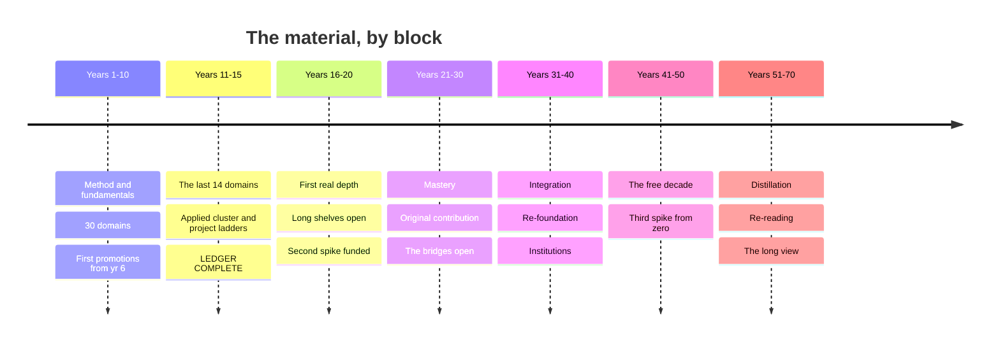

# Timeline — What to Read, and in What Order

This is the material queue: the specific books, courses, datasets, and
practices to pick up across seventy years, in the order to pick them up.

`02-map.md` says what the territory is. `resources/` says everything available
in each part of it — far more than any one life will consume. `03-spine.md`
says which domains happen when, and why that order. **This file says what to
actually open, and what to open after it.**

It is a queue to branch from, not a contract to obey. The [branch
points](#branch-points) mark where the plan legitimately splits, and the
[variants](#variants--pre-built-forks) are pre-built forks. Everything named
here is already in `resources/` — nothing new is introduced, so every item has
a full treatment waiting behind it.

## How to use this

**Work down the numbered list.** Within a year, the order is the argument.
Three rules generated it, and they're worth knowing so you can re-derive the
sequence when you inevitably reorder:

1. **Method before material.** Adler before anything he teaches you to read.
   The reading and note-taking method pays off across every item that follows,
   so it goes first even though it feels like a detour.
2. **Intuition before rigour.** 3Blue1Brown before Strang. Spiegelhalter
   before Blitzstein. The accessible door first, always — a hard text read
   after an easy one is a different and much faster experience than the same
   text read cold.
3. **Canon after survey, never instead.** The survey tells you what the field
   asks; the canon shows you the field asking it. Reversed, the canon is just
   difficult prose. Where a resource file says *start here*, that item is #1.

**Three things run underneath every year** and aren't repeated in the tables:
daily spaced repetition, the weekly log, and the curiosity budget. Current
awareness (`05-current.md`) and the frontier slot (`04-frontier.md`) run every
year too. When those stop, the plan has stopped.

### The pace, and the hours

The default is **25 hours a week, about 1,300 a year**, of which roughly 540
go to ledger material. That funds **three literacy domains a year**, and it
means **the ledger completes at year 15** — not year 30, and not never.

| Block | Ledger hrs/yr | What's happening |
|-------|---------------|------------------|
| Years 1–10 | ~540, plus fundamentals | Thirty domains. The heaviest stretch of the plan, deliberately |
| Years 11–15 | ~540 | The last fourteen domains. The applied cluster, where doing is the material |
| Years 16–70 | — | No new literacy passes. Depth, re-foundation, bridges, the long shelves |

The whole plan **rescales cleanly** — the *order* never changes, only how fast
you move through it. At 10 hrs/week the ledger closes near year 25; at 15,
near year 17; at 35, near year 9. Pick the row in `03-spine.md`'s pace table
that you'll still be running in year 12, not the one that flatters you now.

**Hours per item are approximate** and a domain's need not be evenly spread —
six weeks of intensity beats ten months of half-hour sessions for most
literacy passes.

**When a year won't fit, cut from the bottom.** The queue is *ordered*, which
makes it a triage list: item 14 earns its place after item 13, not as
optional filler. A year with ten items finished and four deferred is a good
year. A year with fourteen started is a wasted one.

---

# Years 1–10 — Foundations

Thirty of the forty-four domains, plus the fundamentals, plus a spike you are
pushing to professional strength at the same time. This is the heaviest
stretch of the plan and deliberately so: these are the domains everything
downstream waits on, and at 25 hours a week there is no reason to spread them
across three decades.

Three domains a year, and the alternation rule matters more here than
anywhere — three hard prerequisite-chained domains in one year is how a good
year becomes an abandoned one. Every year below carries at least one that
asks nothing of you but attention.

Promotions begin at year 6, once fifteen literacy passes have told you which
domains you kept reading after the artifact was finished.

## Year 1 — Statistics & probability · Philosophy · Mathematics

**The order, and why.** Adler comes before everything because he is the
instrument for everything: the four levels — inspectional, analytical,
syntopical — are how you will read the next sixty-nine years, and reading him
in month one makes every item below cheaper. Then the three doors open close
together, because they teach three different instruments: Spiegelhalter
teaches you to interrogate evidence, Plato to interrogate argument, and Gowers
to see the abstract method that locks outsiders out of mathematics. Intuition
before rigour is the rule that sets the middle of the year — 3Blue1Brown
before Strang, Spiegelhalter before Blitzstein — and the two courses are
scheduled like enrolled classes, because the problem sets are the only part
that is really the course. Proof-writing comes last, after Euclid has shown
you what a proof looks like from the outside.

| # | Material | Role | Hrs | Why here |
|---|----------|------|-----|----------|
| 1 | Adler & Van Doren, *How to Read a Book* | method | ~12 | month one, as a manual not an essay — it is the instrument the other sixty-nine years run on |
| 2 | Anki, set up day one, with Woźniak's "Twenty rules of formulating knowledge" | method / practice | ~4 + daily | rules 1–4 before your first card, or you will write a year of bad ones |
| 3 | Williams, *Style: Lessons in Clarity and Grace* | method | ~10 | worked slowly with its exercises and answers; writing is the output channel for every artifact below |
| 4 | Spiegelhalter, *The Art of Statistics* | survey (door) | ~20 | teaches the reasoning through real cases and postpones formulas until you want them |
| 5 | Huff, *How to Lie with Statistics* | survey | ~2 | ninety minutes, written in 1954, and it inoculates permanently |
| 6 | Plato, *Euthyphro / Apology / Crito*, Grube (Hackett) | canon (door) | ~10 | sixty pages, and it shows philosophy as an activity before it shows any doctrine |
| 7 | Gowers, *Mathematics: A Very Short Introduction* | survey (door) | ~6 | 150 small pages on the abstract method, which is the actual barrier |
| 8 | 3Blue1Brown, *Essence of Linear Algebra* and *Essence of Calculus* | video | ~10 | geometric meaning first — and they are intuition pumps, not substitutes |
| 9 | 500–1,500 words published weekly, with your name on it | practice | ~40 | the habit starts in week one or it never starts; draft, sleep, cut a quarter, apply Williams to the ten worst sentences |
| 10 | Harvard **Stat 110** (Blitzstein) with Blitzstein & Hwang, *Introduction to Probability*, ch. 1–6 | course | ~55 | the load-bearing half of the domain; exercises worked with solutions covered, then checked |
| 11 | Millican, *General Philosophy* (Oxford, free) | course | ~15 | the core problems, structured, before you meet them scattered through the canon |
| 12 | MIT OCW **18.06 Linear Algebra** (Strang) | course | ~50 | the real thing, with the problem sets done; reading math is not learning math |
| 13 | Freedman, Pisani & Purves, *Statistics* | survey | ~25 | the calculus-free classic, still unmatched on what inference actually *means* |
| 14 | Kenny, *A New History of Western Philosophy* | survey | ~25 | the map, after you have walked one small piece of the territory yourself |
| 15 | Courant & Robbins, *What Is Mathematics?* (or Aleksandrov, Kolmogorov & Lavrent'ev, *Mathematics: Its Content, Methods and Meaning*) | survey | ~25 | the panorama; take the Dover three-in-one if Courant feels thin |
| 16 | Euclid, *Elements* Book I — definitions, postulates, common notions, then Props. 1–47; plus Book IX Prop. 20 | canon | ~12 | the first axiomatic system, ending at Pythagoras; two paragraphs for the infinitude of primes |
| 17 | Pólya, *How to Solve It*, with Aigner & Ziegler, *Proofs from THE BOOK* (browsed) | method | ~10 | the psychology of discovery from someone who had it, plus five-page pleasures to browse forever |
| 18 | Philosophy canon: *Republic* I–II, VI–VII; *Nicomachean Ethics* I–II, X; Descartes, *Meditations*; Hume, *Enquiry*; Mill, *On Liberty*; Nietzsche, *Genealogy* | canon | ~40 | read for argument structure, not conclusions — the summaries lose the interesting move |
| 19 | The *Analects* (Slingerland), *Tao Te Ching* (D.C. Lau), Nāgārjuna via Garfield's *Fundamental Wisdom of the Middle Way* | canon | ~20 | alongside the Western canon, not after it, or the survey's silences become yours |
| 20 | Sandel, *Justice* (justiceharvard.org) | course | ~15 | ethics and political philosophy with the arguments run live against a room |
| 21 | Fisher, *The Design of Experiments* ch. 2; Tukey, *Exploratory Data Analysis* (browse); Tufte, *The Visual Display of Quantitative Information* | canon | ~12 | the lady tasting tea is fifteen pages and is where the modern experiment starts |
| 22 | Ioannidis (2005), "Why Most Published Research Findings Are False"; Gigerenzer (2004), "Mindless Statistics" | canon | ~4 | short and merciless, and they arm you for every study you will read after this year |
| 23 | Salsburg, *The Lady Tasting Tea* | history | ~8 | the century of statistics as a story, once the vocabulary is in place |
| 24 | Hammack, *Book of Proof* (free) — or Velleman, *How to Prove It* | practice | ~25 | proof-writing, after Euclid; every exercise in the early chapters, written in full sentences with no solutions consulted |
| 25 | Lakatos, *Proofs and Refutations* | canon | ~10 | how definitions actually get made, written as dialogue; nothing else does this job |
| 26 | Gettier (1963), "Is Justified True Belief Knowledge?"; Nagel (1974), "What Is It Like to Be a Bat?" | canon | ~4 | two short papers that wreck two comfortable positions, read once the canon has built them |
| 27 | McElreath, *Statistical Rethinking* lectures (free) | course | ~20 | the Bayesian and causal side — after Stat 110, never instead of it |
| 28 | Hardy, *A Mathematician's Apology*, with Wigner, "The Unreasonable Effectiveness of Mathematics" | canon | ~6 | what a mathematician thinks they are doing, at the end of a year of doing it |
| 29 | A reading group, or one reader who owes you honesty | people | ~15 | feedback is the bottleneck in all three domains and you must go get it deliberately |
| 30 | The forecast log, started — dated probabilistic predictions, scored when they resolve | practice | ~10 | begins now and never stops; nothing else teaches calibration, and it compounds |

**Also running.** **The fundamentals are deliberately front-loaded into this
year**, which is why the table above carries method items that later years
will not: the instrument is built once and taxes every domain afterward.
Around the Williams work, Zinsser's *On Writing Well* first for the argument,
then Pinker's *The Sense of Style* for why the advice works. Brown, Roediger &
McDaniel's *Make It Stick* explains what the daily Anki habit is doing;
Ahrens' *How to Take Smart Notes* is the retrieval half. Peter Adamson's
*History of Philosophy Without Any Gaps* and *In Our Time* fill commute hours
that were otherwise unusable. Personal finance gets exactly one weekend,
early, and then stops: Housel's *The Psychology of Money* for the behavioural
half, the *Bogleheads' Guide* for the allocation, Sethi's checklists for the
account order — automate it and do not touch it again until the annual hour.
Underneath all of it: daily spaced repetition, the weekly log, the curiosity
budget, and whatever your working specialty already takes, which comes first
in any conflict.

**Buy this year.** Almost nothing, deliberately — well under $150. A library
card first, which is the highest-leverage item in `kit.md` by an enormous
margin and often carries remote JSTOR and newspaper archives. A notebook
system ($20–40/yr): a carry notebook for capture, a bound one for working
problems, one place they get processed. Index cards ($10). A whiteboard
($25–80), A2 or larger, because thinking with your arm instead of your wrist
changes what you can hold in view. A hardbound proof notebook ($10), kept
separate — the record of your own failed attempts is the most useful document
you will own in this cluster. Skip the graphing calculator. Anki, LaTeX,
SageMath and SymPy are free.

**The artifacts.** A statistical claim from the news taken back to its paper —
2,000 words on what it does and does not support, naming sample, interval,
assumptions, and how many comparisons were really made. Free will
reconstructed three ways — hard determinism, libertarianism, compatibilism —
as numbered premise–conclusion arguments, then the single premise you deny and
your defence of denying it, 2,000 words. Cantor's diagonal argument and
Galois' insight explained in full to a bright sixteen-year-old, then used to
argue whether mathematics is discovered or invented, 2,000 words. Plus
forty-plus weeks of public writing, an unbroken SRS streak, a first scored
page in the forecast log, and an honest self-rating against the fundamentals
table in `02-map.md`.

---

## Year 2 — World history · Physics · Literature

**The order, and why.** Three doors again, and each is the cheapest thing in
its domain: McNeill organises history around connection and exchange before
any survey can organise it around civilisations, Feynman teaches what a
physical law *is* before you meet any particular law, and Wilson's *Odyssey*
is the work nearly everything after it is arguing with. Then the method book,
early and non-optionally — Bloch changes how you read every narrative that
follows him, including the ones in the other two domains. History gets the
largest share of the year because it is doing in one pass what the old plan
split across two: the deep-time frame, the global spine, the decentring
anchors, and the modern quartet, so that politics, law, sociology and
geography are all cheaper later. Physics runs on year 1's calculus, which is
what lets Susskind and the named Feynman chapters land in the same year as
Carroll rather than two years after him.

| # | Material | Role | Hrs | Why here |
|---|----------|------|-----|----------|
| 1 | McNeill & McNeill, *The Human Web* | survey (door) | ~12 | organises everything around connection and exchange, which is the frame you want before any survey |
| 2 | Feynman, *The Character of Physical Law* (Messenger Lectures; book and video free) | canon (door) | ~8 | what a law is, before any particular law |
| 3 | Homer, *The Odyssey*, Emily Wilson | canon (door) | ~20 | plain, fast, line-for-line with the Greek; her introduction is a short education in what a translator decides |
| 4 | Bloch, *The Historian's Craft* (or Carr, *What Is History?*) | method | ~10 | non-optional, and early — Bloch is warmer, Carr sharper on causation |
| 5 | The **Big History Project** (free) | course | ~25 | the deep-time frame, so the last 5,000 years stop looking like the whole story |
| 6 | Carroll, *The Biggest Ideas in the Universe*, vols. 1–2 | survey | ~25 | real equations, no prerequisites — go lighter here because year 1's calculus took |
| 7 | Norton Anthology of World Literature (Puchner, gen. ed.) | survey | ~30 | a survey that consists of actually reading the works |
| 8 | Susskind, *The Theoretical Minimum* — Classical Mechanics, then Quantum Mechanics, then Special Relativity | course | ~40 | furthest for least pain, and in that order specifically |
| 9 | Roberts & Westad, *The Penguin History of the World* | survey | ~45 | the best single reference narrative, ~1,200 pages, read as a spine to hang anchors on |
| 10 | Open Yale **ENGL 300**, *Introduction to Theory of Literature* (Paul Fry) | course | ~25 | the schools taught fairly, so you can tell which lens you are using |
| 11 | *The Feynman Lectures*, Vol. I ch. 1–7, 26–27, 37–38, 44–46 (free online) | canon | ~35 | least time, quantum, and the thermodynamic ratchet — the named chapters, not the book |
| 12 | Herodotus, *Histories* Bks 1 and 7; Thucydides, *Peloponnesian War* Bk 1, the Melian Dialogue, Bks 6–7 | canon | ~20 | the invention of the genre, then the hardest political history ever written |
| 13 | Literature canon, first pass: Sophocles, *Oedipus Tyrannus*; Dante, *Inferno* (Hollander for notes, Pinsky for verse); Austen, *Pride and Prejudice*; Flaubert, *Madame Bovary* (Davis); Woolf, *To the Lighthouse* | canon | ~45 | ask of each: how does it manage time, and where does its narrator stand |
| 14 | Lewin, MIT 8.01/8.02 lectures (YouTube) | course | ~20 | still the best filmed introduction to E&M |
| 15 | Open Yale: Merriman, *European Civilization, 1648–1945*; Freedman, *The Early Middle Ages* | course | ~30 | two complete free lecture courses, and the period depth the global spine cannot give |
| 16 | Shakespeare, *Hamlet* and *King Lear*, read aloud | canon | ~15 | aloud is not a flourish — the verse does not work silently |
| 17 | Ibn Khaldun, *The Muqaddimah* (abridged) on *asabiyyah* and the dynastic cycle; Sima Qian, selected biographies | canon | ~15 | two historians outside the Greek line, read while Herodotus and Thucydides are still fresh |
| 18 | Einstein (1905), "On the Electrodynamics of Moving Bodies," §1–5 | primary | ~4 | free, and astonishingly readable once Susskind's SR is done |
| 19 | Frankopan, *The Silk Roads* | survey anchor | ~15 | the decentring anchor — read it against the Penguin spine, not instead of it |
| 20 | Hobsbawm, *Age of Revolution / Capital / Empire / Extremes* | survey anchor | ~30 | 1789–1991 by one arguing mind, which is what makes the quartet worth four books of your time |
| 21 | Literature canon, second pass: Murasaki, *The Tale of Genji* (Tyler); Cervantes, *Don Quixote* (Grossman); *The Arabian Nights* (Haddawy) | canon | ~20 | the works the Western survey compresses into a sentence each, taken at their own length |
| 22 | One non-Western regional history read properly: Keay's *India*, Iliffe's *Africans*, or Brook's *The Troubled Empire* | survey anchor | ~20 | one region at full depth beats three at skim depth, and it is the corrective to the spine |
| 23 | Bell (1964), "On the Einstein Podolsky Rosen Paradox," with EPR (1935); Anderson, "More Is Different" (1972) | primary | ~6 | six pages that changed the field, then five that explain why a theory of everything predicts nothing |
| 24 | Auerbach, *Mimesis* | survey / argument | ~20 | a survey and an argument at once, and it needs canon under it to land |
| 25 | Blaut's *Eight Eurocentric Historians* and Pomeranz, read against *Guns, Germs, and Steel* and *Sapiens* | method | ~12 | the two bestsellers everyone has read, and the specialist literature that answers them |
| 26 | The bench: *g* to three figures, the speed of light with a microwave and cheese, Planck's constant from LEDs | practice | ~15 | measurement with your own hands, which is the half of physics that reading cannot supply |
| 27 | ModPo (Filreis, free) | course / community | ~15 | real communal close reading, which is the rarest thing online |
| 28 | A natural history museum, with a specific written question in hand | place | ~6 | deep time as physical scale; go repeatedly and briefly, never once and exhaustively |

**Also running.** **The language starts now** and runs to B2. Order matters
here too: Wyner's *Fluent Forever* first for the sound system, with
minimal-pair drills and shadowing daily for two months, because sounds you
cannot distinguish you cannot store; Krashen's *Principles and Practice* (free
at sdkrashen.com) for why comprehensible input is the engine; a paid tutor
from month one via italki or a local equivalent, which is the non-negotiable
item; graded readers as the input backbone; the first 1,000–2,000 words by
frequency, taken deliberately rather than waited for; Anki cards built from
sentences you actually met. The daily loop is SRS 15–20 min, input 30–45 min,
output two or three sessions a week. **The craft starts now and never ends.**
Pick one from `made-applied.md` and learn the tool before the technique:
sharpening, tuning, calibration and the safety rules cold, from a person. Then
the one book for your craft — Schwarz, Nosrat, Leach, Platt, Smith or
Klickstein — read once and kept beside the bench. Then an in-person class,
because this is the tier where money buys the most. `04-frontier.md` and
`05-current.md` both start drawing their capped hours this year and never
stop. Mathematics' lifetime practice continues — one hard problem a week in
the notebook — and physics adds its own: one derivation a week from scratch,
no references open. Weekly publication continues, with Williams' exercises
still being worked.

**Buy this year.** Under $250. 10×50 binoculars, $90–180 — the most useful
advice in `kit.md`, and they serve birding forever and the astronomy year
later. A planisphere, $12, which teaches the sky's rotation because you turn
it yourself; Stellarium is free. The craft's starting tools: the cheap
version, used until its limits genuinely annoy you — except the sharpening
setup, which is bought good alongside the first edged tools. A cheap
multimeter and a handful of LEDs for the bench work, under $40.

**The artifacts.** 2,000 words on the Great Divergence: state Pomeranz's case,
state the strongest institutionalist counter, and say precisely what evidence
would settle it — if you cannot name the evidence, you have not understood the
argument. 2,000 words on why least action, not Newton's second law, is the
real formulation of classical mechanics, and what it means that the same
principle reappears in quantum mechanics. A 2,000-word close reading of one
poem or one three-page passage, defending a claim that collapses if the
details don't support it — no biography, no context, the words only. Plus CEFR
A2 and one working month of the physics notebook.

---

## Year 3 — Evolutionary & molecular biology · Chemistry · Music

**The order, and why.** The chemistry lab course is booked before anything is
read, because it is a calendar constraint rather than a reading choice —
chemistry is the least autodidact-friendly domain on the map, you cannot fake
a lab, and community-college enrolment happens months before the term starts.
Dawkins and Copland are the two cheap doors and they do the same job in
different materials: after Dawkins you can predict what selection will and
won't build, and after Copland you hear form rather than mood, so Stearns and
Wright both land on prepared attention instead of building it from zero. Levi
then makes chemistry a way of seeing before Drennan makes it a syllabus. The
microscope goes early, not late — pond water on day one is the point — and the
organic course goes last, when arrow-pushing has something to attach to.

| # | Material | Role | Hrs | Why here |
|---|----------|------|-----|----------|
| 1 | Dawkins, *The Selfish Gene*, ch. 1–6 and 11 | canon (door) | ~12 | selection as an algorithm; those chapters carry it |
| 2 | Copland, *What to Listen For in Music* | survey (door) | ~10 | you finish it hearing form rather than mood |
| 3 | The community college chemistry lab course | course / lab | ~50 | enrol first; it sets the year's calendar and it is the honest route |
| 4 | Pond water, yeast, your own cheek cells, under the scope | practice | ~15 | day one, before the textbook — the cell stops being a diagram |
| 5 | Levi, *The Periodic Table* | canon (door) | ~10 | chemistry as a way of seeing, by a working chemist; if only two chapters, "Iron" and "Carbon" |
| 6 | Open Yale **MUSI 112**, *Listening to Music* (Craig Wright) | course | ~30 | the best structural-listening course available anywhere |
| 7 | Atkins, *Chemistry: A Very Short Introduction*, then *Atkins' Molecules* | survey | ~15 | he wrote the standard physical chemistry text and compresses without lying |
| 8 | Zimmer & Emlen, *Evolution: Making Sense of Life* | survey | ~35 | a textbook that reads like journalism; the best complete first pass |
| 9 | MIT OCW **5.111**, *Principles of Chemical Science* (Drennan) | course | ~40 | full video, among the best-taught on OCW, and it pairs with the lab hours |
| 10 | Open Yale **EEB 122**, *Principles of Evolution, Ecology and Behavior* (Stearns) | course | ~35 | 36 free lectures, still the best online treatment |
| 11 | Coursera (Edinburgh), *Fundamentals of Music Theory*, with musictheory.net and teoria.com drills | course | ~20 | the mechanics, once Copland and Wright have given you something to name |
| 12 | Darwin, *On the Origin of Species*, ch. 1, 4, 6, 14 | canon | ~15 | ch. 6 is where Darwin is his own best critic; skip the pigeon-fancier detail |
| 13 | Music canon, listened to structurally with a score where you can: Hildegard; Josquin; Monteverdi, *L'Orfeo*; Bach's C-major prelude and fugue then the *B Minor Mass*; Mozart 40; Beethoven 5 and Op. 131; *Winterreise*; the *Tristan* prelude; Debussy; *The Rite of Spring*; Ligeti | canon | ~35 | ask of each: where is the tension, and what resolves it |
| 14 | Pauling, *The Nature of the Chemical Bond*, ch. 1–3 and the resonance chapters | canon | ~15 | it built modern chemistry and is still readable; skip the crystal-radii tables |
| 15 | Lane, *The Vital Question* | survey | ~12 | the energetic origin story the standard textbook underplays |
| 16 | Bernstein, *The Unanswered Question* (Norton Lectures, free) | video | ~6 | six hours, and it is a composer arguing rather than a teacher explaining |
| 17 | MIT OCW **7.01SC**, *Fundamentals of Biology* | course | ~25 | the molecular half Stearns doesn't cover |
| 18 | Beyond the West: a full Ravi Shankar rāga (ālāp into jor into jhālā); Umm Kulthūm; Javanese gamelan; Ali Farka Touré. And Ellington; *Kind of Blue* (modal, not functional); *A Love Supreme*; Robert Johnson; Aretha Franklin | canon | ~25 | Taruskin's line is one tradition; Titon's *Worlds of Music* is the corrective |
| 19 | MIT OCW **5.12**, *Organic Chemistry I* | course | ~30 | after 5.111 and the lab, when the arrow-pushing has something to attach to |
| 20 | Taruskin & Gibbs, *The Oxford History of Western Music: College Edition* | survey | ~25 | the Western line laid out properly, after a year of hearing pieces from it |
| 21 | Weiner, *The Beak of the Finch* | survey | ~10 | selection measured in real time, still the best demonstration in print |
| 22 | Kimura (1968) on neutral theory; Margulis (1967), "On the origin of mitosing cells"; Gould & Lewontin (1979), "The Spandrels of San Marco" | canon | ~5 | three short papers: most change is not adaptive, cells are communities, and not everything is an adaptation |
| 23 | One unknown a week — a published ¹H and ¹³C NMR, IR and mass spectrum, assigned cold and checked | practice | ~10 | starts now and runs for decades; structure elucidation becomes reflex or it never becomes anything |
| 24 | Hoffmann, *The Same and Not the Same* | canon | ~8 | a Nobel laureate on what chemistry *is* — the best writing about the field's own dualities |
| 25 | Monod, *Chance and Necessity* | canon | ~8 | chance and necessity stated by someone who did the molecular work |
| 26 | Ross, *The Rest Is Noise* | survey | ~15 | the twentieth century as narrative, after you can hear it |
| 27 | Kean, *The Disappearing Spoon* | supplement | ~8 | the fun supplement, and explicitly not the substitute |
| 28 | A local natural history society | people | ~10 | amateur societies hand a newcomer real equipment within a month |

**Also running.** An instrument in your hands, not a book about music — a
weekly teacher, and Klickstein's *The Musician's Way* for how to practise
rather than merely repeat. If the instrument *is* your craft, this and the
year-2 craft track are the same track; otherwise the craft continues toward
its first finished object. Language to B1: the daily loop unchanged, tutor
sessions now doing real work, graded readers giving way to native shows with
target-language subtitles. **Speaking starts this year**, because all three
domains produce things worth explaining — a real venue monthly is the primary
source and not a supplement, with Berkun's *Confessions of a Public Speaker*
for fear and rooms that go wrong, Anderson's *TED Talks* for structuring
around one idea, and Winston's "How to Speak" (MIT, free, one hour). Record
every time; the recording is the feedback source and it is non-negotiable. R
is free and is the environment both biology and psychology reason in — learn
it here rather than later. Chemistry's bound lab notebook is kept properly
from the first session, dated and numbered, even for kitchen chemistry.
Sapolsky's *Human Behavioral Biology* lectures are held back for the
anthropology year, where they do double duty.

**Buy this year.** A real compound microscope — achromatic objectives,
mechanical stage with coaxial controls, Abbe condenser with iris, glass
throughout. New, the usable entry point is $200–400; better, buy used from
university surplus or a lab liquidation at $150–400, where a thirty-year-old
professional instrument beats anything new at that price. Prepared slides
($30–60) to calibrate your eye, then blanks and coverslips ($20/hundred) and
methylene blue and iodine ($15), because making your own is the skill. A
dissection kit ($20–40). An instrument bought used — a solid-top acoustic
guitar at $150–400, or a weighted-key 88 digital piano at $300–500 — plus
$50–100 for a setup or tuning, and a mechanical metronome ($20–30), which gets
used because it is sitting there. IMSLP is free and holds the repertoire. For
chemistry, lab course fees rather than home equipment: be clear-eyed that
reagents, glassware and apparatus carry real safety and legal constraints, and
`kit.md` names the legitimate hobby routes.

**The artifacts.** One adaptation traced end to end — lactase persistence, the
sickle-cell heterozygote advantage, the vertebrate eye — through the mutation,
the selective regime, the population dynamics of its spread, and the evidence
the story is true rather than merely plausible, 2,000 words. Haber–Bosch
traced end to end, 2,000 words — the thermodynamics that makes it hard, the
catalysis that makes it possible, the real temperatures and pressures, and the
fact that roughly half the nitrogen atoms in your body passed through it.
1,500 words on a single four-minute piece: what happens, in order, section by
section, plus the moment the music makes a promise and the moment it keeps or
breaks it. Plus language at B1 and the craft's first finished object, however
bad.

---

## Year 4 — Psychology · Economics · Visual art & architecture

**The order, and why.** Kahneman opens the year because he shows, repeatedly,
how a vague claim about the mind becomes a cheap decisive experiment — and he
is read *with the replication crisis in hand*, which is why he comes before
Bloom's course rather than after it. Economics is the one domain where
`human-social.md` says explicitly: start with a course, not a book, so CORE
leads with inequality, institutions, power and real data instead of chapter-one
supply-and-demand, and Heilbroner afterwards supplies the lineage CORE assumes
rather than teaches. The dataset comes early on purpose — `modes.md` is right
that in quantitative fields an afternoon with real series should precede the
survey book. For art, Berger before any names, then the museum before Gombrich,
because scale does not survive reproduction; year 1's statistics is what makes
the psychology readable and the incidence arguments checkable.

| # | Material | Role | Hrs | Why here |
|---|----------|------|-----|----------|
| 1 | Kahneman, *Thinking, Fast and Slow* | survey (door) | ~20 | how a vague claim about the mind becomes a cheap decisive experiment — and the priming chapter has not held up |
| 2 | Berger, *Ways of Seeing* — the book and the four free BBC episodes | survey (door) | ~8 | makes visible the ideology in how you already look, before you have learned any names |
| 3 | **CORE Econ, *The Economy*** (core-econ.org) | course (door) | ~50 | the modern introduction, free, and the single best free resource named in `human-social.md` |
| 4 | FRED and Our World in Data — one question, one afternoon, one chart you made | data | ~10 | before the survey book, not after; an afternoon of messy series teaches what ten chapters don't |
| 5 | Open Yale **PSYC 110**, *Introduction to Psychology* (Paul Bloom) | course | ~30 | take it whole; among the best introductory courses in any subject |
| 6 | The museum, repeatedly and briefly, membership in hand | place | ~30 | twenty short visits to look at four things, not one exhausting march |
| 7 | Heilbroner, *The Worldly Philosophers* | survey | ~12 | the great economists as a story, readable in a weekend, and it is the lineage CORE assumes |
| 8 | Gray & Bjorklund, *Psychology* (or Bloom, *Psych: The Story of the Human Mind*) | survey | ~30 | a real textbook, evolutionary in framing — which year 3 has now earned |
| 9 | Gombrich, *The Story of Art* | survey | ~30 | one great voice through the Western tradition, and honest about being that |
| 10 | Hayek, "The Use of Knowledge in Society" (1945) | canon | ~3 | fifteen pages, free, and the best argument for prices ever written |
| 11 | MIT OCW **14.01** *Principles of Microeconomics* and **14.02** *Principles of Macroeconomics* | course | ~40 | do the problem sets; they are posted with solutions |
| 12 | Smarthistory (free, with Khan Academy) | course | ~20 | two experts talking in front of each work — the best free art-history resource that exists |
| 13 | PsychoPy or jsPsych: run a classic experiment on yourself | practice | ~15 | watching your own data come out noisy teaches the methods problem faster than any chapter about it |
| 14 | Smith, *Wealth of Nations* I.1–3 and IV.2; Ricardo, *Principles* ch. 7 | canon | ~10 | the invisible hand is one sentence and is almost always misquoted |
| 15 | Kostof, *A History of Architecture: Settings and Rituals*, with Ching's *Architecture: Form, Space and Order* | survey | ~30 | Ching teaches spatial thinking by drawing, which is the only way it goes in |
| 16 | Simmons, Nelson & Simonsohn (2011), "False-Positive Psychology"; Miller (1956); Tversky & Kahneman (1974) | canon | ~6 | the paper that named the disease, plus the two findings the field was built on |
| 17 | James, *The Principles of Psychology* — "Habit," "The Stream of Thought," "The Consciousness of Self," "Attention," "Will" | canon | ~15 | five chapters and stop; still quoted, and still right about more than it should be |
| 18 | Stokstad, *Art History* (or Gardner's *Art Through the Ages*); MIT OpenCourseWare's global history of architecture | survey | ~25 | the global coverage Gombrich doesn't attempt and most surveys skip |
| 19 | Akerlof (1970), "The Market for Lemons"; Card & Krueger (1994); Solow (1956) | canon | ~6 | one market failure, one design that overturned a consensus, one growth model — the field in three papers |
| 20 | Henrich, *The WEIRDest People in the World* | survey | ~15 | which of psychology's findings are about humans and which are about undergraduates |
| 21 | Keynes, *The General Theory* ch. 12 and 24 only; Friedman, *Capitalism and Freedom* ch. 1–2 | canon | ~10 | read *about* the rest of Keynes first — the file is right that it is genuinely hard |
| 22 | Edwards, *Drawing on the Right Side of the Brain*, with a dated sketchbook | practice | ~20 | drawing breaks symbol-drawing, and copying teaches what looking alone cannot |
| 23 | MoMA's free Coursera courses | course | ~10 | the modern and contemporary half, taught by the institution that assembled the argument |
| 24 | Festinger, Riecken & Schachter, *When Prophecy Fails* | canon | ~10 | what social psychology looked like when it was brave |
| 25 | Marginal Revolution University's video library, with the IGM Forum polls | course | ~10 | the concepts once more in plain language, plus a free reality check on where economists actually agree |
| 26 | Hirschman, *Exit, Voice, and Loyalty* | canon | ~8 | the most reliably surprising economist to read, and it applies to every institution you belong to |
| 27 | The canon, looked at in person wherever possible — the Pantheon's oculus, Hagia Sophia, Chartres, Giotto's Arena Chapel, Masaccio's *Trinity*, *Las Meninas*, Rembrandt's late self-portraits, Hokusai, Manet's *Olympia*, Rothko; and the buildings — Brunelleschi's dome, the Villa Rotonda, Fallingwater, the Salk Institute, Kéré's school at Gando | canon | ~25 | look for what the work does with your eye's path and your body's position |
| 28 | Ritchie, *Science Fictions* | survey | ~8 | the reform case from inside, once you have seen the literature it is about |
| 29 | *Journal of Economic Perspectives*, cover to cover, quarterly | primary | ~8 | free, deliberately readable, and over decades it is an education by itself |
| 30 | The provenance log — one claim a week traced to its original study | practice | ~10 | twenty minutes weekly produces a calibration almost nobody has, including many professionals |

**Also running.** Language reaches B2 this year, which is the level that
changes your life — real conversations without strain on both sides, a novel
read with effort, work done in the language. Mollick's *Co-Intelligence* is
the right year for the AI-tools row, because you now have twelve domains'
literacy to check a model against, and the weekly drill — take one
AI-generated explanation in a field you know well and find its errors — is
only possible once you know several fields well. The craft moves toward its
second object; the monthly speaking venue continues, still recorded.
Economics adds its own lifetime practice: one long series of your own —
prices at your local shops, rents on one street, your household's complete
accounts — collected the same way, the same month, for decades. Weekly
publication, daily SRS, the forecast log, the frontier slot and current
awareness all run as always.

**Buy this year.** A museum membership, $50–150/yr, which pays for itself in
two visits and changes how you use a museum. A drawing kit at $40–70 —
graphite HB through 6B, vine and compressed charcoal, kneaded eraser, blending
stump — and a 90–150 gsm sketchbook at $15–25, because cheap paper buckles and
makes competent work look bad at exactly the wrong moment. For psychology the
equipment that isn't free is mostly disappointing: a hobbyist EEG will show
you alpha rhythm appearing when you close your eyes, which is a legitimate
thrill and is not neuroscience. The real equipment in both empirical domains
is access to participants, R, and free public data — FRED, World Bank WDI,
Our World in Data, and your national statistics office.

**The artifacts.** A famous psychological finding you believed before you
started, traced through its full evidential history — the original N and
effect size, what the press said, what replication found, where it honestly
stands — then what you would need to see to change your mind again, 2,000
words. 2,000 words on a real policy with real data — a minimum wage change, a
carbon tax, a zoning reform — with a supply/demand analysis, an explicit
incidence claim, the strongest counterargument stated fairly, and at least one
chart you made yourself. 1,500 words on one object you saw in person: five
hundred words of pure description with no interpretation, then what it was
for, then what you claim it does to a viewer — with the description as your
evidence. Plus language at B2 and the craft's second object, visibly better
than the first.

---

## Year 5 — Neuroscience · Genetics · World religions & mythology

**The order, and why.** Sacks first because each chapter is a mind broken in
one specific way, which is precisely how the field learned what the parts do —
and because you finish it wanting the mechanism, which is the right appetite to
bring to Kanwisher. Prothero goes early on the other side because he
inoculates against the single commonest error before you read anything else,
and Mukherjee is the genetics door because he braids mechanism with the
eugenics history most popular accounts skip. This is a payoff year: heritability
is unreadable without year 1's statistics, Kandel is unreadable without year 3's
chemistry, and the genome course assumes the molecular biology you took beside
it. Kandel is deliberately late and deliberately partial — Part I, the membrane
and action potentials, synaptic transmission, one systems chapter on vision, and
you skip the molecular detail entirely.

| # | Material | Role | Hrs | Why here |
|---|----------|------|-----|----------|
| 1 | Sacks, *The Man Who Mistook His Wife for a Hat* | canon (door) | ~10 | the abstract made concrete, and it leaves you wanting mechanism |
| 2 | Prothero, *God Is Not One* | survey (door) | ~12 | organises each tradition around the problem that tradition thinks it is solving |
| 3 | Mukherjee, *The Gene: An Intimate History* | survey (door) | ~18 | then read the criticism of the epigenetics chapter — that argument is part of the door |
| 4 | Mendel, *Experiments on Plant Hybridization* (1866), whole | canon | ~4 | free, short, startlingly modern, and the rare canon item you read entire |
| 5 | MIT OCW **9.13**, *The Human Brain* (Kanwisher) | course | ~40 | free video, outstanding, unusually honest about the limits of the methods |
| 6 | Open Yale **RLST 145**, *Introduction to the Old Testament* (Christine Hayes) | course | ~30 | a model of what rigorous non-devotional teaching about scripture looks like |
| 7 | Lander, *Introduction to Biology — The Secret of Life* (MITx / OCW 7.00x) | course | ~45 | problem-set driven, taught by someone who led the genome project; the best free course here by a wide margin |
| 8 | Hebrew Bible in Robert Alter's translation — Genesis, Exodus, Job, Ecclesiastes | canon | ~30 | his notes are the education; read alongside Hayes, not after |
| 9 | Cobb, *The Idea of the Brain* | survey | ~15 | the whole history of how we've thought about brains, honest about how much is unknown |
| 10 | Harvard, *Fundamentals of Neuroscience* (three parts, browser simulations) | course | ~25 | the cellular side Kanwisher skips, with simulations to fail against |
| 11 | Smart, *The World's Religions* | survey | ~18 | the standard secular survey, built on the seven dimensions |
| 12 | GenBank: pull real sequence data, build a tree, learn what a bootstrap value does and does not mean | data | ~20 | the year-1 statistics finally cashing out on somebody else's evidence |
| 13 | Kandel et al., *Principles of Neural Science* — Part I, membrane potential, action potential, synaptic transmission, one vision chapter | canon | ~30 | do **not** read it cover to cover at this tier |
| 14 | Mark and Romans; the Qur'an (Abdel Haleem); the *Bhagavad Gita* (Miller); the *Dhammapada*, then Bhikkhu Bodhi's *In the Buddha's Words* | canon | ~30 | read for genre and audience — who was this addressed to, and what did it ask of them |
| 15 | Rutherford, *A Brief History of Everyone Who Ever Lived* | survey | ~12 | the numerate correction to genetic just-so stories, especially on ancestry and race |
| 16 | Open Yale **RLST 152**, *Introduction to New Testament History and Literature* (Dale Martin) | course | ~20 | the second half of the same non-devotional method |
| 17 | MIT OCW **7.03**, *Genetics* | course | ~25 | follows on from Lander, and this is the order the file gives |
| 18 | Hodgkin & Huxley (1952); Hubel & Wiesel (1962); Marr, *Vision*, ch. 1 | canon | ~8 | the axon, the receptive field, and the three levels most confused arguments ignore |
| 19 | Watson, *The Double Helix*, alongside Maddox, *Rosalind Franklin: The Dark Lady of DNA* | canon | ~15 | the pair is the honest version; neither alone is |
| 20 | Services or ceremonies of two traditions not your own, observed as a scholar would | place / people | ~10 | the material dimension of Smart's seven, which no text delivers |
| 21 | Sapolsky, *Behave* | survey | ~15 | sprawling, and the best bridge from cells to social behaviour — read after Kanwisher, not before |
| 22 | *Gilgamesh* (Andrew George); Hesiod, *Theogony*; *Popol Vuh* (Dennis Tedlock) | canon | ~15 | myth as its own genre, not as failed history |
| 23 | Reich, *Who We Are and How We Got Here* | survey | ~12 | ancient DNA, once population structure means something to you |
| 24 | Ramachandran, *Phantoms in the Brain*; Cajal's Nobel lecture (short, free) | survey / primary | ~10 | the founder's own voice, once you know what a neuron is |
| 25 | Durkheim, *The Elementary Forms* (the conclusion); Geertz, "Religion as a Cultural System" | canon | ~6 | the two theoretical frames the survey compresses, in the words that made them |
| 26 | Watson & Crick (1953), one page; Jinek et al. (2012) on programmable Cas9 | primary | ~3 | the structure and the tool, sixty years apart, both short |
| 27 | Zimmer, *She Has Her Mother's Laugh* | survey | ~12 | the best general book on heredity written this century, and it is about more than genes |
| 28 | Kevles, *In the Name of Eugenics* | canon | ~10 | eugenics is not a footnote to this field's history; it is load-bearing |
| 29 | Jonas & Kording (2017), "Could a Neuroscientist Understand a Microprocessor?" | canon | ~2 | a joke that is not a joke, and the sharpest methodological critique the field has produced |
| 30 | A brain specimen — a museum or a university open day | place | ~4 | proportion, which is exactly what secondary sources lose |
| 31 | A standing weekly journal club — one paper, read from the figures first | practice | ~10 | starts now and never stops; a written note on what the controls did not rule out |

**Also running.** The language shifts from acquisition to maintenance, and the
protocol is specific: SRS five to ten minutes a day on that deck, never
deleted; one hour of input a week minimum; one book and one show a month, with
the book as the load-bearing half; one hour of conversation a month, because
output degrades first and fastest; and one recorded hour a year with a tutor
briefed to rate you against CEFR and say so plainly. The craft moves toward
material fluency, which is where the second, harder book on your medium
belongs. The *Analects* and *Tao Te Ching* return this year from year 1's
philosophy queue — read now as religious texts rather than as arguments, which
is a different book. Judson's *The Eighth Day of Creation* is the full
molecular saga if it grips you, and skipping it is legitimate. The monthly
speaking venue continues, still recorded; the forecast log, the provenance log
and the weekly unknown all continue.

**Buy this year.** Nothing significant, and that is deliberate — bank it for
the telescope in year 7. The genetics work runs on free public infrastructure:
GenBank, Ensembl, the 1000 Genomes data and IQ-TREE cost nothing and are the
real equipment. If an alumni library account is reachable ($50–200/yr) this is
the year it starts earning, because both neuroscience and genetics move fast
enough that the live literature matters and PubMed Central covers only part of
it.

**The artifacts.** A single act — reaching for a cup you see on a table —
traced from photons to muscle contraction, naming each structure and the
transformation it performs, then marking explicitly every step where the
textbook story is actually a hypothesis. The marks are the real test. 2,000
words. 2,500 words answering a smart skeptic's question — what does it mean to
say height is 80% heritable? — handling twin studies, GWAS, missing
heritability, population stratification, and why the number says nothing about
any individual person. One ritual described three times — as participants
explain it, as a Durkheimian functionalist would, as a textual historian would
— then which description you think is missing the most, 2,000 words.

---

## Year 6 — Political science · Computing in practice · Anthropology & archaeology

**The order, and why.** Petzold first, because *Code* builds a computer from
flashlights and relays and "it's just electricity and logic" stops being a
slogan; Geertz first on the anthropology side, because everything you read
afterward is either doing thick description or arguing with it; Fukuyama first
on the politics side, because after him you will never again treat "state,"
"rule of law," and "democracy" as one thing. Then *Missing Semester* very
early — a week of work that removes years of friction, and `made-applied.md`
calls it the highest-leverage free course in the whole file. After five years
of programming as a fundamental you arrive with real problems, so building and
deploying comes before CS50 rather than after it. Anthropology inverts the
usual shape: there is no open flagship worth your time, one full ethnography
read cover to cover *is* the training, and the observation hours start early
because the artifact depends on notes you cannot reconstruct later.

| # | Material | Role | Hrs | Why here |
|---|----------|------|-----|----------|
| 1 | Petzold, *Code: The Hidden Language of Computer Hardware and Software* (2nd ed.) | survey (door) | ~20 | you watch a computer get built out of relays, which no later abstraction replaces |
| 2 | Geertz, *The Interpretation of Cultures* — "Thick Description" and "Deep Play" | canon (door) | ~8 | everything you read afterward is either doing this or arguing with it |
| 3 | Fukuyama, *The Origins of Political Order* | survey (door) | ~25 | genuinely comparative — China, India, the Islamic world, Europe — rather than Western |
| 4 | MIT, *The Missing Semester of Your CS Education* | course | ~12 | shell, git, editors, debugging, profiling — do it before anything bigger |
| 5 | **Federalist 10 and 51** | canon | ~3 | twenty pages, non-negotiable, the best short statement of institutional design ever written |
| 6 | Eriksen, *Small Places, Large Issues* | survey | ~15 | short, global, and not US-centric |
| 7 | Ten hours of observation in a setting you can access, with field notes written the same day | practice | ~20 | start the observation early — the artifact depends on notes you cannot reconstruct later |
| 8 | Build and deploy something small that strangers actually use | practice | ~50 | the better route by now; a tutorial's problem gives you a tutorial's feedback |
| 9 | Machiavelli, *The Prince* (whole — 100 pages) and *Discourses on Livy* Book 1 | canon | ~15 | the *Discourses* are more important and far less read |
| 10 | One full ethnography, cover to cover | canon | ~20 | the lecture format fails this field; this is the substitute and it is not a lesser one |
| 11 | Open Yale, *Introduction to Political Philosophy* (Steven B. Smith) | course | ~25 | the systematic version of what Sandel did in year 1 |
| 12 | Malinowski, *Argonauts of the Western Pacific* — the Introduction on method, plus the kula chapters | canon | ~15 | the Introduction alone is the founding document of fieldwork |
| 13 | Hobbes, *Leviathan* (Introduction, ch. 13–18); Locke, *Second Treatise*; Rousseau, *Social Contract* Bks 1–2 | canon | ~20 | ch. 13–18 is the whole argument; the rest is optional at this tier |
| 14 | Renfrew & Bahn, *Archaeology: Theories, Methods and Practice* — method chapters read, the rest browsed | survey | ~20 | the genuine standard; the method chapters are the part that transfers |
| 15 | Mauss, *The Gift*, whole | canon | ~8 | short, and it is the other half of the kula |
| 16 | Harvard **CS50**, if you want the structure | course | ~35 | optional by now; finish it including the final project, or don't start |
| 17 | Fukuyama, *Political Order and Political Decay* | survey | ~15 | the second volume brings the triad to the present, which is where you actually live |
| 18 | Brooks, *The Mythical Man-Month* ch. 1–3, 11 and "No Silver Bullet"; Kernighan & Pike, *The Practice of Programming* | canon | ~15 | Brooks for why your project is late, Kernighan & Pike for taste in the small |
| 19 | Evans-Pritchard, *The Nuer* (the cattle and time-reckoning chapters); Lévi-Strauss, *Tristes Tropiques* | canon | ~18 | time reckoned by cattle is the cleanest available demolition of the universal category |
| 20 | Olson, *The Logic of Collective Action*; Ostrom, *Governing the Commons* | canon | ~15 | shared interests do not produce shared action — and the fieldwork showing when they do |
| 21 | Ladder rung 3 — a service you operate: API, database, deploys, backups, monitoring, and a restore drill you actually perform | project | ~20 | operating something is a different skill from building it, and it is the rarer one |
| 22 | Dahl, *On Democracy*, with Acemoglu & Robinson, *Why Nations Fail* and its critiques | survey | ~18 | Dahl for the definition of polyarchy; Acemoglu & Robinson read *with* the causal-overreach critiques |
| 23 | Sapolsky, *Human Behavioral Biology* (Stanford, free) | course | ~25 | the biological-anthropology flank, held back from year 3 so it lands where it does double duty |
| 24 | Aristotle, *Politics* Books 3–6 | canon | ~10 | the original comparative politics, and still sharp on regime decay |
| 25 | Abelson & Sussman, *Structure and Interpretation of Computer Programs*, ch. 1–2 (free) | canon | ~25 | if it grips you keep going; if it doesn't, that is a legitimate outcome, not a moral failure |
| 26 | Tocqueville, *Democracy in America* (Vol. 1 Pt 2; Vol. 2 Pt 2); Mill, *On Liberty*, reread | canon | ~15 | *On Liberty* was a year-1 philosophy text; read now as institutional design it is a different book |
| 27 | V-Dem, Polity and Correlates of War — one question, one afternoon, one chart | data | ~8 | the measurement debates are the whole backsliding literature; you cannot judge them from prose |
| 28 | Achen & Bartels, *Democracy for Realists* | survey | ~10 | how little most voters resemble the model, argued with the data |
| 29 | Naur, "Programming as Theory Building"; Parnas (1972); Hoare's "The Emperor's Old Clothes"; Leveson & Turner on Therac-25 | canon | ~8 | why software rots, how to cut it up, what arrogance costs, and the failure case to reread once a decade |
| 30 | A local council meeting, then its minutes | place | ~8 | the gap between the two is the domain's actual subject |
| 31 | An archaeological field school or a dig season | practice / place | ~40 | volunteer archaeology genuinely takes amateurs; pull it forward if a season is offered |

**Also running.** **The first promotions begin this year.** At the annual
review, take the domain from years 1–3 that pulled hardest and move it to
working depth on its own long shelf in `resources/` — statistics into Casella &
Berger and *Bayesian Data Analysis*, mathematics into Velleman, Spivak, Axler
and Abbott, philosophy into the *Stanford Encyclopedia* with Loux and Audi,
physics into Kleppner and Purcell, literature into Genette and Booth with the
scansion drills. That is a real second budget beside the ledger, and it is
what the ledger was for. Alongside it, this is the natural year for
programming's deliberate re-foundation — take a tool you actually depend on and
rebuild it on whatever is currently mainstream, including version control,
environment and deployment. Craft continuing; language on the maintenance
protocol; the monthly speaking venue; the frontier slot, which has been running
since year 2 and is the cluster where it most often pays. Politics adds its own
lifetime practice: adopt a country that is not yours and follow it for life,
with a written forecast before each of its elections, graded afterwards.

**Buy this year.** Under $300, and it opens the whole made-and-applied
cluster. A temperature-controlled soldering station, $50–120 — the $12
fixed-temp pencil is the standard false economy, producing cold joints you
will misdiagnose as circuit bugs for hours; buy a spare tip and a brass
sponge, and fan the smoke away. A multimeter, $40–80, which turns "it doesn't
work" into a location. Breadboards and a components assortment, $50–80. A
microcontroller starter kit, $30–70 for an Arduino-class board or $50–90 for a
Raspberry Pi-class board. A cheap USB oscilloscope at $60–150 if the signals
start mattering. For politics and anthropology the sources are free —
CourtListener, V-Dem, the field school's own fees are the real spend.

**The artifacts.** 2,000 words explaining one country's specific political
outcome using two competing frameworks and stating what observable evidence
would distinguish them; naming the discriminating evidence is the test.
Something small, built and deployed, that strangers actually use — plus the
write-up: what broke, what you measured, what you'd change — and separately
1,500 words tracing everything that happens between typing a URL and pixels
appearing. An ethnographic sketch of 2,000 words on a setting you can access,
thick description first, closing with a paragraph on what your own position
let you see and what it hid.

---

## Year 7 — Cosmology & astronomy · Logic & foundations · Theater, film & narrative media

**The order, and why.** Sagan first because *Cosmos* models reasoning rather
than reporting results, and it is still the best invitation ever made;
Aristotle first on the narrative side because the *Poetics* is forty pages and
every story manual sold today is a diluted restatement of it. Nagel & Newman
opens logic because walking the incompleteness argument in a hundred pages
means you meet the destination before the machinery, so the machinery has
somewhere to go — then Priest for the map and Peter Smith's free textbook for
the truth tables, natural deduction and quantifiers, because skipping the
machinery means nothing after it lands. Then vocabulary before canon in both
of the other domains: OpenStax skimmed whole in a month, Bordwell & Thompson
before the films. Gödel's own 1931 paper is brutal and you take it through
Smith's book instead; Turing 1936 you read directly, and it pays for itself
again next year.

| # | Material | Role | Hrs | Why here |
|---|----------|------|-----|----------|
| 1 | Sagan, *Cosmos* (book or the 1980 series) | survey (door) | ~15 | it models reasoning rather than reporting results |
| 2 | Aristotle, *Poetics* (Malcolm Heath, Penguin) | canon (door) | ~5 | forty pages, and every story manual since is a diluted restatement |
| 3 | Nagel & Newman, *Gödel's Proof* | canon (door) | ~10 | it walks the argument rather than gesturing at it |
| 4 | OpenStax *Astronomy 2e* (free) | survey | ~30 | skim it whole in a month, for the vocabulary — this is not close reading |
| 5 | Bordwell & Thompson, *Film Art: An Introduction* | survey | ~25 | it teaches you to see rather than to summarize; the vocabulary must precede the canon |
| 6 | Priest, *Logic: A Very Short Introduction* | survey | ~8 | the map, before you commit real hours to the terrain |
| 7 | Peter Smith, *Beginning Mathematical Logic: A Study Guide* (free) | method | ~4 | a better roadmap than any course on offer |
| 8 | Binoculars and a planisphere, outdoors, twenty nights | practice | ~20 | you learn that the sky moves, that the Moon ruins everything, and that magnitude is a sensation |
| 9 | Peter Smith, *An Introduction to Formal Logic* (free, logicmatters.net) | survey | ~35 | the machinery — skip it and nothing after it lands |
| 10 | Open Yale **ASTR 160**, *Frontiers and Controversies in Astrophysics* (Bailyn) | course | ~35 | uses real arithmetic — actually perform it — and is honest about what is unsettled |
| 11 | Film canon, with the remote in hand and rewatching: Lumière and Méliès; Keaton's *Sherlock Jr.*; the Odessa Steps shot by shot; *La Règle du jeu*; *Citizen Kane*; *Tokyo Story*; *Bicycle Thieves*; *Rashomon*; *Pather Panchali*; *Persona*; *Breathless*; *Vertigo*; *2001*; *Stalker*; *Black Girl*; *Jeanne Dielman*; *Close-Up*; *In the Mood for Love*; *Spirited Away*; *Parasite* | canon | ~45 | with *Film Art*'s vocabulary in hand, which is what makes rewatching productive |
| 12 | Peter Smith, *An Introduction to Gödel's Theorems* | canon | ~30 | the route to Gödel 1931 that a self-teacher can actually walk |
| 13 | SDSS SkyServer: pull galaxy spectra, plot a colour–magnitude diagram, find the red sequence yourself | data | ~30 | the hour the textbook figure stops being a figure |
| 14 | Theatre, live and not filmed: *Oedipus*, *A Doll's House*, *The Cherry Orchard*, *Waiting for Godot*, *Mother Courage*, *A Raisin in the Sun* | canon | ~20 | whatever is actually staged near you; the mode is the point, not the title |
| 15 | Turing, *On Computable Numbers* (1936), §1–4, with Petzold, *The Annotated Turing* | canon | ~25 | computability and provability are one subject; also next year's canon |
| 16 | A local astronomy club — six meetings and two star parties | people | ~15 | the most welcoming amateur community in existence; someone stops you buying the wrong eyepiece |
| 17 | Every Frame a Painting (Tony Zhou); Bordwell, *Observations on Film Art* | video / blog | ~10 | free, and better than most paid courses at teaching you to see a cut |
| 18 | Weinberg, *The First Three Minutes*; then Hubble (1929) and Penzias & Wilson (1965) | canon / primary | ~12 | two papers of two pages each — the modern picture is born in four pages |
| 19 | Frege, preface to the *Begriffsschrift*, and Russell's 1902 letter to Frege (van Heijenoort, *From Frege to Gödel*) | canon | ~3 | an evening, and the whole programme's rise and puncture |
| 20 | Shot-log an entire feature — every cut, timed | practice | ~10 | the analytic act is rewatching, and the log is what makes the second viewing count |
| 21 | Franzén, *Gödel's Theorem: An Incomplete Guide to Its Use and Abuse* | method | ~10 | inoculation against what you will hear said about Gödel forever |
| 22 | Thorne, *Black Holes and Time Warps*; MIT OCW **8.282J**, *Introduction to Astronomy* | survey / course | ~25 | the relativistic half, after ASTR 160 has given you the arithmetic |
| 23 | Bazin, *What Is Cinema?* (selections); Mulvey (1975), "Visual Pleasure and Narrative Cinema"; Gunning, "The Cinema of Attractions" | canon | ~8 | the long take against montage, then the two essays that changed what critics look at |
| 24 | *Mathematics in Lean*, with mathlib | practice | ~25 | a proof assistant changes what you believe a proof is |
| 25 | AAVSO variable-star estimates, submitted | practice | ~12 | amateurs assemble fifty-year light curves; this is a domain where your data is genuinely wanted |
| 26 | Overbye, *Lonely Hearts of the Cosmos* | history | ~10 | the same story as human comedy, and still the best book on how cosmology is actually done |
| 27 | Bordwell & Thompson, *Film History*; Brockett & Hildy, *History of the Theatre* | survey | ~20 | the timelines, last, once you have things to hang on them |
| 28 | An observatory or planetarium night | place | ~5 | one public observing session at a real instrument, plus a show on a question you brought |

**Also running.** The promotions continue and a second one starts — the depth
budget now carries two domains from years 1–3 on their long shelves, and the
first one should be far enough in that its T2 practice (worked problems,
formalizations, fitted models) is a weekly habit rather than a plan. **A new
lifetime practice starts here:** keep a proof assistant alive and formalize
something small every month, an exercise or a lemma, in Lean or Rocq. Two
more begin alongside it: one film a week on a fixed night, working the *Sight
and Sound* poll, and an observing log kept on paper for decades — measurements,
not pretty pictures. The craft has been running five years and should now be
producing objects a stranger would call good. Language maintenance; the
monthly speaking venue; the forecast log; the weekly hard problem; the frontier
slot and current awareness.

**Buy this year.** **The telescope year: a Dobsonian reflector, 6–8 inch,
$350–700.** It spends your money on the only thing that matters — aperture —
and its mount problem is already solved, which is why it beats a cheap
equatorial. Any advertisement leading with magnification is aimed at people
who don't know this. Never point any optical instrument at the Sun without a
proper full-aperture solar filter over the front; eyepiece-mounted "sun
filters" can crack while your eye is at the lens, and this is the one
irreversible injury in `kit.md`. If film study is continuing, physical media
plus a projector ($400–900) or a good large screen — streaming crops,
recompresses and alters colour, and if you are studying film rather than
watching it, the disc is the primary source. Logic buys nothing: Lean, mathlib
and LaTeX are free, and the two purchases that do help are a tutor for the
eight weeks you are stuck ($40–100/hr) and an alumni library account
($50–200/yr).

**The artifacts.** 2,000 words on how we know the age, composition and
geometry of the universe — naming the measurements and their error bars, not
the conclusions. Both incompleteness theorems stated precisely, with every
hypothesis, then 1,500 words on what each hypothesis is doing and what the
theorems do *not* imply about minds, machines, or mathematics. A shot-by-shot
analysis of one three-minute sequence: every shot logged for scale, angle,
movement, duration and sound, then 1,500 words arguing what the pattern
accomplishes, with the log attached. Plus the first twelve monthly
formalizations in the proof-assistant repository.

---

## Year 8 — Theoretical computer science & information theory · Linguistics · Rhetoric & writing

**The order, and why.** Williams opens the year as a re-read with the
exercises done against seven years of your own weekly drafts, which is a
different book from the one you worked in year 1; Deutscher opens linguistics
because he shows grammar the way geology shows mountains, after which you can
never read grammatical structure as designed. Computation's own door was paid
for in year 6 and Turing 1936 in year 7, so TCS opens directly on Sipser, with
MIT's 18.404J running beside it because the course is Sipser teaching his own
book. Shannon comes after Sipser, not before: read cold it is elegant, read
after the complexity chapters it is the second half of the same idea. Saussure
and Chomsky come after *Language Files*' problem sets, because read cold they
are position statements and read after the problem sets they are arguments
about data you have handled.

| # | Material | Role | Hrs | Why here |
|---|----------|------|-----|----------|
| 1 | Williams, *Style: Lessons in Clarity and Grace* | method (door) | ~10 | re-read with exercises, now against seven years of your own drafts |
| 2 | Deutscher, *The Unfolding of Language* | survey (door) | ~12 | grammar as erosion, not design |
| 3 | Sipser, *Introduction to the Theory of Computation*, ch. 0–5 and 7 | survey | ~35 | slowly through 3, 4 and 7; skip 6 on a first pass |
| 4 | McEnerney, *The Craft of Writing Effectively* (80 min), with Gopen & Swan, "The Science of Scientific Writing" | method | ~4 | reader-expectation prose in one afternoon |
| 5 | Pinker, *The Language Instinct* | survey | ~10 | read it, and know it argues one side hard |
| 6 | MIT OCW **18.404J Theory of Computation** | course | ~15 | Sipser on video teaching Sipser — run it against the book |
| 7 | *Language Files* (Ohio State Dept. of Linguistics) | survey | ~40 | exercise-driven, every subfield; do the problem sets, don't read past them |
| 8 | Pinker, *The Sense of Style* | survey | ~12 | the modern linguistic account of why prose fails |
| 9 | Shannon, *A Mathematical Theory of Communication* (1948), in full | canon | ~8 | one of the most readable landmark papers ever written |
| 10 | MIT OCW **24.900 Introduction to Linguistics** | course | ~25 | full materials free, unusually good on syntax |
| 11 | Aristotle, *Rhetoric* I–II (Kennedy, *On Rhetoric*), with Plato's *Gorgias* | canon | ~12 | invention and arrangement — the canons modern advice ignores |
| 12 | MacKay's Cambridge lectures with *Information Theory, Inference, and Learning Algorithms* (free PDF) | course | ~16 | equals anything paid, and the entropy half needs a teacher |
| 13 | Saussure, *Course in General Linguistics* — Introduction, Part One on the sign, synchrony/diachrony | canon | ~8 | the frame every later argument assumes; the rest is skippable |
| 14 | Moore & Mertens, *The Nature of Computation*, ch. 1–6 | survey | ~20 | the best expository book the field has, read against Sipser rather than instead of him |
| 15 | Chomsky, *Syntactic Structures* ch. 1–5, then his 1959 review of Skinner's *Verbal Behavior* | canon | ~8 | "colorless green ideas," then the shot that started the cognitive revolution |
| 16 | The speeches: Pericles; Lincoln's Gettysburg and Second Inaugural; Douglass, "What to the Slave Is the Fourth of July?"; King, "Letter from Birmingham Jail"; Montaigne; Orwell; Baldwin; Didion | canon | ~12 | the field's real canon — read each twice, once for what, once for how |
| 17 | Cook (1971), "The Complexity of Theorem-Proving Procedures"; Karp (1972), "Reducibility Among Combinatorial Problems" | canon | ~5 | NP-completeness in its own words, then twenty-one problems falling in one paper |
| 18 | Narrow IPA transcription of your own speech, with CHILDES for child-language data | practice | ~18 | the gap between what people think they say and what they say |
| 19 | The reduction drill — fifteen to twenty problems proved NP-complete, without solutions | practice | ~15 | reductions feeling mechanical *is* the skill; nothing else produces it |
| 20 | Cicero, *De Oratore*; Longinus, *On the Sublime* | canon | ~14 | the Roman synthesis and the ancient account of why some sentences lift you |
| 21 | Sapir, *Language* (1921) | canon | ~6 | beautiful prose, still worth the evening (skip Bloomfield) |
| 22 | Build four things: a Turing machine simulator, a Huffman and arithmetic coder, a Hamming decoder against a simulated channel | practice | ~20 | the theorems become physical the first time your coder hits the entropy bound |
| 23 | Corbett & Connors, *Classical Rhetoric for the Modern Student*, with the *progymnasmata* worked in order | practice | ~20 | a textbook with actual exercises — imitation is how this was taught for two thousand years |
| 24 | Leiden, *Miracles of Human Language* (van Oostendorp, Coursera) | course | ~12 | the friendlier second course, and stronger on typology and fieldwork than MIT's |
| 25 | Labov (1963) on Martha's Vineyard; Greenberg (1963) on word order; Grice (1975), "Logic and Conversation"; Hockett (1960), "The Origin of Speech" | canon | ~8 | four short papers that founded sociolinguistics, typology, pragmatics and the design features |
| 26 | Farnsworth, *Classical English Rhetoric* | survey | ~12 | the figures demonstrated on real sentences rather than defined in a glossary |
| 27 | Gleick, *The Information* | history | ~12 | the wider history, once entropy means something specific to you |
| 28 | Zinsser, *On Writing Well* | survey | ~6 | nonfiction craft and temperament, re-read from the far side of a decade of drafts |
| 29 | Sainani, *Writing in the Sciences* (Stanford, free) | course | ~10 | worth the hours even if you never write science; it is revision taught as a procedure |
| 30 | Everett, *Don't Sleep, There Are Snakes*, read with the published rebuttals | canon | ~8 | a contested fieldwork claim, and a lesson in how to evaluate one |
| 31 | Hamming, *The Art of Doing Science and Engineering* | canon | ~10 | the Bell Labs lectures, containing "You and Your Research" — about choosing problems, and it applies everywhere |
| 32 | Orwell, "Politics and the English Language"; Klemperer, *LTI* | canon | ~8 | flawed as linguistics, indispensable as ethics — and the dark mirror the other rows do not show you |
| 33 | Ostler, *Empires of the Word* | survey | ~12 | world history told through languages, which year 2 has now made legible |
| 34 | Hofstadter, *Gödel, Escher, Bach* | canon | ~20 | read it once, argue with it forever; year 7's logic is what makes the argument possible |
| 35 | Quintilian, *Institutio Oratoria*, Book I | canon | ~8 | one book a year for twelve years starts now |
| 36 | One reference grammar of a language you do not speak, with your own ten-page structural sketch | practice | ~20 | the lifetime practice starts here — thirty of these gives you an internal typology no textbook hands you |
| 37 | Fortnow, *The Golden Ticket* | survey | ~5 | P versus NP explained without dilution, as the year's closing argument |

**Also running.** The promotions are now the settled second half of the week —
two or three domains from years 1–3 at working depth on their long shelves,
each with its own practice load rather than its own reading list. **Two more
lifetime practices start here.** From TCS: reduce things. Every genuinely new
problem that turns up, at work or in another domain on this map, gets
classified — polynomial, NP-hard, undecidable, or ill-posed — and the reduction
written down, however roughly. Keep the file, and add one Simons Institute
workshop series a year; the videos are free. From rhetoric: 500 words a day,
one finished piece published a month, one page a week copied by hand from a
single writer chosen for the year, the *progymnasmata* run in order at one per
quarter, and a commonplace book on Locke's indexing method — one book,
indefinitely, indexed, never restarted. Keep an editorial log of every change
any editor makes to your work, with the pattern named. Monthly formalization,
the weekly hard problem, the weekly journal club, the forecast log, the film
night, language maintenance and the craft all continue.

**Buy this year.** Nothing for computation — it is a pencil-and-screen
subject. Spend it on feedback instead, which is where rhetoric's hours
actually convert: **a paid editor**, $300–1,500 per pass, once or twice a year
on a real piece. This is the single most underrated line in `kit.md`, because
writing is the fundamental with the worst feedback loop — nobody in your life
will tell you your prose is flabby. Add **a serious writing workshop** staffed
by people willing to hurt your feelings on schedule ($300–1,500). For
linguistics, **a microphone bought properly the first time** — $100–250 for a
decent large-diaphragm condenser or dynamic plus an interface — because a $25
microphone does not produce a worse recording, it produces one in which you
cannot hear the thing you were trying to evaluate. Praat, ELAN, CHILDES and
COCA are free. A **second large monitor** ($200–500) earns its place for
anything with code or two documents at once.

**The artifacts.** Prove the halting problem undecidable from scratch, explain
what NP-completeness means and why 3-SAT is the hinge, then estimate the
entropy of English text and say what that number means — 2,000 words.
Transcribe three minutes of your own unscripted speech in narrow IPA — actual
transcription, not spelling — then 1,500 words on what the transcription
reveals that the orthography hides, and on what a five-year-old knows about
your language that nobody taught them, citing real CHILDES data rather than
reasoning from the armchair; plus the first structural sketch of a grammar you
don't speak. And: take 1,000 words of your own older writing, cut it to 600
without losing content, publish both versions plus a paragraph naming each
*class* of cut — the taxonomy is the proof, not the shorter draft. Then the
**mid-ledger decision point**: twenty-four domains are behind you, and which
of them pulled hardest is now a question with evidence. Those are your
promotion candidates for the second half.

## Year 9 — Artificial intelligence · Sociology · Ecology

**The order, and why.** Mitchell opens the year because AI is the largest
literacy pass in the ledger and she is the only door that leaves you knowing
the field has a seventy-year past rather than a news cycle. The patch of
ground starts in week one regardless of what else is happening, because a
season is a season and it will not wait for your reading schedule. Mills is
eight hours and tells you what sociology is *for* before you learn what it
does, which stops the survey reading as a list of topics. After that the three
domains interleave on a single rule: implement or observe before you theorize
— CS188's Pacman projects before Russell & Norvig's philosophy chapters,
Gotelli's models before Leopold, the microdata before the classical frames.

| # | Material | Role | Hrs | Why here |
|---|----------|------|-----|----------|
| 1 | Melanie Mitchell, *Artificial Intelligence: A Guide for Thinking Humans* | survey (door) | ~15 | a working researcher taking both the achievements and the skepticism seriously |
| 2 | One patch of ground, visited weekly for a season | practice | ~25 | week one, not after the reading — the season sets this year's calendar |
| 3 | C. Wright Mills, *The Sociological Imagination*, ch. 1–2 | canon (door) | ~8 | a hundred pages, a mission statement, what the discipline is for |
| 4 | David Quammen, *The Song of the Dodo* | survey (door) | ~18 | island biogeography as narrative; own the species–area relationship and you can reason alone |
| 5 | MIT OCW **6.034 Artificial Intelligence** (Patrick Winston) | course | ~30 | AI as a seventy-year field rather than as this year's tooling |
| 6 | OpenStax, *Introduction to Sociology* (free) | survey | ~18 | the map, at no cost, so the hours go to the theorists |
| 7 | Gotelli, *A Primer of Ecology* | course | ~18 | short, math-forward, the fastest route to modelling competence |
| 8 | Berkeley **CS188** Pacman projects (free) | practice | ~28 | search, CSPs, MDPs and RL stick when you implement them and evaporate when you watch them |
| 9 | Begon, Townsend & Harper, *Ecology: From Individuals to Ecosystems* | survey | ~40 | unusually readable and genuinely complete |
| 10 | Erving Goffman, *The Presentation of Self in Everyday Life* | canon | ~10 | the most immediately usable book on the sociology list |
| 11 | Russell & Norvig, *AI: A Modern Approach* — Part I, the search chapters, uncertainty and decisions skimmed, the closing philosophy chapters read properly | survey | ~35 | do not attempt it whole at this tier |
| 12 | Sean B. Carroll, *The Serengeti Rules* | survey | ~6 | regulation and trophic cascades, told lightly, against Begon's weight |
| 13 | Implement from scratch, in a language you control: A\*, minimax with alpha–beta, a CSP solver with propagation, value iteration, Q-learning | practice | ~30 | the algorithms are small; writing them is what makes the vocabulary yours |
| 14 | Weber, *The Protestant Ethic and the Spirit of Capitalism*, with "Politics as a Vocation" and "Science as a Vocation" | canon | ~10 | short, and the rationalization thesis is load-bearing everywhere later |
| 15 | Open Yale **EEB 122**, second half (Stearns) | course | ~12 | the ecology treatment, from a course you already know |
| 16 | Turing (1950), "Computing Machinery and Intelligence," and the 1955 Dartmouth proposal | canon | ~5 | the objections-and-replies section, not just the imitation game |
| 17 | Durkheim, *Suicide* Book 2 (egoistic and anomic), and the conclusion of *The Elementary Forms* | canon | ~7 | social facts as real, external and measurable |
| 18 | Karpathy, *Neural Networks: Zero to Hero* (free) — backpropagation by hand before any framework | practice | ~25 | builds to a working transformer from arithmetic you wrote yourself |
| 19 | Marx, the 1844 manuscripts on alienation, with *The Communist Manifesto*; Du Bois, *The Souls of Black Folk* ch. 1 | canon | ~6 | the two frames the survey will have flattened |
| 20 | Aldo Leopold, *A Sand County Almanac* — "Thinking Like a Mountain" and "The Land Ethic" | canon | ~7 | lands differently once you can do the population arithmetic |
| 21 | Newell & Simon (1976), "Computer Science as Empirical Inquiry"; Searle (1980), "Minds, Brains, and Programs"; Marr, *Vision*, ch. 1; Sutton, "The Bitter Lesson" (2019) | canon | ~9 | the hypothesis, its best attack, the levels discipline, and the two pages to argue with |
| 22 | Rachel Carson, *Silent Spring* — ch. 1–3 and the pesticide-resistance chapters | canon | ~7 | the scientifically live half, read as evolution in action |
| 23 | Open Yale, *Foundations of Modern Social Theory* (Iván Szelényi) | course | ~20 | the one free course in this domain that rises to the level of the others |
| 24 | MacArthur & Wilson, *The Theory of Island Biogeography* | canon | ~7 | skim the mathematics; the argument is the point |
| 25 | GSS, IPUMS and the World Values Survey — one question, cleaned yourself, regressed, and the coefficient explained as not the causal effect | data | ~20 | the modal paper in this field is a regression on panel microdata, so run one |
| 26 | Granovetter, "The Strength of Weak Ties" (1973); DiMaggio & Powell, "The Iron Cage Revisited" (1983) | canon | ~4 | two of the field's genuinely counterintuitive, genuinely replicated results |
| 27 | Darwin, *The Formation of Vegetable Mould through the Action of Worms* | canon | ~5 | the original ecosystem-engineering study, and a delight |
| 28 | Paine (1966), "Food Web Complexity and Species Diversity," with Hairston, Smith & Slobodkin (1960) | canon | ~4 | the keystone paper and the "world is green" argument, back to back |
| 29 | Matthew Desmond, *Evicted* | practice | ~10 | what a modern ethnography actually looks like, against the classical frames |
| 30 | Nils Nilsson, *The Quest for Artificial Intelligence* | history | ~18 | the authoritative history by someone who was there; the old budget could never afford it |
| 31 | Annette Lareau, *Unequal Childhoods*, with William Julius Wilson, *The Truly Disadvantaged* | canon | ~14 | reproduction of advantage as an observed mechanism rather than a slogan |
| 32 | eBird, iNaturalist and Zooniverse, plus a local mycological or botanical society | practice | ~15 | citizen science with genuine scientific value, and people who will correct you |
| 33 | Fei Xiaotong, *From the Soil* | canon | ~5 | a non-Western social structure described on its own terms, against Connell's charge |
| 34 | The *Annual Review of Sociology*, one volume front to back | survey | ~8 | the cheapest way to stay current across a field far too big to follow |
| 35 | The three artifacts | artifact | ~42 | see below |

**Also running.** The second spike takes its usual three hundred hours and
comes first in any conflict; the frontier slot and current awareness run as
they have since year 1, and this is the cluster where the frontier slot most
often pays — `04-frontier.md` exists for exactly the case where something that
looks like tooling turns out to be a field. The craft reaches ladder rung 4 —
hand-cut dovetails, through then half-blind, straight off the saw, or the
analogue in your medium: a mitred corner that closes, a jar with a seating
gallery, a piece played from memory without a stumble. Language is
maintenance, not acquisition. **Three lifetime practices start this year.**
From AI, the dated capability logbook: a fixed battery of tasks you actually
care about, a written prediction of how the best available system will do, the
result recorded, every six months forever — thirty years of that is a private,
uncontaminated evaluation record worth more than any quantity of commentary,
and one classic pre-2010 algorithm implemented a year keeps the field's memory
in your hands. From ecology, the patch and its record: first flowering,
first arrivals, ice-on and ice-off, a fixed photo point, submitted to a scheme
so the data survives you. From sociology, sit on something — a school board,
a housing association, a union local, a co-op — for years, taking notes.

**Buy this year.** Compute, if the projects need it: rented cloud time at
$50–300 for a specific project, never a framework subscription and never
hardware bought speculatively, since `01-principles.md` principle 5 says
nothing with a version number belongs in a seventy-year plan and this is the
year you will be most tempted. **One serious newspaper of record**,
$150–400/yr, read daily — a slow course in politics and economics at once, and
the raw material for the sociology artifact. Then the cheap kit that converts
ecology from reading to fieldwork: **regional field guides** ($20–30 each,
regional beats comprehensive — buy the one whose range map includes your
house), a **10× doublet or triplet loupe** ($15–40, non-negotiable for botany),
a **plant press** ($40–80 bought, $20 built). Your year-3 binoculars carry
over, though 8x42 is the birder's preference. Then the access spend, which
matters more: a **botanical garden or arboretum membership** ($40–100/yr) and a
**professional society membership** ($50–300/yr — ornithological, mycological,
native plant), both of which hand newcomers real responsibility within a month.
If the opportunity reserve has been rolling over, an **ecology field school**
($1,500–5,000, two to six weeks) is what it was saved for. GSS, IPUMS and the
World Values Survey are free.

**The artifacts.** 2,500 words answering what would have to be true for you to
say a system understands something: state a concrete test, apply it to a chess
engine, a large language model and a honeybee, and where the test gives an
answer you don't believe, say so and diagnose why — a literate answer engages
Turing and Searle without merely restating either. 2,000 words applying one
classical frame — Durkheim, Weber, Marx, Bourdieu or Goffman — to a
contemporary pattern you have real data on, closing with what the frame cannot
explain; that second section is the one that proves literacy. And 2,500 words
of natural history on your patch of ground: species present, energy flow,
disturbance and land-use history, the human hand on it, and one falsifiable
claim you could test next season. Plus a season of verified records in eBird or
iNaturalist that a researcher can actually use, and the first entry in the
capability logbook.

---

## Year 10 — Earth science & climate · Law & legal systems · Medicine & physiology

**The order, and why.** Three doors, all cheap, all permanently reorganizing:
McPhee installs deep time in your bones, Hart makes it impossible ever again to
confuse law with orders backed by threats, and Gawande puts the epistemics of
practice — uncertainty, error, judgment, a clock running — in front of you
before a single mechanism, so what follows carries the right humility. Then
the surveys, and note that law's is a *comparative* one: Merryman decenters the
common law immediately, because if you have only met common law you have met
the minority tradition. Silverthorn is the year's spine and is taken in the
sequence the resource file names — membrane transport, cardiovascular,
respiratory, renal, endocrine — since that ordering *is* the integration the
book is selling. Archer's models run before the IPCC report, because you should
watch the outgoing spectrum change before you read what was agreed about it,
and the opinions come last and take the largest single block, since briefing
them yourself is the training and there is no substitute.

| # | Material | Role | Hrs | Why here |
|---|----------|------|-----|----------|
| 1 | John McPhee, *Annals of the Former World* — "Basin and Range" first | survey (door) | ~12 | nothing else installs deep time in your bones |
| 2 | H.L.A. Hart, *The Concept of Law*, ch. 1–6 | canon (door) | ~20 | afterward you cannot confuse law with threats, or with morality |
| 3 | Atul Gawande, *Complications* | survey (door) | ~12 | the epistemics of practice, read before any mechanism |
| 4 | The clinical placement, chosen and booked in January — emergency department or hospice volunteering | practice | ~40 | it has a calendar and the calendar is not yours; EMT-Basic waits for year 13 |
| 5 | David Archer, *Global Warming: Understanding the Forecast* | survey | ~15 | short, quantitative, honest about the uncertainty |
| 6 | Merryman & Pérez-Perdomo, *The Civil Law Tradition* | survey | ~12 | short, and it decenters the common law immediately |
| 7 | Dee Unglaub Silverthorn, *Human Physiology: An Integrated Approach* — membrane transport, cardiovascular, respiratory, renal, endocrine | survey | ~55 | the best physiology text for someone working alone; it teaches integration, not organ lists |
| 8 | Fischl & Paul, *Getting to Maybe* | method | ~12 | nominally an exam book, actually how legal argument is constructed |
| 9 | Archer, *Global Warming: The Science and Modeling of Climate Change* (Chicago, free), with MODTRAN and the models at forecast.uchicago.edu | course | ~20 | you run real models rather than watch |
| 10 | *Understanding Clinical Research: Behind the Statistics* (Cape Town, Coursera) | course | ~15 | half of what medicine knows is a claim about trials; run it in parallel from month one |
| 11 | Penn, *Introduction to American Law* (Coursera, free to audit), with Wacks, *Law: A Very Short Introduction*, and Feinman, *Law 101* | course / survey | ~25 | orientation and the concept map, taken quickly and not lingered over |
| 12 | MIT OCW **12.001**, *Introduction to Geology* | course | ~20 | the solid-earth half, which the climate material assumes and skips |
| 13 | IPCC AR6 Working Group I — Summary for Policymakers, then the Technical Summary | canon | ~15 | the SPM is negotiated line by line; the TS is where the science lives |
| 14 | Harvey, *De Motu Cordis* (1628) | canon | ~6 | short, and you can follow the demonstration yourself |
| 15 | Holmes, "The Path of the Law" (1897); Fuller, *The Morality of Law* ch. 2 (King Rex); Dworkin, *Law's Empire* ch. 1 and the Hercules material | canon | ~11 | realism, a legal theory told as a story, and the answer to both |
| 16 | Claude Bernard, *An Introduction to the Study of Experimental Medicine* (1865) | canon | ~12 | the *milieu intérieur*, and still the best statement of what a physiological experiment is |
| 17 | The global temperature anomaly rebuilt from raw GHCN station data, every homogenization choice confronted yourself | data | ~20 | the field is the most data-open on the map, and the adjustments are where the argument actually is |
| 18 | Walter Cannon, *The Wisdom of the Body* (1932) | canon | ~8 | homeostasis named, by the person who named it |
| 19 | Lyell, *Principles of Geology* Vol. 1 ch. 1–4, with Arrhenius (1896) | canon | ~8 | what Darwin read on the *Beagle*, and the radiative physics at its source |
| 20 | Eight landmark opinions in full, briefed yourself: *Marbury*, *Brown*, *Donoghue v. Stevenson*, *Carlill*, *Riggs v. Palmer*, and three from your own jurisdiction | practice | ~28 | reading actual opinions beats any book about them |
| 21 | Dissection — sheep heart, cow eye, fetal pig | practice | ~8 | anatomy is spatial knowledge and diagrams flatten it |
| 22 | Bjornerud, *Timefulness*, or Alvarez, *T. rex and the Crater of Doom* | survey | ~10 | the solid-earth voice, once the deep time has somewhere to sit |
| 23 | IRAC-structured issue spotting on unfamiliar fact patterns, then a contract drafted and the clause that breaks it | practice | ~20 | the gap between recognizing a rule and deploying it is only closed by doing this |
| 24 | Manual blood pressure, and Dubin, *Rapid Interpretation of EKG's* | practice | ~10 | two skills that make the physiology stop being notional |
| 25 | Archie Cochrane, *Effectiveness and Efficiency* (1972) | canon | ~7 | evidence-based medicine's founding document, in seventy pages |
| 26 | Coase, "The Problem of Social Cost" (1960); Calabresi & Melamed (1972); Bickel, *The Least Dangerous Branch* | canon | ~14 | law and economics, and the countermajoritarian difficulty stated properly |
| 27 | Lewis Thomas, *The Youngest Science* | canon | ~8 | what the profession was before it could do much, told from inside |
| 28 | Spencer Weart, *The Discovery of Global Warming* (free, AIP) | history | ~10 | the best history of any science in `resources/`, and continuously updated |
| 29 | NHANES for population physiology; MIMIC-IV for bedside critical-care data | data | ~12 | the base-rate lesson lands once you compute it yourself |
| 30 | One live case followed through its docket on CourtListener and RECAP (free) | practice | ~8 | law in action against law on the books |
| 31 | Harvard **CopyrightX**, if the subject fits | course | ~15 | the one genuinely excellent open law course; skip it without guilt if it doesn't |
| 32 | Khan Academy health and medicine sequence | course | ~8 | gap-filling only — no free course rivals working through Silverthorn |
| 33 | The three artifacts | artifact | ~41 | see below |

**Cut first if the year runs long.** CopyrightX, then the Khan Academy
sequence, then Weart — all real, all deferrable. Do not cut the opinions or the
placement: the ledger pass here is literacy, and briefing cases *is* the
literacy, exactly as standing in front of patients is.

**Also running.** The second spike moves toward trusted-professional strength,
with the first deliberately hybrid project scoped. The craft takes ladder rung
5 — **a chair**, the field's traditional proof piece, because compound angles
have no square reference and strangers judge it with their bodies. Teach: a
beginner, seriously, which will expose every gap in what you think you know.
Frontier slot and current awareness run hot this year in particular, since
climate, law and therapeutics are three domains where the live literature moves
and `05-current.md` is the mechanism. **Three more lifetime practices begin.**
Become an observer of record: a weather station reporting daily precipitation
to CoCoRaHS or your national network, one repeat-photography station — one
spot, one bearing, one photo a year — and a field notebook with sketched
sections and measured strikes and dips from every trip. Be your own cohort: a
personal record with real measurements taken the same way every time, plus a
journal club of one, a single clinical trial a week read all the way to a
judgment, and a running list of things you believed that were later reversed —
that list is the real credential. And keep first aid and CPR current.

**Buy this year.** A **home weather station** with anemometer and rain gauge
($120–300), or a thermometer and aneroid barometer to start ($40–90) — pressure
falling ahead of a front stops being a textbook sentence and becomes something
you watched happen. Log the readings; the log is the point. A **rock and
mineral hardness kit** ($25–50): Mohs picks, streak plate, magnet, dilute
hydrochloric acid for the carbonate fizz test, because geology is a field
identification discipline first. **Topographic sheets** from your national
mapping agency ($10–20 each) for places you actually walk, and a **geology
field-methods course** if one is reachable. A **dissection kit** ($20–40). Then
the spend that matters, which is access rather than objects: an **alumni
library account** ($50–200/yr) covering *NEJM*, *The Lancet*, JAMA, BMJ and the
law reviews, since PubMed Central covers only part of it. For law the good
sources are free — CourtListener, RECAP and the Avalon Project. No big-ticket
instrument anywhere here: none of these domains has been promoted, and a
research-grade anything would be a closet ornament.

**The artifacts.** 2,000 words deriving the greenhouse effect from first
principles — blackbody balance, why the surface exceeds the effective
temperature, what doubling CO₂ does before feedbacks, and exactly where the
uncertainty lives. Three cases briefed yourself in standard format (facts,
issue, holding, reasoning, dissent), then 1,500 words tracing how one doctrine
shifted across them and arguing whether the shift was interpretation or policy.
And one common condition — heart failure, type 2 diabetes, hypertension —
written as a whole chain in 2,500 words: normal physiology, what breaks, how it
presents, what each first-line treatment does mechanistically, and what the
trials showed in absolute risk and number needed to treat. Plus the volunteer
log, which is an artifact in the same sense a finished object is, and the
rebuilt temperature series with its adjustments defended.

---

---

# Years 11–15 — The Ledger Completes

Fourteen domains left, and most of them applied. Years 12–14 are where the
queue stops being a reading list: the project ladders in
`resources/made-applied.md` become the spine of the practice, and a year here
should end with objects, datasets, calculation packages and metered results
rather than only essays. The workshop lands in this block.

**Year 15 is the hinge of the whole plan.** The map is covered, roughly
forty-five artifacts exist, and fifty-five years remain. The consolidation
work that year — the audit, the sweep of all 44 re-foundation-watch
paragraphs, `bridges.md` read against your accumulated list, and the
promotion decisions that open the long shelves — is what turns a covered map
into a working one.

## Year 11 — Materials science · Finance & markets · Geography & geopolitics

**The order, and why.** Three doors that work by asking one question you cannot
then un-ask: why things don't fall down, whether markets can be beaten, and
what the state has to do to space before it can govern it. Gordon is better on
fracture than most textbooks and funnier than all of them; Malkiel forces the
efficiency question first, and your answer to it reorganizes everything else in
finance you will ever read; Scott buys more with twenty hours than anything
else in geography, because one idea explains cadastral maps, surnames, city
grids, scientific forestry and collectivization at once. Sadoway grounds the
atomic basis before Ashby & Jones asks you to reason about selection, and
metallography starts the week 3.091 reaches phase diagrams, because the
iron–carbon chart means nothing until you have etched a coupon and looked at
it. Geography has no dominant free flagship, so the course slot goes to the
tool: QGIS, most days, because doing geography means making maps — and the
geopolitical canon comes after the tool, since Mackinder and Mahan are
arguments about maps and you should be able to draw the map before you judge
the argument.

| # | Material | Role | Hrs | Why here |
|---|----------|------|-----|----------|
| 1 | J.E. Gordon, *Structures: Or Why Things Don't Fall Down* | survey (door) | ~12 | funny, physical, and better on fracture than most textbooks |
| 2 | Burton Malkiel, *A Random Walk Down Wall Street* | survey (door) | ~15 | forces the efficiency question first; your answer reorganizes the rest |
| 3 | James C. Scott, *Seeing Like a State* | canon (door) | ~20 | one idea that explains cadastral maps, surnames, city grids and collectivization at once |
| 4 | Mark Miodownik, *Stuff Matters* | survey | ~8 | ten materials, superbly told — the vocabulary in a week |
| 5 | Robert Shiller, Open Yale **ECON 252 Financial Markets** | course | ~30 | free, complete, the entire system from insurance to behavioral finance |
| 6 | QGIS — its own documentation and tutorials, with UC Davis's GIS specialization for structure | course | ~40 | no dominant free flagship exists, so learn the tool instead |
| 7 | MIT OCW **3.091 Introduction to Solid-State Chemistry** (Sadoway) | course | ~25 | one of the great lecture performances on OCW; it grounds the atomic basis |
| 8 | Harm de Blij, *Why Geography Matters* (or *The Power of Place*) | survey | ~15 | the human half, from someone who taught it for a living |
| 9 | MIT OCW **15.401 Finance Theory I** (Andrew Lo), with Damodaran's free valuation course | course | ~48 | where you actually learn to compute; do the problem sets |
| 10 | Home metallography — mount, polish, etch and image steel; heat-treat and quench coupons and measure the hardness change | practice | ~25 | the most accessible genuine lab work in any domain on the map |
| 11 | Robert Christopherson, *Geosystems* | survey | ~30 | the physical half most readers skip and shouldn't — and year 10 just made it cheap |
| 12 | Ashby & Jones, *Engineering Materials 1* | survey | ~15 | a textbook that reads like a book, once 3.091 has given you the atoms |
| 13 | Benjamin Graham, *The Intelligent Investor* — ch. 8 (Mr. Market) and ch. 20 (margin of safety) | canon | ~5 | those two chapters; the rest is dated and you may skip it |
| 14 | Halford Mackinder, "The Geographical Pivot of History" (1904) | canon | ~3 | twenty pages, free, and the origin of the whole geopolitical vocabulary |
| 15 | MIT OCW **3.032**, *Mechanical Behavior of Materials* | course | ~20 | strength, stiffness and toughness separated properly, which is where outsiders fail |
| 16 | Alfred Thayer Mahan, *The Influence of Sea Power upon History* — introduction and ch. 1 only | canon | ~5 | the sea-power half of the argument, at its source |
| 17 | Walter Bagehot, *Lombard Street* (1873) | canon | ~6 | still cited by central bankers, which tells you something |
| 18 | Nicholas Spykman, *America's Strategy in World Politics* | canon | ~8 | the Rimland answer to Mackinder — all three are frameworks, not predictions |
| 19 | Ashby, *Materials Selection in Mechanical Design*, with one real selection problem worked on the charts | spine | ~12 | property space as a navigable design space, which is how the field is actually used |
| 20 | Kindleberger & Aliber, *Manias, Panics, and Crashes* | canon | ~10 | the pattern, across three centuries, so you recognize the next one |
| 21 | Carl Sauer, "The Morphology of Landscape" (1925) | canon | ~4 | landscape as a made thing, which is the discipline's other half |
| 22 | Ken French's data library — a factor strategy backtested, then deliberately broken with out-of-sample data and transaction costs | practice | ~12 | the fastest cure for mistaking a backtest for evidence |
| 23 | Cyril Stanley Smith, *A Search for Structure* — the title essay and "Art, Technology and Science" | canon | ~5 | materials advanced through aesthetics and craft long before theory arrived |
| 24 | David Harvey, *The Condition of Postmodernity* — Part III on time-space compression | canon | ~6 | space is produced socially, not just occupied |
| 25 | Fama (1970), "Efficient Capital Markets," with Markowitz (1952), Black & Scholes (1973), Fama & French (1992) and Diamond & Dybvig (1983) | canon | ~11 | the claims in their own words, after Malkiel gave you the popular version |
| 26 | A supervised land-cover classification, plus Moran's I on a real dataset | practice | ~15 | ordinary regression on spatial data is usually wrong, and this is where you find out |
| 27 | Griffith (1921), "The Phenomena of Rupture and Flow in Solids," with Hall (1951) and Petch (1953) | canon | ~4 | things break from cracks, and grain size is the cheapest strengthening mechanism |
| 28 | James Blaut, *Eight Eurocentric Historians*, with Pomeranz, read against *Guns, Germs, and Steel*; Marshall's *Prisoners of Geography* treated as journalism | method | ~10 | environmental determinism is the field's oldest failure mode; inoculate deliberately |
| 29 | The Materials Project database, with pycalphad for a phase diagram you compute yourself | data | ~10 | free, enormous, and the computational half costs nothing but attention |
| 30 | John Kay, *Other People's Money*, with Michael Lewis's *Liar's Poker* and *The Big Short* as texture | survey | ~16 | Kay for what finance is for; Lewis is reportage and belongs to the curiosity budget |
| 31 | Our World in Data and the CIA *World Factbook* | data | ~5 | free reference infrastructure worth knowing exists |
| 32 | Travel as field equipment — three weeks in one place | practice | ~— | the variable is duration, not distance |
| 33 | The three artifacts | artifact | ~55 | see below |

**Also running.** The second spike heads toward T1, and consolidation begins:
finish the long arcs, turn scattered expertise into legible artifacts — a book,
a body of work, a named method, a team that runs without you. The craft takes
ladder rung 6 — **a piece with a curve you made rather than cut**, a bent
lamination or a steam-bent component, which teaches planning because the clock
starts when the glue opens. Teach one beginner. The capability logbook, the
patch record, the weather station, the journal club of one and the trial-a-week
all continue; the forecast log gets a market column this year, fed directly by
the paper portfolio. Start learning deliberately from people two levels down —
seniority insulates you from the new, and reverse-mentoring is the
countermeasure.

**Buy this year.** A **metallography setup**, which is cheaper than it sounds
and genuinely doable at home — mounting and polishing consumables, etchants,
and an inexpensive metallurgical microscope. This is the year's real purchase
and it converts materials science from reading into laboratory work. Get
**tensile testing** at a makerspace ($30–150/month) or a community college
rather than buying anything for it; the Materials Project, Quantum ESPRESSO and
pycalphad are free. Finance needs nothing at all — Ken French's data library,
Damodaran's entire valuation course and every 10-K ever filed are free, and the
temptation to buy data or a terminal is the exact substitution error `kit.md`
warns about. For geography, **travel budgeted as field equipment rather than
leisure** ($1,500–6,000, and a great deal less if you go slowly and stay put) —
this is the one line where more money reliably buys more learning, because it
buys duration; attach it to a field school, a language program, a specific set
of buildings or a specific archive and it converts from tourism into study. For
the desk: the ***Times Comprehensive Atlas of the World*** ($150–250), or the
*National Geographic Atlas* ($100–170) as the cheaper alternative, plus
topographic sheets and **a wall map you see daily**, which beats a better one
you shelve. QGIS, OpenStreetMap and Natural Earth are free.

**The artifacts.** 2,000 words on steel down the full chain: the iron–carbon
phase diagram, what quenching and tempering do to microstructure, and why a
razor blade, a bridge cable and a sword need three different microstructures
from nearly the same alloy system — illustrated with your own etched samples. A
DCF for one real public company built from its own 10-K, not a summary site,
with every assumption stated; then inverted, computing what growth rate the
current price implies, plus 1,500 words on why the market might be right and
you wrong. And one strait, basin or borderland — Malacca, Hormuz, the Nile, the
North European Plain, the Taiwan Strait — in 2,000 words on what geography
constrains there, what it demonstrably does *not* constrain, and how technology
changed the constraint over a century, with a map you made yourself in QGIS on
a defensible projection. Optionally a paper portfolio run against a broad index
for six months, with the postmortem written honestly.

---

## Year 12 — Education · Engineering: energy & power systems · Engineering: structures & the built environment

**The order, and why.** The applied cluster opens here, and from now until year
14 a year should read half like a build log. *Make It Stick* comes first and
you have almost certainly read it already — read it again from the teacher's
chair, which is a different book, because the class you teach this year is the
year's real instrument and it needs pre/post assessments you wrote rather than
a syllabus you admired. MacKay is next and alone on his side, because he fixes
the units — kWh per person per day — and every item after is easier once your
arithmetic has somewhere to land; then you instrument your own house before you
read anyone else's numbers. Gordon you read last year for materials, so
structures opens instead on breaking something small: the gap between your
predicted failure load and the actual break is the fastest feedback this field
offers, and it should happen in February. Tools come last on both engineering
sides, always — a power flow or a frame analysis you cannot sanity-check by
hand is a liability, and that is how engineers actually get hurt.

| # | Material | Role | Hrs | Why here |
|---|----------|------|-----|----------|
| 1 | Brown, Roediger & McDaniel, *Make It Stick* | survey (door) | ~10 | re-read from the teacher's chair; it converts a large literature into things you can do this week |
| 2 | David MacKay, *Sustainable Energy — Without the Hot Air* (free at withouthotair.com) | survey (door) | ~20 | it refuses to argue with adjectives, and after it you cannot read energy journalism the same way |
| 3 | Ladder rung 1 (structures) — build a model truss or beam, write down the predicted failure load, then break it | project | ~6 | a weekend, in February, and the gap is the lesson |
| 4 | Ladder rung 1 (energy) — clamp meter and plug loggers on your own house; a real load profile; predict next month's bill to within 5% | project | ~12 | your own numbers before anyone else's, and the prediction is the test |
| 5 | J.E. Gordon, *Structures*, re-opened for the load path alone, with *The New Science of Strong Materials* already behind you | canon (door) | ~5 | last year you read him for fracture; this year you read him for the path force takes |
| 6 | Daniel Willingham, *Why Don't Students Like School?* | survey | ~10 | short, and scrupulous about what the evidence does and doesn't support |
| 7 | Mario Salvadori, *Why Buildings Stand Up*, then Levy & Salvadori, *Why Buildings Fall Down* | survey | ~18 | read as a set; the second grades the first |
| 8 | Vaclav Smil, *Energy: A Beginner's Guide*, with Grady Hillhouse's *Practical Engineering* videos | survey / video | ~16 | the technical sweep compactly, and free grid intuition before the math arrives |
| 9 | MIT OCW **1.050 Engineering Mechanics I** | course | ~40 | statics and mechanics of materials, the entire foundation — do the problem sets or don't bother |
| 10 | Daisy Christodoulou, *Seven Myths About Education* | survey | ~10 | the systematic demolition of what schools believe without evidence |
| 11 | Alexandra von Meier, *Electric Power Systems: A Conceptual Introduction* | spine | ~18 | the clearest bridge from literacy into the real math |
| 12 | Oakley & Sejnowski, *Learning How to Learn* (Coursera, free), then Oakley's *Uncommon Sense Teaching* | course | ~27 | the most enrolled course in the world, for defensible reasons — and you intend to teach |
| 13 | MIT OCW, *Introduction to Electric Power Systems* (Kirtley), with MIT OCW *Sustainable Energy* for the systems view | course | ~30 | free, and it needs the calculus you have had since year 2 |
| 14 | Teach a real class at a library or makerspace — pre/post assessments you wrote, item analysis, and a taxonomy of the errors your learners actually make | practice | ~30 | teaching is the final exam, used as a source and not just a test |
| 15 | Sadi Carnot, *Reflections on the Motive Power of Fire* (1824) | canon | ~4 | short, foundational, readable — the ceiling under everything else |
| 16 | Vitruvius, *Ten Books on Architecture*, Book I | canon | ~5 | firmitas, utilitas, venustas; skip the war machines unless curious |
| 17 | Ladder rung 2 (structures) — something real and small, designed by you to code with a calculation package behind it: a deck, a shed, a retaining wall | project | ~30 | a package another engineer could check without phoning you |
| 18 | Benjamin Bloom, "The 2 Sigma Problem" (1984, free, fifteen pages), with Dunlosky et al. (2013) | canon | ~8 | the benchmark every edtech claim should be measured against, and the field's best review |
| 19 | MacKay's technical appendices (not the popular front half) | canon | ~12 | the same book at the tier you are now ready for |
| 20 | Henry Petroski, *To Engineer Is Human* | canon | ~8 | design as a failure-driven process, which is the discipline's actual method |
| 21 | A per-unit model of a small network, power flow solved by hand, then checked in MATPOWER or PyPSA | practice | ~18 | hand first, tool second — this is the order that keeps you honest |
| 22 | John Dewey, *Democracy and Education* ch. 1–4 and 11, then *Experience and Education* | canon | ~15 | the second is short, and is Dewey correcting the progressives who claimed him |
| 23 | ASCE 7 for the loads, alongside a gravity load takedown on a small building | practice | ~10 | the texts teach you to read the documents you will actually work from |
| 24 | NREL's PVWatts and SAM — size a rooftop PV-plus-battery system, price it, compare against a year of your actual bills | practice | ~12 | then find out why your estimate was wrong, which is the actual exercise |
| 25 | Paulo Freire, *Pedagogy of the Oppressed*, ch. 1–2, with Vygotsky, *Mind in Society* ch. 6 | canon | ~13 | the banking model named — and you have just spent a semester avoiding it |
| 26 | Ladder rung 3 (structures) — a traditional timber frame, cut and raised, at a workshop | project | ~25 | joinery that resists by geometry teaches what fasteners hide |
| 27 | Vaclav Smil, *Energy and Civilization: A History*, with *Power Density* | canon | ~26 | why energy is the substrate under every other domain, and the land-use argument done honestly |
| 28 | David Billington, *The Tower and the Bridge*, with Stewart Brand, *How Buildings Learn* | canon | ~18 | structural art as a discipline with its own aesthetics, then the time dimension the textbooks omit |
| 29 | Richard Mayer, *Multimedia Learning*, with Roediger & Karpicke (2006) and Kirschner, Sweller & Clark (2006) | spine | ~15 | you are producing teaching materials this year, so the cognitive-load evidence is operational |
| 30 | The NIST investigations (World Trade Center, Champlain Towers South) and the Hyatt Regency walkway literature | primary | ~12 | study them as an ethics curriculum as much as a technical one |
| 31 | IEA *World Energy Outlook*, NREL *Annual Technology Baseline*, EIA *Annual Energy Outlook*, plus a real interconnection study and the 2003 Northeast and February 2021 Texas event reports | data / primary | ~14 | the field's shared reality, and event reports are where the grid explains itself |
| 32 | Ladder rung 4 (structures) — instrument a real footbridge with accelerometers, extract the modal frequencies, compare to your hand model | project | ~12 | the year-9 microcontroller kit is the rig; measurement against prediction again |
| 33 | Ladder rung 4 (energy) — rebuild a published dispatch or capacity-expansion study in PyPSA or MATPOWER from public data, and find where you disagree | project | ~25 | replication is the only reading of a model that counts |
| 34 | Bridge — *Materials and structure*: Smil, *Making the Modern World: Materials and Dematerialization*, with Gordon and Vitruvius in hand | bridge | ~10 | which buildings were possible when, and why — architectural history with the physics restored |
| 35 | The three artifacts | artifact | ~40 | see below |

**Also running.** The synthesis track opens: start the "these two should talk"
list from `bridges.md` and write in it the moment something recurs — this
year's grid work and this year's load paths are both about paths that must
close, and that belongs in it on day one. The second spike is at or near T1 and
comes first in any conflict. The craft takes ladder rung 7 — **a commission**:
someone else's brief, deadline, budget and taste, delivered on time at the
price you quoted, and quoting it correctly is half the lesson. The workshop
begins in earnest. **Three lifetime practices start:** MacKay's household
ledger, re-run every decade until it is a fifty-year dataset nobody else has;
the load-path notebook, drawn for every building you enter, for decades; and
teaching instrumented rather than merely performed — assessments written,
errors taxonomised, gains measured against a baseline you defined in advance.

**Buy this year.** The multimeter at a genuine CAT III rating with fused
current inputs, since you will be measuring mains, plus the clamp meter and
plug loggers rung 1 needs. Then the workshop, in the order `kit.md` insists on:
**safety equipment before the tools that need it** — ANSI-rated eye protection,
hearing protection at NRR 25+, a fitted respirator with real dust extraction,
and an ABC extinguisher within reach of the bench. Then the sharpening setup,
bought good immediately, and a bench and vise — build the bench, buy the vise.
The **artisan workshop fee for the timber framing** ($200–1,500 for a weekend
to a week) is the best version of this money: concentrated hands-on instruction
with tools you would otherwise buy and misuse. A **makerspace membership** if
the bandsaw and planer question is starting to press. Borrow ASCE 7 and the
AISC *Steel Construction Manual* through the alumni library rather than buying,
and add associate membership of the IEEE Power & Energy Society for *IEEE
Transactions on Power Systems*. The teaching venue is free — libraries,
makerspaces and community centres usually say yes, and the deadline does the
work. Spend what is left on **a paid editor** ($300–1,500) for the year's
write-ups.

**The artifacts.** Run the learning experiment on yourself: take a body of
material you need anyway, split it, learn half by rereading and half by spaced
retrieval, test cold at four and eight weeks, and write 1,500 words reporting
your actual numbers plus an honest section on what your design cannot rule out.
An energy balance for your own life in kWh/day — transport, heat, food,
electricity, embodied goods — with a supply stack for your country that adds up
to it, arithmetic published; if the columns don't balance you don't have an
opinion yet. And the load-path essay: a bridge, a parking garage or a market
hall you can physically reach, loads estimated from ASCE 7, 1,500 words on why
it is shaped the way it is and what would have changed if the span doubled.
Plus the taught class with its assessments and error taxonomy, the replication
write-up naming where you disagree with the published study, the deck or shed
permitted and standing with its calculation package, and the footbridge modal
data.

---

## Year 13 — Engineering: machines, manufacturing & transport · Public health & care systems · Business, management & entrepreneurship

**The order, and why.** Three things get booked in January because they own the
calendar rather than the reading: the machining course, the six-month front-
desk placement, and the side business that has to reach its first collected
thousand. Macaulay is first and do not skip it because it looks like a
children's book — it is the best mechanism-literacy text in print — and the
teardown follows immediately, because cataloguing every part of a real machine
by function, material and process makes every process chapter afterwards
concrete. Johnson does the same job for public health: *The Ghost Map* shows an
epidemiological argument being *constructed* against the consensus rather than
handing you its conclusion, and that is the habit the whole year is about.
Kaufman maps business honestly in one volume and points at the real books, and
Graham on financial statements comes immediately after, because you cannot
claim literacy here without reading a balance sheet and this is the cheapest
possible fix. This is the heaviest year in the plan; the cut-first line below
is not decoration.

| # | Material | Role | Hrs | Why here |
|---|----------|------|-----|----------|
| 1 | David Macaulay, *The Way Things Work Now* | survey (door) | ~10 | mechanism literacy, and the fastest hundred pages in the plan |
| 2 | Steven Johnson, *The Ghost Map* | survey (door) | ~10 | an argument being assembled against the consensus, not a conclusion delivered |
| 3 | Josh Kaufman, *The Personal MBA* | survey (door) | ~12 | maps the territory honestly and points at the real books |
| 4 | A community college machining course — manual lathe and mill, cutting metal | course | ~45 | `kit.md`'s best value per dollar after tutoring, and there is no substitute |
| 5 | The teardown artifact — take a machine apart and catalogue every part | artifact | ~15 | before the process reading, not after |
| 6 | Ladder rung 3 (public health) — six months inside a real program: a clinic, a vaccination drive, a needle exchange, a food bank; or EMT-Basic certification if year 10 took the volunteering route | project | ~50 | the front desk, where public health actually lives or dies, and both routes are open to anyone |
| 7 | Benjamin Graham, *The Interpretation of Financial Statements* (or Berman & Knight, *Financial Intelligence*) | survey | ~8 | short, old, still correct, and it fixes the one gap you cannot bluff |
| 8 | Kenneth Rothman, *Epidemiology: An Introduction* | survey | ~18 | short, by a master, and it teaches the concepts rather than the vocabulary |
| 9 | Ladder rung 1 (business) — sell ten things to strangers and record the unit economics honestly, including your own time at a real rate | project | ~8 | a weekend, and "honestly" is the whole exercise |
| 10 | Womack, Jones & Roos, *The Machine That Changed the World*, with Goldratt, *The Goal* | survey | ~18 | manufacturing *systems* differ by orders of magnitude, and a novel that teaches operations theory |
| 11 | John Snow, *On the Mode of Communication of Cholera* (1855, free) — the Broad Street pump and the South London water comparison | canon | ~5 | the first natural experiment, in the author's own hand |
| 12 | Ladder rung 1 (public health) — reproduce a published figure from NHANES or BRFSS microdata and publish the code | project | ~12 | your number will differ; finding out why is the education |
| 13 | Andy Grove, *High Output Management*, with Drucker, *The Effective Executive* | canon | ~15 | the best book ever written on managing, and it is about leverage |
| 14 | MIT OCW **2.007 Design and Manufacturing I** | course | ~20 | the design process plus the contest that motivates it |
| 15 | Geoffrey Rose, *Rose's Strategy of Preventive Medicine* | canon | ~8 | the field's philosophical core in under 150 pages, and the prevention paradox inverts your intuitions |
| 16 | Ronald Coase, "The Nature of the Firm" (1937), with Porter, *Competitive Strategy* ch. 1–3 | canon | ~10 | twenty pages that explain the existence of your employer, then the moat question |
| 17 | Taiichi Ohno, *Toyota Production System*, with Frederick Taylor, *The Principles of Scientific Management* | canon | ~13 | inventory as a symptom, read against the man he was reacting to |
| 18 | Johns Hopkins, *Epidemiology in Public Health Practice* (Coursera, auditable free); UNC's *Epidemiology: The Basic Science of Public Health* as the gentler alternative | course | ~25 | structure, from the field's leading school, at no cost |
| 19 | Ladder rung 1 (machines) — a mechanism from scratch: a Geneva drive or a Peaucellier linkage, printed or cut, then measured against its intended motion | project | ~10 | a weekend, and it makes kinematics physical |
| 20 | Rob Fitzpatrick, *The Mom Test*, then thirty customer interviews before building anything | practice | ~16 | how to ask without generating flattery, which is the entire skill |
| 21 | Matthew Crawford, *Shop Class as Soulcraft* | canon | ~6 | why this work is worth doing at all, read while your hands hurt |
| 22 | Y Combinator's *Startup School* and the Stanford *How to Start a Startup* lectures — Graham, Altman, Chesky; several others are filler | course | ~12 | free, and read Paul Graham's essays alongside |
| 23 | Budynas & Nisbett, *Shigley's Mechanical Engineering Design* — the fatigue and bearing chapters properly | spine | ~12 | machines die from cycles, not single loads, and this is the half nobody does |
| 24 | The artifact (public health) — three news health claims traced back to the actual study | artifact | ~20 | see below; three times is the point, not once |
| 25 | Ladder rung 2 (business) — a side business to its first $1,000 of revenue: priced, delivered, invoiced, collected | project | ~30 | collection is the part nobody warns you about |
| 26 | Ladder rung 2 (machines) — restore a machine to working spec: a hand plane, a small engine, a bicycle | project | ~15 | you find out what "spec" means by having to meet one |
| 27 | Doll & Hill's British Doctors Study; the Framingham papers; Marmot's Whitehall studies | primary | ~10 | three landmarks that between them built the modern field |
| 28 | This Old Tony and NYC CNC — real chips being cut, with *Machinery's Handbook* beside the bench | video / reference | ~13 | watching an experienced machinist think aloud beats most lectures per hour |
| 29 | Ladder rung 3 (business) — a three-statement model of a public company, forecast a year out, filed dated and unopened until next year | project | ~20 | the error analysis is the course, and it lands in year 14 |
| 30 | Cochrane, *Effectiveness and Efficiency*; Bradford Hill, "The Environment and Disease" (1965); Ioannidis (2005) | canon | ~8 | seventy pages, nine pages, and a correction — the field's epistemology in one sitting |
| 31 | Ladder rung 3 (machines) — an assembly of a dozen parts with a real tolerance stack-up, made and fitted first-article | project | ~15 | getting it right once feels like magic and is just arithmetic |
| 32 | Richard Rumelt, *Good Strategy Bad Strategy*, with Clayton Christensen, *The Innovator's Dilemma* | spine / canon | ~14 | the rare strategy book with actual content, and the disruption argument at its source |
| 33 | James Jones, *Bad Blood*, and Rebecca Skloot, *The Immortal Life of Henrietta Lacks* | canon | ~10 | read both as the ethics curriculum, not as reading |
| 34 | Ladder rung 4 (machines) — hold a tenth on the lathe and mill, then make five identical | project | ~20 | five identical is a different and much harder problem than one good one |
| 35 | Ladder rung 4 (business) — own a P&L that is not yours: treasurer of a nonprofit, a team budget, a project with a real number attached | project | ~20 | fiduciary weight without needing to found anything |
| 36 | Ladder rung 6 (public health) — an outbreak investigation done properly: case definition, line list, epidemic curve, hypothesis, control measure | project | ~20 | health departments take volunteers and CSTE runs the training |
| 37 | The failure library — Lowenstein, *When Genius Failed*; McLean & Elkind, *The Smartest Guys in the Room*; Carreyrou, *Bad Blood* | canon | ~10 | this is where the real education is; business books are survivor-biased hypothesis generators |
| 38 | Gawande's essays, with Drucker, *Managing Oneself* | survey / canon | ~7 | the delivery side the methods texts leave out, and twenty pages to reread every five years |
| 39 | Bridge — *The politics of health numbers*: Porter, *Trust in Numbers*; Marmot, *The Status Syndrome*; Oreskes & Conway, *Merchants of Doubt* | bridge | ~12 | with the project: reconstruct one local disparity from open data, then name the official who could act |
| 40 | Factory and industrial heritage tours | place | ~5 | the knowledge lives on the floor, not in the CAD file — go look at a floor |
| 41 | The three artifacts | artifact | ~40 | see below |

**Cut first if the year runs long, and it will.** Hounshell's *From the
American System to Mass Production* and Levinson's *The Box* — both real, both
deferrable to the standing reading. Then Barry's *The Great Influenza*. Then
the *Organisational ethnography* bridge (Vaughan's *The Challenger Launch
Decision*, Orr's *Talking About Machines*) and the week of shadowing that goes
with it, which move cleanly into year 14 beside the media work. Do not cut the
machining course, the placement, the five identical parts, or the collected
thousand dollars. This year's ledger is objects, line lists and invoices, and
the reading is what explains them.

**Also running.** The synthesis list now has three engineerings and two
delivery systems in it, which is the point of taking the applied cluster in a
block — the same habit of mind, repeatedly. The craft takes ladder rung 8 — **a
tool of your own making**: a plane, a knife, a marking gauge, a jig — the point
at which you stop being downstream of a catalogue, and the shop's "make one
tool a year" practice starts here. Stewardship starts: this is a good year to
begin the thing that teaches without you. **Three lifetime practices start.**
The shop logbook: every job, every setup, every scrap part and why. ***MMWR*
weekly, and it never stops** — forty years of it is pattern recognition you
cannot buy. And the decision journal: dated predictions with the reasoning,
reviewed annually, the only defence against remembering yourself as having been
right, with one annual report read a month alongside it.

**Buy this year.** The machining course fee ($150–600 a semester) first. Then a
lathe *if the course has made the case* — `kit.md` is explicit that the
machining course should precede the metal lathe rather than follow it, and that
the metal lathe is the machine that lets you make machines. *Machinery's
Handbook*, bought once and kept forever; learn to find things in it. A 3D
printer ($200–400) only if you already have parts you want and can model them —
otherwise use a print service until a specific part is the reason. Laser
cutters and CNC routers are what makerspaces are for; do not buy one. For
public health, almost nothing physical: the alumni library account earns its
keep on *The Lancet*, *NEJM* and the *American Journal of Epidemiology*, and R
or Python and every dataset named above are free. For business, nothing on a
shelf — put money at risk in the side business instead, at a size you can lose,
and add a conference or industry meeting registration ($200–1,500), where you
go as a non-academic and nobody checks.

**The artifacts.** The teardown: a derailleur, a stapler, a hard drive or a
cordless drill, every part photographed and catalogued with its function,
material and process, and 1,500 words on why each choice was made and what
would change at 100× the volume. Three separate 1,500-word pieces, each taking
a health claim currently in the news back to the study behind it — design,
plausible confounders, the absolute rather than relative risk change, and
whether the headline survives contact with the paper; do it three times and you
will never be fooled the same way again. And the one-page model of a real
company from its 10-K — where revenue enters, what it costs to serve, where the
cash actually goes — with 1,500 words on where its advantage is structural and
what would kill it in five years. Plus the first-article assembly that fitted,
five identical parts within a tenth, the tool you made, the reproduced NHANES
figure with its code, the outbreak line list, and the side business's first
$1,000, collected.

---

## Year 14 — Media & communication · Military history & strategy · Design

**The order, and why.** Two of these three domains have no course worth
structuring a year around, and the resource files say so plainly — so in both
cases the artifact *is* the course, and both start in month two rather than as
a December scramble. Postman goes first because he takes McLuhan's aphorism and
turns it into a concrete arguable claim that transfers to every medium since.
Nolan goes first on the military side because he attacks the illusion you
almost certainly hold — that wars are decided by great battles — and nothing
else in the field lands correctly until that is gone. Norman is the design door
because his five words are load-bearing for everything after, and Butterick
goes immediately second and out of tier order, since *Practical Typography* is
free and improves every document you produce within a week, which pays back
across every remaining artifact in the plan. Then the twelve monthly redesigns
begin in January and repeat all year, because twelve small things tested on
five people each beats any course.

| # | Material | Role | Hrs | Why here |
|---|----------|------|-----|----------|
| 1 | Neil Postman, *Amusing Ourselves to Death* | survey (door) | ~8 | short, and it makes the medium-is-the-message claim arguable instead of decorative |
| 2 | Cathal Nolan, *The Allure of Battle* | survey (door) | ~20 | it removes the decisive-battle illusion, and nothing else lands correctly until it is gone |
| 3 | Don Norman, *The Design of Everyday Things* (revised edition) | survey (door) | ~12 | affordances, signifiers, mapping, feedback, constraints — five words that reorganize your eye |
| 4 | Matthew Butterick, *Practical Typography* (free online), with Dieter Rams' ten principles | course / canon | ~9 | opinionated, free, and it improves every document you produce within a week |
| 5 | Ladder rung 1 (design), twelve times — redesign one real thing a month (a form, a sign, a label) and test it on five people | project | ~40 | twelve of these beats any course, and Nielsen's five users is why cheap testing works |
| 6 | The content analysis begins — one event, six outlets, coding scheme written first | artifact | ~30 | the doing is the course here; start it in month two, not month ten |
| 7 | Michael Howard, *War in European History*, then John Keegan, *The Face of Battle* | survey | ~18 | short and dense, then what combat is actually like at eye level, before any theory |
| 8 | Walter Lippmann, *Public Opinion* (1922), Part I — "The World Outside and the Pictures in Our Heads" | canon | ~12 | anticipated most of the field, and reads as current |
| 9 | Lidwell, Holden & Butler, *Universal Principles of Design* | survey | ~8 | a browsable index for finding out what you don't know exists |
| 10 | Thucydides — the funeral oration, the Corcyra passages, the Melian Dialogue, the Sicilian Expedition | canon | ~20 | skip much of the campaign narrative on a first pass; these four carry it |
| 11 | McQuail (with Deuze), *Mass Communication Theory* | survey | ~22 | dry but complete, and it gives you the whole map with names attached |
| 12 | Josef Müller-Brockmann, *Grid Systems in Graphic Design*, then Robert Bringhurst, *The Elements of Typographic Style* | canon | ~25 | the grid as an instrument for directing attention; most "bad design" is bad typography |
| 13 | Clausewitz, *On War* (Howard & Paret) — Book One Chapter One, then Book Eight; Sun Tzu (Griffith or Sawyer), once | canon | ~12 | the trinity and friction; ninety minutes for Sun Tzu, and don't build a philosophy on him |
| 14 | Marshall McLuhan, *Understanding Media*, ch. 1–4, with Stuart Hall, "Encoding/Decoding" (1973) | canon | ~10 | past chapter four it becomes aphorism; Hall is two hours and reception is not reception of intent |
| 15 | Martin van Creveld, *Supplying War* | spine | ~12 | it will permanently change what you notice, which is the point of reading it early |
| 16 | Steve Krug, *Rocket Surgery Made Easy*, then actually run the sessions with strangers | practice | ~15 | read it and then do it; watch yourself want to explain, and don't |
| 17 | Herman & Chomsky, *Manufacturing Consent* — ch. 1 for the model, then skim the cases; Habermas, *The Structural Transformation of the Public Sphere*, introduction and ch. 6 | canon | ~16 | the structural filters, and the ideal type that real media never match |
| 18 | Ladder rung 1 (military) — reconstruct the order of battle for one day of one action from primary sources | project | ~15 | and notice how much the narrative histories silently invented |
| 19 | Christopher Alexander, *The Timeless Way of Building* (first hundred pages) and *A Pattern Language* (dip) | canon | ~12 | patterns as a language, and the argument that the objective is the real question |
| 20 | McCombs & Shaw (1972); Entman (1993); Katz & Lazarsfeld, *Personal Influence*; Bakshy, Messing & Adamic (*Science*, 2015) | primary | ~12 | agenda setting, framing, two-step flow — the durable findings, in the original |
| 21 | Peter Paret (ed.), *Makers of Modern Strategy*, and the 2023 Hal Brands edition | spine | ~20 | read both; they disagree usefully, and the disagreement is the education |
| 22 | Edward Tufte, *The Visual Display of Quantitative Information*, reread | canon | ~5 | a year-1 statistics text, reread as a designer — and it retro-fits every chart you have made |
| 23 | Ladder rung 2 (military) — design and play a wargame of a small engagement, then write down what your model got wrong | project | ~20 | designing one teaches more than playing fifty |
| 24 | Benkler, Faris & Roberts, *Network Propaganda*, with Chris Bail, *Breaking the Social Media Prism* | canon | ~18 | the asymmetry finding, and how weak the echo-chamber story turned out to be |
| 25 | David Pye, *The Nature and Art of Workmanship* | canon | ~10 | the workmanship of risk versus certainty will organize forty years of your thinking |
| 26 | Content analysis at scale — Media Cloud, GDELT, the Internet Archive's TV News Archive; hand-code a sample, train a classifier, validate against human coders rather than against itself | practice | ~22 | free corpora, and the validation step is the one people skip |
| 27 | Ladder rung 3 (military) — plan and lead a staff ride for other people on terrain you can reach | project | ~20 | explaining a decision while standing where it was made is the test |
| 28 | Bruno Munari, *Design as Art*, and Massimo Vignelli, *The Vignelli Canon* (free) | canon | ~8 | playful and short, and wiser than they look |
| 29 | Produce media yourself — write, edit, shoot, publish | practice | ~22 | the constraints of the form are invisible until you have hit them |
| 30 | Ladder rung 5 (military) — a logistics reconstruction: a campaign's actual requirement in tons and calories per day against what moved | project | ~20 | this is also the *Logistics, weapons and war* bridge project, and van Creveld's method is reusable |
| 31 | Bridge — *Engineering × Design*: Petroski, *The Evolution of Useful Things*, with Norman, Pye and Alexander in hand | bridge | ~12 | why objects that work well so often feel wrong — two years of engineering arguing back |
| 32 | The bridge project — take an object you dislike using, document every error it induces, redesign and *build* it, then give version two to somebody else and watch them fail differently | project | ~20 | the building is what separates this from an opinion |
| 33 | Graham Allison, *Essence of Decision* | canon | ~12 | three models of one crisis, and the best methodological training in `made-applied.md` |
| 34 | Zeynep Tufekci, *Twitter and Tear Gas* (free online), with Tim Wu, *The Master Switch* | canon | ~18 | protest movements outside the West, and the cycle every information industry runs |
| 35 | The failure literature — the Therac-25 papers, the Three Mile Island control room, the 2018 Hawaii false missile alert, the 737 MAX documents | primary | ~12 | what happens when the human is the last undesigned component |
| 36 | *Parameters*, the *Naval War College Review*, *War on the Rocks*; the Nielsen Norman Group's free articles; the Reuters Institute *Digital News Report* | reference | ~14 | three free working references, read as series rather than snapshots |
| 37 | The three artifacts | artifact | ~45 | see below |

**Cut first if the year runs long.** Keegan's *A History of Warfare* and
Freedman's *Strategy: A History* — the anthropological sweep and strategy
outside the military frame, both genuinely worth it and both deferrable. Then
Curran & Seaton's *Power Without Responsibility*. Do not cut the twelve monthly
redesigns or the coding scheme; both are the year's real curriculum.

**Also running.** Score year 13's three-statement forecast against what actually
happened — that is the assignment, not an option, and the error analysis is
where the business year finally pays. The synthesis work should have a named
question by now, not a theme; `bridges.md` is strict about this, and the test is
whether a specialist in A would punt it to B. The craft reaches ladder rung 9 —
**a body of work**, twenty or more pieces with a recognizable hand, shown or
sold, made at a speed someone could live on; quality and speed together is the
actual line between amateur and professional, and this is the year the craft
crosses it. Teaching continues, now at a serious level. **Three lifetime
practices start.** The media diary: the same week each year, log everything you
read, watch and hear with sources and durations, and archive a sample of the
actual content — forty years of that is a longitudinal record of one
information environment nobody else has. One campaign a year, studied from
primary sources, with a written assessment you keep, a commonplace book of
sourced quotations, and a battlefield a year walked deliberately. And the daily
sketchbook, the single habit that most separates designers who improve from
designers who plateau, plus a standing critique group and a personal archive of
collected artifacts — tickets, packaging, signage, forms.

**Buy this year.** A **duplex laser printer/scanner** ($150–300) if you don't
have one: twelve monthly redesigns means printing before-and-afters at real
size, and inkjets are a false economy past occasional use. A **second large
monitor** ($200–500) for two documents at once. **A paid editor** ($300–1,500),
which `kit.md` calls the single most underrated line item in the file, and a
year spent producing media is exactly when line-level correction compounds. An
**archive reader's card**, usually free — ID, proof of address, a short
registration, and the first time you handle a document nobody has requested in
eleven years, history stops being a genre — plus a phone scanning app and the
discipline of recording the citation in the same moment. **Topographic sheets**
for the terrain you will walk, and travel budgeted as field equipment and
attached to a specific archive or a specific piece of ground. Society for
Military History membership. A **museum or design-collection membership**
($50–150/yr), where the argument is repetition: twenty short visits to look at
four things. Optional: an artisan workshop in letterpress or bookbinding
($200–1,500), since ink and paper refuse to be undone, and a used mirrorless
body with one prime lens ($300–600) only if photography is the point rather than
the record.

**The artifacts.** The content analysis: one event, coverage sampled from six
outlets across at least two countries, an explicit coding scheme, the sample
coded, a subset re-coded two weeks later to measure your agreement with
yourself, and 1,500 words on what varied, what didn't, and what your coding
scheme couldn't see. The campaign reassessment: the information the commander
had and when he had it, the constraints he could not change, and 2,000 words on
whether the standard verdict on him is fair — hindsight is the field's
occupational disease and this exercise is the cure. And the redesign done
properly: one real thing that annoys you — a government form, a wayfinding
sign, a remote control, an app screen — with a stated hypothesis about why the
original fails, before-and-after, tested on five real people, reporting **what
they did, not what they said**. Plus the wargame and its post-mortem, the staff
ride you led, the logistics arithmetic, twelve monthly redesigns in a folder,
the rebuilt object from the bridge project, and whatever you published as a
producer rather than an analyst.

---

## Year 15 — Agriculture & food systems · The ledger completes

**The order, and why.** The soil test goes in the ground's first warm week,
before any reading, because everything else this year runs on a season you
cannot reschedule. Pollan then comes first on the page and is read as
journalism — he is excellent at seeing and unreliable at quantities — and is
corrected immediately with Smil's numbers, which is the whole method of the
year in one move. Magdoff & van Es sits second and out of the usual tier order
because `living.md` is explicit that the strongest free material here is
extension literature rather than a MOOC. Then the year turns, and the second
queue is the one that matters: the ledger's forty-fourth domain closes and the
consolidation work begins. Audit first, because the promotion decision
downstream should be made from the record rather than from memory, and memory
flatters. Then the re-foundation sweep, then the bridges, then the rereads, and
only then the decisions. The rereads sit late deliberately — a book you first
read in year 1 is a different book after forty-three literacy passes, and you
want the audit's findings in your head while you reread.

**The agriculture queue.**

| # | Material | Role | Hrs | Why here |
|---|----------|------|-----|----------|
| 1 | A soil test through the agricultural extension service, and a call to the extension office | practice | ~4 | one lab result is worth ten home kits, and the office is the most underused free expertise in the domain |
| 2 | Michael Pollan, *The Omnivore's Dilemma* | survey (door) | ~12 | four complete food chains made visible at once; read it, then correct it |
| 3 | Magdoff & van Es, *Building Soils for Better Crops* (free PDF) | survey | ~15 | land-grant extension literature, genuinely excellent, and free |
| 4 | The season — a market-garden bed sequence with records: yield per bed-foot, inputs, irrigation, labour hours, failures; a compost pile monitored with a thermometer; germination tests; an amendment and pest log | project | ~55 | grow at a scale that keeps books, not a windowsill; the season sets the calendar |
| 5 | Vaclav Smil, *Enriching the Earth*, then *Should We Eat Meat?* | survey | ~18 | half the nitrogen in your body passed through an industrial reactor, and the livestock question done numerically |
| 6 | Ruth DeFries, *The Big Ratchet* | survey | ~8 | the long-run framing, and it connects back to year 4's biology |
| 7 | Albert Howard, *An Agricultural Testament* | canon | ~8 | the founding soil-and-compost text, and the origin of "organic" |
| 8 | F.H. King, *Farmers of Forty Centuries* (1911), first four chapters | canon | ~5 | four thousand years of nutrient cycling before anyone had the chemistry |
| 9 | Masanobu Fukuoka, *The One-Straw Revolution* | canon | ~4 | argue with it; that is what it is for |
| 10 | David Montgomery, *Dirt: The Erosion of Civilizations* | canon | ~8 | soil as the thing civilizations spend rather than keep |
| 11 | Amartya Sen, *Poverty and Famines* — the introduction and the Bengal 1943 chapter | canon | ~6 | famine as a failure of entitlement, not absolute scarcity, and it holds up |
| 12 | A yield-trend analysis built from FAOSTAT and USDA NASS | data | ~12 | the numbers you will be arguing from for the next forty years, assembled yourself |
| 13 | Poore & Nemecek (2018, *Science*); Foley et al., "Solutions for a Cultivated Planet" (2011) | primary | ~6 | probably the single most useful paper in the field, and the framing paper beside it |
| 14 | A season of someone else's ground — a CSA, a WWOOF placement, a research farm | project | ~35 | your own plot will never teach you scale |
| 15 | Eliot Coleman, *The New Organic Grower*, with Carol Deppe, *The Resilient Gardener* | practice | ~12 | the two most useful practical books, both by people who keep records |
| 16 | Charles Mann, *The Wizard and the Prophet*, then Borlaug's 1970 Nobel lecture (free) | canon | ~13 | if you read one book here, this — the field's central argument staged as two biographies |
| 17 | Peter Pringle, *The Murder of Nikolai Vavilov* | canon | ~8 | the seed bank, the siege of Leningrad, and what Lysenkoism cost |
| 18 | Scott, *Seeing Like a State* — the high-modernist agriculture chapters, reread | canon | ~4 | you read it in year 11 for geography; it is a different book with a soil test in your hand |
| 19 | The artifact — one crop, one region, the whole system | artifact | ~18 | see below |
| 20 | Bridge — *The energy budget of food*: Odum, *Environment, Power, and Society*, and Altieri, *Agroecology*, against year 12's Smil and Montgomery above | bridge | ~15 | audit the full energy cost of one meal or one garden bed against calories delivered |

**Agriculture subtotal: ~266 hours. The ledger's forty-fourth domain closes
here.**

**The consolidation queue.** Nothing new gets opened below, and that constraint
is the point — the material is what you already have. This is the hinge of the
whole plan, and it arrives fifteen years earlier than the original schedule
had it, which means the decisions taken here govern more remaining years than
anyone drafting the old version imagined.

| # | Material | Role | Hrs | Why here |
|---|----------|------|-----|----------|
| 21 | `templates/annual-review.md`, run at fifteen-year scale | audit | ~12 | answer from the record, not from memory — skim the weekly logs first, all of them |
| 22 | `phases/decade-2-completion.md`, milestone list, answered honestly | audit | ~3 | including the uncomfortable one about being a genuine beginner at something recently |
| 23 | Every "Re-foundation watch" paragraph in `resources/`, read in one sitting | audit | ~14 | forty-four of them; the ones that read as stale *are* the re-foundation queue |
| 24 | `resources/bridges.md`, end to end, against your own "these two should talk" list | synthesis | ~12 | an idea you wrote down three times across five years has a question underneath it |
| 25 | The "Beyond T1 — the long shelf" section of every promotion candidate | decision | ~15 | the branch point: saying yes to five means saying no to thirty-nine, and the long shelves are what the five open into |
| 26 | Mortimer Adler, *How to Read a Book*, reread | reread | ~8 | the method from year 1, applied now by someone with forty-three passes behind it; you will find you have been half-doing it |
| 27 | The Socratic dialogues, reread | reread | ~6 | sixty pages, and a different book entirely after law, politics, medicine, business and war |
| 28 | David Pye, *The Nature and Art of Workmanship*, reread | reread | ~8 | the workmanship of risk reads differently after three engineering years and a body of work |
| 29 | Thucydides, the Melian Dialogue, reread | reread | ~2 | fifteen pages that now have public health, business and strategy standing behind them |
| 30 | Peter Drucker, *Managing Oneself*, reread | reread | ~1 | twenty pages, every five years; the habit starts properly here |
| 31 | MacKay's household ledger, re-run against year 12's baseline | practice | ~8 | the second point on a fifty-year dataset nobody else has |
| 32 | The lifetime-practice audit — all fifteen of them, checked for entries | audit | ~4 | a practice with no entries is a practice that ended; retire it deliberately rather than keep it on the list |
| 33 | `kit.md`'s inventory walk and the consumables diagnostic, applied across the whole workshop | audit | ~6 | an hour with a list, through the house — **a tool with no consumable spend is a tool you are not using** |
| 34 | The first bridge, chosen and fully scoped: the question named in one sentence, the reading assembled from `bridges.md`, the first sixty pages read | project | ~50 | the ledger was never a collection; it was the price of standing between two fields and being taken seriously by both |
| 35 | Show the scope to a specialist on each side, separately, before committing a year to it | practice | ~6 | `bridges.md`'s countermeasure — if both wince, you learned something cheaply |
| 36 | Stewardship — the course, curriculum, standard or open resource that teaches without you | project | ~45 | one good institution outlearns any individual, and vault-keeping is the named failure mode |
| 37 | The craft, ladder rung 10 — teach it, and make one piece built to be repaired and still in use in a hundred years | project | ~40 | both are contributions of a kind books cannot be |
| 38 | The next-phase sketch, written against `phases/decade-3-mastery.md` | artifact | ~10 | fifty-five years left and a completed map to work from, which is not a position the original schedule ever contemplated |

**Consolidation subtotal: ~250 hours. Year 15 total: ~516 hours.**

**Also running.** Everything, unchanged and now a decade and a half old: spaced
repetition, the weekly log, the frontier slot, current awareness, the curiosity
budget. Fifteen lifetime practices are live by the end of this year — the AI
capability logbook, the patch record, sitting on something, the observer-of-
record series, being your own cohort, the journal club of one, MacKay's
household ledger, the load-path notebook, instrumented teaching, the shop
logbook, *MMWR* weekly, the decision journal, the media diary, one campaign a
year, the daily sketchbook, and now the field book and soil history. The second
spike is at T1 and the synthesis work has a named question. **The last lifetime
practice starts with the season:** one piece of ground and an unbroken record
of it — the same sample points, the same depth, the same laboratory, every
three to five years for thirty years — plus a dated field book of last frost,
sowing, emergence, flowering, harvest, yield per bed, rainfall, every failure
and what you think caused it. Save seed from your own selections until you have
a landrace adapted to your specific ground; that is a thirty-year artifact no
catalogue can supply.

**Buy this year.** A garden, soil test kits, and time — the slowest feedback
loop of anything in the plan and worth it. Send samples to the extension
service ($15–30 for a real lab report) rather than relying on home kits. Seeds,
soil and potting mix as consumables ($50–200/yr under `kit.md`'s Living line).
A fermentation setup ($30–60) — applied microbial ecology at kitchen scale,
failing informatively. A compost thermometer; the regional field guides and the
10× loupe you already own from year 9. Otherwise nothing, deliberately, with
one exception: `kit.md`'s unglamorous upgrade — **the desk, the chair and the
light, in that order** — which applies to every hour of every domain for the
fifty-five years that follow, and is the best cost-per-year arithmetic in the
file. The money the audit's conclusions call for gets spent in year 16, against
whatever the promotion decision names, and not before.

**The artifacts.** One crop in one region, 2,500 words: agronomy, inputs,
water, labour, subsidy regime, supply chain, environmental cost per kilogram —
then model what a 30% yield shortfall or a price spike does to each link. Plus
a full season's bed records with yields and failures, the FAOSTAT trend
analysis, and the energy-per-calorie audit. Then the consolidation artifacts,
which are the real output of the year: **the fifteen-year review**, written
against the template and kept. **The re-foundation queue** — which domains have
moved most since you learned them, named and ranked, with the stale
"Re-foundation watch" paragraphs cited. **The promotion decision** — three to
five domains taken to the long shelves, with the reasoning written down and the
thirty-nine you are declining named too, because saying yes to five is the same
act as saying no to thirty-nine and only one half of it feels like a decision.
**The bridge scope**, one sentence for the question and a reading list behind
it, already shown to a specialist on each side. And the next-phase sketch —
because the plan does not end when the ledger does; that is the moment the
bridges become visible.

---

# Years 16–20 — First Depth

The ledger closed at year 15. Forty-four domains, one literacy pass each, and
the naive reading of that is that the material runs out. It doesn't — it
reorganises, and it gets much larger. At twenty-five hours a week the year
carries roughly 1,300 hours, and for the first time none of them are
committed to a survey you have not read yet.

Four sources replace the literacy queue and between them they hold more
material than the first fifteen years did: the **long shelves** at the bottom
of every `resources/` file, the **re-foundation** passes on domains that have
moved, the **multi-decade plans** that started in year 1 and are now deep
enough to be worth their own line, and the **bridges** in
`resources/bridges.md`. What changes is the unit. Years 1–15 were organised
around a domain and its survey. From here the unit is a branch, a question,
or a return.

The rough allocation, which should be written down rather than discovered:
about 200 hours a year to re-foundation on a rolling basis, 65–130 to the
frontier slot (`04-frontier.md` says the slot *grows* when the ledger
completes — that is the whole point of it), 130–260 to the curiosity budget,
and the remaining 700-odd hours to depth. Seven hundred hours a year is what
a promotion actually costs, and it is why this plan expects eight to twelve
domains at working depth and three or four at genuine mastery by year 70
rather than the three to five a thinner budget would buy.

## Years 16–17 — The audit, and the first promotions

**What the material is now.** Fifteen years of evidence tell you which
domains you kept reading after the artifact was finished, and that record —
not enthusiasm, not the tier table — is what funds the next five years. The
material is the *Branch into* and *The long canon* blocks at the bottom of
each `resources/` file: subfield textbooks and extended canon, never another
survey. The picks below span four clusters and are **illustrative only**;
choosing from this list because it is written down is the exact error the
promotion rule exists to prevent.

| # | Material | Role | Why here |
|---|----------|------|----------|
| 1 | `templates/annual-review.md`, run at fifteen-year scale | Audit | Answer from the record, not from memory — skim the weekly logs first, all of them, before you decide anything |
| 2 | Every "Re-foundation watch" paragraph in `resources/`, read in one sitting | Audit | Forty-four of them. The ones that already read as stale are the queue for years 29–30, and noticing that now is free |
| 3 | The "Beyond T1 — the long shelf" block of every promotion candidate | Decision | The year-15 branch point: saying yes to four means saying no to forty, and the long shelves are what the four open into |
| 4 | `resources/bridges.md`, end to end, against your own "these two should talk" list | Survey of the far bank | Read for reconnaissance, not action — the bridges are years 27–28's work, and knowing which ones you want changes what you promote now |
| 5 | Adler & Van Doren, *How to Read a Book*, the syntopical chapter reread | Method | The instrument from year 1, now handled by someone with forty-four passes behind it. You will find you have been half-doing it |
| 6 | Strogatz, *Nonlinear Dynamics and Chaos* | Illustrative promotion — formal branch: dynamical systems | Owns the long-run behaviour of iteration, and `resources/formal.md` is right that it pays back fastest of any branch on that shelf |
| 7 | Prialnik, *An Introduction to the Theory of Stellar Structure and Evolution* | Illustrative promotion — physical branch: stellar astrophysics | Why a ball of gas has a life story at all. The Dobsonian bought in the first decade has been waiting for exactly this book |
| 8 | AAVSO variable-star estimates, submitted; Burnham's *Celestial Handbook* beside the eyepiece | Practice | A fifty-year light curve assembled by amateurs is the normal unit of contribution here. Burnham's data are dated; the eye is not |
| 9 | Crosby, *Ecological Imperialism*; J.R. McNeill, *Something New Under the Sun* | Illustrative promotion — human-social branch: environmental history | Owns nature as an agent rather than a stage, and it is the branch that meets ecology and earth science coming the other way |
| 10 | Dürr, *The Cantatas of J.S. Bach*, as the standing companion | Illustrative promotion — meaning-expression: the cantata spine | The listening plan has run liturgically since year 2; promotion is where it acquires scholarship and stops being a habit |
| 11 | Hernán & Robins, *Causal Inference: What If* (free) | Promotion — statistics branch: causal inference | Owns what would have happened otherwise. The single most transferable thing on any shelf in the file, and it cashes out in thirty other domains |
| 12 | One demotion, with the reason written down | Decision | A promotion that produces no real work in two years gets demoted at a review rather than defended. Practise the move early, while it costs nothing |

Say the arithmetic out loud, because it is the block's real work: promoting
four domains means declining forty. The map does not shrink — your funding
narrows, deliberately, and the forty you are not funding still get the
frontier slot, the curiosity budget, and current awareness.

## Years 18–19 — The shelves under load

**What the material is now.** This is the first sustained experience of a
domain that does not end. A survey has a last page; Katok & Hasselblatt does
not, and neither does Braudel, and the adjustment is real. Working depth
means you can read the field's current papers with effort rather than
bafflement, follow a talk, and produce something a specialist would argue
with rather than praise politely.

| # | Material | Role | Why here |
|---|----------|------|----------|
| 13 | Katok & Hasselblatt, after Strogatz | Formal branch, continued | The rigorous half. Strogatz gives you the phenomena; this gives you the theorems, and the order is not reversible |
| 14 | Perryman, *The Exoplanet Handbook*, with Seager, *Exoplanet Atmospheres* | Physical branch: exoplanets | What you can learn from a 0.01% dip in brightness — the branch where the census is still being built and an amateur can still read the whole literature |
| 15 | Stillwell, *Mathematics and Its History*; Aigner & Ziegler, *Proofs from THE BOOK* | Long canon | Stillwell is the best single volume for seeing the subject whole. Aigner & Ziegler is a lifetime of five-page pleasures, and it is meant to be dipped into forever |
| 16 | Davies, Krebs & West, *An Introduction to Behavioural Ecology*; Elton, *Animal Ecology*; Hutchinson's "Homage to Santa Rosalia" and "The Paradox of the Plankton" | Living branch: behavioural and theoretical ecology | Hutchinson set a field's agenda in about twenty pages. Read the founding papers alongside the modern textbook, not after it |
| 17 | Skinner, *Visions of Politics* vol. 1; Subrahmanyam, "Connected Histories" (1997) | Human-social branch: intellectual and connected history | Two methods for reading past the national container. Skinner's contextualist discipline is what you will want when the bridges arrive |
| 18 | Haynes, *The End of Early Music*; Abbate & Parker, *A History of Opera* | Music branches | Haynes owns the argument that period instruments changed what the repertoire *means*, which quietly reorganises everything you have been listening to since year 2 |
| 19 | Wade, *Music in India: The Classical Traditions*, alongside the one-rāga-a-year habit | Music branch | Owns rāga and tāla as generative systems, and oral transmission as a pedagogy. The habit gives the book somewhere to land |
| 20 | Box, Hunter & Hunter, *Statistics for Experimenters*, with Gerber & Green, *Field Experiments* | Statistics branch: experimental design | Owns how to make data answer a question rather than a neighbouring one — the skill every promoted domain immediately needs |
| 21 | Craft ladder rungs 5–7: a chair; a bent lamination or steam-bent component; a commission with someone else's brief, deadline and budget | Craft, continuing | The chair is the traditional proof piece — compound angles, no square reference, and strangers who judge it with their bodies |
| 22 | Pye, *The Nature and Art of Workmanship* | Long canon, craft | The distinction between the workmanship of risk and of certainty will organise forty more years of your thinking, and it lands properly only once you have made something hard |
| 23 | Reverse mentoring: one a year, on the calendar, as a student | Countermeasure | `04-frontier.md` names the seniority trap and says the fix is structural rather than attitudinal. Start it now, long before you need it |

The frontier slot is at full size for the first time — 5 to 10 percent of a
1,300-hour year rather than of a 500-hour one — and the difference is
material. This is the band where a candidate that passes test 1 and either
test 2 or test 3 can be given a full literacy pass inside a single year
without pulling from anything else.

## Year 20 — The twenty-year audit

**What the material is now.** Nothing new gets opened, and the constraint is
the point. Twenty years of records, four promoted domains, a spike that has
taken hours from the ledger for a decade, and the first honest chance to ask
whether the depth is real or whether you have been reading around a subject
comfortably.

| # | Material | Role | Why here |
|---|----------|------|----------|
| 24 | `templates/annual-review.md`, run at twenty-year scale | Audit | Twenty years of decisions with reasons attached. The review is the only instrument that distinguishes a chosen slowdown from drift |
| 25 | `phases/decade-2-completion.md`, milestone list, answered honestly | Audit | Including the uncomfortable one about whether the fixed weekly block at the edge of your ability is still defended, or has quietly become admin |
| 26 | Your own "these two should talk" list, reviewed for repeats | Synthesis | An idea you wrote down three times across five years has a question underneath it. This is where the bridges of years 27–28 actually get chosen |
| 27 | The frontier list, read as a twenty-year diff | Method | If it has produced zero literacy passes in a decade, your filter is broken. If it has produced six, it is eating the ledger |
| 28 | One domain demoted; the promotion decision for years 21–30 written down, with the domains declined named too | Decision | Naming what you are not doing is the part that makes the choice real |
| 29 | The years 21–30 sketch | Artifact | Fifty years left and a completed map to work from. This is the sketch that decides where mastery gets aimed |

**The long-running plans.** They started in year 1 with the domains that
carry them, and they run on the calendar rather than on the budget — a play
a year is a play a year at any number of hours. The Shakespeare cycle is
about nineteen plays in, halfway through its first traverse of the roughly
thirty-eight, with the January-read, June-production, December-reread
structure holding and three sets of notes accumulating per play. The Bach
cantatas have been followed liturgically since the music year: sixty
occasions against two hundred surviving works means three or four church
years per complete traverse, so you are five cycles in and the calendar has
started to become recognition rather than discovery — Gardiner's *Pilgrimage*
set and the free Bach Cantatas Website still doing the indexing. The
Beethoven round — thirty-two sonatas at one a month, then the sixteen
quartets at one a season — has run twice and begun a third. The nine Mahler
symphonies closed their first traverse around year 11. The film night has
produced something like eight hundred films on its fixed slot, with the
*Sight and Sound* poll's editions landing in plan years 7 and 17 and the
additions and deletions read as a diff; the director year is eighteen
filmographies deep. The museum route is past two hundred and twenty monthly
visits, one room at a time, hour rule kept — one work, sixty minutes, notes
afterwards — and the sketchbooks are one a year, dated on the spine. The one
building revisited every fifth year has three thousand-word accounts, still
unread against each other. Of the reading plans: the philosophy spine has
moved faster than a forty-year schedule assumed, closing Plato entire and
Aristotle by about year 5 and the Islamic, Jewish, Indian and Buddhist
traditions by about year 12, so the moderns to Kant are underway with the
first *Critique of Pure Reason* taken through Guyer. The religions plan runs
four years per tradition rather than five and has closed four of its eight,
with the *daf yomi* rhythm of one page a morning underneath it and two
complete cycles behind it. The Hebrew Bible and New Testament have been read
straight through twice, in Alter and then the NRSVue with its apparatus.
Quintilian's twelve books closed their first pass at year 13 and the second
is running. The *progymnasmata* have run five complete sequences of all
fourteen exercises. Deep in the background: one grammar a year, one new rāga
a year — seventeen so far — one branch of mathematics a year, one long novel
every winter, a poem memorised every month, five hundred words a day, one
finished piece published a month, and one page a week copied by hand from
that year's writer. Proust's first pass closed around year 12; the second is
deliberately held back.

---

# Years 21–30 — Mastery and Original Work

This is the plan's most productive stretch and it should be planned as one.
Three things land inside it that have no equivalent anywhere else in the
seventy years: the second spike reaches genuine mastery, the first work that
would not exist without you gets made, and the first bridges get built.
Behind all three is the same asset — a completed map plus real depth in a
handful of places — and nobody arriving at year 1 has it.

The composition shifts across the decade. The front half is still
acquisition, at the top of the long shelves rather than the bottom. The
middle is production. The back half is the first re-foundation pass, which
arrives here rather than at year 31 because the ledger closed fifteen years
ago and fifteen years is exactly when a domain's methods sections start
reading like a foreign language.

## Years 21–23 — Mastery: the top of the shelves

**What the material is now.** The reference monuments and the multi-volume
works — the things you do not read so much as move into. Three or four
domains are now deep enough that the honest next step is a book that takes
years, and `resources/` names them precisely because a shelf that ends is a
shelf you have already outgrown.

| # | Material | Role | Why here |
|---|----------|------|----------|
| 30 | Braudel, *Civilization and Capitalism, 15th–18th Century* — one volume a year | Human-social long canon | The great synthesis, and `resources/human-social.md` says exactly how to take it: a volume a year, not a summer |
| 31 | Hodgson, *The Venture of Islam* (3 vols) | Long canon | Still the most ambitious history of a civilization by an outsider who took it on its own terms. Three years, and it repays them |
| 32 | Riehl, *Category Theory in Context* (free), then Mac Lane | Formal branch: category theory | Owns what "structure-preserving" means, and it is what makes the other branches talk to each other — which is the point of a second formal branch |
| 33 | Durrett, *Probability: Theory and Examples* (free) | Formal branch: probability theory | Owns the limiting behaviour of randomness. After Stat 110 and fifteen years of applied use, this is the rigorous version you can now actually read |
| 34 | Knuth, *The Art of Computer Programming* — a section at a time, forever | Long canon | Explicitly a twenty-year project and should be treated as one. Starting it is the commitment; finishing it is not the measure |
| 35 | Ross Anderson, *Security Engineering* (3rd ed., free); Kleppmann, *Designing Data-Intensive Applications* | Made-applied branches | Anderson owns adversarial reasoning and is the best-written systems book in existence; Kleppmann owns the layer question, which is the part that survives four toolchain generations |
| 36 | *Janeway's Immunobiology*; Hille, *Ion Channels of Excitable Membranes* | Living and mind branches | The only system that learns without a nervous system, and how a membrane computes. Both are the books their fields are actually taught from |
| 37 | Peter & Rosemary Grant, *40 Years of Evolution*; Gilbert White, *The Natural History of Selborne* | The model, whatever the domain | The payoff of a single sustained study, and the origin of the phenological record. Read as an argument for starting a forty-year observation now rather than admiring one |
| 38 | One long observation begun, with a fixed protocol and a dated notebook | Practice, compounding | Year 21 is the last point at which a fifty-year series is still available to you. The protocol matters more than the subject |
| 39 | Mayr, *The Growth of Biological Thought*; Stigler, *The History of Statistics*; Kline, *Mathematical Thought from Ancient to Modern Times*, a chapter at a time | Long canon, intellectual history | Each is a field's own account of how it came to ask what it asks. They are the cure for treating any method as inevitable |

## Years 24–26 — The first original contribution

**What the material is now.** For the first time the reading is chosen to
serve a piece of work rather than the reverse, and most of it is method,
temperament and models of the form. Originality here is mostly earned
recombination — the shape you have built is the raw material — and the
material below is what keeps a long arc from collapsing in month nine.

| # | Material | Role | Why here |
|---|----------|------|----------|
| 40 | Eco, *How to Write a Thesis* | Method | Far better than its title on working systematically through a literature you already hold. The bibliographic discipline is the half people skip |
| 41 | Lakatos, *Proofs and Refutations* | Model | How definitions get made, written as dialogue. Nothing else does this job, and it is the clearest available picture of a field arguing itself into existence |
| 42 | Cajal, *Advice for a Young Investigator*; Villani, *Birth of a Theorem* | Temperament | The founder on research temperament, still the best ever written; Villani on what research actually feels like day to day, which nobody tells you |
| 43 | Naur, "Programming as Theory Building" (1985); Parnas, "On the Criteria To Be Used in Decomposing Systems into Modules" (1972) | Canon, applied | Fifteen pages on why software rots and twelve on how to prevent it. Both generalise well past software, which is why they are here rather than in a tooling note |
| 44 | Hirschman, *Exit, Voice, and Loyalty* | Model | The most reliably surprising economist to read, and a demonstration of how much work one clean distinction can do. This is the register the contribution should aim at |
| 45 | The work itself — research, a product, a body of writing, a method, a school of thought | Project | Whatever "original contribution" means in your fields. One or two deep commitments a year, never six shallow ones |
| 46 | Show it to a specialist on each side, separately, before publishing | Practice | `bridges.md`'s countermeasure, applied early. If both wince, you learned something cheaply |
| 47 | A reading group, or one reader who owes you honesty | People | The same bottleneck as year 1 and the same fix. Feedback does not arrive because you have become senior; it stops arriving for exactly that reason |
| 48 | Drucker, *Managing Oneself*, reread | Reread | Twenty pages, every five years, forever. This is the habit starting properly rather than being remembered late |
| 49 | Teach the material at a serious level — a course, a talk series, or long-form writing with an audience | Project | Your explanations now carry experience textbooks cannot. Teaching is also the fastest available audit of what you actually understand |

## Years 27–28 — The first bridges

**What the material is now.** A bridge is worth pursuing when you can name a
specific question that neither field alone can answer — one a specialist in A
would punt to B and a specialist in B would punt to A. Not a theme, not a
resonance. `resources/bridges.md` holds twenty-four with their reading
already assembled, and the ones below are the cheapest first attempts because
their projects are small, physical, and produce a result you can be wrong
about.

| # | Material | Role | Why here |
|---|----------|------|----------|
| 50 | Ebbinghaus, *Memory*; Dunlosky et al. (2013); Bjork & Bjork, "Making Things Hard on Yourself, But in a Good Way"; Ericsson & Pool, *Peak*, with the Macnamara meta-analysis | Bridge: the science of learning | Self-interested and therefore first among equals — it sets the efficiency of the other forty-three domains for the next forty years |
| 51 | Export your SRS review history and weekly logs; test one claim above against your own record | Bridge project | Twenty-seven years in, you are the dataset, and interval schedule against retention is a question you can actually answer about yourself |
| 52 | Helmholtz, *On the Sensations of Tone*; Benson, *Music: A Mathematical Offering* (free); Duffin, *How Equal Temperament Ruined Harmony*; Tymoczko, *A Geometry of Music* | Bridge: tuning, harmony and number | Cashes a formal promotion against a musical one. The problem is arithmetic and the solutions are aesthetic, which is what makes it a real bridge |
| 53 | Build a monochord; find the Pythagorean comma by ear and ruler; retune a recording into just intonation and hear where the modulation breaks | Bridge project | Cheap, physical, and it makes the temperament argument audible rather than theoretical |
| 54 | Cochrane, *Effectiveness and Efficiency*; Bradford Hill, "The Environment and Disease" (1965); Evans et al., *Testing Treatments* (free); Goldacre, *Bad Pharma* | Bridge: evidence-based medicine | Seventy pages that created a discipline, and the most cited nine pages in it. The statistics promotion is what makes this readable rather than inspirational |
| 55 | Take one Cochrane review, retrieve its trials, re-run the meta-analysis, draw the funnel plot | Bridge project | Publication bias stops being an abstraction the first time you see the hole in your own plot |
| 56 | Shannon, "A Mathematical Theory of Communication" (1948); Maynard Smith, "The Concept of Information in Biology" (2000) with the Godfrey-Smith and Sterelny replies; Schneider & Stephens, "Sequence Logos" (1990) | Bridge: information in living systems | Is "information" in biology a measurable quantity or a metaphor that escaped its enclosure? Both answers have serious defenders, which is the mark of a live question |
| 57 | Compute the information content of a transcription-factor binding site from aligned real sequences, and compare it with the information needed to locate that site in the genome | Bridge project | Schneider's result — that the two roughly match — is reproducible in a weekend, and reproducing it is worth more than reading about it |
| 58 | The specialist on each side, separately, again | Practice | Bridges are where the cranks live. Literacy in two fields is exactly enough to produce confident nonsense in both, and the countermeasure is procedural rather than attitudinal |

## Years 29–30 — The first re-foundation pass, and stewardship

**What the material is now.** You are not learning these fields; you are
learning their last fifteen years. The drift audit picks five to eight
domains, and the ones that come up are always the same kind — instrument-
driven and computational, where a new way of measuring opened a window that
was shut when you studied. Each gets the T3 shape again at roughly half the
hours: a survey published in the last three years, a current primary source,
a new artifact.

| # | Material | Role | Why here |
|---|----------|------|----------|
| 59 | The drift audit, row by row through `02-map.md` | Method | One question per domain: how far has this moved since I last looked? Check `04-frontier.md` in the same sitting — some of what looks like drift is a field that had no name when the map was written |
| 60 | Reich, *Who We Are and How We Got Here*; Pääbo, *Neanderthal Man*; Geary, *The Myth of Nations* | Re-foundation: genetics × archaeology | Ancient DNA rewrote human prehistory after roughly 2010 and has not stopped. Geary is the standing corrective on what ancestry does *not* license |
| 61 | The Reich Lab's Allen Ancient DNA Resource — reproduce a principal-components plot | Artifact | The re-foundation is not done until you have touched the current data yourself. Then write what an admixture proportion can and cannot say about the existence of "a people" |
| 62 | Peebles, *Cosmology's Century*; Ivezić et al., *Statistics, Data Mining, and Machine Learning in Astronomy* | Re-foundation: cosmology & astronomy | The most instrument-driven domain on the map. Ivezić is the survival skill for the survey era, and it is the book the field actually reorganised around |
| 63 | Levesque, *The Last Stargazers*; Harwit, *Cosmic Discovery* | Long canon, read as diagnosis | Harwit's thesis — discoveries follow instruments rather than theories — is the argument for why this domain re-founds first. Test it against everything since |
| 64 | The current guideline for one common condition, read line by line against your own literacy artifact | Re-foundation: medicine | `resources/living.md` sets the test explicitly: count the reversals. If there are none, you have the wrong guideline |
| 65 | Russell & Norvig, *Artificial Intelligence: A Modern Approach*; Mitchell, *AI: A Guide for Thinking Humans*; Christian, *The Alignment Problem* | Re-foundation: AI | The most volatile domain in `resources/mind.md`. What the field believes its central problem is flips roughly every fifteen years, and you have now lived through one flip |
| 66 | One reference grammar of a language you do not speak, worked through to a ten-page structural sketch | Re-foundation: linguistics | The learnability argument reopened when the models started producing fluent text. The field's durable half is fieldwork technique, and this is what keeps it |
| 67 | McElreath, *Statistical Rethinking*; Gelman, Hill & Vehtari, *Regression and Other Stories* | Re-foundation: statistical practice | The mathematics is permanent; the practice has turned over twice. This is the fifteen-year refresh `resources/fundamentals.md` schedules |
| 68 | Mayo, *Statistical Inference as Severe Testing*, read against Jaynes | Long canon, argumentative | The significance-testing reform is unresolved and will look different again. Read the strongest version of each side rather than the winner's summary |
| 69 | Rebuild one tool you actually depend on, on the current toolchain | Re-foundation: programming — a build, not a read | `resources/fundamentals.md` is explicit that this refresh has to be made rather than read. Expect four or five more shifts of that size before year 70 |
| 70 | Stewardship — the course, curriculum, standard or open resource that teaches without you | Project | One good institution outlearns any individual, and vault-keeping is this stretch's named failure mode. The test is whether it runs in a year you are absent |
| 71 | `phases/decade-3-mastery.md`, milestone list, and the years 31–40 sketch | Audit | Including the one about being a genuine beginner at something after year 21. Forty years left, a completed map, and four domains you can defend |

Nothing on this list is remedial. You keep the scaffolding, so you are
learning the delta rather than the field — which is why 50 to 150 hours does
what 150 to 300 did the first time. Note also what is *not* here: mathematics,
philosophy, literature, the historical canon, and the craft. Theorems do not
rot, arguments do not rot, and wood movement will be identical in forty
years. Those domains want deepening, not refreshing, and putting them in a
drift audit is how you waste a decade.

**The long-running plans.** The Shakespeare cycle is around twenty-nine plays
in and its first complete traverse is visibly close. The cantata calendar has
gone round eight times; you now know what is coming in a given week, which is
a different kind of listening, and Dürr stays open beside it. The Beethoven
round has closed four times. The film night is past thirteen hundred films,
with the *Sight and Sound* poll's third edition of your run taken up in year
27 and the director year twenty-eight filmographies deep. The museum route is
past three hundred and forty monthly visits; the one building revisited every
fifth year has six accounts. This is the decade given to a single national
tradition read in publication order — the Russian nineteenth century from
Pushkin's *Eugene Onegin* through to Chekhov is the cleanest example, because
you watch the arguments land in real time — and to August Wilson's ten-play
Century Cycle at one play a year. The Vermeer pilgrimage is begun and about
half its thirty-odd paintings are seen. The philosophy plan has closed its
moderns-to-Kant spine and started the one subfield you refuse to leave, with
the *Critique* read twice now, Guyer then Allison. The religions plan has
closed seven of its eight traditions, the *daf yomi* rhythm three complete
cycles. The Hebrew Bible and New Testament have been read straight through
three times in three translations. Quintilian's second pass closed at year 25
and the third is running; the *progymnasmata* have completed eight sequences
against harder subjects each time. The rāga habit is at twenty-seven of its
forty. Underneath it all: five hundred words a day, one finished piece a
month, one page a week copied by hand — thirty writers so far — one long
novel every winter, a poem a month, one journal issue cover to cover a month
including the articles you have no stake in.

---

# Years 31–40 — Integration and Synthesis

The map has been covered once for sixteen years and re-founded once. This
decade makes it one thing rather than forty-four things. Two moves do the
work: a second wave of promotions that takes the count from four to eight or
nine, and the signature synthesis that neither a spike nor the map could
produce alone. Most masters have the spikes without the map; most generalists
have the map without the spikes. The questions needing both are yours nearly
uncontested, and this is the decade to ask one of them properly.

It is also, for most people, the stretch of peak professional authority,
which is why it needs more structure than any decade so far. Authority is the
easiest thing in this agenda to mistake for currency.

## Years 31–33 — The second wave of promotions

**What the material is now.** Four domains have been at working depth for
fifteen years and three or four more have been pulling steadily without
funding. The material is the second half of the long shelves — the branches
you passed over the first time, and the reference monuments that only make
sense once a neighbouring field is already deep. Promote for combination
rather than affection: a domain that meets one of your spikes at an angle
beats two that sit off on their own.

| # | Material | Role | Why here |
|---|----------|------|----------|
| 72 | Kandel et al., *Principles of Neural Science*, this time whole; Wandell, *Foundations of Vision* (free) | Promotion — mind: systems neuroscience | The first pass took Part I and one vision chapter and stopped, correctly. This is the version where the whole book is the unit |
| 73 | Gordon, *Structures: Or Why Things Don't Fall Down* and *The New Science of Strong Materials*; Heyman, *The Stone Skeleton* | Promotion — made-applied: structures | Heyman owns why Gothic vaults stand and why elastic analysis lies about them, which is the cleanest case anywhere of a method being wrong and useful |
| 74 | Hallin & Mancini, *Comparing Media Systems*, then *…Beyond the Western World*; Eisenstein, *The Printing Press as an Agent of Change*, with Johns' *The Nature of the Book* as corrective | Promotion — human-social: media systems and media history | Owns whether technologies cause social change or are recruited by it, which is the question every decade of your own lifetime has been arguing about |
| 75 | Preston, Heuveline & Guillot, *Demography: Measuring and Modeling Population Processes* | Promotion — human-social: demography | The most predictive social science there is, and it owns the denominators every other domain quietly divides by |
| 76 | Mann, *The Sources of Social Power*; Wallerstein, *The Modern World-System* (4 vols) | Long canon, the very long run | Two rival accounts of the same millennium at the same scale. Read against Braudel, who is now finished, and the disagreement is the education |
| 77 | Fortson, *Indo-European Language and Culture*; Labov, *Principles of Linguistic Change* (3 vols) | Promotion — mind: historical and socio-linguistics | Descent and change, then structured variation in a living community. Labov is the rare case where the fieldwork is as good as the theory |
| 78 | Alon, *An Introduction to Systems Biology*; Phillips et al., *Physical Biology of the Cell* | Promotion — living: quantitative biology | Circuits and numbers instead of arrows on diagrams. This is the branch that makes the biophysics bridge in years 37–40 possible |
| 79 | Galbert, *Chairmaker's Notebook*; Aspery, *Mastering the Fundamentals of Blacksmithing*; or Britt on high-fire glazes | Craft branch | Whichever medium is yours, the branch is where the craft stops being general competence. Decades of material under your hands, not books read |
| 80 | The tier table in `02-map.md`, rewritten to reflect the narrowing; one further demotion, with the reason written down | Decision | The map does not shrink and the funding does. Kill criteria apply harder each decade, not less |

## Years 34–36 — Mastery, and the work only you are placed to do

**What the material is now.** Three or four domains are now at the top of
their shelves and the honest description is mastery: you can tell a good
paper from a fashionable one, you know which results the field is quietly
unsure about, and you are read by specialists rather than tolerated by them.
The material is the argumentative long canon — heterodoxies, the books the
field responds to rather than teaches from.

| # | Material | Role | Why here |
|---|----------|------|----------|
| 81 | Rota, *Indiscrete Thoughts*; Davis & Hersh, *The Mathematical Experience*; Halmos, *I Want to Be a Mathematician* | Long canon, the trade's own voice | Heterodox, funny, rude about things the field prefers not to say. You can only hear this after the mathematics is real |
| 82 | Gould & Lewontin, "The Spandrels of San Marco" (1979), then Gould, *The Structure of Evolutionary Theory*; Lewontin, *The Triple Helix*; Lynch, *The Origins of Genome Architecture* | Long canon, argumentative | Three very different arguments that adaptation explains less than you think. The full heterodox case at fourteen hundred pages is a promotion-level commitment and worth it |
| 83 | Buzsáki, *Rhythms of the Brain* and *The Brain from Inside Out*; Marr, *Vision*, the whole thing | Long canon, argumentative | Buzsáki argues the standard stimulus-response framing has the causality backwards. Marr is a monument, and chapter 1 is not the book |
| 84 | Evans & Levinson (2009), "The Myth of Language Universals," with the twenty published responses | Long canon, the field arguing in public | The best single heterodox attack in linguistics and a model of what a discipline looks like when it is actually disagreeing rather than posturing |
| 85 | Wittgenstein, *Remarks on the Foundations of Mathematics*; Feferman, *In the Light of Logic*; Chaitin, *Meta Math!* | Long canon, foundations | Three attacks from three directions. You will disagree, usefully, which is the only reason to read them at this depth |
| 86 | Hossenfelder, *Lost in Math*, with Smolin, *The Trouble with Physics* | Long canon, the quarrel from both sides | Take an ongoing methodological fight in a domain you hold, from both sides, and write down which side your own practice is actually on |
| 87 | One hard practice with unfakeable feedback, kept alive inside a spike | Countermeasure | The only reliable check on whether judgment is still calibrated or has quietly become taste plus reputation. Eminence without production is this decade's failure mode |
| 88 | Reverse mentoring, now structural: hosted, in public, contradiction made visibly safe | Countermeasure | The people best positioned to correct you are now the least socially able to. Find the ones who will and make it easy for them |

## Years 37–40 — The signature work: bridges at full scale

**What the material is now.** The bridges of years 27–28 were first attempts
with weekend projects at the end of them. These are the real thing: a
question at the centre, two promoted domains behind it, and the back half of
a decade given to one of them. By the end there should exist one synthesis
work that neither spike alone could produce, and something institutional
running with other hands on it.

| # | Material | Role | Why here |
|---|----------|------|----------|
| 89 | Stephenson, *Historical Eclipses and Earth's Rotation*; Aveni, *Skywatchers*; Ruggles, *Astronomy in Prehistoric Britain and Ireland*; Richards, *Mapping Time* | Bridge: archaeoastronomy | Cashes the astronomy promotion against the history one. Can the sky date the archive? The residuals turn out to measure the slowing of Earth's rotation |
| 90 | Retro-calculate one dated eclipse from a chronicle and see whether it constrains the chronology; or survey a local alignment with a compass and real error bars | Bridge project | The error bars are what separate this field from its lunatic fringe, and stating them is most of the contribution |
| 91 | Le Roy Ladurie, *Times of Feast, Times of Famine*; Parker, *Global Crisis*; Brooke, *Climate Change and the Course of Global History*; Harper, *The Fate of Rome* | Bridge: climate and the historical record | The methodological question — when is this determinism with proxy data attached? — is more interesting than any single case |
| 92 | Line one regional crisis's documentary chronology against a published tree-ring or ice-core series at annual resolution; then write the paragraph stating what the correlation does not establish | Bridge project | That paragraph is the part nobody writes, and it is the part a historian will actually read |
| 93 | Schrödinger, *What Is Life?*; D'Arcy Thompson, *On Growth and Form*; Vogel, *Life in Moving Fluids*; West, *Scale*, read sceptically | Bridge: biophysics and biological scaling | The quarter-power claims are genuinely contested, which makes this a bridge with a live question rather than a theme |
| 94 | Fit the metabolic-rate exponent yourself from a published dataset of mammalian body masses, and say honestly whether your data can distinguish 3/4 from 2/3 | Bridge project | Popular accounts assume it can. Finding out that yours cannot is a real result and worth publishing as one |
| 95 | Hardin, "The Tragedy of the Commons" (1968), then Ostrom, *Governing the Commons*; Daly & Farley, *Ecological Economics*; Dasgupta, *The Economics of Biodiversity* (free) | Bridge: ecological economics and the commons | Ostrom dismantles Hardin empirically, which is the cleanest available demonstration of what fieldwork does to a thought experiment |
| 96 | Audit a commons you can reach — a fishery, an irrigation district, a shared car park, an open-source project — against Ostrom's eight design principles | Bridge project | Report which principles are missing and what happens where they are. Local, checkable, and nobody has done it for that commons |
| 97 | The major synthesis work, written at full scale | Project | The book, the framework, the survey of a territory you are one of few to have walked end to end. Name the two or three questions you are best placed to ask, pick one, and give the back half of the decade to it |
| 98 | Something institutional, built and running with other hands on it | Project | Decade 3 ran stewardship as a track; here it becomes a build. The test is whether it still runs in a year you are absent |
| 99 | Hearing and vision tested and corrected; exercise, sleep and social engagement scheduled as curriculum | Instrument | Principle 8 becomes explicit curriculum from here. Untreated hearing loss pulls people out of conversation, teaching and argument — the exact activities that keep a mind in use |

**The long-running plans.** The Shakespeare cycle finishes its first complete
traverse of the roughly thirty-eight plays around year 39, with three sets of
notes per play and the striking discovery that the ones you found
impenetrable at the start are the ones that changed most. The cantata
calendar is eleven or twelve complete cycles in and has become recognition
rather than discovery. The Beethoven round has closed five or six times. The
film night is past nineteen hundred films, the *Sight and Sound* poll's
fourth edition taken up in year 37, and the director year is at
thirty-eight — the target of forty is in sight. The museum route is
approaching its four hundred and eightieth monthly visit; the building
revisited every fifth year has eight thousand-word accounts, still unread
against each other until the end. The philosophy plan closed its four
original decade-spines around year 30 and has spent this decade on what a
Western survey silently omits — Africana philosophy, phenomenology, analytic
metaphysics, aesthetics — with the *Critique of Pure Reason* now read three
times, Guyer then Allison then Longuenesse. The religions plan closed its
eight traditions around year 34 and has begun a second circuit with different
scholarship and different ethnographies; the Hebrew Bible and New Testament
have been read straight through four times, the *daf yomi* cycle four times.
Quintilian's third pass closed at year 37 and the fourth is running; the
*progymnasmata* are past eleven complete sequences. The rāga habit is at
thirty-seven of forty; the listening log is the record of it. One grammar a
year, one branch of mathematics a year, one long novel each winter, a poem a
month — around four hundred and eighty of them by now — and one page a week
copied by hand from that year's writer, which is close to forty writers and
two thousand pages taken through your own hand.

---

# Years 41–50 — The Free Decade

For most people this is when obligations loosen and the learning budget rises
again — not doubling as it once would have, because twenty-five hours a week
was already serious, but adding perhaps ten more and, more importantly,
removing the constraint that they be taken in evenings. The material has to
be loaded before the hours arrive or they evaporate into errands inside six
months.

This is where the plan's least intuitive claim gets tested: that with a vast
SRS vault, syntopical reading, a network that answers, taste, a completed map
and three domains at mastery, a new field costs weeks rather than years.
Nobody arriving at year 1 has that combination. This can be the most
productive learning decade of a life — not a consolation decade, not a
wind-down.

## Years 41–43 — The third spike, entered from zero

**What the material is now.** Back to *start here* doors, deliberately. A
third spike is chosen on pull alone, with zero career justification
permitted — that filter did its job for forty years and is now in the way —
and it enters at T3 like everything else: one survey, one primary source, one
artifact, and only then equipment. The examples below are illustrative; the
criterion is what you would read on a bad week.

| # | Material | Role | Why here |
|---|----------|------|----------|
| 100 | The *start here* door of whichever domain won, from its `resources/` file | T3 entry, third spike | `02-map.md`'s rule holds with no exceptions: everything enters at T3, nothing skips the line on enthusiasm, least of all at this stage |
| 101 | Gioia, *The History of Jazz*, with Levine, *The Jazz Theory Book* | Illustrative third spike: improvisation as composition at speed | A branch of a promoted domain is the cheapest possible third spike — the scaffolding is already there and the ear has forty years on it |
| 102 | Nichols, *Introduction to Documentary*; Bogart, *A Director Prepares* | Illustrative third spike: making rather than watching | Owns the ethics of pointing a camera at real people, and the room where it gets made. Forty years of the viewing log is the preparation |
| 103 | Elton, *The Ecology of Invasions*; Heinrich, *Ravens in Winter* and *Bumblebee Economics* | Illustrative third spike: field ecology | Heinrich is the standing proof that one person with patience can still do real ecology, and the long observation begun in year 21 is now a decade of data |
| 104 | Ørberg's *Lingua Latina* (*Familia Romana*, then *Roma Aeterna*), or *Athenaze* | Classical language, reading only | One skill, no production, two or three years to the primary sources. Take it when the canon work makes the payoff concrete — which by now it has |
| 105 | A fourth or fifth modern language, chosen on circumstance: where you moved, whom you married, the archive you need | Languages: the cheap-neighbour slot | `resources/languages.md` — the second language in a family is cheap; spend distance early and collect neighbours late. This is late |
| 106 | Craft ladder rung 8: a tool of your own making — a plane, a marking gauge, a jig, a glaze recipe | Craft | The point at which you stop being downstream of a catalogue |
| 107 | One formal program applied to — a degree, fellowship, residency or visiting position | Structure | Many institutions actively want older students; the seminar improves when someone in it has done the thing. The worst case is a letter |

Beginner-hood here is a practice, not a humiliation, and the thing you will
notice is how fast four decades of method carries you compared with year 1.

## Years 44–46 — The book-length synthesis, and the second re-foundation

**What the material is now.** Two tracks in parallel. The full-scale account
of a territory you are one of few to have walked end to end is what the
agenda has been accumulating toward since year 1, and the material for it is
models of the form plus the craft books that survive contact with a long
manuscript. Running underneath it, the second systematic drift audit, because
fifteen years have passed since the first.

| # | Material | Role | Why here |
|---|----------|------|----------|
| 108 | McPhee, *Draft No. 4* | Craft: structure | The best thing written on structure, and structure is now the entire problem — the sentences stopped being it two decades ago |
| 109 | Thomas & Turner, *Clear and Simple as the Truth* | Craft: style as a stance | You need a settled stance to hold a book together, and rulebooks will not supply one |
| 110 | Quintilian, *Institutio Oratoria* — the books on arrangement, taken out of sequence | Long canon, applied | Twelve books read one a year for decades; this is the year you read the ones the manuscript actually needs, out of order and without apology |
| 111 | Braudel again, and Auerbach's *Mimesis* — read as construction rather than content | Models of synthesis | Two books that are surveys and arguments at once. Read for how the thing is built, with the seams visible |
| 112 | Caro, *The Years of Lyndon Johnson* | Model | For what sustained biography can do, and what a decade spent inside one subject buys that five years cannot |
| 113 | Lopate, *The Art of the Personal Essay* | Branch: the essay | Owns thinking performed rather than reported — the register the summative work will probably need somewhere in it |
| 114 | The drift audit, run again row by row; AI again, from whatever has replaced the current paradigm | Re-foundation | The field's sense of its own central problem will have flipped at least once more inside this span. Expect not to recognise the vocabulary |
| 115 | Genetics: the current pangenome, the current cost-per-genome, the current portability picture across ancestries | Re-foundation | The stale signal here is numerical. If your figure for the cost of a genome is the one you learned, refresh everything |
| 116 | Neuroscience: the current cell-type nomenclature, and one brain-wide association study at current sample sizes | Re-foundation | The small-sample imaging literature you learned from is largely unreliable, and the taxonomy is being rewritten under the names |

## Years 47–50 — Transmission, and deciding what stays

**What the material is now.** Unshared mastery does not compound; it retires.
This block is the handover of live work to named people while you are still
there to answer questions, and the first deliberate closing of lines of work
that have run their course. It is also where the compounding private records
start being read as data rather than kept as habit.

| # | Material | Role | Why here |
|---|----------|------|----------|
| 117 | Two named successors, given real parts of the work with authority to change it | Handover | Not "juniors" — particular people, particular work, particular dates. Give it away while you can still help |
| 118 | A course that runs annually, a curriculum others teach from, an open resource | Transmission at scale | One good course reaches more people than twenty years of good mentoring. Do both, but do not confuse the scales |
| 119 | Your dated capability logbook, run again | Practice, compounding | Fixed battery, prediction written first, result recorded, every six months, forever. By now it is an uncontaminated private evaluation record with no public equivalent |
| 120 | Your forecast log, scored | Practice, compounding | Thirty years of scored predictions makes you a better statistician than thirty more textbooks. The bets that were right for the wrong reasons are the useful list |
| 121 | The frontier list, read as a fifteen-year diff | Method | If it has produced zero literacy passes in a decade, your filter is broken. Dismissing everything as hype feels like wisdom, is cheap, and is right most of the time — which is what makes it dangerous |
| 122 | Kleppmann and Kernighan & Pike, reread against whatever has replaced them | Re-foundation: computing | The layer question — which layer a problem belongs at — is the only part that survives four toolchain generations, and this is the fourth |
| 123 | One thirty-year line of work closed deliberately at a review, with the reason written down | Decision | Closing it deliberately is the discipline principle 7 describes. Drifting out of it is not the same thing and wears the same clothes |
| 124 | Hearing, vision and mobility adaptations made early rather than late | Instrument | Adapting early preserves engagement. The failure is never the limitation; it is quietly dropping the activity the limitation made slightly harder |

**The long-running plans.** The Shakespeare cycle, having closed once around
year 39, took up its second traverse immediately — and because re-reading is
faster and the hours are there, it runs at roughly two plays a year now, so
about twenty-four are back through by year 50. The plays you found
impenetrable at the beginning are the ones that have changed most, and you
have two sets of notes to read a third against. The cantata calendar is
fourteen or fifteen cycles deep. The museum route passes its four hundred and
eightieth monthly visit around year 42, completing the planned forty years;
begin the second forty, and use the free decade's travel for the Vermeer
pilgrimage — the last of the thirty-odd paintings across roughly eighteen
collections in seven countries, which is the errand that ends with you having
seen an entire lifetime's output. The building revisited every fifth year has
nine accounts. The director year completed its forty around year 42, which
was the whole target, so the next forty get chosen on different grounds
entirely; the film night is past twenty-four hundred films and the *Sight and
Sound* poll's fifth edition of your run lands in year 47. The rāga habit
completed its forty around year 43 and continues without a target. Quintilian's
fourth pass closes at year 49; the *progymnasmata* are past thirteen
sequences. The religions plan's second circuit is well advanced and the
*daf yomi* rhythm has completed six cycles; the Hebrew Bible and New
Testament have been read straight through five times, and the next translation
should be one you have not used or a source language if you have one. The
philosophy plan is deep in subfields the survey never named, and the
*Critique* is due its fourth commentary. Proust's first pass is long behind
you; the second is deliberately held back.

---

# Years 51–60 — Distillation

The binding constraint for fifty years was acquisition. It is gone, and what
replaces it is an editing problem: a corpus of notes, artifacts,
half-finished manuscripts, three spikes' worth of judgment and forty-four
domains of literacy, almost entirely unsorted and legible to nobody but you.

Say the trade plainly. A thousand scattered pieces distilled into one usable
thing is a larger contribution than the thousand, and it is the hardest
intellectual work in the agenda — you could not have done it in year 20,
because you did not yet know which parts were load-bearing.

## Years 51–54 — Reading for subtraction

**What the material is now.** Mostly your own corpus, read the way you would
read someone else's, which is why the outside material here is method rather
than content. Every pass asks what to cut. Most of what you have is
scaffolding: necessary to build, useless to hand over, and the value you add
now is knowing which tenth was ever the point.

| # | Material | Role | Why here |
|---|----------|------|----------|
| 125 | Your own reading journal — one page per book, dated, fifty years, including the abandonments and why | Primary source | `resources/meaning-expression.md` calls it the most interesting thing you own by forty years. This is the decade it earns that |
| 126 | Klinkenborg, *Several Short Sentences About Writing* | Craft: subtraction | It will annoy you usefully, which is the correct effect at this stage and at no earlier one |
| 127 | Montaigne's *Essays* in Frame's translation, with the A, B and C layers marked | Model | You can literally watch a man rewrite himself across three editions and twenty years. That is the operation you are now performing on yourself |
| 128 | Locke's indexing method for the commonplace book — one book, never restarted, indexed | Method | The finding aid a stranger can actually use starts here, in the book you already have, not in a new system |
| 129 | Reread something you wrote ten years earlier and name what is wrong with it in the vocabulary of the field | Practice | The unusual case in `resources/meaning-expression.md`: the re-reading that matters most is of your own work, and the point is diagnosis rather than embarrassment |
| 130 | Hand a chapter, a module or a folder to someone thirty years younger and watch where they stall | Test | Their confusion is the edit list. There is no substitute for this and no way to do it alone |
| 131 | *A Pattern Language*; Pye, *The Nature and Art of Workmanship* — as models of a method written down completely | Model | Both are what a distillation looks like when it worked: a whole practice, rendered usable by strangers who were never in the room |
| 132 | Tschichold, *The New Typography* then *The Form of the Book* — the same man recanting, read in that order | Model | An education in dogma and its cost, which is exactly the risk of writing a summative work at the height of your authority |
| 133 | One primary form chosen and committed to — the summative book, the curriculum, the collected works, the method written down completely | Decision | One form, not four. Distillation fails by hedging, and it fails silently for years |

## Years 55–57 — Something new, with real failure in it

**What the material is now.** Genuinely unfamiliar, and chosen for
difficulty. Reviewing what you already know is not the same stimulus as being
a beginner, and novelty plus difficulty is the active ingredient — which
makes this block health infrastructure rather than enrichment. Adapt the
method freely; do not lower the ambition.

| # | Material | Role | Why here |
|---|----------|------|----------|
| 134 | A dormant language revived, or a close neighbour of one you hold | New, and best value | Relearning is far faster than first learning — the savings effect. Above B2 there is a residue to come back to |
| 135 | Tenzer, *Gamelan Gong Kebyar*, or Touma, *The Music of the Arabs* | Illustrative: a new music from zero | Cyclic form and interlocking parts, or modal melody with microtonal intervals — neither reachable through the tonal training you have |
| 136 | Roads, *The Computer Music Tutorial* | Illustrative branch | Owns timbre as the composed parameter — a genuinely different compositional problem, and one that suits a screen and headphones |
| 137 | Chernoff, *African Rhythm and African Sensibility* | Illustrative branch | Owns polyrhythm and participation, and it argues that the listening you have been trained in is one option rather than the default |
| 138 | Audio as a first-class mode: the long canon read aloud, at whatever length suits | Method, not fallback | `resources/fundamentals.md` is explicit that audio substitutes fully for narrative and argument. Keep print for equations, diagrams and tables |
| 139 | The SRS vault, twenty minutes a day | The payoff, collected | Fifty-five years of your own cards is what holds a lifetime of reading within reach. This was always what the habit was for |
| 140 | The frontier slot, undiminished | Countermeasure | A frozen model is this decade's characteristic failure, and the slot is the only structural defence against it. It is also how you stay interesting to the people you are trying to teach |
| 141 | The third systematic re-foundation pass, run lightly across the domains that still carry work | Re-foundation | Fifteen years since the second. Fewer domains now, chosen by whether they feed the summative work, and taught by whoever built the last fifteen years |

## Years 58–60 — Re-reading as real material, and succession

**What the material is now.** Re-reading, treated as real material with real
value — because the repo's claim is specific and testable: returning to a
work decades later is a different experience, not a nostalgic one, and you
are the only person who can run the comparison. The works below are chosen
because the difference is largest, not because of affection.

| # | Material | Role | Why here |
|---|----------|------|----------|
| 142 | Eliot, *Middlemarch* | The standard proof | Dorothea is admirable on a first reading, exasperating on a second and heartbreaking on a third. Eliot wrote all three, which is the whole claim in one book |
| 143 | Homer, *The Odyssey* (Wilson) | Re-reading | It changes once you have a home to return to, which is not a thing that can be rushed or simulated |
| 144 | Aristotle, *Nicomachean Ethics* VIII–IX on friendship; Hume on the self; Parfit, *Reasons and Persons*; Epicurus and Lucretius on death | Re-reading, philosophy | The arguments do not change. What changes is which premise you find it costly to deny, and that change is the finding |
| 145 | Job, then Ecclesiastes | Re-reading, religion | Job is a puzzle about theodicy first and a book about the friends later. Ecclesiastes reverses polarity somewhere in the middle of a life |
| 146 | Beethoven, Op. 131 and the Op. 111 sonata; Schubert's *Winterreise*, one singer's earliest recording against their latest | Re-listening | Impressive early, legible late. *Winterreise* is a young man's cycle sung best by old singers, which is a fact about the music and not about sentiment |
| 147 | Glenn Gould's 1955 and 1981 *Goldberg Variations*, back to back | The demonstration | Same notes, a different person — the cleanest available proof of what returning does, and it takes an afternoon |
| 148 | Ozu, *Tokyo Story*; Kurosawa, *Ikiru*; Bergman, *Wild Strawberries*; Fellini, *8½* | Re-watching | *Tokyo Story* is three films depending on where you stand in it. Rewatching is the method this medium requires, not nostalgia |
| 149 | Rembrandt's 1669 self-portraits; late Titian, *The Flaying of Marsyas*; Goya's Black Paintings; Matisse's cut-outs; Michelangelo's *Rondanini Pietà* | Re-seeing | All made late, all about what remains possible — which is not a subject that can be seen clearly from the beginning of a life |
| 150 | Sturt, *The Wheelwright's Shop* | Re-reading, craft | The best account ever written of knowledge that lived in hands and then stopped. Read after sixty years at a bench it is a different book, and a warning |
| 151 | Named successors, named work, named dates: who takes the course, who inherits the correspondence, who gets the manuscript if you stall | Handover | The value of a transfer is not the object; it is the six months of questions afterward, and that window closes without warning |
| 152 | The summative work, finished and released | The deliverable | Finished is the operative word. A distillation held back for one more pass is a distillation nobody reads |

**The long-running plans.** The Shakespeare second traverse closes around
year 58, which makes two complete passes and three sets of notes per play;
begin a third, selective, on the ten that moved most between the first and
second. The January–June–December structure now generates a comparison
rather than a reading. The cantata calendar is around eighteen cycles in; you
know
what is coming and listen for what a particular performance does with it,
with Dürr open beside it. The film night keeps its fixed slot and is past
twenty-nine hundred films; the *Sight and Sound* poll's sixth edition lands
in year 57, and reading the additions and deletions as a diff against the
list you started with is now one of the more interesting documents you have
access to. The museum route is deep into its second forty, hour rule intact,
the sketchbooks filling a shelf at one a year, dated on the spine; the
building revisited every fifth year has eleven accounts and the rule that you
do not reread the earlier ones until the end is starting to feel expensive,
which is the point. The *Critique of Pure Reason* comes round again with a
fourth commentary; the Hebrew Bible and New Testament get a sixth complete
traverse in whichever translation or source language you have not used.
Quintilian's fifth pass is closing. The *Up* series is watched at the
intervals the series itself sets, which is the only long plan here designed by
somebody else and it holds up perfectly. The reading journal, the listening
log, the viewing and playgoing log, the observing log, the build log, the
forecast log and the capability logbook all keep running — and this is the
decade in which you realise they are no longer records of the work. They
*are* the work, and the next decade is about making them readable.

---

# Years 61–70 — The Long View

The contribution here is not another domain. It is a view of change over time
that no younger person can hold and no book reconstructs — historians work
from documents; you worked from inside. It decays unless it is written down,
and writing it down is a real assignment with real material behind it.

Fifty-five years after the ledger closed, the honest description of what this
decade holds is: your own records, read as evidence; one canonical work a
year, read against your own marginalia; and the placing of things with people
who will use them. None of that is a wind-down. Two of the three produce
documents that do not otherwise exist.

## Years 61–64 — Your own record as primary source

**What the material is now.** For the first time, the primary sources are
yours. Every long-running log in this plan was designed to be readable
decades later, and this is the decade they are read — not for nostalgia but
because they are evidence about how fields actually moved, which confident
consensus collapsed, and how long it took.

| # | Material | Role | Why here |
|---|----------|------|----------|
| 153 | The annual reviews, read end to end in one sitting | Primary source | Seventy years of decisions with reasons attached. Nobody else has this about you, and you will not remember it accurately |
| 154 | The frontier lists, year by year | Primary source | What you watched, what you concluded, what changed. The 1985 version of anyone's list would have said "expert systems" and not "the web" — yours will be quaint in ways you cannot presently detect, and that is the finding |
| 155 | The AI capability logbook, all of it | Primary source | A private, uncontaminated evaluation record across decades. There is no public equivalent, and there cannot be |
| 156 | The forecast log with its scores | Primary source | Which of your bets were right, and which were right for the wrong reasons. The second list is the more useful one and the harder to write |
| 157 | The reading journal, converted into an annotated bibliography — one paragraph per book on what it did and whether it held up | The deliverable | Among the most useful documents you can leave, and achievable in an afternoon a week |
| 158 | The list of things you believed that were later reversed | The credential | `resources/living.md` says it plainly: that list is the real credential. It is also the only part of this nobody can fake |
| 159 | Memoir, long essay, or recorded conversations taken by someone who asks good questions | The form | Written if you write well, recorded if you talk better than you type. Recording is cheap; there is no excuse left for losing this |
| 160 | Letters to specific successors, addressed to one person about one thing they are working on | The form | Letters written to nobody get read by nobody |
| 161 | The observing log, the build log, the listening log, the viewing log, the commonplace book | Primary sources | Each is a fifty-year series in a single domain, taken the same way each time. That consistency is exactly what makes them usable by someone else |
| 162 | The long observation begun in year 21, written up | The deliverable | Forty years of one protocol at one site. Whatever the subject, this is now a dataset nobody else on earth has, and Gilbert White is the model for how to present it |

## Years 65–68 — One canonical re-reading a year, and the handover

**What the material is now.** One canonical work a year, read against your
own marginalia from decades earlier, with the comparison written down. This
is the clearest measure of a mind's change anyone gets, and it is a genuine
research output — you are the instrument and the record both. Alongside it,
the physical handover, done while you are present to explain things.

| # | Material | Role | Why here |
|---|----------|------|----------|
| 163 | Plato, *Apology* | Canonical re-reading | It repays a reading every ten years — Socrates is a young person's hero, then an awkward one, then something else again |
| 164 | Proust, entire, one volume a year — the second pass | Canonical re-reading | The plan always specified twice in a life, and this is the second. The first was decades ago and by design |
| 165 | Shakespeare, *Hamlet*, then *King Lear*, read aloud | Canonical re-reading | *Hamlet* shifts as you read past the prince and toward Polonius, then past him. *Lear* was never a young reader's play |
| 166 | Tolstoy, *The Death of Ivan Ilyich* | Canonical re-reading | Theoretical until it isn't — which the repo says without embellishment, and so should you |
| 167 | Augustine, *Confessions* (Chadwick); the second chapter of the *Bhagavad Gita*; the Buddhist texts on impermanence | Canonical re-reading | All read as argument first and as description later, and the shift between those two readings is the thing to write down |
| 168 | Bashō, *The Narrow Road to the Deep North*, and the classical Chinese lyric poets | Canonical re-reading | They get better as the reader gets quieter, which is the one advantage this decade has over every other |
| 169 | Kant, *Critique of Pure Reason*, with a fifth commentary | Canonical re-reading | Once a decade with a different commentary was the plan from the start. By now the marginalia are the more interesting text |
| 170 | Montaigne, complete, with the layers marked — read now as a peer rather than a model | Canonical re-reading | He revised across three editions and twenty years; you have revised across seven decades, which is the only vantage from which the C layer reads correctly |
| 171 | The Dobsonian, the microscope, the bench, the sharpening stones, the binoculars | Handover | The object is half the gift; the other half is the afternoon showing someone how you used it. Libraries, makerspaces, clubs and schools take gear gladly |
| 172 | Books, notebooks, correspondence, collections — each to a named person or institution, written down and told to them | Handover | What is left to chance is left to a skip |
| 173 | The unfinished work, documented: what you were trying to do, where you got stuck, what you would try next | Handover | Unfinished work with instructions is an inheritance; without them it is a puzzle nobody solves |
| 174 | Craft ladder rung 10: teach it, and make one piece built to be repaired and still in use in a hundred years | Craft, completed | Both are contributions of a kind books cannot be. Smaller pieces, better light, sharper tools, more jigs, less standing |

## Years 69–70 — What still runs

**What the material is now.** Fewer domains, chosen for pull, at whatever
pace the energy supports — three good hours a week is a real learning
practice. Everything here has been running for decades and needs no
introduction; the work is keeping it honest rather than starting it.

| # | Material | Role | Why here |
|---|----------|------|----------|
| 175 | The curiosity budget — ten to twenty percent, off-ledger, no artifact required | The canary | It was the canary in year 1 and it is the canary now. Checked at review, every year, and a zero means the agenda is dying whatever else the page says |
| 176 | One canonical rereading a year, comparison written | Continuing | The habit does not have a terminal year; it has a cadence |
| 177 | The frontier slot | Continuing | Still the difference between a current model of the world and one that froze at the height of a career — and it is how you stay interesting to the people you are trying to teach |
| 178 | One journal issue cover to cover a month, including the articles you have no stake in | Continuing | The philosophy plan's underneath-everything habit, and the cheapest breadth maintenance that exists |
| 179 | The SRS review, twenty minutes | Continuing | Expect retrieval to slow before knowledge goes. Those are different problems, and confusing them is how people talk themselves out of work they could still do easily |
| 180 | Aigner & Ziegler, *Proofs from THE BOOK*; Smullyan's puzzle books; Hardy & Wright, dipped into | Continuing, for pleasure | Named here because they were always meant for this — five-page pleasures, kept for a stage where a five-page pleasure is exactly the right unit |
| 181 | Standing weekly contact with someone, defended the way the learning block once was | Countermeasure | Isolation is the quiet failure of this decade and it arrives through cancelled plans rather than decisions |
| 182 | The long-view account, revised once against the four standing questions in `phases/decade-7-long-view.md` | The deliverable | What was the whole thing for — this year's answer, not last year's |
| 183 | Years 71–80, sketched in good faith with real intentions in it | The last instruction | A plan written in year 1 and still running in year 70 has already succeeded. Draft the next one anyway — that is what this system has been since the first year |

**The long-running plans.** Most have completed at least one full circuit and
several have completed two or three, which was always the design — they were
sized to outlast impatience, not to be finished early. The Shakespeare cycle
has two complete traverses behind it and a third selective pass running, with
three sets of notes per play and, on the plays taken three times, a document
about your own reading that nobody else could assemble. The cantata calendar
is around twenty complete cycles deep and simply continues; it was never going
to end, because the church year doesn't. The Beethoven round has closed nine
or ten times. The film night keeps its fixed slot and is past three thousand
films, with the *Sight and Sound* poll's seventh edition of your run taken up
in year 67 and the whole sequence readable as a fifty-year record of what a
critical consensus does to itself. The museum route continues one room at a
time, adapted to whatever the body wants — shorter visits, more of them, the
hour rule intact — and is past seven hundred visits across two forty-year
blocks. The building revisited every fifth year has thirteen thousand-word
accounts, and this is the year to finally read them against each other. The
*Up* series is watched at the intervals the series itself sets. Proust's
second pass closes; Quintilian's sixth is underway; the Hebrew Bible and New
Testament have been read straight through seven times in seven versions; the
*daf yomi* rhythm has completed nine cycles. Poems memorised are past eight
hundred, long novels past sixty-five, and the pages copied by hand — one a
week, a new writer each year — run to something over three thousand. The
canon re-reads keep producing new books out of old ones, which was the claim
in year 3 and is now simply the observed result. What none of these need is a
summary or a completion certificate. The checkboxes were always the
instrument, and this is what the instrument was for.

---

# Branch points

Eight moments where the material queue legitimately forks. Everywhere else,
reordering is a preference. Here it's a decision worth taking to an annual
review, because what you pick up afterward changes.

| Year | The decision | What hangs on it |
|------|--------------|------------------|
| 1 | **How many hours a week, honestly?** | Sets whether the ledger closes near year 15, 17, or 25. All are fine — pick the row you'll still be running in year 12 |
| 3 | **Which language, and which craft?** | Both are lifelong tracks with their own material. Linguistic distance is cheapest to buy now (`resources/languages.md`) |
| 5–7 | **Your first spike's specialization** | The highest-stakes choice of Decade 1. Depth in a good-enough subfield beats sampling the perfect one |
| 6 | **The first promotion** | Fifteen literacy passes is enough evidence to see which domain you kept reading after the artifact was done. Promote one — and only one |
| 10 | **The second spike** | Chosen from evidence, not plan. Pick for combinatorial value with the first — the π-shape is where original work comes from |
| 15 | **Which 3–4 domains get promoted?** | The ledger is complete and its hours come free. Saying yes to four means saying no to forty. This is the plan's single largest allocation decision |
| 20 | **What are the next ten years actually for?** | Mastery, or breadth-with-depth, or a pivot. All legitimate. Drift is not |
| 42 | **The third spike, on pull alone** | The one choice in seventy years where career justification is forbidden |

---

# Variants — pre-built forks

Take whichever fits and edit from there. All preserve the prerequisite chains;
they change pace, order, or emphasis. Each names its own cost, because every
fork has one.

<b>The constrained queue</b> — ten hours a week

 

Roughly 520 hours a year rather than 1,300. **One ledger domain a year instead
of three**; the ledger completes near year 25 rather than year 15. Keep the
prerequisite order exactly as written and simply take longer.

**Which domain to keep** when a year lists three: keep the
prerequisite-chained one. Statistics over philosophy in year 1, physics over
literature in year 2, chemistry over music in year 3. The free domains are
what to defer, because nothing downstream is waiting on them — but don't defer
them forever, or you get an education with no pleasure in it.

**What you do not cut:** the fundamentals and the three habits. They're what
make the remaining hours effective. A slow reader at ten hours a week is
running at a fraction of a fast reader's rate, so the reading method matters
more here, not less.

**This is not a lesser plan.** Forty-four domains at any pace is more than
almost anyone manages, and year 25 is still early enough that forty-five years
of depth follow it. Consistency is the entire mechanism.

<b>The compressed queue</b> — starting later

 

The tiers and the method are unchanged; the sequence shortens. Cut in this
order: the second half's re-foundation passes first (fewer decades means fewer
things go stale), then the third spike, then the number of promotions.

- **A decade in:** run the standard queue unchanged. The ledger still closes
  fifteen years from your start, and you compress Decades 6–7 into one.
- **Two decades in:** run the standard queue but at four domains a year if you
  can carry it, closing the ledger near year 11. Keep statistics, mathematics
  and philosophy in year 1 regardless — they change how you read everything
  after.
- **Three or more decades in:** ignore completeness entirely. Pick fifteen
  domains you actually want and do them properly. The literacy artifact still
  earns the checkmark, and fifteen done well beats forty-four skimmed.

<b>The research queue</b> — early depth over early breadth

 

For someone who knows their spike from the start and wants mastery sooner.

- Two ledger domains a year rather than three; the spike takes the freed ~180
  hours
- Second spike pulled forward to year 7
- First original contribution targeted at year 15 rather than 25
- Promotions start at year 4 instead of 6, and go deeper

**The cost, stated plainly:** the map completes near year 22 instead of 15, so
you carry less breadth into the years where bridges become takeable.
`resources/bridges.md` is thinner when you own fewer domains, and bridges are
where the later decades' best work usually comes from. Take this fork knowing
what it trades.

<b>The maker queue</b> — applied cluster early

 

Pull the three engineerings, computing, and design forward into Decades 1–2;
push the social sciences back.

- Year 1 unchanged — statistics, mathematics, and philosophy are genuine
  prerequisites and moving them costs more than it saves
- Physics in year 2 as normal, then engineering material from year 5
- The project ladders in `resources/made-applied.md` become the spine of your
  practice rather than a late addition
- Craft reaches working depth by year 10 rather than year 25
- Workshop kit lands in Decade 1, which raises the early-years budget
  substantially (`resources/kit.md`)

**The cost:** history arrives late, so the humanities cluster has no timeline
to attach to until Decade 2, and the social sciences read thinner without it.

<b>The classical queue</b> — canon and languages early

 

For someone whose pull is the meaning-and-expression cluster.

- Latin from year 2, Greek from year 4 — reading the canon in the original is
  the point, and `resources/languages.md` names Ørberg and Athenaze as the
  routes in
- Literature, philosophy, religion, art, and music all inside years 1–6
- The multi-decade reading and listening plans in
  `resources/meaning-expression.md` start immediately rather than at
  promotion — the Shakespeare year-by-year, the cantata cycle, the museum
  route. Started early, they finish inside your lifetime
- Sciences run one domain a year behind the standard queue

**The cost:** the mathematics and statistics chain runs late, which closes
parts of the science ledger until Decade 2. Keep statistics in year 1 anyway;
it is the cheapest insurance against being fooled that exists.

<b>The interrupted queue</b> — after a lost stretch

 

Not a fork so much as the recovery procedure, and the one you are most likely
to need. Something will take a year from you. The plan has fifty-five years
of post-ledger slack built in for exactly this.

1. **Don't restart.** Restarting is the failure mode, not the fix. You do not
   owe the plan the years you missed.
2. **Restart one habit, at half size.** The weekly log first — five minutes,
   and it makes everything else visible again. Spaced repetition second, with
   the backlog suspended rather than ground through.
3. **Skip the missed years' material.** Those domains go to the back of the
   queue, not into a backlog you'll never clear. A backlog is how a plan
   becomes a debt.
4. **Write the gap into the annual review** — what happened, and what you'd
   change. A recorded interruption is data. A hidden one becomes drift.

---

# Cumulative totals

What the queue produces at the default pace:

| By year | Domains | Artifacts | Hours | Also |
|---------|---------|-----------|-------|------|
| 10 | 30 | ~30 | 13,000 | A language at B2 · a craft making real objects · first spike professional · 2–3 domains at working depth |
| 15 | **44 — complete** | ~45 | 19,500 | The whole map walked, and fifty-five years still to run |
| 20 | 44 + refreshed | ~55 | 26,000 | 5–7 at working depth · second spike advanced · the first hybrid project |
| 30 | — | ~75 | 39,000 | Two spikes at mastery · an original contribution · the first bridge · the map re-founded |
| 40 | — | ~90 | 52,000 | Deep synthesis · an institution that teaches without you |
| 50 | — | ~105 | 65,000 | The book · named successors · a third field entered from zero |
| 60 | — | ~115 | 78,000 | The distillation · an archive a stranger can use |
| 70 | — | — | **91,000** | The long view, written down |

Ninety-one thousand hours is a large number, and it is only twenty-five hours
a week, kept. The arithmetic has never been the hard part — the hard part is
that it has to be the *same* twenty-five hours, most weeks, for a very long
time. Everything else in this repo exists to make that survivable.

---

**Next:** [`QUICKSTART.md`](QUICKSTART.md) if you haven't begun ·
[`03-spine.md`](03-spine.md) for why this order ·
[`resources/INDEX.md`](resources/INDEX.md) to look anything up ·
[`log/tracker.md`](log/tracker.md) to record where you actually are.
